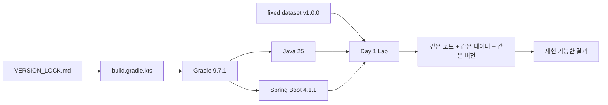
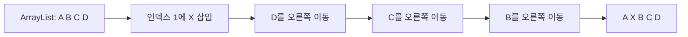

# Day 1 — 면접 준비 환경 구축 + 시간복잡도 + Array/List

> **Day:** 1  
> **오늘의 주제:** 재현 가능한 실습 환경, Big-O 시간/공간 복잡도, Array와 Java `ArrayList`  
> **예상 학습 시간:** 2시간 20분 ~ 3시간  
> **선수 지식:** Java 기본 문법(변수, 반복문, 클래스) 정도  
> **오늘 사용하는 기술:** Cursor 3.19 Stable, Java 25.0.4.1 LTS, Spring Boot 4.1.1, Spring Framework 7.0.9, Gradle 9.7.1, JUnit Jupiter 6.0.3, AssertJ 3.27.7  
> **고정 데이터:** `backend_interview_fixed_sample_dataset.json` v1.0.0  
> **이전 Day와의 연결점:** 없음 — 과정 시작점  
> **다음 Day와의 연결점:** 오늘 배운 시간복잡도 관점으로 Stack / Queue / Hash의 연산 비용과 선택 기준을 비교한다.

---

## 1) 학습 목표

### 설명할 수 있어야 하는 것

- 왜 면접 준비 프로젝트에서 **버전 잠금(version lock)** 과 **고정 데이터셋(Source of Truth)** 이 필요한지 설명할 수 있다.
- 시간복잡도와 공간복잡도의 의미를 Big-O 표기법으로 설명할 수 있다.
- `O(1)`, `O(log n)`, `O(n)`, `O(n log n)`, `O(n²)`의 차이를 입력 크기가 커졌을 때의 성장률 관점으로 설명할 수 있다.
- Array와 `ArrayList`의 차이를 **메모리 배치, 조회, 삽입/삭제, 크기 변경** 관점으로 설명할 수 있다.

### 직접 구현할 수 있어야 하는 것

- `backend-interview-lab` Spring Boot 프로젝트의 Day 1 골격을 만들 수 있다.
- 고정 JSON 데이터셋을 `src/main/resources/data/`에서 읽고 버전과 건수를 검증할 수 있다.
- 고정 상품 데이터 `P001`~`P015`를 Array와 `ArrayList`로 옮겨 보고 순차 탐색을 구현할 수 있다.
- JUnit + AssertJ 테스트로 데이터셋이 바뀌지 않았음을 검증할 수 있다.

### 면접에서 답할 수 있어야 하는 것

- “시간복잡도가 무엇인가요?”
- “Big-O는 실제 실행 시간을 의미하나요?”
- “Array와 List의 차이는 무엇인가요?”
- “ArrayList의 인덱스 조회가 왜 O(1)인가요?”
- “ArrayList 중간 삽입이 왜 O(n)인가요?”
- “데이터가 10건일 때와 1천만 건일 때 자료구조 선택이 왜 달라지나요?”

---

# 이론 1 — 재현 가능한 면접 실습 환경

## 1. 한 줄 설명

**같은 코드와 같은 데이터를 다시 실행했을 때 같은 결과가 나와야, 실험 결과를 믿고 면접 답변까지 연결할 수 있다.**

## 2. 생활 비유

요리 연습을 한다고 가정하자. 어제는 설탕 10g을 넣고 오늘은 40g을 넣었는데 “왜 맛이 달라졌지?”라고 고민하면 원인을 찾기 어렵다. 개발 실습도 같다. Java, Spring Boot, DB 버전과 데이터가 매일 바뀌면 성능 차이와 오류 원인을 학습하기 어렵다.

그래서 이 과정에서는 “레시피”에 해당하는 기술 버전을 `VERSION_LOCK.md`에 고정하고, “재료”에 해당하는 샘플 데이터를 `backend_interview_fixed_sample_dataset.json` 하나로 고정한다.

## 3. 정확한 개발자 정의

**재현성(reproducibility)** 은 동일한 입력, 동일한 코드, 동일하거나 동등한 실행 환경에서 실험을 반복했을 때 동일한 결과를 얻을 수 있는 성질이다.

이 과정에서 재현성을 확보하는 장치는 크게 두 가지다.

1. **Version Lock** — Java, Spring Boot, Gradle, DB, Redis, Kafka 등의 버전을 고정한다.
2. **Source of Truth** — 사용자/상품/주문/결제/이벤트/로그 예제는 고정 JSON 한 파일을 기준으로 한다.

## 4. 왜 필요한가

면접 준비는 단순히 코드를 “한 번 실행”하는 것이 목적이 아니다. 어떤 현상이 왜 발생했는지 설명해야 한다. 버전과 데이터가 고정되어야 다음 질문에 답하기 쉽다.

- “어제는 되는데 오늘은 왜 안 되지?”
- “성능이 좋아진 것이 코드 때문인가, 데이터 때문인가?”
- “Spring 동작이 달라진 것이 내 코드 때문인가, 프레임워크 버전 때문인가?”
- “테스트 실패가 로직 오류인가, 샘플 데이터 변경 때문인가?”

## 5. 내부에서 어떻게 동작하는가

Gradle은 `build.gradle.kts`의 플러그인과 의존성을 해석하고 Maven Central 같은 저장소에서 필요한 라이브러리를 가져온다. Java Toolchain은 프로젝트가 요구하는 Java 버전을 명시한다. Spring Boot 플러그인은 Boot 버전에 맞는 의존성 관리와 실행/패키징 작업을 제공한다.



### 그림 읽는 법

1. `VERSION_LOCK.md`가 과정 전체의 버전 기준이다.
2. `build.gradle.kts`가 Java/Spring 프로젝트의 빌드 정의를 가진다.
3. Gradle은 Java와 Spring Boot 설정을 읽어 컴파일과 테스트를 수행한다.
4. 실습 입력은 고정 데이터셋 v1.0.0만 사용한다.
5. 결과적으로 같은 Day를 다시 실행해도 같은 전제에서 비교할 수 있다.

## 6. 단계별 흐름

1. Cursor에서 `backend-interview-lab`을 연다.
2. JDK 25가 선택됐는지 확인한다.
3. Gradle 9.7.1을 Wrapper로 고정한다.
4. Spring Boot 4.1.1 플러그인을 사용한다.
5. 원본 고정 JSON을 `src/main/resources/data/`에 둔다.
6. 테스트가 데이터셋 버전과 핵심 건수를 검증한다.
7. 이후 Day는 같은 프로젝트를 확장한다.

## 7. 실제 백엔드 서버에서는 어디에서 쓰이는가

실무의 `gradle-wrapper.properties`, Docker image tag, Maven/Gradle dependency lock, DB migration 버전, Kubernetes image digest 등이 모두 같은 문제를 해결한다. “내 PC에서는 되는데 운영에서는 안 된다”를 줄이는 핵심은 실행 환경을 명시적으로 관리하는 것이다.

## 8. 장점

- 문제 재현이 쉬워진다.
- 팀원이 같은 환경을 빠르게 맞출 수 있다.
- 업그레이드로 인한 변수를 통제할 수 있다.
- 성능 비교와 장애 분석의 신뢰도가 높아진다.

## 9. 단점 / Trade-off

버전을 고정했다고 영원히 업그레이드하지 않는 것은 아니다. 실무에서는 보안 패치와 지원 종료를 고려해 계획적으로 올려야 한다. 이 과정에서는 **학습 결과의 일관성**을 위해 10주 동안 잠그는 것이다.

## 10. 자주 하는 오해와 실수

- “최신 버전이면 무조건 가장 좋다” → 최신 버전끼리 서로 호환되지 않을 수 있다.
- “Spring Boot 버전만 고정하면 된다” → JDK와 Gradle 실행 버전도 중요하다.
- “JSON은 샘플이라 조금 바꿔도 된다” → Day 간 비교가 깨진다.
- “내 PC에 설치된 Gradle을 계속 쓰면 된다” → 팀/CI에서 다른 Gradle이 실행될 수 있으므로 Wrapper가 중요하다.

## 11. 성능 / 장애 관점

실행 환경이 달라지면 GC, 기본 HTTP 서버, 드라이버, 직렬화 라이브러리, SQL 최적화기의 동작이 달라질 수 있다. 장애 분석에서 버전 정보는 “최근 변경”을 추적하는 핵심 데이터다.

## 12. 면접에서 어떻게 설명하면 좋은가

“저는 문제를 재현할 수 있도록 런타임과 빌드 도구, 주요 인프라 버전을 명시적으로 고정하고, 테스트 데이터 역시 Source of Truth를 하나로 유지합니다. 그래야 성능이나 장애 원인을 분석할 때 입력 변화와 환경 변화를 분리할 수 있습니다.” 정도로 답하면 좋다.

### 🎯 면접 포인트

- **면접관이 확인하려는 것:** 개발 환경을 단순 도구가 아니라 재현성과 운영 안정성 관점으로 보는지
- **핵심 키워드:** reproducibility, version lock, dependency management, source of truth, wrapper
- **30초 답변:** “동일 코드를 동일 조건에서 재현하려면 JDK·빌드 도구·프레임워크 버전을 고정하고 테스트 입력도 하나의 기준 데이터로 관리해야 합니다. 저는 Gradle Wrapper와 버전 잠금 파일, 고정 데이터셋을 사용해 환경 차이로 생기는 변수를 줄입니다.”
- **잘못된 답변 예시:** “그냥 최신 버전으로 설치하면 됩니다.”
- **꼬리 질문:** “보안 패치가 나오면 버전 잠금을 깨야 하나요?”

---

# 실습 예제 1 — `backend-interview-lab` 초기화

## 실습 목표

Day 1 이후 10주 동안 계속 확장할 프로젝트의 기준 골격을 만든다.

## 실습을 하는 이유

각 Day마다 새 프로젝트를 만들면 이전 코드와 설정을 확장하는 경험이 사라진다. 실제 서비스처럼 하나의 프로젝트를 누적 발전시키는 것이 목적이다.

## 생성할 파일 경로

```text
backend-interview-lab/
├── README.md
├── VERSION_LOCK.md
├── settings.gradle.kts
├── build.gradle.kts
├── gradle.properties
├── docker-compose.yml
├── .env.example
├── docs/
│   └── day-01.md
├── scripts/
├── docker/
├── src/
│   ├── main/
│   │   ├── java/com/example/backendinterview/
│   │   │   ├── BackendInterviewApplication.java
│   │   │   ├── common/
│   │   │   ├── presentation/
│   │   │   ├── application/
│   │   │   ├── domain/
│   │   │   ├── infrastructure/
│   │   │   └── lab/day01/
│   │   │       └── Day01DatasetLab.java
│   │   └── resources/
│   │       ├── application.yml
│   │       ├── data/backend_interview_fixed_sample_dataset.json
│   │       └── db/migration/
│   └── test/java/com/example/backendinterview/lab/day01/
│       └── Day01DatasetLabTest.java
```

## `settings.gradle.kts`

```kotlin
rootProject.name = "backend-interview-lab"
```

## `build.gradle.kts`

```kotlin
plugins {
    java
    id("org.springframework.boot") version "4.1.1"
}

group = "com.example"
version = "0.0.1-SNAPSHOT"

description = "10-week backend interview lab"

java {
    toolchain {
        languageVersion = JavaLanguageVersion.of(25)
    }
}

repositories {
    mavenCentral()
}

dependencies {
    implementation("org.springframework.boot:spring-boot-starter-web")
    implementation("com.fasterxml.jackson.core:jackson-databind")

    testImplementation("org.springframework.boot:spring-boot-starter-test")
}

tasks.withType<Test> {
    useJUnitPlatform()
}
```

### 코드 설명

- `java` 플러그인: Java 컴파일/테스트 태스크를 만든다.
- `org.springframework.boot` 4.1.1: 실행 가능한 Spring Boot 애플리케이션 빌드를 지원한다.
- Toolchain 25: 프로젝트 컴파일 기준 Java를 25로 고정한다.
- `spring-boot-starter-web`: 이후 HTTP/Spring MVC 실습까지 누적 확장할 기본 의존성이다.
- `jackson-databind`: Day 1 고정 JSON을 읽기 위해 사용한다.
- `spring-boot-starter-test`: JUnit, AssertJ 등 테스트 도구를 Boot가 관리하는 호환 버전으로 사용한다.

## `BackendInterviewApplication.java`

```java
package com.example.backendinterview;

import org.springframework.boot.SpringApplication;
import org.springframework.boot.autoconfigure.SpringBootApplication;

@SpringBootApplication
public class BackendInterviewApplication {
    public static void main(String[] args) {
        SpringApplication.run(BackendInterviewApplication.class, args);
    }
}
```

## `application.yml`

```yaml
spring:
  application:
    name: backend-interview-lab

server:
  port: 8080
```

## Cursor에서 수행하는 방법

1. Cursor에서 빈 폴더 `backend-interview-lab`을 연다.
2. 위 구조대로 파일과 디렉터리를 만든다.
3. 프로젝트 루트 터미널에서 `java -version`을 실행한다.
4. Java 25가 아니라면 Cursor의 Java runtime/JDK 설정에서 JDK 25를 선택한다.
5. Gradle 9.7.1이 설치되어 있다면 `gradle wrapper --gradle-version 9.7.1`로 Wrapper를 만든다.
6. 이후에는 시스템 Gradle 대신 `./gradlew` 또는 Windows의 `gradlew.bat`을 사용한다.

## 실행 명령어

macOS/Linux:

```bash
java -version
gradle --version
gradle wrapper --gradle-version 9.7.1
./gradlew test
./gradlew bootRun
```

Windows PowerShell:

```powershell
java -version
gradle --version
gradle wrapper --gradle-version 9.7.1
.\gradlew.bat test
.\gradlew.bat bootRun
```

## 예상 결과

- `java -version`에 Java 25 계열이 표시된다.
- Gradle Wrapper 생성 후 `./gradlew --version`에 9.7.1이 표시된다.
- `bootRun` 실행 시 Spring Boot 애플리케이션이 8080 포트에서 시작된다.

## 결과가 그렇게 나오는 이유

Gradle Wrapper가 사용할 Gradle 배포판 버전을 고정하고, Java Toolchain이 컴파일 타깃을 25로 지정하며, Spring Boot 플러그인이 애플리케이션 실행 태스크를 구성하기 때문이다.

## 일부러 실패시켜 보기

`build.gradle.kts`의 Spring Boot 버전을 존재하지 않는 `99.0.0`으로 바꾸고 빌드해 보자.

```bash
./gradlew test
```

의존성/플러그인 해석 단계에서 실패한다. 다시 4.1.1로 되돌린다.

## 자주 발생하는 오류와 해결법

- **`gradle: command not found`** → 최초 Wrapper 생성용 Gradle을 설치하거나 Spring Initializr로 Wrapper 포함 프로젝트를 만든다.
- **`Unsupported class file major version`** → Gradle/JDK 조합을 확인한다. 이 과정에서는 Gradle 9.7.1 + Java 25를 사용한다.
- **8080 포트 충돌** → 실행 중인 프로세스를 종료하거나 임시로 `server.port`를 바꾼다. 단, 과정 기본값은 8080으로 유지한다.
- **Cursor가 다른 JDK를 사용** → 터미널의 `java -version`과 IDE Java runtime이 같은지 확인한다.

## 실습 완료 체크리스트

- [ ] 프로젝트 루트가 `backend-interview-lab`이다.
- [ ] Java 25를 사용한다.
- [ ] Gradle 9.7.1 Wrapper를 사용한다.
- [ ] Spring Boot 4.1.1로 빌드된다.
- [ ] 기본 패키지가 `com.example.backendinterview`다.
- [ ] 고정 JSON이 `src/main/resources/data/`에 있다.

## 면접 연결 포인트

프로젝트 환경 구성을 설명할 때 “버전을 무엇으로 썼다”보다 “왜 재현 가능하게 고정했는지”를 말하는 것이 더 중요하다.

---

# 이론 2 — 시간복잡도와 Big-O

## 1. 한 줄 설명

**시간복잡도는 입력이 커질수록 알고리즘이 해야 하는 일이 얼마나 빠르게 늘어나는지를 표현한다.**

## 2. 생활 비유

책장에 책이 10권 있을 때 원하는 책을 처음부터 한 권씩 찾는 것은 별 문제가 없다. 하지만 1천만 권이라면 이야기가 달라진다. “한 번에 찾을 수 있는지”, “절반씩 범위를 줄일 수 있는지”, “끝까지 훑어야 하는지”가 매우 중요해진다.

## 3. 정확한 개발자 정의

시간복잡도(Time Complexity)는 입력 크기 `n`에 따라 알고리즘의 기본 연산 횟수가 어떻게 증가하는지 나타내는 함수적 척도다. Big-O는 입력이 충분히 커질 때의 **증가율 상한**을 중심으로 알고리즘의 성장 차수를 표현한다.

중요한 점은 Big-O가 “정확히 몇 ms 걸린다”를 뜻하지 않는다는 것이다.

## 4. 왜 필요한가

백엔드에서는 데이터가 커진다.

- 회원 100명 → 1천만 명
- 주문 30건 → 수억 건
- 캐시 키 100개 → 수백만 개
- API 요청 10 QPS → 수만 QPS

작은 데이터에서 티 나지 않던 비효율이 트래픽과 데이터 증가에 따라 장애가 될 수 있다.

## 5. 내부에서 어떻게 동작하는가

대표적인 성장률은 다음과 같다.

| 복잡도 | 의미 | 예시 |
|---|---|---|
| `O(1)` | 입력 크기와 무관하게 비슷한 횟수의 작업 | 배열 인덱스 접근 |
| `O(log n)` | 입력을 반복해서 절반 수준으로 줄임 | 이진 탐색 |
| `O(n)` | 입력을 한 번 훑음 | 선형 탐색 |
| `O(n log n)` | 분할과 전체 처리가 결합 | 효율적인 비교 정렬 |
| `O(n²)` | 입력마다 다시 전체를 확인 | 이중 반복문 |

예를 들어 `n = 1,000,000`이라고 생각해 보자.

- `O(1)` → 대략 일정한 한 번 수준
- `O(log₂ n)` → 약 20단계
- `O(n)` → 약 100만 단계
- `O(n²)` → 약 1조 단계

실제 CPU 시간과 정확히 같지는 않지만 **성장 방향의 차이**를 이해하기에는 매우 강력하다.

```mermaid
flowchart TD
    A[입력 크기 n 증가] --> B[O(1) 거의 일정]
    A --> C[O(log n) 천천히 증가]
    A --> D[O(n) 비례 증가]
    A --> E[O(n log n) n보다 빠르게 증가]
    A --> F[O(n²) 매우 빠르게 증가]
```

### 그림 읽는 법

1. 모든 알고리즘은 입력 `n`이 커질 때 비용이 어떻게 증가하는지 본다.
2. `O(1)`은 입력이 커져도 접근 단계가 거의 늘지 않는다.
3. `O(log n)`은 입력을 크게 줄여가므로 성장 속도가 느리다.
4. `O(n)`은 데이터가 두 배면 대체로 작업량도 두 배가 된다.
5. `O(n²)`은 데이터가 두 배면 작업량이 약 네 배로 증가할 수 있다.

## 6. 단계별 분석 방법

코드를 볼 때 다음 순서로 분석한다.

1. 입력 크기 `n`이 무엇인지 정한다.
2. 핵심 반복 횟수를 센다.
3. 중첩 반복인지 확인한다.
4. 입력 크기를 줄이는 패턴인지 확인한다.
5. 가장 지배적인 항만 남긴다.
6. 상수는 제거한다.

예시:

```java
for (int i = 0; i < n; i++) {
    System.out.println(i);
}
```

`n`번 반복하므로 `O(n)`이다.

```java
for (int i = 0; i < n; i++) {
    for (int j = 0; j < n; j++) {
        System.out.println(i + ":" + j);
    }
}
```

`n × n`이므로 `O(n²)`다.

## 7. 실제 백엔드 서버에서는 어디에서 쓰이는가

- 사용자 ID를 List에서 매번 선형 검색하는 코드
- 요청마다 전체 주문 목록을 정렬하는 코드
- 중첩 반복문으로 주문과 주문상세를 애플리케이션에서 매칭하는 코드
- DB 인덱스 없이 큰 테이블을 스캔하는 쿼리
- 캐시에서 키 하나로 즉시 찾는 구조

알고리즘 복잡도와 DB/캐시 구조는 완전히 같은 개념은 아니지만, **입력이 커질 때 비용이 어떻게 증가하는가**라는 사고방식은 같다.

## 8. 장점

- 구현 전부터 확장성을 비교할 수 있다.
- 머신 성능과 무관한 수준에서 알고리즘 선택을 토론할 수 있다.
- 면접에서 자료구조 선택 근거를 설명하기 쉬워진다.

## 9. 단점 / Trade-off

Big-O만 보고 실제 성능을 단정하면 안 된다.

- `O(1)`이라도 해시 충돌, 캐시 미스, 네트워크 I/O가 있으면 느릴 수 있다.
- 작은 `n`에서는 단순한 `O(n)`이 복잡한 `O(log n)` 구현보다 실제로 빠를 수 있다.
- 메모리 사용량과 구현 복잡도도 같이 봐야 한다.

## 10. 자주 하는 오해와 실수

- Big-O = 실행 시간(ms)이라고 생각한다.
- 상수를 무시한다는 말을 “상수는 실제 성능에서도 중요하지 않다”고 오해한다.
- 평균복잡도와 최악복잡도를 구분하지 않는다.
- 입력 크기 `n`이 무엇인지 정의하지 않고 복잡도를 말한다.

## 11. 성능 / 장애 관점

`O(n²)` 로직이 트래픽이 높은 요청 경로에 들어가면 CPU 사용률이 급격하게 증가할 수 있다. 단일 요청은 정상이어도 동시 요청 수가 증가하면 thread pool 고갈, latency 증가, timeout의 연쇄로 이어질 수 있다.

## 12. 면접에서 어떻게 설명하면 좋은가

“시간복잡도는 실제 시간을 직접 나타내는 값이 아니라 입력 크기에 따른 연산량의 증가율을 표현합니다. 자료구조나 알고리즘을 선택할 때 평균/최악 복잡도뿐 아니라 데이터 크기, 메모리, 캐시 지역성, 실제 프로파일링 결과까지 함께 봅니다.”라고 답하면 좋다.

### 🎯 면접 포인트

- **면접관이 확인하려는 것:** Big-O 암기가 아니라 규모가 커질 때의 사고방식
- **핵심 키워드:** input size, growth rate, dominant term, average/worst case, trade-off
- **30초 답변:** “Big-O는 입력 `n`이 증가할 때 연산량이 어떤 차수로 증가하는지를 표현합니다. 예를 들어 선형 탐색은 O(n), 배열 인덱스 접근은 O(1)입니다. 실제 latency와 동일한 값은 아니므로 상수 비용과 I/O, 메모리 특성도 같이 봐야 합니다.”
- **잘못된 답변 예시:** “O(n)은 n초 걸립니다.”
- **꼬리 질문:** “O(1)인데도 느릴 수 있는 사례가 있나요?”

---

# 실습 예제 2 — 복잡도를 코드에서 직접 판별하기

## 실습 목표

단순한 Java 메서드의 시간복잡도를 코드 구조에서 판별한다.

## 실습을 하는 이유

면접에서는 정의를 말한 직후 코드를 주고 “복잡도가 무엇인가요?”라고 묻는 경우가 많다. 반복 횟수와 입력 축소 패턴을 빠르게 읽는 훈련이 필요하다.

## 생성할 파일

```text
src/main/java/com/example/backendinterview/lab/day01/ComplexityExamples.java
```

## 전체 코드

```java
package com.example.backendinterview.lab.day01;

public final class ComplexityExamples {

    private ComplexityExamples() {
    }

    public static int first(int[] numbers) {
        if (numbers.length == 0) {
            throw new IllegalArgumentException("numbers must not be empty");
        }
        return numbers[0];
    }

    public static boolean containsLinear(int[] numbers, int target) {
        for (int number : numbers) {
            if (number == target) {
                return true;
            }
        }
        return false;
    }

    public static long pairCount(int[] numbers) {
        long count = 0;
        for (int i = 0; i < numbers.length; i++) {
            for (int j = 0; j < numbers.length; j++) {
                count++;
            }
        }
        return count;
    }
}
```

## 코드 블록별 상세 설명

### `first`

```java
return numbers[0];
```

배열의 시작 주소와 인덱스를 이용해 원하는 위치를 계산하므로 데이터 개수와 관계없이 같은 방식으로 접근한다. 시간복잡도는 `O(1)`이다.

### `containsLinear`

최악의 경우 마지막 원소까지 확인해야 하므로 `O(n)`이다. 첫 번째 원소에서 찾으면 빨리 끝나지만 Big-O의 최악 기준으로 설명할 때는 `O(n)`이다.

### `pairCount`

바깥 반복 `n`번 × 안쪽 반복 `n`번이므로 `O(n²)`이다.

## Cursor에서 수행하는 방법

1. `lab/day01` 아래에 `ComplexityExamples.java`를 만든다.
2. 코드를 붙여 넣는다.
3. 각 메서드 위에 직접 `// O(?)`를 먼저 써 본다.
4. 답을 확인한 뒤 이유를 한 문장으로 말해 본다.

## 실행/검증 명령어

```bash
./gradlew test
```

이 예제 자체는 독립 메서드이므로 다음 실습의 테스트에 함께 추가해도 된다.

## 예상 결과

- `first`: `O(1)`
- `containsLinear`: 최악 `O(n)`
- `pairCount`: `O(n²)`

## 일부러 실패시켜 보기

`containsLinear`에서 `return true`를 반복문 바깥으로 잘못 옮겨 보자. 컴파일은 될 수 있어도 논리적으로 모든 입력을 제대로 판단하지 못한다. 복잡도만 맞는다고 알고리즘이 올바른 것은 아니다.

## 자주 발생하는 오류와 해결법

- 반복문 개수만 보고 무조건 `O(n²)`라고 판단하지 않는다. 연속된 두 반복문은 보통 `O(n) + O(n) = O(n)`이다.
- 이진 탐색처럼 반복문 하나라도 검색 범위가 절반씩 줄면 `O(log n)`일 수 있다.
- 조기 종료가 있어도 최악의 경우를 별도로 생각한다.

## 실습 완료 체크리스트

- [ ] 입력 크기 `n`을 먼저 정의했다.
- [ ] 반복문의 최대 반복 횟수를 설명할 수 있다.
- [ ] `O(1)`, `O(n)`, `O(n²)`를 코드에서 구분한다.
- [ ] 실제 실행 시간과 Big-O가 다른 개념임을 말할 수 있다.

## 면접 연결 포인트

면접에서는 복잡도만 말하지 말고 “왜”를 한 문장으로 붙인다. 예: “최악의 경우 모든 원소를 한 번 확인하므로 O(n)입니다.”

---

# 이론 3 — Array와 Java ArrayList

## 1. 한 줄 설명

**Array는 길이가 고정된 연속 공간이고, `ArrayList`는 내부 Array를 자동으로 교체하며 크기가 늘어나는 List 구현체다.**

## 2. 생활 비유

Array는 좌석 번호가 1번부터 100번까지 고정된 영화관과 비슷하다. 좌석 번호를 알면 바로 찾아갈 수 있다. 하지만 좌석이 꽉 찼다고 101번 좌석을 갑자기 만들 수는 없다.

`ArrayList`는 필요할 때 더 큰 영화관으로 옮겨 주는 관리자가 붙어 있는 것과 비슷하다. 사용자는 `add()`만 호출하지만 내부에서는 공간이 부족하면 더 큰 배열을 만들고 기존 원소를 복사한다.

## 3. 정확한 개발자 정의

### Array

Java 배열은 같은 타입의 원소를 인덱스로 접근하는 고정 길이 컨테이너다. 배열 객체가 생성되면 길이는 바뀌지 않는다.

### `ArrayList`

`ArrayList<E>`는 Java Collections Framework의 `List` 구현체이며 내부적으로 동적 배열(dynamic array)을 사용한다. 논리적 원소 개수인 `size`와 내부 저장 공간인 capacity를 구분해서 관리한다.

## 4. 왜 필요한가

백엔드 코드는 수많은 컬렉션을 다룬다.

- API 응답의 상품 목록
- DB 조회 결과
- 주문 상세 목록
- 캐시에서 가져온 키 목록
- 이벤트 배치

단순히 `List`를 습관적으로 쓰는 것이 아니라 내부 비용을 이해해야 성능 질문에 답할 수 있다.

## 5. 내부에서 어떻게 동작하는가

배열의 원소 위치는 개념적으로 다음처럼 계산할 수 있다.

```text
원소 주소 = 시작 주소 + (인덱스 × 원소 슬롯 크기)
```

그래서 `array[10]`처럼 인덱스를 알고 있으면 앞의 0~9번을 순서대로 읽을 필요가 없다. 이 때문에 인덱스 접근은 `O(1)`로 본다.

`ArrayList`도 내부적으로 배열을 쓰므로 `get(index)`는 `O(1)`이다. 그러나 중간에 원소를 삽입하면 뒤의 원소를 한 칸씩 이동해야 한다.



### 그림 읽는 법

1. 기존 `A B C D`에서 `A` 뒤에 `X`를 넣고 싶다.
2. 바로 덮어쓰면 `B`가 사라지므로 뒤쪽 원소를 먼저 이동한다.
3. 이동 대상이 많을수록 비용이 커진다.
4. 그래서 중간 삽입/삭제는 일반적으로 `O(n)`이다.

## 6. 단계별 흐름

### `ArrayList.get(index)`

1. 인덱스 범위를 확인한다.
2. 내부 배열의 해당 위치를 직접 읽는다.
3. 원소를 반환한다.
4. 시간복잡도는 `O(1)`.

### `ArrayList.add(value)` — 공간이 충분할 때

1. 내부 배열의 `size` 위치에 저장한다.
2. `size`를 증가시킨다.
3. 일반적인 한 번의 append는 매우 빠르다.

### `ArrayList.add(value)` — 공간이 부족할 때

1. 더 큰 내부 배열을 만든다.
2. 기존 원소를 새 배열로 복사한다.
3. 새 원소를 추가한다.
4. 해당 한 번의 증설은 `O(n)` 비용이 들 수 있다.
5. 여러 번의 append 전체로 보면 **amortized O(1)** 로 설명한다.

**Amortized(분할상환) 분석**은 가끔 비싼 작업이 발생하더라도 긴 연산 시퀀스 전체에 비용을 나누어 평균적인 연산 비용을 설명하는 방식이다.

## 7. 실제 백엔드 서버에서는 어디에서 쓰이는가

JPA 조회 결과, REST 응답 DTO 목록, Spring 서비스 내부 집계 등에서 `List`를 자주 사용한다. 데이터가 이미 순서대로 들어오고 뒤에 추가하는 패턴이면 `ArrayList`가 매우 일반적인 선택이다.

반대로 “ID로 매번 빠르게 찾기”가 핵심이면 List를 선형 탐색하기보다 Hash 기반 구조를 고려한다. 이 부분이 Day 2의 Hash 학습으로 이어진다.

## 8. 장점

### Array

- 구조가 단순하다.
- 길이가 고정되어 예측하기 쉽다.
- 인덱스 접근이 빠르다.

### ArrayList

- 크기를 직접 관리할 필요가 적다.
- 인덱스 접근이 빠르다.
- 뒤에 순차적으로 추가하는 작업에 적합하다.
- Java 생태계에서 범용적으로 사용된다.

## 9. 단점 / Trade-off

### Array

- 길이를 생성 후 변경할 수 없다.
- 삽입/삭제가 불편하다.

### ArrayList

- capacity가 부족할 때 재할당과 복사가 필요하다.
- 중간 삽입/삭제는 원소 이동 때문에 `O(n)`이다.
- `contains`, 조건 검색은 별도 인덱스가 없다면 일반적으로 선형 탐색이다.

## 10. 자주 하는 오해와 실수

- `ArrayList`의 모든 연산이 `O(1)`이라고 생각한다.
- `get(1000)`과 “값이 1000인 원소 찾기”를 같은 연산으로 생각한다.
- `size`와 내부 capacity를 같은 값으로 생각한다.
- 대규모 데이터에서 `list.stream().filter(...)`를 반복 호출하면서 선형 검색 비용을 잊는다.

## 11. 성능 / 장애 관점

요청 하나에서 100개의 항목을 List에서 찾는 것은 문제가 없어 보일 수 있다. 그러나 10만 개 목록을 요청마다 여러 번 선형 탐색하면 CPU 사용량과 latency가 증가한다. 여기에 동시 요청이 겹치면 서버 thread가 오래 점유되어 처리량까지 떨어질 수 있다.

또한 매우 큰 `ArrayList` 증설은 큰 배열 할당과 복사를 유발하므로 순간적인 allocation pressure와 GC 부담을 만들 수 있다. 예상 크기를 안다면 `new ArrayList<>(expectedSize)`로 초기 capacity를 주는 것이 도움이 될 수 있다.

## 12. 면접에서 어떻게 설명하면 좋은가

“Array는 길이가 고정되고 인덱스 접근이 O(1)인 자료구조입니다. ArrayList는 내부적으로 배열을 사용하면서 capacity가 부족할 때 더 큰 배열로 재할당합니다. 그래서 `get`은 O(1), 중간 삽입/삭제는 원소 이동 때문에 O(n), 끝에 추가는 증설 비용을 분산해서 amortized O(1)로 설명할 수 있습니다.”

### 🎯 면접 포인트

- **면접관이 확인하려는 것:** Java 컬렉션을 API 수준이 아니라 내부 배열 관점에서 이해하는지
- **핵심 키워드:** contiguous-like indexed storage, size, capacity, resize, copy, amortized O(1), shift O(n)
- **30초 답변:** “ArrayList는 내부 배열 기반이라 인덱스 조회는 O(1)입니다. 다만 중간 삽입/삭제는 뒤 원소를 이동해야 해서 O(n)이고, capacity가 부족한 append는 배열 확장이 필요합니다. 반복적인 append 전체 비용은 amortized O(1)로 봅니다.”
- **잘못된 답변 예시:** “ArrayList는 동적이니까 모든 작업이 O(1)입니다.”
- **꼬리 질문:** “LinkedList가 중간 삽입에서 무조건 더 빠른가요?”

---

# 실습 예제 3 — 고정 상품 데이터로 Array / ArrayList / 선형 탐색 확인

## 실습 목표

고정 데이터셋의 상품 15개를 실제로 읽어 Array와 `ArrayList`로 변환하고, `P015`를 선형 탐색한다.

## 실습을 하는 이유

임의의 `1,2,3` 데이터보다 앞으로 계속 사용할 고정 커머스 데이터로 자료구조를 익히면 이후 DB, Redis, Kafka, 장애 분석 실습과 연결하기 쉽다.

고정 데이터에서 `P015`는 **한정판 개발자 머그**, 가격 **27,000원**, 상태 **`SOLD_OUT`** 이다. 이 값은 앞으로 임의로 바꾸지 않는다.

## 생성할 파일

```text
src/main/java/com/example/backendinterview/lab/day01/Day01DatasetLab.java
src/test/java/com/example/backendinterview/lab/day01/Day01DatasetLabTest.java
```

## `Day01DatasetLab.java` 전체 코드

```java
package com.example.backendinterview.lab.day01;

import com.fasterxml.jackson.databind.JsonNode;
import com.fasterxml.jackson.databind.ObjectMapper;
import org.springframework.core.io.ClassPathResource;

import java.io.IOException;
import java.io.InputStream;
import java.util.ArrayList;
import java.util.List;
import java.util.Optional;

public final class Day01DatasetLab {

    private static final String DATASET_PATH =
            "data/backend_interview_fixed_sample_dataset.json";

    private final JsonNode root;

    public Day01DatasetLab() {
        this.root = loadDataset();
    }

    public String datasetVersion() {
        return root.path("meta").path("dataset_version").asText();
    }

    public int count(String arrayName) {
        JsonNode node = root.path(arrayName);
        if (!node.isArray()) {
            throw new IllegalArgumentException(arrayName + " is not an array field");
        }
        return node.size();
    }

    public String[] productIdsAsArray() {
        JsonNode products = root.path("products");
        String[] ids = new String[products.size()];
        for (int i = 0; i < products.size(); i++) {
            ids[i] = products.get(i).path("product_id").asText();
        }
        return ids;
    }

    public List<String> productIdsAsArrayList() {
        JsonNode products = root.path("products");
        List<String> ids = new ArrayList<>(products.size());
        for (JsonNode product : products) {
            ids.add(product.path("product_id").asText());
        }
        return ids;
    }

    public Optional<ProductView> findProductLinear(String productId) {
        for (JsonNode product : root.path("products")) {
            if (productId.equals(product.path("product_id").asText())) {
                return Optional.of(new ProductView(
                        product.path("product_id").asText(),
                        product.path("name").asText(),
                        product.path("status").asText(),
                        product.path("price").asLong()
                ));
            }
        }
        return Optional.empty();
    }

    private JsonNode loadDataset() {
        ObjectMapper objectMapper = new ObjectMapper();
        ClassPathResource resource = new ClassPathResource(DATASET_PATH);
        try (InputStream inputStream = resource.getInputStream()) {
            return objectMapper.readTree(inputStream);
        } catch (IOException e) {
            throw new IllegalStateException(
                    "Failed to load fixed dataset: " + DATASET_PATH,
                    e
            );
        }
    }

    public record ProductView(
            String productId,
            String name,
            String status,
            long price
    ) {
    }
}
```

## 핵심 코드 설명

### `productIdsAsArray`

상품 수만큼 길이를 정확히 아는 배열을 먼저 만든다.

```java
String[] ids = new String[products.size()];
```

그 뒤 인덱스 `i`를 이용해 각 상품 ID를 같은 순서로 저장한다. 배열 길이는 생성 후 고정된다.

### `productIdsAsArrayList`

```java
List<String> ids = new ArrayList<>(products.size());
```

예상 원소 수 15개를 알고 있으므로 초기 capacity를 15로 준다. 불필요한 내부 배열 확장 가능성을 줄이는 의도를 코드로 표현할 수 있다.

### `findProductLinear`

상품 배열의 앞에서부터 하나씩 `product_id`를 비교한다. `P015`는 마지막 상품이므로 현재 고정 데이터에서는 15번째 비교에서 찾게 된다. 상품 수를 `n`이라고 하면 최악 시간복잡도는 `O(n)`이다.

## 테스트 코드 전체

```java
package com.example.backendinterview.lab.day01;

import org.junit.jupiter.api.Test;

import java.util.List;

import static org.assertj.core.api.Assertions.assertThat;
import static org.assertj.core.api.Assertions.assertThatThrownBy;

class Day01DatasetLabTest {

    private final Day01DatasetLab lab = new Day01DatasetLab();

    @Test
    void fixedDatasetMetadataAndCountsDoNotChange() {
        assertThat(lab.datasetVersion()).isEqualTo("1.0.0");
        assertThat(lab.count("users")).isEqualTo(12);
        assertThat(lab.count("products")).isEqualTo(15);
        assertThat(lab.count("orders")).isEqualTo(30);
        assertThat(lab.count("order_items")).isEqualTo(50);
    }

    @Test
    void arrayAndArrayListKeepTheSameProductOrder() {
        String[] array = lab.productIdsAsArray();
        List<String> list = lab.productIdsAsArrayList();

        assertThat(array).containsExactlyElementsOf(list);
        assertThat(array[0]).isEqualTo("P001");
        assertThat(array[14]).isEqualTo("P015");
    }

    @Test
    void linearSearchFindsTheSoldOutProductFromTheFixedDataset() {
        Day01DatasetLab.ProductView product =
                lab.findProductLinear("P015").orElseThrow();

        assertThat(product.name()).isEqualTo("한정판 개발자 머그");
        assertThat(product.status()).isEqualTo("SOLD_OUT");
        assertThat(product.price()).isEqualTo(27_000L);
    }

    @Test
    void invalidArrayNameFailsFast() {
        assertThatThrownBy(() -> lab.count("meta"))
                .isInstanceOf(IllegalArgumentException.class)
                .hasMessageContaining("is not an array field");
    }
}
```

## Cursor에서 수행하는 방법

1. 원본 `backend_interview_fixed_sample_dataset.json`을 프로젝트의 `src/main/resources/data/`에 복사한다.
2. 원본 JSON의 내용을 수정하지 않는다.
3. `Day01DatasetLab.java`와 테스트 파일을 만든다.
4. Cursor에서 `findProductLinear` 위에 커서를 두고 AI에게 다음처럼 물어볼 수 있다.

```text
이 메서드의 시간복잡도와 공간복잡도를 분석해 줘.
단, 답만 말하지 말고 입력 크기 n을 무엇으로 잡았는지와
최악/최선 케이스를 구분해 설명해 줘.
```

5. AI 답변을 그대로 믿지 말고 반복문 횟수와 추가 메모리 할당을 직접 확인한다.

## 실행 명령어

```bash
./gradlew test
```

특정 테스트만 실행:

```bash
./gradlew test --tests "*Day01DatasetLabTest"
```

## 예상 출력 / 결과

테스트 4개가 모두 통과해야 한다.

핵심 기대값:

```text
dataset_version = 1.0.0
users = 12
products = 15
orders = 30
order_items = 50
P015 = 한정판 개발자 머그 / SOLD_OUT / 27000
```

## 결과가 그렇게 나오는 이유

Day 1은 과정 전체에서 동일한 고정 JSON v1.0.0을 사용한다. 상품 배열은 `P001`부터 `P015`까지 고정 순서를 유지하고 있으며 `P015`가 품절 시나리오 상품이다.

## 일부러 실패시켜 보는 실험

복사본에서만 `P015`의 `status`를 `SALE`로 바꾼 뒤 테스트를 실행해 본다.

```bash
./gradlew test --tests "*Day01DatasetLabTest"
```

`SOLD_OUT`을 기대하는 테스트가 실패해야 정상이다. 실험이 끝나면 반드시 원본 JSON으로 다시 복원한다.

이 실험의 목적은 “테스트가 고정 데이터의 계약 위반을 잡아내는지” 확인하는 것이다.

## 자주 발생하는 오류와 해결법

### `FileNotFoundException` 또는 resource를 찾지 못함

경로가 정확히 아래인지 확인한다.

```text
src/main/resources/data/backend_interview_fixed_sample_dataset.json
```

### JSON 파싱 오류

원본 파일을 수동 수정하지 않았는지 확인한다. 이 과정에서는 원본 JSON을 Source of Truth로 사용한다.

### 테스트에서 한글 문자열이 깨짐

프로젝트/터미널 파일 인코딩을 UTF-8로 유지한다.

### `P015` 검색이 왜 O(15)가 아니라 O(n)인가

현재 데이터가 15건이어도 알고리즘 분석은 일반화된 입력 크기 `n`을 기준으로 한다. 현재 실행에서는 최대 15회 비교지만 데이터가 1만 건이면 최대 1만 회 비교가 된다.

## 실습 완료 체크리스트

- [ ] 데이터셋 버전 1.0.0을 테스트로 확인했다.
- [ ] `products`가 15개임을 확인했다.
- [ ] Array와 `ArrayList`가 같은 상품 ID 순서를 유지함을 확인했다.
- [ ] `P015`를 선형 탐색으로 찾았다.
- [ ] 선형 탐색의 최악 시간복잡도가 `O(n)`임을 말할 수 있다.
- [ ] 원본 JSON은 수정하지 않았다.

## 면접 연결 포인트

면접에서 “List 검색이 느립니다”라고만 말하지 않는다. “현재 구현은 별도 인덱스 없이 `product_id`를 앞에서부터 비교하므로 최악 O(n)입니다. ID 조회가 매우 빈번하고 데이터가 커진다면 Hash 기반 인덱스를 고려할 수 있습니다.”처럼 문제와 대안을 연결한다.

---

# 코딩테스트 40~50분 — Day 1 병행 트랙

1주차 코딩테스트 범위는 구현, 문자열, Hash, Stack/Queue, Sorting이다. Day 1은 그중 **구현 + 문자열 + 기본 배열 순회**에 집중한다.

권장 연습 순서:

1. 문자열 한 번 순회하며 조건에 맞는 문자 개수 세기
2. 정수 배열에서 최대/최소 찾기
3. 배열을 역순으로 새 배열에 복사하기
4. 특정 값의 첫 위치 찾기
5. 풀이 후 시간복잡도와 공간복잡도를 입으로 설명하기

문제를 푼 뒤 반드시 다음 문장으로 마무리한다.

```text
입력 크기를 n이라고 하면 배열을 한 번 순회하므로 시간복잡도는 O(n)이고,
추가 배열을 만들지 않는다면 추가 공간복잡도는 O(1)입니다.
```

추가 배열을 만들었다면 공간복잡도를 `O(n)`으로 수정해야 한다.

---

# 1분 말하기 훈련

## 주제 A — 시간복잡도란?

**권장 구조:** 정의 → 왜 필요한지 → 대표 예시 → 실무 관점

예시 답변:

> 시간복잡도는 입력 크기가 증가할 때 알고리즘의 연산량이 어떤 비율로 증가하는지를 나타냅니다. Big-O는 실제 실행 시간을 직접 뜻하기보다 증가율을 표현합니다. 예를 들어 배열 인덱스 접근은 O(1), 선형 탐색은 O(n)입니다. 실무에서는 Big-O뿐 아니라 실제 데이터 크기, 메모리 사용량, I/O와 프로파일링 결과를 함께 보고 자료구조를 선택합니다.

## 주제 B — Array와 ArrayList 차이

**권장 구조:** 정의 → 내부 구조 → 주요 복잡도 → 선택 기준

예시 답변:

> Java Array는 길이가 고정된 인덱스 기반 구조이고, ArrayList는 내부 배열을 사용하면서 필요할 때 capacity를 늘립니다. 둘 다 인덱스 접근은 O(1)이지만 ArrayList의 중간 삽입과 삭제는 원소 이동 때문에 O(n)입니다. 뒤에 추가하는 연산은 배열 확장이 가끔 발생하지만 전체 시퀀스 기준으로 amortized O(1)로 설명할 수 있습니다.

---

# 성능/장애 사고 훈련

다음 상황을 면접처럼 생각해 보자.

```text
상품 목록 10만 건을 메모리에 List로 보관하고 있다.
요청 하나를 처리할 때 상품 ID 100개를 각각 List 선형 탐색으로 찾는다.
트래픽이 증가한 뒤 CPU가 급증하고 API latency가 느려졌다.
```

단순화하면 한 요청에서 최대 `100 × 100,000 = 10,000,000`번 수준의 비교가 발생할 수 있다. 요청이 동시에 많이 들어오면 CPU 사용량이 누적된다.

개선 방향은 다음 순서로 생각한다.

- 먼저 profiler/metric으로 실제 hotspot인지 확인한다.
- ID 조회가 핵심이라면 `Map<productId, Product>` 같은 인덱스 구조를 고려한다.
- 데이터 갱신 빈도와 메모리 증가를 함께 본다.
- DB가 Source of Truth라면 애플리케이션 메모리 인덱스의 정합성 전략도 필요하다.
- 캐시를 추가한다면 캐시 미스/만료/동시 갱신 문제까지 고려해야 한다.

이 내용은 Day 2 Hash, 이후 Redis와 캐시 설계로 연결된다.

---

# 오늘의 오답 노트 템플릿 — 10분

```text
[질문]

[내가 처음 답한 내용]

[틀렸거나 부족했던 부분]

[정확한 핵심]

[30초 면접 답변]

[꼬리 질문]

[다시 확인할 코드/실습]
```

오늘 최소 3개를 작성한다.

추천 주제:

- Big-O는 실제 시간인가?
- ArrayList add는 무조건 O(1)인가?
- Array와 ArrayList 중 무엇이 더 빠른가?

---

## 강의 요약

### 오늘의 핵심 개념

- 재현 가능한 실습 환경
- Version Lock
- Source of Truth
- 시간복잡도 / 공간복잡도
- Big-O
- `O(1)`, `O(log n)`, `O(n)`, `O(n log n)`, `O(n²)`
- Array 고정 길이
- `ArrayList`의 내부 배열
- size와 capacity
- resize와 copy
- 중간 삽입/삭제의 shift 비용
- amortized O(1)
- 선형 탐색 O(n)

### 개념 간 연결 관계

```text
입력 데이터 증가
   ↓
연산 횟수 증가 방식 분석
   ↓
시간복잡도
   ↓
자료구조 선택
   ↓
Array / ArrayList의 조회·삽입 비용 이해
   ↓
ID 조회가 많다면 List가 적절한가?
   ↓
Day 2 Hash로 연결
```

### 오늘 반드시 기억할 3가지

1. **Big-O는 실제 ms가 아니라 입력 증가에 따른 연산량의 성장률이다.**
2. **Array/ArrayList의 인덱스 조회는 O(1)이지만 값 검색과 중간 삽입/삭제는 보통 O(n)이다.**
3. **자료구조는 “무엇이 더 좋다”가 아니라 조회/삽입/삭제 패턴과 데이터 규모에 따라 선택한다.**

### 실무에서 언제 쓰는지

- API 응답 목록을 만들 때
- 조회 결과를 메모리에 가공할 때
- 주문 상세를 순회할 때
- 성능 이슈에서 CPU hotspot을 분석할 때
- List 반복 검색을 Hash 인덱스로 바꿀지 판단할 때

### 면접 직전 1분 복습

```text
Big-O = 입력 크기에 따른 연산량 증가율.
Array = 길이 고정, 인덱스 조회 O(1).
ArrayList = 내부 배열 기반, get O(1), 중간 삽입/삭제 O(n), append amortized O(1).
값을 List에서 순차 검색하면 최악 O(n).
Big-O만 보지 말고 실제 데이터 크기, 메모리, I/O, 운영 특성을 함께 본다.
```

### 다음 Day와 이어지는 포인트

오늘 `P015`를 찾기 위해 상품 목록을 앞에서부터 순회했다. Day 2에서는 같은 “ID로 찾기” 문제를 Hash 기반 구조로 바꾸면 왜 평균적으로 더 빠른지, 그리고 Stack/Queue가 어떤 처리 순서를 보장하는지 학습한다.

---

## 예상 면접 질문

### 초급 예상 면접 질문 — 5개

#### 1. 시간복잡도란 무엇인가요?

- **면접관이 확인하려는 것:** Big-O의 기본 의미를 정확히 아는지
- **핵심 답변 가이드:** 입력 크기에 따른 연산량 증가율, 실제 시간과 구분
- **가능한 꼬리 질문:** 공간복잡도는 무엇인가요?

#### 2. `O(1)`과 `O(n)`의 차이를 설명해 주세요.

- **면접관이 확인하려는 것:** 성장률 개념을 이해하는지
- **핵심 답변 가이드:** 입력 증가와 작업량 관계, 배열 인덱스 접근 vs 선형 탐색
- **가능한 꼬리 질문:** `O(1)`이면 항상 빠른가요?

#### 3. Java Array와 `ArrayList`의 가장 큰 차이는 무엇인가요?

- **면접관이 확인하려는 것:** 기본 자료구조 차이
- **핵심 답변 가이드:** 고정 길이 vs 동적 크기, `ArrayList` 내부 배열
- **가능한 꼬리 질문:** primitive를 `ArrayList`에 직접 저장할 수 있나요?

#### 4. 배열 인덱스 조회가 왜 `O(1)`인가요?

- **면접관이 확인하려는 것:** 단순 암기가 아니라 인덱스 접근 원리
- **핵심 답변 가이드:** 시작 위치와 인덱스로 위치를 직접 계산
- **가능한 꼬리 질문:** LinkedList도 인덱스 조회가 O(1)인가요?

#### 5. List에서 특정 값을 찾는 연산은 보통 왜 `O(n)`인가요?

- **면접관이 확인하려는 것:** 인덱스 접근과 값 검색을 구분하는지
- **핵심 답변 가이드:** 별도 인덱스가 없으면 앞에서부터 비교해야 함
- **가능한 꼬리 질문:** 더 빠르게 만들려면 어떤 자료구조를 고려하겠나요?

### 중급 예상 면접 질문 — 5개

#### 6. `ArrayList.add()`의 시간복잡도를 어떻게 설명하겠습니까?

- **면접관이 확인하려는 것:** resize와 amortized 분석 이해
- **핵심 답변 가이드:** 일반 append는 빠르지만 capacity 부족 시 O(n) 복사, 전체적으로 amortized O(1)
- **가능한 꼬리 질문:** 초기 capacity를 주면 어떤 장점이 있나요?

#### 7. `ArrayList`의 중간 삽입이 `O(n)`인 이유는 무엇인가요?

- **면접관이 확인하려는 것:** 내부 배열과 원소 이동 이해
- **핵심 답변 가이드:** 삽입 위치 뒤의 원소들을 이동해야 함
- **가능한 꼬리 질문:** 삭제도 같은 이유로 O(n)인가요?

#### 8. Big-O에서 상수를 제거하는 이유와, 실제 성능에서 상수가 여전히 중요한 이유를 설명해 주세요.

- **면접관이 확인하려는 것:** 이론과 실제 성능을 구분하는지
- **핵심 답변 가이드:** 성장 차수 비교에서는 상수 제거, 실제 latency에서는 CPU/cache/I/O와 상수 비용 영향
- **가능한 꼬리 질문:** 같은 O(n) 알고리즘 두 개를 어떻게 비교하겠나요?

#### 9. 데이터가 작을 때는 선형 탐색이 충분할 수 있는데도 Hash를 항상 쓰지 않는 이유는 무엇인가요?

- **면접관이 확인하려는 것:** Trade-off 사고
- **핵심 답변 가이드:** 메모리, 구현 복잡도, 데이터 변경 비용, 작은 n에서의 상수 비용
- **가능한 꼬리 질문:** 어느 시점에 자료구조를 바꾸겠나요?

#### 10. 고정 데이터셋과 버전 잠금이 테스트 재현성에 어떤 도움을 주나요?

- **면접관이 확인하려는 것:** 개발 프로세스와 품질 관점
- **핵심 답변 가이드:** 입력과 환경 변수를 통제해 실패 원인을 분리
- **가능한 꼬리 질문:** 보안 취약점이 나오면 어떻게 하나요?

### 고급 예상 면접 질문 — 5개

#### 11. 상품 10만 건을 `ArrayList`에 보관하고 요청마다 100개의 상품 ID를 각각 선형 탐색합니다. 성능 문제를 어떻게 분석하고 개선하겠습니까?

- **면접관이 확인하려는 것:** 복잡도, 프로파일링, 자료구조 선택을 실제 서버 문제에 연결하는지
- **핵심 답변 가이드:** 최악 O(m×n), profiler/metric 확인, ID 기반 `HashMap` 검토, 메모리/갱신 정합성 Trade-off
- **가능한 꼬리 질문:** HashMap으로 바꿨는데도 느리다면 무엇을 보겠나요?

#### 12. `ArrayList`가 capacity를 늘리는 순간 latency spike가 관찰된다면 어떤 원인을 의심하고 어떻게 검증하겠습니까?

- **면접관이 확인하려는 것:** 메모리 할당, 복사, GC까지 연결하는지
- **핵심 답변 가이드:** 대형 배열 재할당/복사, allocation pressure, GC 로그/JFR/profiler, 예상 크기 기반 초기 capacity
- **가능한 꼬리 질문:** 무조건 큰 초기 capacity를 주면 어떤 문제가 있나요?

#### 13. 동일하게 `O(n)`인 두 구현 중 하나가 운영에서 훨씬 느릴 수 있는 이유를 설명해 주세요.

- **면접관이 확인하려는 것:** Big-O의 한계와 하드웨어/런타임 관점
- **핵심 답변 가이드:** 상수, 객체 할당, cache locality, branch, boxing, GC, 네트워크/디스크 I/O
- **가능한 꼬리 질문:** 이를 어떤 도구로 측정하겠나요?

#### 14. API latency가 증가했을 때 코드에 `O(n²)` 루프가 있다는 사실만으로 원인이라고 단정하면 안 되는 이유는 무엇인가요?

- **면접관이 확인하려는 것:** 장애 분석의 증거 기반 접근
- **핵심 답변 가이드:** 실제 입력 크기와 호출 빈도 확인, CPU profiler, DB latency, external API, lock contention 등 다른 병목과 상관관계 확인
- **가능한 꼬리 질문:** 즉시 완화와 근본 해결을 어떻게 나누겠나요?

#### 15. List를 Hash 기반 인덱스로 바꾸면 평균 조회가 빨라집니다. 이 변경이 분산 시스템이나 캐시까지 확장될 때 추가로 고려할 Trade-off는 무엇인가요?

- **면접관이 확인하려는 것:** 단일 자료구조 지식을 시스템 설계로 확장하는지
- **핵심 답변 가이드:** 메모리 증가, 데이터 변경 시 인덱스 갱신, 정합성, 캐시 무효화, stale data, 장애 복구, Source of Truth
- **가능한 꼬리 질문:** DB와 캐시 값이 다르면 어느 것을 기준으로 복구하겠나요?
