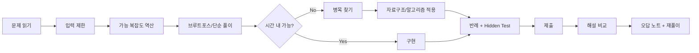

# Day 1 ~ Day 224 대기업 코딩테스트 커리큘럼 — 2026 최신 기출 통합판

> **기준일:** 2026-09-02  
> **기간:** **32주 × 7일 = 224일**  
> **실습 언어:** Python 3.14.7  
> **IDE:** Cursor  
> **대상:** 자료구조·알고리즘 완전 입문자 → 대기업 코딩테스트 합격권  
> **목표:** 기본 알고리즘뿐 아니라 **2026 카카오 공식 공개 기출, 삼성 최신 기출 기반 문제, 현대차 HSAT 최신 기출 기반 문제, 고급 알고리즘, Hidden Test, AI-assisted/Repository-style 평가**까지 대비

---

# 1. 기간 판단

기존 180일 과정은 입문자가 대기업 전통 알고리즘 코딩테스트를 준비하기에 이미 잘 구성되어 있다.

특히 기존 과정은:

- 기초 문법
- 배열/문자열/해시
- Stack/Queue/Heap/Tree/Graph
- DFS/BFS
- Backtracking
- Bitmask/DP
- Greedy/Binary Search
- Dijkstra/0-1 BFS
- Union-Find/MST
- Floyd-Warshall
- Monotonic Stack/Deque
- Coordinate Compression
- Trie
- Simulation
- 기업별 모의

까지 포함한다.

다만 2026 최신 공개 문제까지 **실제로 한 문제씩 풀고 복기**하려면 196일도 짧다.

이번 버전은:

```text
기존 180일
+
고급 알고리즘/검증/현대형 평가 14일
+
최신 공개 기출/기출 기반 실전 30일
=
224일
```

로 구성한다.

### 왜 210일이 아니라 224일인가?

2026 카카오 공식 공개 문제만:

```text
1차 7문제
+
2차 5문제
=
12문제
```

다.

여기에 삼성 2025~2026 최신 기출 기반 문제, HSAT 최신 기출 기반 문제까지 포함하면
기출을 하루에 여러 개 억지로 넣는 순간 **풀이보다 목록 소화**가 된다.

따라서:

```text
기출 1문제
→ 제한시간 풀이
→ 해설 비교
→ 복잡도 분석
→ 오답 원인
→ 재풀이 날짜
```

를 지키기 위해 **224일이 적정**하다고 판단한다.

210일은 다소 빡빡하고,
240일 이상은 일반 대기업 신입 코딩테스트 대비 목표에는 과하다.

---

# 2. 최신 기출의 출처 등급

## A. 공식 공개 기출

기업이 직접 문제해설과 문제 링크를 공개한 경우.

현재 커리큘럼에서 가장 명확한 예:

```text
2026 카카오그룹 신입크루 공채 코딩테스트 1차
2026 카카오그룹 신입크루 공채 코딩테스트 2차
```

카카오 Tech가 2026-03-11에 공식 해설을 공개했다.

## B. 기출 기반 공개/변형 문제

기업 시험 원문 전체가 공식적으로 공개되지 않지만,
실제 출제 문제를 기반으로 외부 플랫폼에서 변형·유사 문제로 제공하는 경우.

예:

```text
삼성 SW 역량테스트
현대차그룹 HSAT
```

이 과정에서는 이 문제들을 **“기출 기반”**이라고 명시한다.

절대로 공식 원문과 동일하다고 단정하지 않는다.

---

# 3. 32주 로드맵

| 기간 | 단계 | 핵심 |
|---|---|---|
| Week 1~4 | 코테 기초 체력 | Python, 배열, 문자열, 정렬, 해시, 복잡도 |
| Week 5~8 | 필수 자료구조 | Stack, Queue, Heap, Tree, Graph, Binary Search, Prefix Sum |
| Week 9~13 | 핵심 알고리즘 | DFS/BFS, Backtracking, Bitmask, Greedy, DP |
| Week 14~17 | 중급 알고리즘 | Shortest Path, Union-Find, MST, Topological, Monotonic DS, Trie |
| Week 18~21 | 기업형 문제 | Simulation, Programmers, 삼성/카카오/네이버·라인형 |
| Week 22~26 | 최종 합격권 | 약점보완, 반복 모의, 속도/정확도, 복합 알고리즘 |
| Week 27~28 | 고급/현대형 | Fenwick, Segment Tree, SCC, LCA, KMP, Z, MITM, Oracle, Hidden Test |
| Week 29 | 카카오 2026 1차 | 공식 공개 7문제 |
| Week 30 | 카카오 2026 2차 | 공식 공개 5문제 + Mixed Mock |
| Week 31 | 삼성 최신 | 2026 상반기 + 2025 하반기 기출 기반 |
| Week 32 | HSAT + 삼성 보강 | HSAT 최신 + 삼성 2025 상반기 + Final Adaptive Mock |

---

# 4. 최신 공개 기출 목록

## 4.1 카카오 2026 1차 — 공식 공개 기출

공식 Kakao Tech 해설 기준:

1. **중요한 단어를 스포 방지** — 문자열/Set/구간 중복
2. **노란불 신호등** — 시뮬레이션/GCD·LCM
3. **리프 노드 수 최대화** — 수학적 관찰/구조적 최적화
4. **바이러스 파이프** — 그래프 탐색 + 제한된 순서 완전탐색
5. **카카오 앱 정리하기** — BFS + 격자 연쇄 시뮬레이션
6. **발전소 회로 복구** — BFS 거리 전처리 + Bitmask DP
7. **최고 속도** — 직교선분 교차 + 그래프 + Union-Find

공식 해설:
https://tech.kakao.com/posts/813

## 4.2 카카오 2026 2차 — 공식 공개 기출

1. **힌트 스테이지** — Bitmask 완전탐색
2. **보물 찾기** — Interval DP / 의사결정
3. **선인장 숨기기** — Monotonic Deque + 2D Sliding Window
4. **제곱 개수 배열** — Prefix Sum + 수학적 관찰
5. **기차 선로** — Backtracking + Simulation

공식 해설:
https://tech.kakao.com/posts/814

## 4.3 삼성 SW 역량테스트 — 최신 기출 기반 공개 문제

2026 상반기 공개 자료에서 확인되는 문제:

- **아기 바다거북의 대모험: 해저 화산 지대**
- **아기 고래의 첫 항해**

2025 하반기 기출 기반 공개 문제:

- **택배 하차**
- **해적 선장 코디**
- **AI 로봇청소기**
- **가로등 설치**

2025 상반기 기출 기반 공개 문제:

- **여왕 개미**
- **민트 초코 우유**
- **개구리의 여행**
- **미생물 연구**

주의:

코드트리 등에서 제공되는 삼성 문제는
**실제 출제 문제를 바탕으로 제작된 기출 기반 변형/유사 문제**로 학습한다.

## 4.4 현대차그룹 HSAT — 최신 기출 기반 공개 문제

10~11차 최신 공개 목록:

- **쉬운 워크숍**
- **디지털 논리 패턴 검사**
- **배터리 효율 최적화**
- **도로 보수 로봇**

---

# 5. 문제 풀이 원칙



---

# 6. 최신 기출 학습 방법

각 기출 Day는 단순히 문제 하나를 푸는 날이 아니다.

## 1단계 — Blind Solve

공식 해설을 보기 전에 실제 제한시간을 둔다.

```text
쉬운 문제: 30~60분
중간 문제: 60~120분
삼성형: 최대 4시간
```

## 2단계 — Failure Classification

실패 원인을 다음 중 하나로 분류한다.

```text
문제 이해
알고리즘 선택
상태 정의
복잡도
구현
경계값
디버깅
시간 배분
```

## 3단계 — Official/Public Explanation Review

공개 해설을 읽고:

```text
내 풀이
vs
공개 해설
```

을 비교한다.

## 4단계 — Re-solve

해설을 본 직후 코드를 복사하지 않는다.

아이디어만 정리한 후 빈 파일에서 다시 구현한다.

## 5단계 — Spaced Repetition

```text
D+3
D+7
D+21
```

중 최소 두 번 다시 푼다.

---

# 7. Day 1 ~ Day 224 상세 커리큘럼

| Day | 단계 | 주제 | 오늘 배울 것 | 문제 풀이 | 복습/산출물 |
|---:|---|---|---|---|---|
| Day 1 | 1단계: 코테 기초 체력 | 코딩테스트 환경 세팅 | 언어 선택, 입출력, 제출 방식, 시간복잡도 O 표기 입문 | 입출력/조건문 5문제 | 기본 템플릿 만들기 |
| Day 2 | 1단계: 코테 기초 체력 | 변수·조건문·반복문 | 문제 조건을 코드로 옮기는 연습 | 조건/반복 구현 5문제 | if 조건 누락 체크 |
| Day 3 | 1단계: 코테 기초 체력 | 함수 분리 | 입력, 처리, 출력 함수를 나누는 습관 | 기초 구현 4문제 | 함수명과 역할 정리 |
| Day 4 | 1단계: 코테 기초 체력 | 배열/List 기초 | 배열 순회, 최댓값, 최솟값, 합계 | 배열 5문제 | 인덱스 범위 실수 정리 |
| Day 5 | 1단계: 코테 기초 체력 | 문자열 기초 | split, slice, replace, count, index 처리 | 문자열 5문제 | 문자열 내장함수 정리 |
| Day 6 | 1단계: 코테 기초 체력 | 1주차 복습 | 배열/문자열/반복문 오답 재풀이 | 오답 4문제 | 실패 원인 기록 |
| Day 7 | 1단계: 코테 기초 체력 | 미니 테스트 1 | 60분 제한으로 쉬운 구현 풀이 | Lv.0~Lv.1 4문제 | 시간 기록 |
| Day 8 | 1단계: 코테 기초 체력 | 배열 응용 | 중복, 누적, 조건 필터링 | 배열 응용 5문제 | 반례 3개 만들기 |
| Day 9 | 1단계: 코테 기초 체력 | 2차원 배열 | 행/열, 좌표, 격자 탐색 전 단계 | 2차원 배열 4문제 | row/col 혼동 정리 |
| Day 10 | 1단계: 코테 기초 체력 | 문자열 파싱 | 문자열에서 의미 있는 값 추출 | 문자열 파싱 4문제 | 예외 케이스 정리 |
| Day 11 | 1단계: 코테 기초 체력 | 정렬 기초 | 오름차순, 내림차순, 다중 조건 정렬 | 정렬 4문제 | compare 규칙 정리 |
| Day 12 | 1단계: 코테 기초 체력 | 완전탐색 입문 | 모든 경우를 확인해도 되는지 판단 | 완전탐색 4문제 | N 크기별 가능 복잡도 정리 |
| Day 13 | 1단계: 코테 기초 체력 | 2주차 복습 | 배열/정렬/완전탐색 오답 재풀이 | 오답 4문제 | 풀이 전 복잡도 쓰기 |
| Day 14 | 1단계: 코테 기초 체력 | 미니 테스트 2 | 90분 제한 기초 종합 | 구현+정렬 4문제 | 제출 전 체크리스트 |
| Day 15 | 1단계: 코테 기초 체력 | 시간복잡도 집중 | O(1), O(N), O(NlogN), O(N^2) 감각 | 복잡도 판단 10문제 | 문제 제한 보고 풀이 고르기 |
| Day 16 | 1단계: 코테 기초 체력 | 공간복잡도 입문 | 배열, Map, Set 사용 시 메모리 감각 | 기초 구현 3문제 | 메모리 사용 이유 기록 |
| Day 17 | 1단계: 코테 기초 체력 | 브루트포스 | 중첩 반복문으로 후보 전체 탐색 | 브루트포스 4문제 | 중복 탐색 줄이기 |
| Day 18 | 1단계: 코테 기초 체력 | 시뮬레이션 입문 | 문제 설명을 순서대로 구현 | 간단 시뮬레이션 3문제 | 상태 변수 목록 작성 |
| Day 19 | 1단계: 코테 기초 체력 | 디버깅 훈련 | 중간값 출력과 작은 테스트케이스 검증 | 오답 3문제 디버깅 | 디버깅 포인트 정리 |
| Day 20 | 1단계: 코테 기초 체력 | 3주차 복습 | 기초 구현 약점 보완 | 오답 5문제 | 자주 틀린 문법 정리 |
| Day 21 | 1단계: 코테 기초 체력 | 미니 테스트 3 | 기초 구현 2시간 테스트 | Lv.1 5문제 | 문제당 소요시간 기록 |
| Day 22 | 1단계: 코테 기초 체력 | 해시 Map 입문 | key-value, 빈도 계산, 그룹핑 | 해시 4문제 | Map 패턴 정리 |
| Day 23 | 1단계: 코테 기초 체력 | Set 입문 | 중복 제거, 포함 여부 O(1) 검사 | Set 4문제 | 배열 탐색과 비교 |
| Day 24 | 1단계: 코테 기초 체력 | 해시 응용 | 이름/번호/카테고리 매핑 | 해시 Lv.1~2 4문제 | 키 설계 기준 기록 |
| Day 25 | 1단계: 코테 기초 체력 | 카운팅 배열 | 숫자 범위가 작을 때 배열로 빈도 관리 | 카운팅 3문제 | Map과 배열 선택 기준 |
| Day 26 | 1단계: 코테 기초 체력 | 자료구조 선택 연습 | Array, Map, Set 중 고르기 | 혼합 4문제 | 선택 이유 한 줄 작성 |
| Day 27 | 1단계: 코테 기초 체력 | 4주차 복습 | 해시/Set/카운팅 오답 재풀이 | 오답 5문제 | 자료구조 선택표 작성 |
| Day 28 | 1단계: 코테 기초 체력 | 1개월 차 모의고사 | 2시간 제한 기초 종합 | Lv.1 4문제 + Lv.2 쉬운 1문제 | 2문제 이상 30분 내 풀이 |
| Day 29 | 1단계: 코테 기초 체력 | 모의고사 분석 | 시간이 오래 걸린 원인 분석 | 틀린 문제 재풀이 | 읽기/구현/디버깅 시간 분리 |
| Day 30 | 1단계: 코테 기초 체력 | 1개월 차 마무리 | 기초 문법과 배열/문자열/해시 정리 | 대표 유형 6문제 | 기초 템플릿 확정 |
| Day 31 | 2단계: 필수 자료구조 | 스택 개념 | LIFO, push/pop, 괄호 문제 이해 | 스택 4문제 | 스택 사용 조건 정리 |
| Day 32 | 2단계: 필수 자료구조 | 스택 응용 + 단조 스택 입문 | 짝 제거, 이전 값 비교, Next Greater Element, 단조 증가/감소 스택 감각 | 스택 Lv.2 2문제 + 단조 스택 2문제 | pop 조건과 단조성 유지 규칙 |
| Day 33 | 2단계: 필수 자료구조 | 큐 개념 | FIFO, enqueue/dequeue, 작업 처리 | 큐 4문제 | 큐 포인터 방식 정리 |
| Day 34 | 2단계: 필수 자료구조 | Deque 개념 | 양쪽 삽입/삭제, 회전 문제 | Deque 3문제 | 큐와 Deque 차이 정리 |
| Day 35 | 2단계: 필수 자료구조 | 스택/큐 선택 | 문제 상황에 맞는 구조 선택 | 스택/큐 혼합 4문제 | 선택 이유 기록 |
| Day 36 | 2단계: 필수 자료구조 | 5주차 복습 | 스택/큐 오답 재풀이 | 오답 5문제 | 대표 패턴 3개 정리 |
| Day 37 | 2단계: 필수 자료구조 | 미니 테스트 4 | 스택/큐 90분 테스트 | 스택/큐 4문제 | 정답률 확인 |
| Day 38 | 2단계: 필수 자료구조 | 우선순위 큐/힙 개념 | 최솟값/최댓값을 빠르게 꺼내는 구조 | 힙 기초 3문제 | heap push/pop 정리 |
| Day 39 | 2단계: 필수 자료구조 | 힙 응용 | 작업 처리, 섞기, 스케줄링 | 힙 Lv.2 3문제 | 정렬+힙 조합 기록 |
| Day 40 | 2단계: 필수 자료구조 | 연결 리스트 개념 | 노드, 포인터, 삽입/삭제 원리 이해 | 개념 구현 1회 + 쉬운 문제 2개 | 실전에서 자주 안 쓰는 이유도 정리 |
| Day 41 | 2단계: 필수 자료구조 | 트리 개념 | 루트, 부모, 자식, 리프, 깊이 이해 | 트리 기초 3문제 | 트리 용어 정리 |
| Day 42 | 2단계: 필수 자료구조 | 이진 트리 순회 | 전위/중위/후위 순회 구현 | 순회 3문제 | 재귀 순회 템플릿 |
| Day 43 | 2단계: 필수 자료구조 | 6주차 복습 | 힙/트리 오답 재풀이 | 오답 4문제 | 자료구조 용어 복습 |
| Day 44 | 2단계: 필수 자료구조 | 미니 테스트 5 | 자료구조 종합 테스트 | 스택/큐/힙/트리 4문제 | 막힌 구조 기록 |
| Day 45 | 2단계: 필수 자료구조 | 그래프 개념 | 정점, 간선, 방향/무방향, 가중치 이해 | 그래프 표현 3문제 | 인접 리스트/행렬 비교 |
| Day 46 | 2단계: 필수 자료구조 | 그래프 구현 | 인접 리스트로 관계 저장 | 그래프 기초 3문제 | 입력 변환 템플릿 |
| Day 47 | 2단계: 필수 자료구조 | 재귀 개념 | 함수가 자기 자신을 호출하는 구조 | 재귀 기초 4문제 | 종료 조건 체크 |
| Day 48 | 2단계: 필수 자료구조 | DFS 개념 | 깊게 들어가는 탐색 방식 이해 | DFS 기초 3문제 | visited 처리 위치 |
| Day 49 | 2단계: 필수 자료구조 | BFS 개념 | 가까운 곳부터 탐색하는 방식 이해 | BFS 기초 3문제 | 큐 초기화 방식 |
| Day 50 | 2단계: 필수 자료구조 | 7주차 복습 | 그래프/재귀/DFS/BFS 오답 재풀이 | 오답 5문제 | DFS vs BFS 비교표 |
| Day 51 | 2단계: 필수 자료구조 | 미니 테스트 6 | 그래프 탐색 입문 테스트 | DFS/BFS 4문제 | 방문 처리 실수 기록 |
| Day 52 | 2단계: 필수 자료구조 | 정렬 알고리즘 이해 | 버블/선택/삽입/병합/퀵 정렬 개념 | 정렬 구현 2개 + 응용 2문제 | 내장 정렬과 직접 구현 차이 |
| Day 53 | 2단계: 필수 자료구조 | 이분탐색 개념 | 정렬된 범위에서 반씩 줄이는 탐색 | 이분탐색 기초 4문제 | left/right 규칙 |
| Day 54 | 2단계: 필수 자료구조 | 투 포인터 개념 | 두 포인터로 범위를 조절 | 투 포인터 3문제 | 포인터 이동 조건 |
| Day 55 | 2단계: 필수 자료구조 | 누적합 개념 | 구간 합을 빠르게 계산 | 누적합 4문제 | prefix 배열 공식 |
| Day 56 | 2단계: 필수 자료구조 | 슬라이딩 윈도우 + 단조 Deque 맛보기 | 고정/가변 구간 관리와 구간 최댓값/최솟값 최적화 아이디어 | 윈도우 2문제 + 단조 Deque 기초 1문제 | Deque에서 제거하는 조건 정리 |
| Day 57 | 2단계: 필수 자료구조 | 8주차 복습 | 탐색/누적합 오답 재풀이 | 오답 5문제 | 최적화 패턴 정리 |
| Day 58 | 2단계: 필수 자료구조 | 2개월 차 모의고사 | 2.5시간 자료구조 종합 | 혼합 5문제 | 2~3문제 정답 목표 |
| Day 59 | 2단계: 필수 자료구조 | 모의고사 분석 | 자료구조 선택 실패 원인 분석 | 틀린 문제 재풀이 | 선택 기준 수정 |
| Day 60 | 2단계: 필수 자료구조 | 2개월 차 마무리 | 필수 자료구조 총정리 | 대표 자료구조별 1문제 | Array/Map/Set/Stack/Queue/Heap/Tree/Graph 정리 |
| Day 61 | 3단계: 핵심 알고리즘 | DFS 격자 탐색 | 상하좌우 이동과 영역 탐색 | 격자 DFS 3문제 | dx/dy 템플릿 |
| Day 62 | 3단계: 핵심 알고리즘 | BFS 최단거리 | 가중치 없는 최단거리 계산 | BFS 최단거리 3문제 | dist 배열 정리 |
| Day 63 | 3단계: 핵심 알고리즘 | 멀티소스 BFS | 시작점 여러 개를 큐에 넣기 | 전염/토마토류 3문제 | 초기 큐 세팅 |
| Day 64 | 3단계: 핵심 알고리즘 | 연결 요소 | 섬/단지/네트워크 개수 세기 | 연결 요소 4문제 | visited 초기화 |
| Day 65 | 3단계: 핵심 알고리즘 | 탐색 종합 | DFS/BFS 선택 훈련 | 탐색 혼합 4문제 | 선택 이유 기록 |
| Day 66 | 3단계: 핵심 알고리즘 | 9주차 복습 | DFS/BFS 오답 재풀이 | 오답 5문제 | 방문 처리 체크리스트 |
| Day 67 | 3단계: 핵심 알고리즘 | 미니 테스트 7 | 탐색 2시간 테스트 | DFS/BFS 4문제 | 2문제 이상 정답 |
| Day 68 | 3단계: 핵심 알고리즘 | 백트래킹 개념 | 가능한 후보를 만들고 조건에 맞지 않으면 되돌아가기 | 순열/조합 기초 4문제 | used/start와 가지치기 |
| Day 69 | 3단계: 핵심 알고리즘 | 순열·조합 | 순서가 중요한 선택과 중요하지 않은 선택 구분 | 순열 2문제 + 조합 2문제 | 중복 선택 여부 정리 |
| Day 70 | 3단계: 핵심 알고리즘 | 부분집합과 선택/비선택 재귀 | 모든 부분집합을 재귀 트리로 표현 | 부분집합 3문제 | 재귀 트리 그리기 |
| Day 71 | 3단계: 핵심 알고리즘 | 비트 연산 기초 | AND/OR/XOR/SHIFT와 비트로 상태 표현하기 | 비트 연산 5문제 | 비트 연산자 표 작성 |
| Day 72 | 3단계: 핵심 알고리즘 | 비트마스크 | 부분집합, 방문 상태, 선택 상태를 정수 하나로 표현 | 비트마스크 4문제 | set/check/toggle 패턴 |
| Day 73 | 3단계: 핵심 알고리즘 | 백트래킹 + 비트마스크 | used 배열 대신 bitmask를 사용하는 탐색과 가지치기 | 복합 탐색 3문제 | 상태 표현 비교 |
| Day 74 | 3단계: 핵심 알고리즘 | 미니 테스트 8 | 백트래킹·부분집합·비트마스크 종합 | 복합 4문제 | 시간 초과와 상태 중복 원인 |
| Day 75 | 3단계: 핵심 알고리즘 | 그리디 개념 | 지금 최선이 전체 최선이 되는 조건 | 그리디 기초 4문제 | 반례 찾기 |
| Day 76 | 3단계: 핵심 알고리즘 | 정렬+그리디 | 정렬 후 선택하는 문제 | 그리디 4문제 | 정렬 기준 정리 |
| Day 77 | 3단계: 핵심 알고리즘 | 이분탐색 응용 | 정답 후보를 줄이는 방식 | 이분탐색 4문제 | 가능 함수 작성 |
| Day 78 | 3단계: 핵심 알고리즘 | 파라메트릭 서치 | 조건을 만족하는 최댓값/최솟값 찾기 | 입국심사/랜선류 3문제 | low/high 의미 정리 |
| Day 79 | 3단계: 핵심 알고리즘 | 투 포인터 응용 | 연속 구간과 조건 만족 구간 찾기 | 투 포인터 4문제 | 포인터 이동 근거 |
| Day 80 | 3단계: 핵심 알고리즘 | 11주차 복습 | 그리디/이분탐색/투포인터 오답 | 오답 5문제 | 풀이 선택표 작성 |
| Day 81 | 3단계: 핵심 알고리즘 | 미니 테스트 9 | 최적화 알고리즘 테스트 | 혼합 4문제 | 복잡도 먼저 쓰기 |
| Day 82 | 3단계: 핵심 알고리즘 | DP 개념 | 이전 결과를 저장해서 중복 계산을 없애는 사고 | DP 기초 4문제 | dp 상태의 의미를 문장으로 쓰기 |
| Day 83 | 3단계: 핵심 알고리즘 | 1차원 DP | 계단, 타일, 최댓값/최솟값 문제 | 1차원 DP 4문제 | 초기값과 점화식 |
| Day 84 | 3단계: 핵심 알고리즘 | 2차원 DP | 격자, 문자열, 두 상태를 동시에 관리하는 DP | 2차원 DP 3문제 | 행/열과 상태 정의 |
| Day 85 | 3단계: 핵심 알고리즘 | 구간 DP | 구간 길이를 늘려가며 작은 구간의 답으로 큰 구간의 답을 만드는 방법 | Interval DP 3문제 | 구간 길이·시작·끝 순회 순서 |
| Day 86 | 3단계: 핵심 알고리즘 | 비트마스크 DP | 방문 집합과 마지막 상태를 bitmask + DP로 표현 | Bitmask DP 2~3문제 | dp[mask][state] 의미 작성 |
| Day 87 | 3단계: 핵심 알고리즘 | DP 종합 복습 | 1D/2D/구간/비트마스크 DP 선택 훈련 | DP 오답 5문제 | 상태 정의 실패 원인 |
| Day 88 | 3단계: 핵심 알고리즘 | 3개월 차 모의고사 | 3시간 알고리즘 종합 | 탐색+그리디+DP 5문제 | 2문제 이상 정답 |
| Day 89 | 3단계: 핵심 알고리즘 | 모의고사 분석 | 아이디어/구현/시간 실패 분류 | 틀린 문제 재풀이 | 약점 유형 TOP3 |
| Day 90 | 3단계: 핵심 알고리즘 | 3개월 차 마무리 | 핵심 알고리즘 템플릿 정리 | DFS/BFS/백트래킹/DP 각 1문제 | 템플릿 파일 완성 |
| Day 91 | 4단계: 중급 알고리즘·대기업 빈출 | 다익스트라 | 음이 아닌 가중치 그래프에서 한 출발점 최단거리 | 다익스트라 3문제 | heapq와 stale entry 처리 |
| Day 92 | 4단계: 중급 알고리즘·대기업 빈출 | 0-1 BFS | 간선 가중치가 0 또는 1일 때 deque로 최단거리 계산 | 0-1 BFS 3문제 | appendleft/append 기준 |
| Day 93 | 4단계: 중급 알고리즘·대기업 빈출 | Union-Find | 집합 합치기와 연결성 판단, path compression | Union-Find 3문제 | find/union 템플릿 |
| Day 94 | 4단계: 중급 알고리즘·대기업 빈출 | MST: Kruskal / Prim | 모든 정점을 최소 비용으로 연결하는 최소 신장 트리 | MST 3문제 | Kruskal과 Prim 선택 기준 |
| Day 95 | 4단계: 중급 알고리즘·대기업 빈출 | 위상정렬 | 선후관계가 있는 작업의 가능한 순서 계산 | 위상정렬 3문제 | indegree와 사이클 |
| Day 96 | 4단계: 중급 알고리즘·대기업 빈출 | Floyd-Warshall + 최단거리 선택 | 모든 쌍 최단거리와 BFS/0-1 BFS/Dijkstra/Floyd 선택 기준 | Floyd 2문제 + 알고리즘 선택 5문항 | 최단거리 선택표 |
| Day 97 | 4단계: 중급 알고리즘·대기업 빈출 | 미니 테스트 10 | 0-1 BFS·Dijkstra·MST·위상정렬·Floyd 종합 | 그래프 4문제 | 그래프 알고리즘 선택 이유 |
| Day 98 | 4단계: 중급 알고리즘·대기업 빈출 | 힙 심화 | Top-K, 스케줄링, 두 힙, 정렬+힙 패턴 | 힙 응용 4문제 | heap 불변조건 |
| Day 99 | 4단계: 중급 알고리즘·대기업 빈출 | 2차원 누적합 + 차분 배열 | 격자 구간 합과 구간 업데이트를 빠르게 처리 | 누적합/차분 4문제 | 좌표 경계 공식 |
| Day 100 | 4단계: 중급 알고리즘·대기업 빈출 | 단조 스택 | Next Greater/Smaller, 히스토그램류에서 스택을 단조롭게 유지 | 단조 스택 3문제 | push/pop 시점 |
| Day 101 | 4단계: 중급 알고리즘·대기업 빈출 | 단조 Deque + 슬라이딩 윈도우 | 고정 구간 최솟값/최댓값을 O(N)에 관리 | 단조 Deque 3문제 | 앞/뒤 제거 규칙 |
| Day 102 | 4단계: 중급 알고리즘·대기업 빈출 | 좌표 압축 + bisect | 큰 좌표를 순위로 바꾸고 이분탐색과 결합 | 좌표압축 3문제 | 원본값↔압축값 매핑 |
| Day 103 | 4단계: 중급 알고리즘·대기업 빈출 | Trie 기초 | 접두사 기반 문자열 저장/검색 구조와 해시 대안 비교 | Trie 2문제 + 문자열 2문제 | 노드 구조와 사용 조건 |
| Day 104 | 4단계: 중급 알고리즘·대기업 빈출 | 미니 테스트 11 | 단조 자료구조·누적합·좌표압축·Trie 종합 | 혼합 4문제 | 문제별 자료구조 선택 이유 |
| Day 105 | 4단계: 중급 알고리즘·대기업 빈출 | 시뮬레이션 기본 | 상태 변화를 순서대로 구현 | 시뮬레이션 3문제 | 상태 변수 목록 |
| Day 106 | 4단계: 중급 알고리즘·대기업 빈출 | 방향/좌표 구현 | 상하좌우, 회전, 이동 | 방향 구현 4문제 | dx/dy/회전 공식 |
| Day 107 | 4단계: 중급 알고리즘·대기업 빈출 | 격자 회전 | 부분 배열 회전과 복사 | 격자 회전 3문제 | 원본/복사본 분리 |
| Day 108 | 4단계: 중급 알고리즘·대기업 빈출 | 동시 이동 | 여러 객체가 동시에 움직이는 상황 | 동시 이동 2문제 | 업데이트 순서 |
| Day 109 | 4단계: 중급 알고리즘·대기업 빈출 | 충돌 처리 | 같은 좌표에 모이는 객체 처리 | 충돌 시뮬레이션 2문제 | 우선순위 규칙 |
| Day 110 | 4단계: 중급 알고리즘·대기업 빈출 | 시뮬레이션 + 탐색 결합 | 상태 업데이트와 BFS/DFS를 분리해 긴 구현을 안정화 | 복합 시뮬레이션 3문제 | 상태 변경 순서와 탐색 경계 |
| Day 111 | 4단계: 중급 알고리즘·대기업 빈출 | 미니 테스트 12 | 삼성형 3시간 테스트 | 긴 구현 1~2문제 | 완주 경험 만들기 |
| Day 112 | 4단계: 중급 알고리즘·대기업 빈출 | 삼성형 구현 1 | 긴 지문을 함수로 분해 | 삼성 스타일 1문제 | 설계 30분 제한 |
| Day 113 | 4단계: 중급 알고리즘·대기업 빈출 | 삼성형 구현 2 | 격자+BFS 결합 | 삼성 스타일 1문제 | 함수별 테스트 |
| Day 114 | 4단계: 중급 알고리즘·대기업 빈출 | 삼성형 구현 3 | 회전/이동/충돌 결합 | 삼성 스타일 1문제 | 조건 순서 표 작성 |
| Day 115 | 4단계: 중급 알고리즘·대기업 빈출 | 카카오형 구현 1 | 문자열+자료구조 | 카카오 스타일 2문제 | 입출력 예시 추적 |
| Day 116 | 4단계: 중급 알고리즘·대기업 빈출 | 복합 알고리즘: BFS + 비트마스크/DP | 위치와 방문 상태를 함께 갖는 탐색, BFS 결과를 DP 상태와 연결 | 복합 2~3문제 | state=(position, mask) 설계 |
| Day 117 | 4단계: 중급 알고리즘·대기업 빈출 | 16주차 복습 | 기업형 오답 재풀이 | 오답 5문제 | 기업별 약점 정리 |
| Day 118 | 4단계: 중급 알고리즘·대기업 빈출 | 4개월 차 모의고사 | 3~4시간 기업형 테스트 | 구현 2문제 + 알고리즘 2문제 | 2문제 이상 정답 |
| Day 119 | 4단계: 중급 알고리즘·대기업 빈출 | 모의고사 분석 | 긴 구현 실패 원인 분석 | 틀린 문제 재풀이 | 조건 누락 원인 |
| Day 120 | 4단계: 중급 알고리즘·대기업 빈출 | 4개월 차 마무리 | 대기업 빈출 유형 정리 | 대표 유형 6문제 | 지원 기업별 우선순위 작성 |
| Day 121 | 5단계: 기업별 기출·실전 전환 | 프로그래머스 Kit 해시 | 해시 유형 완성 | 해시 5문제 | 키 설계 복습 |
| Day 122 | 5단계: 기업별 기출·실전 전환 | 프로그래머스 Kit 스택/큐 | 스택/큐 유형 완성 | 스택/큐 5문제 | push/pop 조건 |
| Day 123 | 5단계: 기업별 기출·실전 전환 | 프로그래머스형 힙 + 단조 자료구조 | 우선순위 큐와 단조 스택/Deque를 구간 문제에 적용 | 힙 2문제 + 단조 자료구조 2문제 | 자료구조 선택 기준 |
| Day 124 | 5단계: 기업별 기출·실전 전환 | 정렬 + 좌표 압축 | 다중 조건 정렬과 좌표/값 순위 압축 결합 | 정렬 2문제 + 좌표압축 2문제 | 정렬 키와 압축 기준 |
| Day 125 | 5단계: 기업별 기출·실전 전환 | 완전탐색 + 비트마스크 | 부분집합과 작은 상태 공간을 bitmask로 전부 탐색 | 비트마스크 완전탐색 4문제 | 2^N 가능 범위 계산 |
| Day 126 | 5단계: 기업별 기출·실전 전환 | 17주차 복습 | Kit 기초 오답 재풀이 | 오답 5문제 | 빈출 유형 체크 |
| Day 127 | 5단계: 기업별 기출·실전 전환 | 미니 테스트 13 | 프로그래머스형 3시간 테스트 | Lv.2 중심 5문제 | 3문제 목표 |
| Day 128 | 5단계: 기업별 기출·실전 전환 | DFS/BFS + 상태 압축 | 위치뿐 아니라 열쇠/방문집합/활성상태까지 상태로 관리 | 상태 탐색 4문제 | visited 차원 설계 |
| Day 129 | 5단계: 기업별 기출·실전 전환 | 이분탐색 + 파라메트릭 서치 | 정답 범위를 반으로 줄이고 가능 여부 함수로 검증 | 이분/파라메트릭 4문제 | possible 함수 단조성 |
| Day 130 | 5단계: 기업별 기출·실전 전환 | DP 심화: 구간 + 비트마스크 | Interval DP와 Bitmask DP를 문제 조건에서 구분 | DP 심화 3문제 | 상태 수와 메모리 계산 |
| Day 131 | 5단계: 기업별 기출·실전 전환 | 그래프 심화 종합 | 0-1 BFS, Dijkstra, MST, Floyd-Warshall 선택과 조합 | 그래프 4문제 | 최단거리/MST 선택표 |
| Day 132 | 5단계: 기업별 기출·실전 전환 | 복합 알고리즘 훈련 | BFS+DP, 정렬+Union-Find, 누적합+이분탐색 등 두 기법 이상 결합 | 복합 3문제 | 문제를 서브문제로 분해 |
| Day 133 | 5단계: 기업별 기출·실전 전환 | 18주차 복습 | Kit 심화 오답 재풀이 | 오답 5문제 | Lv.3 막힌 이유 |
| Day 134 | 5단계: 기업별 기출·실전 전환 | 프로그래머스 모의 | 3시간 제한 실전 | Lv.2~3 5문제 | 2~3문제 정답 |
| Day 135 | 5단계: 기업별 기출·실전 전환 | 삼성 기출 1 | 긴 구현 완주 | 삼성형 1문제 | 조건 체크리스트 |
| Day 136 | 5단계: 기업별 기출·실전 전환 | 삼성 기출 2 | 격자 시뮬레이션 | 삼성형 1문제 | 상태 업데이트 순서 |
| Day 137 | 5단계: 기업별 기출·실전 전환 | 삼성 기출 3 | BFS+구현 | 삼성형 1문제 | 탐색과 시뮬 분리 |
| Day 138 | 5단계: 기업별 기출·실전 전환 | 삼성 기출 4 | 회전/충돌/우선순위 | 삼성형 1문제 | 반례 5개 |
| Day 139 | 5단계: 기업별 기출·실전 전환 | 삼성 기출 5 | 시간 제한 내 구현 | 삼성형 1문제 | 설계 시간 측정 |
| Day 140 | 5단계: 기업별 기출·실전 전환 | 19주차 복습 | 삼성형 오답 재풀이 | 오답 3문제 | 긴 구현 실수 패턴 |
| Day 141 | 5단계: 기업별 기출·실전 전환 | 삼성 모의 | 4시간 2문제 실전 | 삼성형 2문제 | 1문제 완전정답 |
| Day 142 | 5단계: 기업별 기출·실전 전환 | 카카오 기출 1 | 문자열/자료구조 | 카카오 스타일 2문제 | 예시 직접 시뮬레이션 |
| Day 143 | 5단계: 기업별 기출·실전 전환 | 카카오 기출 2 | 구현/파싱 | 카카오 스타일 2문제 | 요구사항 체크박스 |
| Day 144 | 5단계: 기업별 기출·실전 전환 | 카카오 기출 3 | 그래프/트리 | 카카오 스타일 2문제 | 자료구조 설계 |
| Day 145 | 5단계: 기업별 기출·실전 전환 | 네이버/라인형 1 | 자료구조+구현 | 혼합 4문제 | 데이터 흐름도 |
| Day 146 | 5단계: 기업별 기출·실전 전환 | 네이버/라인형 2 | 탐색+최적화 | 혼합 4문제 | 복잡도 확인 |
| Day 147 | 5단계: 기업별 기출·실전 전환 | 20주차 복습 | 기업별 오답 정리 | 오답 5문제 | 기업별 약점표 |
| Day 148 | 5단계: 기업별 기출·실전 전환 | 5개월 차 모의고사 | 지원 기업 기준 3~4시간 | 기업형 모의 1회 | 2문제 이상 정답 |
| Day 149 | 5단계: 기업별 기출·실전 전환 | 모의고사 분석 | 버릴 문제와 풀 문제 판단 | 틀린 문제 재풀이 | 문제 선택 기준 |
| Day 150 | 5단계: 기업별 기출·실전 전환 | 5개월 차 마무리 | 지원 기업 맞춤 루틴 확정 | 약점 유형 5문제 | 마지막 한 달 계획 |
| Day 151 | 6단계: 최종 합격권 | 약점 보완 1 | 가장 약한 자료구조 보완 | 약점 5문제 | 템플릿 수정 |
| Day 152 | 6단계: 최종 합격권 | 약점 보완 2 | 가장 약한 알고리즘 보완 | 약점 5문제 | 오답 이유 정리 |
| Day 153 | 6단계: 최종 합격권 | 약점 보완 3 | 긴 구현 약점 보완 | 시뮬레이션 1문제 | 조건표 작성 |
| Day 154 | 6단계: 최종 합격권 | 약점 보완 4 | 탐색 약점 보완 | DFS/BFS 4문제 | 방문 처리 점검 |
| Day 155 | 6단계: 최종 합격권 | 약점 보완 5 | DP/그리디 약점 보완 | DP 2문제 + 그리디 2문제 | 점화식/반례 |
| Day 156 | 6단계: 최종 합격권 | 21주차 복습 | 약점 오답 재풀이 | 오답 5문제 | 다시 틀린 문제 표시 |
| Day 157 | 6단계: 최종 합격권 | 실전 모의 1 | 3시간 제한 실전 | 혼합 5문제 | 2문제 이상 정답 |
| Day 158 | 6단계: 최종 합격권 | 모의 1 분석 | 시간 분배 분석 | 틀린 문제 재풀이 | 읽기/설계/구현 시간 |
| Day 159 | 6단계: 최종 합격권 | 실전 모의 2 | 3시간 제한 실전 | 혼합 5문제 | 쉬운 문제 선별 |
| Day 160 | 6단계: 최종 합격권 | 모의 2 분석 + 복잡도 역산 | 입력 제한에서 허용 가능한 O(N), O(NlogN), O(N²), O(2^N) 범위를 역산 | 오답 재풀이 + 복잡도 판단 10문항 | 제한조건→알고리즘 후보표 |
| Day 161 | 6단계: 최종 합격권 | 실전 모의 3: 복합 알고리즘 | 상태 설계와 2개 이상 알고리즘 결합이 필요한 기업형 문제 | 복합 4~5문제 | 2문제 이상 정답 |
| Day 162 | 6단계: 최종 합격권 | 모의 3 분석 | 기업형 약점 분석 | 틀린 문제 재풀이 | 기업별 전략 수정 |
| Day 163 | 6단계: 최종 합격권 | 22주차 복습 | 모의 오답 재풀이 | 오답 5문제 | 30분 내 재설명 |
| Day 164 | 6단계: 최종 합격권 | 실전 모의 4 | 3~4시간 실전 | 혼합 5문제 | 합격권 점검 |
| Day 165 | 6단계: 최종 합격권 | 삼성 최종 1 | 긴 구현 완주 | 삼성형 1문제 | 조건 누락 0개 목표 |
| Day 166 | 6단계: 최종 합격권 | 삼성 최종 2 | 시뮬레이션 디버깅 | 삼성형 1문제 | 중간 테스트 |
| Day 167 | 6단계: 최종 합격권 | 카카오 최종 1 | 문자열/자료구조 속도 | 카카오형 3문제 | 쉬운 문제 40분 |
| Day 168 | 6단계: 최종 합격권 | 카카오 최종 2 | 그래프/트리/구현 | 카카오형 2문제 | 설계 15분 |
| Day 169 | 6단계: 최종 합격권 | 네이버/라인 최종 | 탐색+자료구조 혼합 | 혼합 4문제 | 자료구조 선택 점검 |
| Day 170 | 6단계: 최종 합격권 | 23주차 복습 | 기업별 최종 오답 | 오답 5문제 | 버릴 문제 기준 |
| Day 171 | 6단계: 최종 합격권 | 실전 모의 5 | 최종 기업형 모의 | 3~4시간 모의 | 실전 루틴 적용 |
| Day 172 | 6단계: 최종 합격권 | 핵심 템플릿 손코딩 | BFS/DFS/heap/DP/Union-Find/Dijkstra/0-1 BFS/Kruskal/Bitmask DP 템플릿 손코딩 | 핵심 템플릿 9개 | 보지 않고 작성 |
| Day 173 | 6단계: 최종 합격권 | 속도 훈련 1 | 쉬운 문제 빠르게 맞히기 | Lv.1~2 6문제 | 문제당 20분 |
| Day 174 | 6단계: 최종 합격권 | 속도 훈련 2 | 중간 문제 안정 풀이 | Lv.2 4문제 | 문제당 45분 |
| Day 175 | 6단계: 최종 합격권 | 정확도 훈련 | 실수 없이 제출 | 이전 맞힌 문제 5문제 | 제출 전 체크리스트 |
| Day 176 | 6단계: 최종 합격권 | 최종 오답 압축 | 180일 오답 중 핵심 20개 선별 | 오답 10문제 재풀이 | 시험 전 요약노트 |
| Day 177 | 6단계: 최종 합격권 | 최종 모의고사 | 최종 3~4시간 실전 | 지원 기업형 모의 | 합격권 여부 확인 |
| Day 178 | 6단계: 최종 합격권 | 최종 모의 분석 | 마지막 약점 정리 | 틀린 문제 재풀이 | 시험 전략 확정 |
| Day 179 | 6단계: 최종 합격권 | 가벼운 복습 | 새 문제보다 감각 유지 | 쉬운 문제 3문제 | 컨디션 관리 |
| Day 180 | 6단계: 최종 합격권 | Day180 최종 점검 | 기초·핵심·고급·복합 알고리즘과 실전 전략 최종 점검 | 대표 유형 10개 템플릿 + 복합 2문제 | 다음 2주 지원 기업별 계획 |
| Day 181 | 7단계: 고급 알고리즘 보강 | Fenwick Tree | 동적 prefix/range query를 O(logN)에 처리하고 prefix sum과 차이를 이해 | Fenwick 3문제 | lowbit·update·query 템플릿 |
| Day 182 | 7단계: 고급 알고리즘 보강 | Segment Tree | 구간 합/최솟값/최댓값과 point update를 O(logN)에 처리 | Segment Tree 3문제 | build/query/update 템플릿 |
| Day 183 | 7단계: 고급 알고리즘 보강 | SCC | 방향 그래프의 Strongly Connected Component와 condensation DAG 이해 | Kosaraju/Tarjan 계열 3문제 | SCC가 필요한 조건 정리 |
| Day 184 | 7단계: 고급 알고리즘 보강 | LCA + Binary Lifting | 트리의 공통 조상/거리 질의를 O(logN)에 처리 | LCA 3문제 | up[k][v] 의미 정리 |
| Day 185 | 7단계: 고급 알고리즘 보강 | KMP | prefix function을 이용해 패턴 검색을 O(N+M)에 수행 | KMP 3문제 | pi/failure 이동 규칙 |
| Day 186 | 7단계: 고급 알고리즘 보강 | Z Algorithm | Z-array의 의미와 KMP/Trie/Hash와 선택 기준 비교 | Z 2문제 + 선택 3문항 | 문자열 알고리즘 선택표 |
| Day 187 | 7단계: 고급 알고리즘 보강 | Meet-in-the-Middle | 2^N이 큰 경우 두 집합으로 나눠 2^(N/2) 수준으로 줄이는 사고 | MITM 3문제 | N≈35~45 탐색 설계 |
| Day 188 | 7단계: 고급 알고리즘 보강 | Sweep Line·이벤트 정렬 | 구간 시작/끝 이벤트로 겹침·최대 동시성·교차를 처리 | Sweep 3문제 | 이벤트 tie-break 규칙 |
| Day 189 | 7단계: 고급 알고리즘 보강 | Offline Query | 질의를 재정렬해 Fenwick/Union-Find/정렬과 결합하는 사고 | 오프라인 쿼리 3문제 | online/offline 선택 기준 |
| Day 190 | 7단계: 고급 알고리즘 보강 | 고급 상태 그래프 | 위치+방향+열쇠+mask+phase를 하나의 상태로 설계 | 상태 BFS/Dijkstra 3문제 | visited/dist 차원 설계 |
| Day 191 | 7단계: 고급 알고리즘 보강 | Brute-force Oracle + Differential Test | 작은 입력 완전탐색 정답과 최적화 풀이를 랜덤 비교해 반례 탐색 | 검증 스크립트 2개 | oracle 기반 디버깅 루틴 |
| Day 192 | 7단계: 고급 알고리즘 보강 | Hidden Test·Edge-case Engineering | 빈 입력·중복·극단값·오버플로우·tie-break·index 경계를 체계적으로 설계 | 반례 20개 + 문제 2개 | 제출 전 Edge-case 체크리스트 |
| Day 193 | 7단계: 고급 알고리즘 보강 | AI 허용/금지 평가 대응 | 시험 정책에 따라 무도구 풀이와 AI-assisted Plan/Review를 분리 | 같은 문제를 두 모드로 풀이 | AI 사용/검증 체크리스트 |
| Day 194 | 7단계: 고급 알고리즘 보강 | Repository-style Practical Assessment | 기존 코드베이스에서 요구사항→계획→수정→테스트→diff review 수행 | 90~120분 repo 과제 1회 | Plan/Build/Test/Review 기록 |
| Day 195 | 8단계: 2026 최신 공개 기출 | 카카오 2026 1차 ① 중요한 단어를 스포 방지 | 공식 공개 기출: 문자열 구간·Set/Hash·중복 판정을 안정적으로 구현 | 공식 문제 1개 시간 제한 풀이 | 문자열/구간 판정 실수표 |
| Day 196 | 8단계: 2026 최신 공개 기출 | 카카오 2026 1차 ② 노란불 신호등 | 공식 공개 기출: 시뮬레이션 종료 조건과 GCD/LCM을 결합 | 공식 문제 1개 시간 제한 풀이 | 주기/LCM 종료 조건 정리 |
| Day 197 | 8단계: 2026 최신 공개 기출 | 카카오 2026 1차 ③ 리프 노드 수 최대화 | 공식 공개 기출: 수학적 관찰·교환 논증·제한된 상태 탐색 | 공식 문제 1개 시간 제한 풀이 | 관찰→증명→구현 노트 |
| Day 198 | 8단계: 2026 최신 공개 기출 | 카카오 2026 1차 ④ 바이러스 파이프 | 공식 공개 기출: 트리/그래프 탐색 + 파이프 종류 순서 완전탐색 | 공식 문제 1개 시간 제한 풀이 | 3^K 상태 + BFS/DFS 설계 |
| Day 199 | 8단계: 2026 최신 공개 기출 | 카카오 2026 1차 ⑤ 카카오 앱 정리하기 | 공식 공개 기출: 격자 연쇄 이동·BFS·시뮬레이션·wrap-around | 공식 문제 1개 시간 제한 풀이 | 상태변경 순서·BFS seed 정리 |
| Day 200 | 8단계: 2026 최신 공개 기출 | 카카오 2026 1차 ⑥ 발전소 회로 복구 | 공식 공개 기출: BFS 거리 전처리 + 비트마스크 DP + 선행 조건 | 공식 문제 1개 시간 제한 풀이 | dp[mask][last] 상태 정의 |
| Day 201 | 8단계: 2026 최신 공개 기출 | 카카오 2026 1차 ⑦ 최고 속도 | 공식 공개 기출: 직교 선분 교차·그래프 구성·내림차순 Union-Find | 공식 문제 1개 시간 제한 풀이 | geometry→DSU 변환 과정 |
| Day 202 | 8단계: 2026 최신 공개 기출 | 카카오 2026 2차 ① 힌트 스테이지 | 공식 공개 기출: 2^K 비트마스크 완전탐색과 비용 시뮬레이션 | 공식 문제 1개 시간 제한 풀이 | mask 의미·overflow guard |
| Day 203 | 8단계: 2026 최신 공개 기출 | 카카오 2026 2차 ② 보물 찾기 | 공식 공개 기출: 구간 DP와 최악 비용 최소화, interactive-style 의사결정 | 공식 문제 1개 시간 제한 풀이 | cost[L][R]/pick[L][R] 정의 |
| Day 204 | 8단계: 2026 최신 공개 기출 | 카카오 2026 2차 ③ 선인장 숨기기 | 공식 공개 기출: 2차원 sliding minimum + monotonic deque | 공식 문제 1개 시간 제한 풀이 | 행→열 deque 2단계 |
| Day 205 | 8단계: 2026 최신 공개 기출 | 카카오 2026 2차 ④ 제곱 개수 배열 | 공식 공개 기출: 누적합·수학적 관찰·거대한 가상 배열을 직접 만들지 않는 설계 | 공식 문제 1개 시간 제한 풀이 | prefix + jump 관찰 |
| Day 206 | 8단계: 2026 최신 공개 기출 | 카카오 2026 2차 ⑤ 기차 선로 | 공식 공개 기출: 백트래킹·시뮬레이션·방향 상태·가지치기 | 공식 문제 1개 시간 제한 풀이 | 상태/방향/가지치기 표 |
| Day 207 | 8단계: 2026 최신 공개 기출 | 카카오 2026 1·2차 Mixed Mock | 2026 공식 공개 문제 중 미풀이/오답을 섞어 실제 시간 배분 훈련 | 3~4시간 Mixed Mock | 문제 선택·포기 시점 기록 |
| Day 208 | 8단계: 2026 최신 공개 기출 | 카카오 2026 기출 총복기 | 12문제의 유형·제한조건·핵심 관찰을 한 장으로 압축 | 오답 4문제 재풀이 | Kakao 2026 Pattern Map |
| Day 209 | 8단계: 2026 최신 공개 기출 | 삼성 2026 상반기 기출 기반 ① 아기 바다거북의 대모험: 해저 화산 지대 | 기출 기반 공개 문제: BFS 최단거리 + 다중 객체/화산 상태 시뮬레이션 | 4시간형 1문제 | BFS 재계산·상태 업데이트 순서 |
| Day 210 | 8단계: 2026 최신 공개 기출 | 삼성 2026 상반기 기출 기반 ② 아기 고래의 첫 항해 | 기출 기반 공개 문제: 이동 우선순위 + BFS 경로 탐색 + 시뮬레이션 | 4시간형 1문제 | 방향 우선순위·경로 복원 |
| Day 211 | 8단계: 2026 최신 공개 기출 | 삼성 2025 하반기 기출 기반 ① 택배 하차 | 기출 기반 공개 문제로 긴 상태 구현/자료구조 설계를 훈련 | 4시간형 1문제 | 문제 요구사항→함수 분리 |
| Day 212 | 8단계: 2026 최신 공개 기출 | 삼성 2025 하반기 기출 기반 ② 해적 선장 코디 | 기출 기반 공개 문제로 고난도 자료구조·조건 처리를 훈련 | 4시간형 1문제 | 자료구조 선택·불변조건 |
| Day 213 | 8단계: 2026 최신 공개 기출 | 삼성 2025 하반기 기출 기반 ③ AI 로봇청소기 | 기출 기반 공개 문제: 격자/BFS/다중 청소기 상태 시뮬레이션 | 4시간형 1문제 | 좌표·충돌·탐색 상태 정리 |
| Day 214 | 8단계: 2026 최신 공개 기출 | 삼성 2025 하반기 기출 기반 ④ 가로등 설치 | 기출 기반 공개 문제: 우선순위 큐 중심 최적화/자료구조 선택 | 4시간형 1문제 | heap 선택 근거 |
| Day 215 | 8단계: 2026 최신 공개 기출 | 삼성 최신 4시간 모의 + 복기 | 2025 하반기·2026 상반기 기출 기반 문제를 섞어 4시간 실전 | 2문제 4시간 | 완주율·디버깅 시간·조건 누락 기록 |
| Day 216 | 8단계: 2026 최신 공개 기출 | 현대차 HSAT 최신 기출 기반 ① 쉬운 워크숍 | 10~11차 공개 기출 기반 문제로 HSAT 난이도와 구현/알고리즘 감각 확인 | 기출 기반 1문제 | 제한조건→복잡도 선택 |
| Day 217 | 8단계: 2026 최신 공개 기출 | 현대차 HSAT 최신 기출 기반 ② 디지털 논리 패턴 검사 | 10~11차 공개 기출 기반 문제로 패턴/구현 정확도 훈련 | 기출 기반 1문제 | 패턴 판정·경계값 |
| Day 218 | 8단계: 2026 최신 공개 기출 | 현대차 HSAT 최신 기출 기반 ③ 배터리 효율 최적화 | 10~11차 공개 기출 기반 문제로 최적화 설계 연습 | 기출 기반 1문제 | 목적함수·선택 기준 |
| Day 219 | 8단계: 2026 최신 공개 기출 | 현대차 HSAT 최신 기출 기반 ④ 도로 보수 로봇 | 10~11차 공개 기출 기반 문제로 상태/경로/구현 문제 해결 | 기출 기반 1문제 | 상태 전이·검증 |
| Day 220 | 8단계: 2026 최신 공개 기출 | 삼성 2025 상반기 기출 기반 ① 여왕 개미 | 기출 기반 공개 문제로 최신 삼성 B형/자료구조 성격을 경험 | 기출 기반 1문제 | 자료구조/시간복잡도 분석 |
| Day 221 | 8단계: 2026 최신 공개 기출 | 삼성 2025 상반기 기출 기반 ② 민트 초코 우유 | 기출 기반 공개 문제로 삼성식 복합 구현을 훈련 | 기출 기반 1문제 | 상태/우선순위/반례 |
| Day 222 | 8단계: 2026 최신 공개 기출 | 삼성 2025 상반기 기출 기반 ③ 개구리의 여행 | 기출 기반 공개 문제: Dijkstra/최단경로 응용 | 기출 기반 1문제 | 그래프 모델링·heap |
| Day 223 | 8단계: 2026 최신 공개 기출 | 삼성 2025 상반기 기출 기반 ④ 미생물 연구 | 기출 기반 공개 문제로 시뮬레이션/상태 설계 훈련 | 기출 기반 1문제 | 상태 전이·검증 |
| Day 224 | 8단계: 2026 최신 공개 기출 | Day224 Final Adaptive Mock | 카카오 공식 기출 + 삼성/HSAT 기출 기반 문제 + 현대형 repo/AI 평가 중 목표 기업에 맞춰 조합 | 4~5시간 최종 실전 | 최종 합격권 점검·기업별 2주 계획 |
---

# 8. 최신 기출 Source Update 규칙

이 커리큘럼은 **기준일 2026-09-02** 버전이다.

지원 시점에 더 최신 공개 기출이 나오면 다음 규칙으로 교체한다.

```text
동일 기업
더 최신 회차
공식 공개 또는 신뢰 가능한 기출 기반 공개
```

이면:

```text
오래된 기업별 기출 Day
→ 최신 문제로 교체
```

한다.

단, 기초 알고리즘 Day를 삭제해서 최신 기출을 넣지 않는다.

---

# 9. 기업별 우선순위

## 삼성 목표

추가 비중:

```text
Simulation
BFS/DFS
상태 관리
우선순위
긴 지문 함수 분리
4시간 완주
```

## 카카오/플랫폼 목표

추가 비중:

```text
문자열
Hash
Graph
Bitmask
DP
수학적 관찰
자료구조 선택
복합 알고리즘
```

## 현대차그룹/HSAT 목표

추가 비중:

```text
구현 정확도
최적화
자료구조
제한조건 해석
시간 내 안정적 구현
```

---

# 10. 224일 수료 체크리스트

## Core
- [ ] Array/String/Hash/Set
- [ ] Stack/Queue/Deque/Heap
- [ ] Tree/Graph
- [ ] DFS/BFS/Multi-source BFS
- [ ] Backtracking
- [ ] Greedy
- [ ] Binary/Parametric Search
- [ ] Two Pointer/Sliding Window
- [ ] Prefix Sum/Difference Array
- [ ] DP / Interval DP / Bitmask DP
- [ ] Dijkstra / 0-1 BFS
- [ ] Union-Find / MST
- [ ] Topological Sort / Floyd-Warshall
- [ ] Monotonic Stack/Deque
- [ ] Coordinate Compression / Trie

## Advanced
- [ ] Fenwick Tree
- [ ] Segment Tree
- [ ] SCC
- [ ] LCA / Binary Lifting
- [ ] KMP
- [ ] Z Algorithm
- [ ] Meet-in-the-Middle
- [ ] Sweep Line
- [ ] Offline Query
- [ ] Advanced State Graph

## Debug / Validation
- [ ] Brute-force Oracle
- [ ] Differential Testing
- [ ] Hidden Test 설계
- [ ] 경계값 체크리스트
- [ ] 시간복잡도 역산

## Latest Past Problems
- [ ] 카카오 2026 1차 7문제
- [ ] 카카오 2026 2차 5문제
- [ ] 삼성 2026 상반기 최신 기출 기반 문제
- [ ] 삼성 2025 하반기 최신 기출 기반 문제
- [ ] 삼성 2025 상반기 보강 문제
- [ ] 현대차 HSAT 최신 기출 기반 문제

## Modern Assessment
- [ ] AI 금지 환경에서 핵심 템플릿 손코딩
- [ ] AI 허용 환경에서 AI 결과 직접 검증
- [ ] Repository 요구사항 분석
- [ ] Plan → Build → Test → Review

---

# 11. 오답 노트 양식

```md
## 문제명

- Day:
- 기업/회차:
- 공식 기출 / 기출 기반:
- 유형:
- 입력 제한:
- 예상 허용 복잡도:
- 사용한 알고리즘:
- 걸린 시간:
- 첫 제출 결과:
- 실패 원인:
- 놓친 반례:
- 공개 해설 핵심:
- 내 풀이와 차이:
- 다시 풀 날짜:
```

---

# 12. 최종 판단

현재 목표가:

```text
대기업 신입 코딩테스트 합격권
+
2026 최신 공개 기출 실전
+
고급 알고리즘 보강
+
AI/Repository 평가 변화 대응
```

이라면 **224일이 적정**하다.

```text
180일
= 기본 합격권

196일
= 고급 알고리즘까지

224일
= 최신 공개 기출을 실제로 한 문제씩 풀고 복기할 수 있는 완성형

240일+
= 일반 대기업 신입 코테 목표에는 과한 편
```

최종 목표는 문제를 많이 “봤다”가 아니라,
**처음 보는 최신 문제를 제한시간 안에 분석하고, 적절한 알고리즘을 선택하고, Hidden Test까지 견디는 코드를 제출하는 것**이다.
