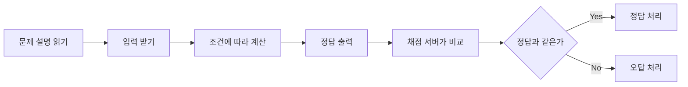
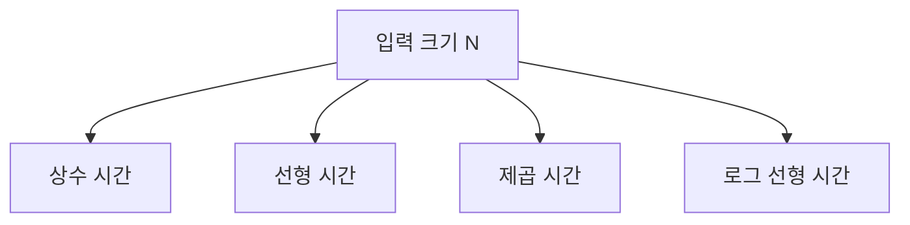

# Coding Test Day 1 — 코딩테스트 환경 세팅

## 1. 학습 목표

- 단계: **1단계: 코테 기초 체력**
- 오늘 주제: **코딩테스트 환경 세팅**
- 오늘 배울 것: **언어 선택, 입출력, 제출 방식, 시간복잡도 O 표기 입문**
- 오늘 문제 풀이: **입출력/조건문 5문제**
- 오늘 복습/산출물: **기본 템플릿 만들기**

오늘의 목표는 “알고리즘을 많이 아는 것”이 아니다. 코딩테스트 문제를 하나 받아서 **입력을 읽고 → 조건을 코드로 옮기고 → 정답을 출력하고 → 왜 이 코드가 충분히 빠른지 아주 기초적인 말로 설명하는 것**까지가 Day 1의 성공 기준이다.

### 오늘 사용하는 고정 환경

- IDE: **Cursor 3.18**
- Python: **3.14.7**
- 실행 방식: Cursor Integrated Terminal에서 `python 파일명.py`
- 외부 Library: 사용하지 않음. Python 표준 라이브러리만 사용
- 버전 근거: 프로젝트 루트 `VERSION_LOCK.md`

> Python 3.15.0rc2는 현재 Release Candidate이므로 Stable 우선 규칙에 따라 사용하지 않는다.

### 오늘의 핵심 사고 질문

- 입력으로 무엇이 들어오는가?
- 출력으로 정확히 무엇을 내야 하는가?
- 조건을 `if / elif / else`로 어떻게 나눌 수 있는가?
- 내 코드는 입력 개수가 늘어나면 몇 번 정도 일을 하는가?
- 가장 작은 입력과 경계값에서도 맞는가?

---

## 2. 이론 1 — 코딩테스트는 무엇을 하는 시험인가?

### 한 줄 정의

**주어진 입력을 읽고, 요구한 규칙대로 계산해서, 정확한 출력 형식으로 답을 내는 프로그램을 만드는 시험**이다.

### 아주 쉬운 비유

자판기를 생각해 보자.

- 입력: 돈과 버튼
- 처리: 가격 확인, 재고 확인
- 출력: 음료 또는 오류 메시지

코딩테스트도 똑같다. 채점 서버는 여러분의 프로그램에 입력을 넣고, 프로그램이 출력한 값을 정답과 비교한다.



### 그림 읽기

- `문제 설명 읽기`에서 무엇을 계산해야 하는지 파악한다.
- `입력 받기`는 채점 서버가 준 값을 Python 변수로 옮기는 단계다.
- `조건에 따라 계산`은 문제의 핵심 규칙을 코드로 구현하는 단계다.
- `정답 출력`에서는 불필요한 문장을 넣으면 안 된다.
- 채점 서버는 출력이 정답과 일치하는지 확인한다.

### 정확한 기술 정의

온라인 저지(Online Judge)는 보통 프로그램을 여러 테스트케이스에 실행하고, 정답 여부와 함께 시간·메모리 제한도 검사한다. 따라서 다음 세 가지가 모두 중요하다.

1. **Correctness**: 답이 맞는가?
2. **Performance**: 제한 시간과 메모리 안에 끝나는가?
3. **Output Format**: 요구한 형식으로만 출력했는가?

### 제출 방식의 기본 흐름

플랫폼마다 UI는 다르지만 일반적인 과정은 다음과 같다.

1. 문제 읽기
2. 언어를 Python으로 선택
3. 로컬(Cursor)에서 코드 작성
4. 예제 입력으로 실행
5. 정답 코드 제출
6. 채점 결과 확인
7. 틀렸다면 작은 반례로 재현

> 실제 시험에서는 IDE, 인터넷, AI, 외부 문서 사용 규칙이 다를 수 있다. **시험 공고와 감독 안내가 항상 우선**이다.

---

## 3. 실습예제 1 — 이름을 입력받아 인사하기

### 문제 상황

한 줄로 이름이 주어진다. `Hello, 이름!`을 출력하자.

### 입력 예시

```text
Nara
```

### 예상 출력

```text
Hello, Nara!
```

### 먼저 손으로 풀기

1. 입력에서 이름을 읽는다.
2. `Hello, ` 뒤에 이름을 붙인다.
3. 마지막에 `!`를 붙여 출력한다.

### 입력 크기 확인

- 문자열 한 줄
- 오늘은 길이가 매우 작다고 생각해도 된다.

### 가장 단순한 풀이

```python
name = input()
print(f"Hello, {name}!")
```

### Python 전체 코드

```python
def solve() -> None:
    name = input().strip()
    print(f"Hello, {name}!")


if __name__ == "__main__":
    solve()
```

### 핵심 설명

- `input()`은 한 줄을 문자열로 읽는다.
- `.strip()`은 줄 앞뒤의 불필요한 공백/개행을 제거한다.
- `f"...{name}..."`은 변수 값을 문자열 안에 넣는 f-string이다.

### 시간복잡도

이름 길이를 `L`이라 하면 문자열을 읽고 출력하므로 **O(L)**이다. 아주 짧은 입력에서는 사실상 즉시 끝난다.

### 공간복잡도

입력 이름을 저장하므로 **O(L)**이다.

### 반례

1. `A`처럼 이름이 한 글자일 때
2. `Nara Kim`처럼 중간 공백이 있을 때
3. 알파벳이 아닌 유니코드 이름이 들어올 때

### Cursor에서 실행

```bash
python days/day001/hello_name.py
```

파일을 별도로 만들지 않았다면 코드 블록을 새 `.py` 파일에 붙여 실행해도 된다.

---

## 4. 이론 2 — Python 입력과 출력

### 한 줄 정의

**입력은 문제 데이터를 변수로 가져오는 일, 출력은 계산 결과를 채점 서버에 보여주는 일**이다.

### 아주 쉬운 비유

요리할 때 주문서가 입력이고, 완성된 음식이 출력이다. 주문을 잘못 읽으면 요리를 아무리 잘해도 틀린 음식이 나온다.

### 가장 자주 쓰는 입력 패턴

#### 정수 하나

```python
n = int(input())
```

#### 공백으로 구분된 정수 여러 개

```python
a, b = map(int, input().split())
```

#### 정수 목록

```python
arr = list(map(int, input().split()))
```

### 왜 `int()`가 필요한가?

`input()`의 결과는 기본적으로 문자열이다.

```python
print("2" + "3")  # 23
print(2 + 3)        # 5
```

숫자 계산을 하려면 문자열을 정수로 바꿔야 한다.

### 출력에서 가장 중요한 규칙

채점 문제에서는 요구하지 않은 설명을 출력하지 않는다.

```python
# 좋음
print(answer)

# 보통 채점에서는 틀릴 수 있음
print("정답은", answer)
```

문제가 `5`만 요구하면 `정답은 5`는 다른 출력이다.

---

## 5. 실습예제 2 — 두 수의 합

### 문제 상황

두 정수 `A`, `B`가 한 줄에 주어진다. 합을 출력한다.

### 입력 예시

```text
7 13
```

### 예상 출력

```text
20
```

### 먼저 손으로 풀기

`7 + 13 = 20`이다.

### 가장 단순한 풀이

```python
a, b = map(int, input().split())
print(a + b)
```

### Python 전체 코드

```python
def solve() -> None:
    a, b = map(int, input().split())
    print(a + b)


if __name__ == "__main__":
    solve()
```

### 시간복잡도

정수 두 개만 처리하므로 **O(1)**이라고 본다.

### 공간복잡도

변수 몇 개만 사용하므로 **O(1)**이다.

### 반례

1. `0 0`
2. `-5 5`
3. `1000000000 1000000000`

Python의 정수는 큰 값을 비교적 안전하게 다룰 수 있지만, 다른 언어에서는 정수 범위를 확인해야 한다.

---

## 6. 이론 3 — 조건문: 문제의 규칙을 코드로 옮기기

### 한 줄 정의

**조건문은 “이 경우에는 이렇게, 저 경우에는 저렇게”를 코드로 표현하는 방법**이다.

### 아주 쉬운 비유

놀이공원 입장 규칙이 다음과 같다고 하자.

- 키가 140cm 이상이면 탑승 가능
- 아니면 탑승 불가

이 규칙을 Python으로 옮기면 다음과 같다.

```python
if height >= 140:
    print("YES")
else:
    print("NO")
```

### 비교 연산자

| 연산자 | 의미 | 예시 |
|---|---|---|
| `==` | 같다 | `x == 10` |
| `!=` | 다르다 | `x != 10` |
| `<` | 작다 | `x < 10` |
| `<=` | 작거나 같다 | `x <= 10` |
| `>` | 크다 | `x > 10` |
| `>=` | 크거나 같다 | `x >= 10` |

### 초보자가 가장 자주 하는 실수

`=`와 `==`를 혼동한다.

- `=`: 변수에 값을 넣는 대입
- `==`: 두 값이 같은지 비교

---

## 7. 실습예제 3 — 합격/불합격 판정

### 문제 상황

점수 `score`가 주어진다.

- 60점 이상: `PASS`
- 그 미만: `FAIL`

### 입력 예시

```text
60
```

### 예상 출력

```text
PASS
```

### 손으로 풀기

60은 “60 이상”에 포함된다. 따라서 `PASS`다.

### Python 전체 코드

```python
def solve() -> None:
    score = int(input())

    if score >= 60:
        print("PASS")
    else:
        print("FAIL")


if __name__ == "__main__":
    solve()
```

### 시간복잡도

비교 한 번이므로 **O(1)**이다.

### 반례

1. `59` → `FAIL`
2. `60` → `PASS` — 가장 중요한 경계값
3. `100` → `PASS`

### 기억할 한 문장

**조건의 경계에 있는 값은 반드시 직접 넣어 본다.**

---

## 8. 이론 4 — 시간복잡도 O 표기 입문

### 한 줄 정의

**입력 크기가 커질 때, 프로그램이 해야 하는 일이 얼마나 빠르게 늘어나는지를 표현하는 방법**이다.

### 아주 쉬운 비유

학생 수가 늘어날 때 출석을 확인한다고 하자.

- 학생 1명만 확인: 거의 일정한 일 → O(1)
- 학생 N명을 한 번씩 확인: 학생 수만큼 일 → O(N)
- 모든 학생 쌍을 서로 비교: 대략 N×N번 일 → O(N²)



### 그림 읽기

- O(1): 입력이 커져도 핵심 작업 횟수가 거의 변하지 않는다.
- O(N): 데이터가 2배면 일도 대략 2배가 된다.
- O(N²): 데이터가 2배면 일은 대략 4배가 된다.
- O(N log N): 정렬 같은 알고리즘에서 자주 보게 될 성장률이다. 오늘은 이름과 감각만 익힌다.

### Big-O에서 중요한 것

정확한 실행 시간을 초 단위로 맞히는 공식이 아니다. **입력이 커질 때 증가하는 경향**을 본다.

예를 들어:

```python
for x in arr:
    print(x)
```

원소가 `N`개라면 반복문 본문은 N번 실행되므로 O(N)이다.

```python
for x in arr:
    for y in arr:
        print(x, y)
```

N개마다 다시 N개를 보므로 O(N²)이다.

### 제한조건에서 대략적인 후보를 떠올리는 습관

오늘은 아래 숫자를 절대 공식처럼 외우지 않는다. 단지 감각을 만든다.

- N이 아주 작다 → 완전탐색 후보가 있을 수 있다.
- N이 100,000처럼 크다 → O(N²)은 매우 위험할 가능성이 크다.
- N을 한두 번 순회하는 O(N)은 보통 훨씬 안전하다.

실제 허용 시간은 언어, 구현, 상수, 채점 환경에 따라 달라진다.

---

## 9. 실습예제 4 — 양수 개수 세기

### 문제 상황

정수 N개가 주어질 때, 양수의 개수를 출력한다.

### 입력 예시

```text
5
-2 0 7 3 -1
```

### 예상 출력

```text
2
```

### 먼저 손으로 풀기

`-2, 0, 7, 3, -1` 중 0보다 큰 값은 `7`, `3` 두 개다.

### 가장 단순한 풀이

모든 원소를 한 번씩 보면서 `x > 0`인지 확인한다.

### 입력 크기 확인

- 원소 개수: N
- 모든 값의 양수 여부를 확인해야 한다.

### Python 전체 코드

```python
def solve() -> None:
    n = int(input())
    arr = list(map(int, input().split()))

    count = 0
    for x in arr:
        if x > 0:
            count += 1

    print(count)


if __name__ == "__main__":
    solve()
```

### 시간복잡도

N개를 정확히 한 번씩 확인하므로 **O(N)**이다.

### 공간복잡도

현재 코드는 배열 전체를 저장하므로 **O(N)**이다.

### 반례

1. 모두 음수 → 0
2. 모두 양수 → N
3. 값에 0이 포함 → 0은 양수가 아님

---

## 10. 이론 5 — Day 1 기본 Python 템플릿

처음에는 템플릿의 모든 이유를 완벽히 이해할 필요는 없다. 하지만 각 줄의 역할은 알고 사용한다.

```python
import sys

input = sys.stdin.readline


def solve() -> None:
    # 입력
    # 처리
    # 출력
    pass


if __name__ == "__main__":
    solve()
```

### 왜 `sys.stdin.readline`을 쓰는가?

입력이 많아지는 문제에서 기본 `input()`보다 빠른 경우가 많다. Day 1 문제는 `input()`만으로도 충분하지만, 앞으로 반복해서 사용할 표준 템플릿을 미리 만든다.

주의할 점:

```python
name = input().strip()
```

`sys.stdin.readline`은 줄 끝 개행 문자를 포함할 수 있으므로 문자열 자체가 중요할 때 `.strip()` 또는 `.rstrip()`을 의식한다.

### 왜 `solve()`를 만드는가?

- 입력/처리/출력 흐름을 한 곳에 모을 수 있다.
- 긴 문제가 되어도 구조를 유지하기 쉽다.
- 전역 코드가 지나치게 흩어지는 것을 막는다.

### 오늘 완성한 템플릿

프로젝트의 다음 파일을 사용한다.

```text
templates/python_fastio.py
```

---

## 11. 실습예제 5 — 두 수 중 큰 값 출력하기

### 문제 상황

두 정수 A, B가 주어진다.

- A가 더 크면 A 출력
- B가 더 크면 B 출력
- 같으면 `SAME` 출력

### 입력 예시

```text
8 8
```

### 예상 출력

```text
SAME
```

### 손으로 풀기

1. A와 B를 비교한다.
2. `A > B`, `A < B`, 나머지 세 경우로 나눈다.

### Python 전체 코드

```python
import sys

input = sys.stdin.readline


def solve() -> None:
    a, b = map(int, input().split())

    if a > b:
        print(a)
    elif a < b:
        print(b)
    else:
        print("SAME")


if __name__ == "__main__":
    solve()
```

### 시간복잡도

비교 횟수가 입력 크기와 무관하게 일정하므로 **O(1)**이다.

### 공간복잡도

**O(1)**이다.

### 반례

1. `1 2` → `2`
2. `2 1` → `2`
3. `2 2` → `SAME`

---

## 12. 오늘의 통합 문제 풀이 — 버스 요금 계산기

오늘 배운 입력, 조건문, 출력, 복잡도를 하나로 묶는다.

### 문제

승객의 나이 `age`와 기본 요금 `fare`가 주어진다.

- 7세 이하: 무료, `0`
- 8세 이상 18세 이하: 기본 요금의 절반, `fare // 2`
- 19세 이상: 기본 요금 그대로

정수 요금을 출력하라.

### 입력 예시

```text
15 1400
```

### 출력 예시

```text
700
```

### 1단계: 문제를 한 문장으로 줄이기

**나이 구간에 따라 요금을 세 가지 중 하나로 결정한다.**

### 2단계: 입력 제한 생각하기

이 문제는 정수 두 개만 처리한다. N개의 데이터를 반복해서 보는 문제가 아니다.

### 3단계: 허용 시간복잡도

비교 몇 번이면 끝나므로 O(1)이면 충분하다.

### 4단계: 가장 단순한 풀이

나이 구간을 `if / elif / else`로 그대로 옮긴다.

### 5단계: 병목

없다. 더 복잡한 자료구조나 알고리즘을 사용할 이유가 없다.

### 6단계: 구현

```python
import sys

input = sys.stdin.readline


def solve() -> None:
    age, fare = map(int, input().split())

    if age <= 7:
        answer = 0
    elif age <= 18:
        answer = fare // 2
    else:
        answer = fare

    print(answer)


if __name__ == "__main__":
    solve()
```

### 왜 `elif age <= 18`만 써도 되는가?

첫 번째 `if age <= 7`이 거짓인 상태에서만 `elif`에 도달한다. 따라서 그 시점에는 이미 `age >= 8`임을 알고 있다.

### 시간복잡도

**O(1)**

### 공간복잡도

**O(1)**

### 핵심 반례

| 입력 | 기대 출력 | 이유 |
|---|---:|---|
| `7 1400` | `0` | 무료의 마지막 경계 |
| `8 1400` | `700` | 청소년 요금의 첫 경계 |
| `18 1400` | `700` | 청소년 요금의 마지막 경계 |
| `19 1400` | `1400` | 성인 요금의 첫 경계 |
| `15 1501` | `750` | `//`는 정수 나눗셈 |

---

## 13. 풀이 검증 / 반례 / 복잡도 분석


### 이 흐름이 의미하는 것

- 먼저 입력 형식을 틀리지 않아야 한다.
- `7/8`, `18/19` 같은 경계값을 문제를 읽을 때 표시한다.
- Day 1 문제는 복잡한 최적화보다 정확한 구현이 중요하다.
- 예제만 맞고 경계값이 틀리는 경우를 막기 위해 직접 반례를 만든다.
- 마지막에는 디버그용 `print()`가 남아 있지 않은지 확인한다.

### Day 1 제출 전 체크리스트

- [ ] 입력 개수와 자료형이 맞는가?
- [ ] `=`와 `==`를 혼동하지 않았는가?
- [ ] `>=`, `<=` 경계가 정확한가?
- [ ] 출력 문자열의 대소문자가 정확한가?
- [ ] 요구하지 않은 설명 문구를 출력하지 않는가?
- [ ] 예제뿐 아니라 경계값을 테스트했는가?
- [ ] 반복문이 있다면 몇 번 도는지 설명할 수 있는가?

---

## 14. 자주 발생하는 오류와 오해

### 오류 1 — `input()` 결과를 숫자로 착각

```python
n = input()
print(n + 1)  # 오류
```

숫자 계산이면 `int(input())`가 필요하다.

### 오류 2 — 대입과 비교 혼동

```python
x = 10   # 값을 넣음
x == 10  # 같은지 비교
```

### 오류 3 — 경계값 하나를 빠뜨림

`60점 이상`을 `score > 60`으로 작성하면 60점이 틀린다.

### 오류 4 — 출력 형식을 마음대로 꾸밈

문제가 숫자만 요구하면 `정답:` 같은 문장을 붙이지 않는다.

### 오류 5 — 시간복잡도를 실행 시간의 정확한 초로 생각함

Big-O는 입력이 커질 때 작업량 증가 경향을 나타낸다. `O(N)`이라고 항상 1초라는 뜻이 아니다.

### 오류 6 — 짧은 문제에도 복잡한 알고리즘을 억지로 사용

정수 두 개 비교 문제에 정렬이나 자료구조는 필요 없다. **가장 단순한 풀이가 충분하면 그것이 좋은 풀이**다.

---

## 15. 강의 요약

### 오늘 배운 핵심 5가지

1. 코딩테스트는 입력을 읽고 규칙에 따라 계산한 뒤 정확한 형식으로 출력하는 시험이다.
2. `input()`, `int()`, `split()`, `map()`을 조합해 기본 입력을 처리할 수 있다.
3. `if / elif / else`로 문제의 조건과 경계값을 코드로 옮길 수 있다.
4. O(1), O(N), O(N²), O(N log N)은 입력이 커질 때 작업량이 어떻게 늘어나는지 설명하는 표기다.
5. 제출 전에는 예제뿐 아니라 최소/최대/경계값과 불필요한 출력을 확인한다.

### 오늘의 알고리즘 선택 질문

Day 1에는 특별한 고급 알고리즘을 고르는 것이 목표가 아니다. 먼저 묻는다.

> “입력을 한 번 읽고 조건 몇 번만 비교하면 끝나는가?”

그렇다면 O(1) 또는 O(N)의 단순 구현이 충분할 수 있다.

### 오늘의 시간복잡도

- 정수 몇 개 계산/비교: O(1)
- N개 원소를 한 번 순회: O(N)
- N개마다 N개를 다시 확인: O(N²)
- 정렬에서 자주 보게 될 성장률: O(N log N) — 자세한 내용은 이후 Day에서 학습

### 오늘의 핵심 반례

1. 조건 경계값 바로 전/정확히 경계/바로 다음 값
2. 0 또는 음수가 허용되는 숫자 입력
3. 두 비교 값이 같은 경우
4. 문자열 한 글자 또는 공백을 포함한 문자열

### 오늘 완성한 파일

```text
VERSION_LOCK.md
templates/python_fastio.py
days/day001/lecture.md
days/day001/practice.md
days/day001/exercises.md
days/day001/review.md
```

### 다음에 다시 풀 날짜

- D+3: 2026-09-06
- D+7: 2026-09-10

### 다음 Day 연결

Day 2에서는 **변수·조건문·반복문**을 더 본격적으로 사용한다. 오늘의 핵심은 입력과 조건문을 정확히 다루는 것이다. Day 2에서는 “같은 일을 여러 번 해야 할 때 반복문으로 어떻게 옮기는가?”로 확장한다.

---

## 16. 핵심 용어

| 용어 | 아주 쉬운 뜻 | 정확한 의미 |
|---|---|---|
| Input | 프로그램에 들어오는 재료 | 채점 시스템이 프로그램에 제공하는 데이터 |
| Output | 프로그램이 내놓는 답 | 문제에서 요구한 형식으로 출력하는 결과 |
| Variable | 값을 담는 이름표 | 실행 중 값을 참조하기 위한 식별자 |
| Condition | 경우를 나누는 질문 | 참/거짓으로 평가되는 표현식 |
| `if` | 조건이 맞으면 실행 | 조건식이 참일 때 블록을 실행하는 문법 |
| Boundary Value | 규칙이 바뀌는 딱 그 값 | 조건 분기 결과가 달라지는 경계 주변 입력 |
| Time Complexity | 입력이 커질 때 일이 얼마나 늘어나는지 | 입력 크기에 따른 알고리즘 연산량 증가율을 점근적으로 표현한 것 |
| O(1) | 입력이 커져도 일 몇 번 | 입력 크기와 무관하게 핵심 연산 횟수가 상수 수준인 복잡도 |
| O(N) | N개를 한 번씩 보기 | 입력 크기에 선형 비례하는 시간복잡도 |
| Online Judge | 자동 채점 선생님 | 제출 코드를 테스트케이스로 실행해 정답·시간·메모리를 판정하는 시스템 |

---

## 17. 연습문제

상세 문제는 `exercises.md`에 있다. Day 1까지 배운 **입출력·사칙연산·조건문·기초 O 표기**만으로 해결할 수 있도록 구성했다.

### 초급 5개

1. 두 정수의 차
2. 홀수/짝수 판정
3. 세일 가격
4. 온도 경보
5. 큰 수 출력

### 중급 5개

1. 시험 등급
2. 택배비 계산
3. 윤년 기초 판정(단순화 규칙)
4. 좌표 사분면 판정
5. 세 수 중 최댓값

### 고급 5개

1. 세 구간 요금제
2. 비밀번호 길이 정책
3. 경기 결과 판정
4. 할인 우선순위
5. 복잡도 분류 퀴즈

> 정답은 기본 자료에 포함하지 않는다. 먼저 직접 풀고, 틀린 문제는 `wrong-answers/`에 기록한다.
