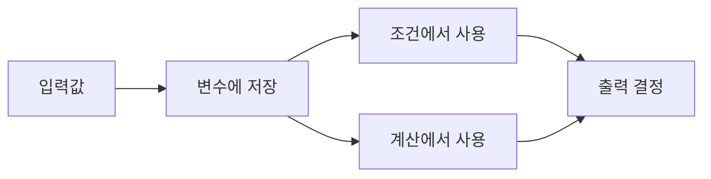
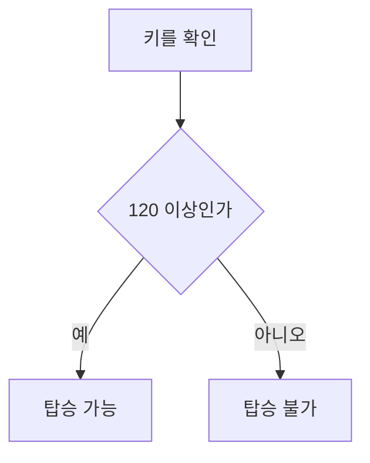
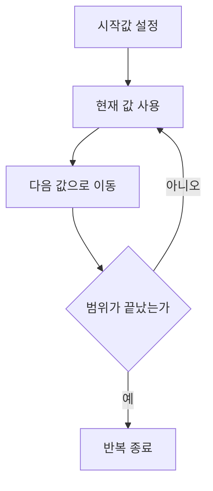
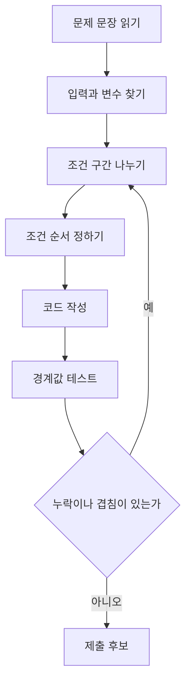

# Coding Test Day 2 — 변수·조건문·반복문

## 1. 학습 목표

- 단계: 1단계 — 코테 기초 체력
- 오늘 주제: 변수·조건문·반복문
- 오늘 배울 것: 문제의 조건을 변수, 비교식, `if`, `for`, `while`로 정확하게 옮기는 방법
- 오늘 문제 풀이: 조건/반복 구현 5문제
- 오늘 복습/산출물: `if` 조건 누락 체크

### 오늘 사용하는 고정 환경

- IDE: Cursor Desktop 3.18
- Python: 3.14.7
- 실행 방식: Cursor Integrated Terminal에서 `python 파일명.py`
- 외부 Library: 없음
- 표준 Library: 필요할 때 `sys`만 사용

> `VERSION_LOCK.md`의 버전은 그대로 유지한다. Day 2에서는 새 도구를 추가하지 않는다.

### 오늘의 핵심 사고 질문

- 문제에서 **무엇을 저장해야 하는가?**
- 조건문에서 `이상`, `초과`, `이하`, `미만`을 정확히 옮겼는가?
- 조건 사이에 **빠진 구간**이나 **겹치는 구간**은 없는가?
- 같은 규칙을 여러 번 적용해야 한다면 반복문으로 바꿀 수 있는가?
- 반복은 정확히 몇 번 실행되는가?
- 입력 크기 `N`이 커졌을 때 반복 횟수는 어떻게 늘어나는가?
- 최솟값, 경계값, 최댓값을 직접 테스트했는가?

---

## Day 1 D+3 워밍업

오늘은 Day 1의 D+3 재풀이 예정일이다. Day 2를 시작하기 전에 10~15분만 사용한다.

1. 60점 이상이면 `PASS`, 아니면 `FAIL`을 출력한다.
2. 두 정수를 비교해 큰 값을 출력한다. 같으면 `SAME`을 출력한다.
3. 입력이 `N`일 때 `1`부터 `N`까지의 수 중 짝수 개수를 손으로 먼저 계산해 본다.

이 워밍업의 목적은 정답 암기가 아니라 **경계 조건을 코드로 정확히 쓰는 습관**을 확인하는 것이다.

---

## 2. 이론 1 — 변수는 값을 붙잡아 두는 이름표

### 한 줄 정의

**변수는 프로그램이 나중에 다시 사용할 값을 이름과 함께 저장하는 공간이다.**

### 아주 쉬운 비유

책상 위에 상자 세 개가 있다고 생각해 보자.

- 첫 번째 상자에는 `나이`
- 두 번째 상자에는 `점수`
- 세 번째 상자에는 `합계`

라는 이름표를 붙인다.

프로그램에서 변수도 비슷하다.

```python
age = 20
score = 85
total = 0
```

`age`라는 이름을 보면 그 안에 나이가 들어 있다는 사실을 알 수 있다.

### 개념 구조



- `입력값`은 사용자가 제공한 숫자나 문자열이다.
- `변수에 저장`은 값을 이름과 연결하는 단계다.
- 저장된 값은 비교하거나 계산할 수 있다.
- 최종 결과를 출력한다.

### 정확한 기술 정의

Python에서 대입문은 오른쪽 값을 계산한 뒤 왼쪽 이름에 연결한다.

```python
count = 3
count = count + 1
```

두 번째 줄을 실행하면 기존 `count` 값 3에 1을 더해 4를 만들고, 다시 `count`에 저장한다.

같은 의미를 더 짧게 쓰면 다음과 같다.

```python
count += 1
```

### 코딩테스트에서 자주 쓰는 변수 역할

| 역할 | 예시 이름 | 의미 |
|---|---|---|
| 입력값 | `n`, `score`, `age` | 문제에서 받은 값 |
| 누적값 | `total`, `sum_value` | 반복하면서 더한 값 |
| 개수 | `count` | 조건을 만족한 횟수 |
| 최댓값 후보 | `best` | 현재까지 가장 좋은 값 |
| 상태 | `is_open` | 현재 상태를 표시하는 값 |

오늘은 복잡한 자료구조보다 **변수 하나가 어떤 역할인지 분명하게 이름 짓는 습관**이 중요하다.

### 변수 이름 원칙

좋은 이름:

```python
score = 85
pass_count = 0
price = 1200
```

초보자에게 위험한 이름:

```python
a = 85
b = 0
c = 1200
```

아주 짧은 문제에서는 `n`, `m`, `i` 같은 관례적 이름을 사용할 수 있지만, 역할이 여러 개라면 의미 있는 이름을 쓰는 편이 안전하다.

---

## 3. 실습예제 1 — 현재 금액 계산하기

### 문제 상황

지갑에 처음 `money`원이 있다. 간식 가격 `price`원을 한 번 지불한 뒤 남은 금액을 출력하자.

### 입력 예시

```text
5000 1800
```

### 예상 출력

```text
3200
```

### 먼저 손으로 풀기

```text
처음 금액 = 5000
간식 가격 = 1800
남은 금액 = 5000 - 1800 = 3200
```

### 가장 단순한 풀이

입력된 두 값을 변수에 저장하고 한 번 뺀다.

### 입력 크기 확인

입력되는 정수는 두 개뿐이다.

### 허용 가능한 시간복잡도

입력 크기가 증가하는 반복 작업이 없다. 계산 횟수는 일정하다.

### Python 전체 코드

```python
money, price = map(int, input().split())

money -= price

print(money)
```

### 핵심 설명

- `money, price = ...` : 두 입력값을 각각 저장한다.
- `money -= price` : `money = money - price`와 같은 의미다.
- `print(money)` : 계산된 값을 출력한다.

### 시간복잡도

`O(1)`이다. 정해진 횟수만큼 계산한다.

### 공간복잡도

`O(1)`이다. 변수 몇 개만 사용한다.

### 반례

1. `1000 1000` → 정확히 0원이 남는 경우
2. `1 0` → 가격이 0인 경우
3. `1000000 1` → 값의 차이가 큰 경우

### Cursor에서 실행

```bash
python solutions/basic/day002/practice01.py
```

---

## 4. 이론 2 — 조건문은 문제의 규칙을 갈림길로 바꾸는 도구

### 한 줄 정의

**조건문은 어떤 조건이 참인지 거짓인지에 따라 실행할 코드를 선택한다.**

### 아주 쉬운 비유

놀이공원 입구에 이런 규칙이 있다고 하자.

```text
키가 120cm 이상이면 탑승 가능
그보다 작으면 탑승 불가
```

사람이 한 명 올 때마다 갈림길이 생긴다.



이 그림에서 마름모 노드는 질문을 뜻한다. 질문의 결과에 따라 서로 다른 코드가 실행된다.

### 비교 연산자

| 문제 표현 | Python | 예시 |
|---|---|---|
| 같다 | `==` | `score == 100` |
| 다르다 | `!=` | `score != 0` |
| 초과 | `>` | `age > 18` |
| 이상 | `>=` | `score >= 60` |
| 미만 | `<` | `age < 14` |
| 이하 | `<=` | `temperature <= 0` |

### 매우 중요한 경계 번역

```text
60점 이상  → score >= 60
60점 초과  → score > 60
60점 이하  → score <= 60
60점 미만  → score < 60
```

한 글자 차이가 정답과 오답을 가른다.

### 기본 if

```python
if score >= 60:
    print("PASS")
```

### if / else

```python
if score >= 60:
    print("PASS")
else:
    print("FAIL")
```

### if / elif / else

```python
if score >= 90:
    print("A")
elif score >= 80:
    print("B")
else:
    print("C")
```

조건은 위에서 아래로 검사한다. 한 분기가 선택되면 그 아래 `elif`와 `else`는 실행하지 않는다.

### 조건 순서가 중요한 이유

잘못된 예:

```python
if score >= 60:
    print("PASS")
elif score >= 90:
    print("EXCELLENT")
```

95점도 첫 번째 조건 `score >= 60`에서 이미 참이므로 `PASS`가 출력된다.

더 구체적이고 높은 기준을 먼저 검사해야 한다.

```python
if score >= 90:
    print("EXCELLENT")
elif score >= 60:
    print("PASS")
else:
    print("FAIL")
```

### 논리 연산자

두 조건을 함께 사용할 수도 있다.

```python
if age >= 14 and height >= 120:
    print("RIDE")
```

- `and`: 모든 조건이 참이어야 참
- `or`: 하나라도 참이면 참
- `not`: 참과 거짓을 뒤집음

Day 2에서는 `and`, `or`를 복잡하게 중첩하기보다 **문장 속 조건을 정확히 나누는 것**에 집중한다.

---

## 5. 실습예제 2 — 놀이기구 탑승 판정

### 문제 상황

나이가 14세 이상이고 키가 120cm 이상이면 `RIDE`, 아니면 `NO`를 출력한다.

### 입력 예시

```text
15 130
```

### 예상 출력

```text
RIDE
```

### 먼저 손으로 풀기

```text
나이 15 >= 14  → 참
키 130 >= 120  → 참
둘 다 참       → RIDE
```

### 가장 단순한 풀이

문장에 있는 두 조건을 그대로 비교식으로 만든다.

### 입력 크기 확인

정수 두 개를 한 번 비교한다.

### Python 전체 코드

```python
age, height = map(int, input().split())

if age >= 14 and height >= 120:
    print("RIDE")
else:
    print("NO")
```

### 시간복잡도

`O(1)`

### 공간복잡도

`O(1)`

### 반례

1. `14 120` → 두 조건이 모두 정확히 경계인 경우
2. `13 200` → 키만 만족하는 경우
3. `20 119` → 나이만 만족하는 경우
4. `13 119` → 둘 다 만족하지 않는 경우

### 초보자 실수

잘못된 코드:

```python
if age >= 14 or height >= 120:
    print("RIDE")
```

문제는 **나이와 키를 모두 만족**해야 하므로 `or`가 아니라 `and`다.

---

## 6. 이론 3 — 반복문은 같은 규칙을 여러 번 적용하는 도구

### 한 줄 정의

**반복문은 같은 작업을 정해진 횟수만큼 또는 조건이 유지되는 동안 반복한다.**

### 아주 쉬운 비유

운동 코치가 이렇게 말한다고 하자.

```text
팔굽혀펴기를 5번 하세요.
```

사람이 `팔굽혀펴기`라는 문장을 다섯 번 복사해 적을 필요는 없다.

```text
5번 반복
→ 팔굽혀펴기 1회
```

코드도 똑같다.

### for 문

횟수나 범위가 분명할 때 주로 사용한다.

```python
for i in range(1, 6):
    print(i)
```

출력:

```text
1
2
3
4
5
```

### range 핵심

```python
range(start, stop)
```

`start`는 포함하고 `stop`은 포함하지 않는다.

```python
range(1, 6)
```

은 `1, 2, 3, 4, 5`를 만든다.

### 반복 횟수 흐름



### while 문

정확한 횟수보다 **조건**이 중요할 때 사용할 수 있다.

```python
count = 1

while count <= 5:
    print(count)
    count += 1
```

`while`은 조건이 계속 참이면 끝없이 반복할 수 있으므로, 상태가 종료 방향으로 변하는지 반드시 확인해야 한다.

### for와 while 선택

| 상황 | 추천 |
|---|---|
| 1부터 N까지 반복 | `for` |
| 정확히 N번 반복 | `for` |
| 특정 조건이 될 때까지 반복 | `while` 후보 |
| 횟수를 쉽게 셀 수 있음 | `for` 우선 고려 |

오늘은 코딩테스트에서 실수가 적은 `for`를 기본으로 익히고 `while`의 종료 조건 감각도 함께 확인한다.

### 누적 변수

반복문에서 자주 사용하는 패턴이다.

```python
total = 0

for number in range(1, 6):
    total += number

print(total)
```

`total`은 현재까지의 합을 기억한다.

### 개수 세기

```python
count = 0

for number in range(1, 11):
    if number % 2 == 0:
        count += 1

print(count)
```

`count`는 조건을 만족한 횟수를 기억한다.

---

## 7. 실습예제 3 — 1부터 N까지 짝수의 합

### 문제 상황

정수 `N`이 주어질 때 `1`부터 `N`까지의 짝수 합을 출력한다.

### 입력 예시

```text
6
```

### 예상 출력

```text
12
```

왜냐하면:

```text
2 + 4 + 6 = 12
```

### 먼저 손으로 풀기

1. 1부터 6까지 한 숫자씩 본다.
2. 현재 숫자가 짝수인지 확인한다.
3. 짝수라면 합계에 더한다.

### 가장 단순한 풀이

`1`부터 `N`까지 모두 확인한다.

### 입력 크기 확인

`N`개의 수를 한 번씩 확인한다.

### 허용 가능한 시간복잡도

이 방법은 확인 횟수가 `N`에 비례하므로 `O(N)`이다. Day 2에서는 이 단순하고 안전한 구현을 우선한다.

### Python 전체 코드

```python
n = int(input())

total = 0

for number in range(1, n + 1):
    if number % 2 == 0:
        total += number

print(total)
```

### 핵심 설명

- `range(1, n + 1)` : `n`도 포함하려고 끝값을 `n + 1`로 둔다.
- `number % 2 == 0` : 2로 나눈 나머지가 0이면 짝수다.
- `total += number` : 짝수만 누적한다.

### 시간복잡도

`O(N)`

### 공간복잡도

`O(1)`

### 반례

1. `N = 1` → 짝수가 하나도 없음
2. `N = 2` → 첫 짝수만 존재
3. `N = 3` → 마지막 값이 홀수
4. `N = 10` → 여러 짝수 누적

### 더 빠른 수학 공식은 왜 쓰지 않는가?

짝수 합을 공식으로 계산할 수도 있지만 오늘의 목표는 **조건과 반복을 정확하게 구현하는 것**이다. 아직 최적화가 필요하지 않은 작은 문제라면 먼저 명확한 풀이를 작성하는 습관을 들인다.

---

## 8. 이론 4 — 문제의 한국어 조건을 코드로 번역하는 5단계

코딩테스트에서 `if` 문법 자체보다 더 어려운 부분은 **문장 속 규칙을 빠짐없이 코드로 옮기는 것**이다.

### 단계 1 — 입력과 상태를 찾는다

문장:

```text
점수가 90 이상이면 A, 80 이상이면 B, 60 이상이면 C, 그 외에는 F를 출력한다.
```

필요한 입력:

```text
score
```

### 단계 2 — 경계를 표로 만든다

| 구간 | 결과 |
|---|---|
| 90 이상 | A |
| 80 이상 90 미만 | B |
| 60 이상 80 미만 | C |
| 60 미만 | F |

### 단계 3 — 겹침과 누락을 확인한다

질문:

- 90은 어디로 가는가?
- 80은 어디로 가는가?
- 60은 어디로 가는가?
- 59는 어디로 가는가?

모든 값이 정확히 한 구간에 들어가야 한다.

### 단계 4 — 조건 순서를 정한다

높은 기준부터 검사한다.

```python
if score >= 90:
    print("A")
elif score >= 80:
    print("B")
elif score >= 60:
    print("C")
else:
    print("F")
```

### 단계 5 — 경계값을 테스트한다

```text
90
89
80
79
60
59
```

이 값들은 조건문 오류를 매우 잘 찾아낸다.

### 조건 구현 사고 흐름



---

## 9. 실습예제 4 — 등급 판정

### 문제 상황

점수가 주어진다.

- 90점 이상: `A`
- 80점 이상: `B`
- 60점 이상: `C`
- 그 외: `F`

등급을 출력하자.

### 입력 예시

```text
83
```

### 예상 출력

```text
B
```

### 먼저 손으로 풀기

`83`은 90 이상은 아니지만 80 이상이다. 따라서 `B`다.

### Python 전체 코드

```python
score = int(input())

if score >= 90:
    print("A")
elif score >= 80:
    print("B")
elif score >= 60:
    print("C")
else:
    print("F")
```

### 시간복잡도

`O(1)`

### 공간복잡도

`O(1)`

### 핵심 반례

1. `90` → A
2. `89` → B
3. `80` → B
4. `79` → C
5. `60` → C
6. `59` → F

### if 조건 누락 체크

- [ ] 90 경계가 정확한가?
- [ ] 80 경계가 정확한가?
- [ ] 60 경계가 정확한가?
- [ ] 60 미만을 `else`가 담당하는가?
- [ ] 높은 조건부터 검사하는가?

---

## 10. 실습예제 5 — N개의 점수에서 합격자 수 세기

### 문제 상황

첫 줄에 학생 수 `N`이 주어진다. 다음 `N`줄에는 각 학생의 점수가 하나씩 주어진다. 60점 이상인 학생 수를 출력하자.

### 입력 예시

```text
5
70
59
60
100
42
```

### 예상 출력

```text
3
```

### 먼저 손으로 풀기

```text
70 → 합격 → count 1
59 → 불합격
60 → 합격 → count 2
100 → 합격 → count 3
42 → 불합격
```

### 입력 크기 확인

학생 수가 `N`명이므로 점수도 `N`개 읽는다.

### 가장 단순한 풀이

각 점수를 한 번 읽고 60 이상인지 확인한다.

### 병목은 무엇인가?

모든 학생의 점수를 확인해야 하므로 적어도 입력 자체를 `N`번 읽어야 한다. 따라서 한 번씩 확인하는 `O(N)` 구현은 자연스럽다.

### Python 전체 코드

```python
import sys

input = sys.stdin.readline

n = int(input())
pass_count = 0

for _ in range(n):
    score = int(input())

    if score >= 60:
        pass_count += 1

print(pass_count)
```

### 핵심 설명

- `for _ in range(n)` : 정확히 `n`번 반복한다.
- `_` : 반복 번호 자체를 사용하지 않는다는 관례적 표현이다.
- 점수를 읽자마자 조건을 확인하므로 별도 배열에 저장할 필요가 없다.
- `pass_count`는 합격자를 발견할 때만 1 증가한다.

### 시간복잡도

`O(N)`

### 공간복잡도

추가 저장공간은 `O(1)`이다.

### 반례

1. `N = 1`, 점수 `60` → 경계값
2. 모든 학생이 59점 → 결과 0
3. 모든 학생이 100점 → 결과 N
4. 합격/불합격이 번갈아 등장

---

# 11. 오늘의 통합 문제 풀이 — 출석 보상 계산기

## 문제 상황

학습자가 `N`일 동안 매일 공부 시간을 기록했다. 각 날의 공부 시간은 한 줄에 하나씩 분 단위로 주어진다.

보상 규칙은 다음과 같다.

- 120분 이상 공부한 날: 3점
- 60분 이상 120분 미만 공부한 날: 2점
- 30분 이상 60분 미만 공부한 날: 1점
- 30분 미만 공부한 날: 0점

`N`일 동안 얻은 총 보상 점수와, 60분 이상 공부한 날의 수를 출력한다.

## 입력 예시

```text
5
20
60
135
45
100
```

## 예상 출력

```text
8 3
```

계산:

```text
20  → 0점
60  → 2점, 60분 이상 날짜 1
135 → 3점, 60분 이상 날짜 2
45  → 1점
100 → 2점, 60분 이상 날짜 3
총점 = 8
```

## 1단계 — 문제를 한 문장으로 줄이기

`N`개의 공부 시간을 하나씩 보면서 구간별 보상 점수를 더하고, 60분 이상인 날의 개수를 센다.

## 2단계 — 입력 크기와 반복 횟수

공부 시간이 `N`개이므로 각 값을 한 번씩 확인하면 된다.

## 3단계 — 허용 복잡도

한 번씩 확인하는 `O(N)` 풀이가 가장 단순하고 충분하다.

## 4단계 — 필요한 변수

```text
n                 전체 날짜 수
time              현재 날짜 공부 시간
total_point       누적 보상 점수
over_sixty_count  60분 이상 날짜 수
```

## 5단계 — 조건 구간 표

| 공부 시간 | 보상 |
|---|---:|
| 120 이상 | 3 |
| 60 이상 120 미만 | 2 |
| 30 이상 60 미만 | 1 |
| 30 미만 | 0 |

`60분 이상 날짜 수`는 보상 조건과 별도로 세면 된다.

## 6단계 — 가장 단순한 의사코드

```text
총점 = 0
60분 이상 날짜 수 = 0

N번 반복
    공부 시간을 읽는다

    120 이상이면 3점 추가
    아니고 60 이상이면 2점 추가
    아니고 30 이상이면 1점 추가

    60 이상이면 날짜 수 1 증가

총점과 날짜 수 출력
```

## 7단계 — Python 전체 코드

```python
import sys

input = sys.stdin.readline

n = int(input())
total_point = 0
over_sixty_count = 0

for _ in range(n):
    study_time = int(input())

    if study_time >= 120:
        total_point += 3
    elif study_time >= 60:
        total_point += 2
    elif study_time >= 30:
        total_point += 1

    if study_time >= 60:
        over_sixty_count += 1

print(total_point, over_sixty_count)
```

## 8단계 — 왜 `if`가 두 묶음인가?

보상 점수는 한 날에 하나만 적용해야 한다. 그래서 첫 번째 묶음은 `if / elif / elif`다.

반면 `60분 이상 날짜 수`는 보상 등급과 별도로 확인해야 한다. 그래서 새로운 `if`를 사용한다.

이 차이를 이해하는 것이 중요하다.

```python
if study_time >= 120:
    ...
elif study_time >= 60:
    ...

if study_time >= 60:
    ...
```

두 번째 `if`는 첫 번째 조건문과 독립적이다.

---

# 12. 풀이 검증 / 반례 / 복잡도 분석

## 조건 누락 검사

보상 구간에 빈틈이 없는지 확인한다.

```text
120 이상
60 이상 120 미만
30 이상 60 미만
30 미만
```

모든 0 이상의 공부 시간은 정확히 한 구간에 포함된다.

## 반드시 테스트할 경계값

### 반례 1 — 120분

```text
1
120
```

예상:

```text
3 1
```

### 반례 2 — 60분

```text
1
60
```

예상:

```text
2 1
```

### 반례 3 — 30분

```text
1
30
```

예상:

```text
1 0
```

### 반례 4 — 29분

```text
1
29
```

예상:

```text
0 0
```

### 반례 5 — 모든 경계가 섞인 경우

```text
4
29
30
60
120
```

예상:

```text
6 2
```

## 시간복잡도

`N`개의 공부 시간을 각각 한 번 처리한다.

```text
입력 N개
각 입력마다 상수 횟수의 비교와 덧셈
전체 O(N)
```

## 공간복잡도

배열에 모든 값을 저장하지 않고 하나씩 처리한다.

```text
변수 몇 개만 사용
추가 공간 O(1)
```

---

# 13. 자주 발생하는 오류와 오해

## 오류 1 — `=`와 `==` 혼동

```python
score = 60
```

은 값을 저장한다.

```python
score == 60
```

은 두 값이 같은지 비교한다.

## 오류 2 — 이상과 초과 혼동

```text
60 이상 → >= 60
60 초과 → > 60
```

## 오류 3 — `and` 대신 `or` 사용

두 조건을 모두 만족해야 한다면 보통 `and`가 필요하다.

## 오류 4 — `range` 끝값 포함으로 착각

```python
range(1, 5)
```

은 `1, 2, 3, 4`다. 5는 포함되지 않는다.

## 오류 5 — 누적 변수 초기화 누락

```python
total = 0
count = 0
```

반복 전에 시작값을 정해야 한다.

## 오류 6 — while에서 증가 코드 누락

```python
count = 1
while count <= 5:
    print(count)
```

위 코드는 `count`가 변하지 않아 끝나지 않는다.

## 오류 7 — 독립 조건과 배타 조건 혼동

```python
if condition_a:
    ...
if condition_b:
    ...
```

은 둘 다 실행될 수 있다.

```python
if condition_a:
    ...
elif condition_b:
    ...
```

은 한 분기가 선택되면 다음 분기를 검사하지 않는다.

---

# 14. 강의 요약

## 오늘 배운 핵심 5가지

1. 변수는 입력값, 누적값, 개수, 상태를 기억하는 이름이다.
2. 문제의 `이상`, `초과`, `이하`, `미만`을 비교 연산자로 정확히 번역해야 한다.
3. `if / elif / else`는 위에서 아래로 검사하므로 조건 순서가 중요하다.
4. 같은 규칙을 여러 번 적용할 때 `for` 또는 `while` 반복문을 사용한다.
5. 반복문 안에서 `total`, `count` 같은 누적 변수를 사용하면 합계와 개수를 계산할 수 있다.

## 오늘의 알고리즘 선택 질문

오늘 수준에서는 복잡한 알고리즘 이름보다 아래 질문이 중요하다.

```text
규칙이 한 번만 적용되는가?
→ 조건문 후보

같은 규칙이 N번 반복되는가?
→ 반복문 후보

조건별 결과가 서로 하나만 선택되어야 하는가?
→ if / elif / else 후보

여러 조건이 동시에 독립적으로 실행될 수 있는가?
→ 여러 개의 if 후보
```

## 오늘의 시간복잡도

| 코드 패턴 | 시간복잡도 |
|---|---|
| 변수 몇 개 계산 | O(1) |
| 조건 몇 개 검사 | O(1) |
| N번 반복 | O(N) |
| N번 반복 안에 N번 반복 | O(N²) |

오늘은 주로 `O(1)`과 `O(N)`을 직접 코드에서 구분한다.

## 오늘의 핵심 반례

1. 조건의 정확한 경계값
2. 조건 바로 아래와 바로 위 값
3. 반복 횟수가 1인 경우
4. 조건을 한 번도 만족하지 않는 경우
5. 모든 반복에서 조건을 만족하는 경우

## 오늘 완성한 파일

```text
days/day002/lecture.md
days/day002/practice.md
days/day002/exercises.md
days/day002/review.md
solutions/basic/day002/README.md
```

## 다음에 다시 풀 날짜

- D+3: 2026-09-09
- D+7: 2026-09-13
- 중요 오답이 있으면 D+21: 2026-09-27

## 다음 Day 연결

Day 3에서는 **함수 분리**를 배운다.

오늘까지는 입력 → 조건/반복 → 출력을 한 흐름으로 구현했다. 다음에는 코드를 역할별로 나눠 `입력`, `처리`, `출력`의 책임을 더 명확하게 만드는 연습으로 연결한다.

---

# 15. 핵심 용어

| 용어 | 아주 쉬운 뜻 | 정확한 의미 |
|---|---|---|
| 변수 | 값에 붙인 이름표 | 값을 참조하기 위해 사용하는 이름 |
| 대입 | 상자에 값 넣기 | 오른쪽 값을 계산해 왼쪽 이름에 연결하는 연산 |
| 조건식 | 맞는지 묻는 질문 | 평가 결과가 참 또는 거짓이 되는 표현 |
| 비교 연산자 | 두 값을 비교하는 기호 | `==`, `!=`, `>`, `>=`, `<`, `<=` |
| 논리 연산자 | 여러 질문을 합치는 방법 | `and`, `or`, `not` |
| 분기 | 갈림길 | 조건에 따라 서로 다른 코드 경로를 선택하는 것 |
| 반복문 | 같은 일을 여러 번 시키기 | 일정 범위 또는 조건 동안 코드 블록을 반복 실행하는 문장 |
| `range` | 반복할 숫자 범위 | 정수 범위를 생성하는 Python 객체 |
| 누적값 | 지금까지 모은 값 | 반복 과정에서 합계 등을 계속 갱신하는 변수 |
| 카운터 | 횟수 기록기 | 특정 사건이 몇 번 발생했는지 세는 변수 |
| 경계값 | 조건이 바뀌는 바로 그 값 | 분기 기준의 양쪽 결과를 가르는 값 |
| O(N) | N개면 대략 N번 처리 | 입력 크기에 선형 비례하는 시간복잡도 |

---

# 16. 연습문제

정답은 이 파일에 포함하지 않는다. 실제 코드는 `solutions/basic/day002/`에 작성한다.

## 초급 5개

1. **성인 판정** — 나이가 19 이상이면 `ADULT`, 아니면 `MINOR`를 출력한다.
2. **짝수 또는 홀수** — 정수 하나를 받아 짝수면 `EVEN`, 홀수면 `ODD`를 출력한다.
3. **1부터 N 출력** — `1`부터 `N`까지 한 줄에 하나씩 출력한다.
4. **1부터 N까지 합** — 반복문으로 합을 계산한다.
5. **3의 배수 개수** — `1`부터 `N`까지 3의 배수 개수를 센다.

## 중급 5개

6. **배송비 등급** — 주문 금액 구간에 따라 배송비를 출력한다.
7. **두 조건 통과** — 점수와 출석률을 모두 만족하면 `PASS`를 출력한다.
8. **N개 숫자 중 양수 개수** — 한 줄씩 들어오는 N개의 정수 중 양수 개수를 센다.
9. **벌점 합계** — N일 동안 매일 받은 벌점을 조건에 따라 가중하여 합한다.
10. **최초 목표 도달** — 하루에 일정량씩 증가할 때 목표 이상이 되는 첫 날짜를 `while`로 찾는다.

## 고급 5개

11. **구간별 전기요금** — 사용량에 따라 서로 다른 단가를 적용해 총 금액을 계산한다.
12. **연속 출석 보너스** — N일의 출석 여부가 한 줄씩 들어올 때 연속 출석 길이에 따라 점수를 누적한다.
13. **숫자 규칙 점수** — 1부터 N까지 각 수가 여러 조건을 만족하는지에 따라 점수를 더한다.
14. **제한 횟수 시뮬레이션** — 시작값을 규칙대로 변화시키며 최대 K번 안에 목표에 도달하는지 확인한다.
15. **다단계 자격 판정** — 나이, 점수, 교육시간 세 입력을 사용해 여러 등급 중 정확히 하나를 출력한다.

각 문제의 상세 조건과 입출력 형식은 `exercises.md`에 있다.
