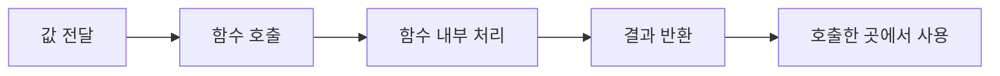
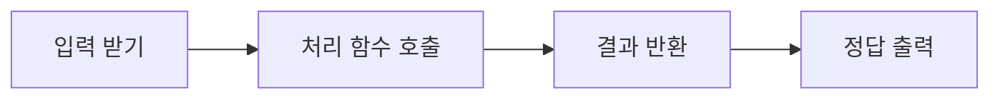
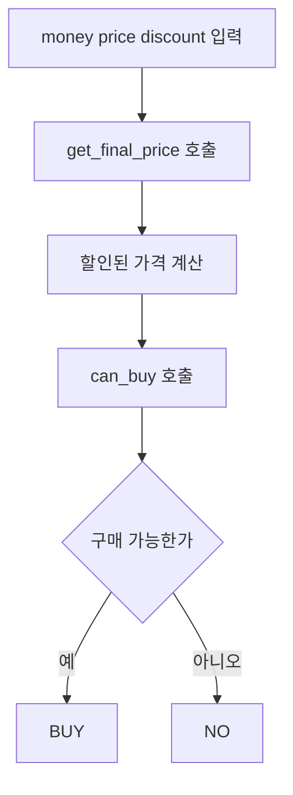

# Coding Test Day 3 — 함수 분리

## 1. 학습 목표

- 단계: 1단계 — 코테 기초 체력
- 오늘 주제: 함수 분리
- 오늘 배울 것: 입력, 처리, 출력을 함수로 나누는 습관
- 오늘 문제 풀이: 기초 구현 4문제
- 오늘 복습/산출물: 함수명과 역할 정리

### 오늘 사용하는 고정 환경

- IDE: Cursor Desktop 3.18
- Python: 3.14.7
- 실행 방식: Cursor Integrated Terminal에서 `python 파일명.py`
- 외부 Library: 없음
- 표준 Library: 필요할 때 `sys`만 사용

> `VERSION_LOCK.md`의 버전은 그대로 유지한다. Day 3에서는 새 도구를 추가하지 않는다.

### 오늘의 핵심 사고 질문

- 이 코드에서 **입력**, **계산**, **출력**은 각각 어디인가?
- 한 함수가 너무 많은 일을 하고 있지는 않은가?
- 함수 이름만 보고 역할을 예상할 수 있는가?
- 같은 계산을 여러 번 쓴다면 함수로 묶을 수 있는가?
- 함수의 입력값인 매개변수와 결과값인 `return`을 구분했는가?
- 전역변수 없이 필요한 값을 함수에 전달할 수 있는가?
- 함수로 나눴다고 해서 시간복잡도가 자동으로 좋아지는 것은 아니라는 점을 이해했는가?

---

## Day 2 연결 복습

Day 2에서 우리는 문제 조건을 `if`, `for`, `while`로 옮겼다.

Day 3에서는 같은 코드를 더 읽기 쉽고 고치기 쉽게 만드는 방법을 배운다.

예를 들어 다음 코드는 틀린 코드는 아니다.

```python
score = int(input())

if score >= 60:
    result = "PASS"
else:
    result = "FAIL"

print(result)
```

오늘은 이 흐름을 다음처럼 바라본다.

```text
입력
→ 처리
→ 출력
```

이 세 역할을 함수로 나누는 것이 Day 3의 핵심이다.

---

## 2. 이론 1 — 함수는 이름 붙인 작업 묶음

### 한 줄 정의

**함수는 특정 작업을 하나의 이름으로 묶어 필요할 때 호출할 수 있게 만든 코드 블록이다.**

### 아주 쉬운 비유

자판기를 생각해 보자.

버튼에 `콜라`라고 적혀 있으면 우리는 내부에서 어떤 모터가 몇 번 움직이는지 몰라도 된다.

버튼 이름만 보고 역할을 이해한다.

함수도 비슷하다.

```python
def is_pass(score):
    return score >= 60
```

함수 이름 `is_pass`만 봐도 점수가 합격인지 확인하는 기능이라는 것을 짐작할 수 있다.

### 함수의 기본 구조

```python
def 함수이름(매개변수):
    처리
    return 결과
```

예:

```python
def add(a, b):
    return a + b
```

사용:

```python
result = add(3, 5)
print(result)
```

출력:

```text
8
```

### 개념 구조



그림의 흐름은 다음과 같다.

1. 함수가 처리할 값을 전달한다.
2. 함수가 호출된다.
3. 함수 내부에서 계산한다.
4. `return`으로 결과를 돌려준다.
5. 호출한 코드에서 결과를 출력하거나 다른 계산에 사용한다.

### 함수가 왜 필요한가

함수의 핵심 목적은 단순히 코드를 길게 만드는 것이 아니다.

다음 장점이 있다.

- 코드의 역할을 이름으로 표현할 수 있다.
- 같은 작업을 여러 번 재사용할 수 있다.
- 잘못된 부분을 특정 함수 안에서 찾기 쉬워진다.
- 긴 문제에서 입력, 계산, 출력이 뒤섞이는 것을 줄일 수 있다.
- 나중에 시뮬레이션처럼 긴 구현을 배울 때 함수 분리가 큰 도움이 된다.

### 오늘의 중요한 오해

함수로 나누면 시간복잡도가 저절로 줄어드는 것은 아니다.

예를 들어 아래 두 코드는 모두 리스트를 한 번 순회한다.

```python
total = 0
for value in numbers:
    total += value
```

```python
def get_sum(numbers):
    total = 0
    for value in numbers:
        total += value
    return total
```

둘 다 핵심 반복 횟수는 같으므로 시간복잡도는 `O(N)`이다.

함수 분리는 먼저 **구조와 가독성**을 개선하는 도구라고 이해하자.

---

## 3. 실습예제 1 — 두 수 중 큰 값 함수 만들기

### 문제 상황

두 정수 `a`, `b`가 주어진다. 더 큰 값을 출력한다. 두 값이 같으면 그 값을 그대로 출력한다.

### 입력 예시

```text
7 12
```

### 예상 출력

```text
12
```

### 먼저 손으로 풀기

```text
7과 12를 비교
12가 더 큼
정답 12
```

### 가장 단순한 풀이

조건문 하나로 해결할 수 있다.

```python
if a >= b:
    result = a
else:
    result = b
```

오늘은 이 비교 작업에 이름을 붙인다.

### 함수 설계

```text
함수 이름: get_larger
입력: a, b
처리: 두 수 비교
출력: 더 큰 값 반환
```

### Python 전체 코드

```python
def get_larger(a, b):
    if a >= b:
        return a
    return b


a, b = map(int, input().split())
answer = get_larger(a, b)
print(answer)
```

### 핵심 설명

- `get_larger(a, b)`는 비교만 담당한다.
- `input()`은 함수 밖에서 입력을 담당한다.
- `print()`는 함수 밖에서 출력을 담당한다.
- 함수는 계산 결과만 `return`한다.

### 시간복잡도

`O(1)`

비교 횟수가 입력 크기에 따라 증가하지 않는다.

### 공간복잡도

`O(1)`

정수 변수 몇 개만 사용한다.

### 반례

1. `5 5` → 같은 값
2. `-3 -10` → 음수 비교
3. `0 1000000` → 값 차이가 큰 경우

### Cursor에서 실행

```bash
python solutions/basic/day003/practice01.py
```

---

## 4. 이론 2 — 매개변수는 함수에게 전달하는 재료

### 한 줄 정의

**매개변수는 함수가 작업할 때 필요한 값을 받아오는 이름이다.**

예:

```python
def multiply(a, b):
    return a * b
```

여기서 `a`, `b`가 매개변수다.

호출할 때 실제 값을 전달한다.

```python
result = multiply(4, 6)
```

이 순간 함수 안에서는 `a = 4`, `b = 6`처럼 사용할 수 있다.

### 값을 함수에 전달하는 이유

초보자가 자주 만드는 코드는 다음과 같다.

```python
score = 85

def is_pass():
    return score >= 60
```

작은 프로그램에서는 동작할 수 있지만, 함수가 외부 변수 `score`에 의존한다.

더 안전한 형태는 다음과 같다.

```python
def is_pass(score):
    return score >= 60
```

이 함수는 어떤 점수를 검사하는지 호출할 때 명확하게 보인다.

```python
print(is_pass(85))
print(is_pass(40))
```

### 함수의 입력과 출력 사고

함수를 만들기 전에 아래 세 줄을 먼저 적어 보자.

```text
입력값:
처리:
반환값:
```

예:

```text
입력값: 정수 n
처리: 짝수인지 확인
반환값: 짝수면 True, 아니면 False
```

구현:

```python
def is_even(n):
    return n % 2 == 0
```

이 방식은 뒤에서 BFS, DP, 시뮬레이션을 함수로 분리할 때도 그대로 사용한다.

---

## 5. 실습예제 2 — 합격 여부 함수 만들기

### 문제 상황

점수 하나가 주어진다.

- 60 이상이면 `PASS`
- 60 미만이면 `FAIL`

을 출력한다.

### 입력 예시

```text
72
```

### 예상 출력

```text
PASS
```

### 먼저 손으로 풀기

```text
72 >= 60
참
PASS
```

### 함수 역할 설계

```text
함수 이름: get_result
입력: score
처리: 60점 이상인지 확인
반환: PASS 또는 FAIL 문자열
```

### Python 전체 코드

```python
def get_result(score):
    if score >= 60:
        return "PASS"
    return "FAIL"


score = int(input())
answer = get_result(score)
print(answer)
```

### 왜 함수 안에서 바로 print하지 않았는가

다음 코드도 동작한다.

```python
def print_result(score):
    if score >= 60:
        print("PASS")
    else:
        print("FAIL")
```

하지만 오늘은 **처리 함수는 값을 반환하고 출력은 마지막에 한 곳에서 담당하는 구조**를 기본으로 연습한다.

이렇게 하면 나중에 결과를 출력하지 않고 다른 계산에 재사용하기 쉽다.

### 시간복잡도

`O(1)`

### 반례

1. `60` → 정확한 경계
2. `59` → 경계 바로 아래
3. `100` → 최댓값 후보

---

## 6. 이론 3 — return은 결과를 돌려주고 함수를 끝낸다

### 한 줄 정의

**`return`은 함수의 결과를 호출한 곳으로 돌려주면서 현재 함수 실행을 종료한다.**

예:

```python
def absolute_value(n):
    if n >= 0:
        return n
    return -n
```

`n >= 0`이면 첫 번째 `return`에서 함수가 끝난다.

그래서 다음처럼 `else`를 생략할 수도 있다.

```python
def absolute_value(n):
    if n >= 0:
        return n
    return -n
```

### print와 return 차이

초보자가 가장 많이 헷갈리는 부분이다.

```python
def add(a, b):
    print(a + b)
```

이 함수는 화면에 값을 보여 주지만 계산 결과를 호출한 곳에 돌려주지는 않는다.

반면:

```python
def add(a, b):
    return a + b
```

이제 결과를 변수에 저장할 수 있다.

```python
result = add(3, 5)
print(result)
```

### 비교

| 구분 | `print` | `return` |
|---|---|---|
| 목적 | 화면에 출력 | 호출한 곳에 값 전달 |
| 함수 종료 | 보통 아님 | 즉시 종료 |
| 결과 재사용 | 직접 불가 | 가능 |
| 코테 처리 함수 | 보통 마지막 출력에서 사용 | 계산 함수에서 자주 사용 |

### 기억할 문장

```text
print는 보여주기
return은 돌려주기
```

---

## 7. 실습예제 3 — 짝수 개수 함수

### 문제 상황

정수 `N`이 주어진다. `1`부터 `N`까지의 정수 중 짝수의 개수를 출력한다.

### 입력 예시

```text
7
```

### 예상 출력

```text
3
```

짝수는 `2, 4, 6`이다.

### 먼저 손으로 풀기

```text
1 제외
2 카운트 1
3 제외
4 카운트 2
5 제외
6 카운트 3
7 제외
```

### 가장 단순한 풀이

`1`부터 `N`까지 모두 확인한다.

### 입력 크기 확인

오늘의 연습에서는 `N`이 충분히 작다고 가정한다.

예:

```text
1 <= N <= 100000
```

### 함수 역할 설계

```text
함수 이름: count_even
입력: n
처리: 1부터 n까지 순회하며 짝수 개수 계산
반환: 개수
```

### Python 전체 코드

```python
def count_even(n):
    count = 0

    for number in range(1, n + 1):
        if number % 2 == 0:
            count += 1

    return count


n = int(input())
answer = count_even(n)
print(answer)
```

### 시간복잡도

`O(N)`

`1`부터 `N`까지 한 번 확인한다.

### 공간복잡도

`O(1)`

리스트를 만들지 않고 변수 몇 개만 사용한다.

### 반례

1. `1` → 짝수 없음
2. `2` → 짝수 하나
3. `10` → 짝수 다섯 개

---

## 8. 이론 4 — 입력, 처리, 출력을 분리하는 기본 구조

Day 3에서 가장 중요한 구조다.



이 흐름을 코드로 옮기면 다음과 같다.

```python
def solve_value(value):
    result = value * 2
    return result


value = int(input())
answer = solve_value(value)
print(answer)
```

### 역할을 표로 나누기

| 영역 | 역할 | 예시 |
|---|---|---|
| 입력 | 문제 데이터를 읽음 | `n = int(input())` |
| 처리 | 정답을 계산 | `answer = solve(n)` |
| 출력 | 요구 형식으로 출력 | `print(answer)` |

### 왜 이 구조가 좋은가

예를 들어 계산이 틀렸다면 처리 함수만 확인하면 된다.

입력이 이상하다면 입력 부분을 확인한다.

출력 형식이 틀렸다면 마지막 출력 부분을 확인한다.

즉, **오류가 생겼을 때 찾을 범위가 줄어든다.**

### 함수 이름은 역할을 드러내야 한다

좋은 예:

```python
get_discounted_price
count_passed_students
is_even
get_grade
calculate_total
```

나쁜 예:

```python
a
func1
do_it
x
abc
```

짧은 코딩테스트 함수에서는 `solve`도 자주 사용하지만, 학습 단계에서는 구체적인 이름을 먼저 연습한다.

---

## 9. 실습예제 4 — N개의 점수에서 합격자 수 계산

### 문제 상황

학생 수 `N`과 `N`개의 점수가 주어진다. 60점 이상인 학생 수를 출력한다.

### 입력 예시

```text
5
45 60 72 59 100
```

### 예상 출력

```text
3
```

### 먼저 손으로 풀기

```text
45 실패
60 합격
72 합격
59 실패
100 합격
합격자 3명
```

### 가장 단순한 풀이

점수를 하나씩 확인하면서 60 이상이면 카운트를 1 증가시킨다.

### 입력 크기 확인

예:

```text
1 <= N <= 100000
```

### 허용 가능한 시간복잡도

모든 학생 점수를 한 번씩 보는 `O(N)`이면 충분하다.

### 함수 역할 설계

```text
함수 이름: count_passed
입력: scores
처리: 각 점수가 60 이상인지 검사
반환: 합격자 수
```

### Python 전체 코드

```python
def count_passed(scores):
    count = 0

    for score in scores:
        if score >= 60:
            count += 1

    return count


n = int(input())
scores = list(map(int, input().split()))

answer = count_passed(scores)
print(answer)
```

### 현재 Day에서의 입력 가정

입력 형식이 정확히 `N`개의 점수를 준다고 가정한다.

나중에는 실제 시험에서 입력 형식과 개수까지 더 엄격하게 확인하는 습관을 강화한다.

### 시간복잡도

`O(N)`

### 공간복잡도

점수 `N`개를 리스트에 저장하므로 `O(N)`이다.

### 반례

1. `1 / 60` → 한 명이 정확히 합격 경계
2. 모두 59 → 정답 0
3. 모두 100 → 정답 N

---

## 10. 오늘의 통합 문제 풀이 — 할인 후 결제 가능 여부

### 문제

현재 가진 돈 `money`, 상품 가격 `price`, 할인율 `discount`가 정수로 주어진다.

할인율은 퍼센트 단위이며 할인 금액은 다음처럼 계산한다.

```text
할인 금액 = price * discount // 100
최종 가격 = price - 할인 금액
```

최종 가격이 가진 돈 이하이면 `BUY`, 아니면 `NO`를 출력한다.

### 입력 예시

```text
8000 10000 30
```

### 예상 출력

```text
BUY
```

### 문제를 한 문장으로 줄이기

```text
할인된 가격을 계산한 뒤 가진 돈으로 살 수 있는지 판단한다.
```

### 입력 크기

정수 세 개만 주어진다.

### 허용 복잡도

반복이 필요하지 않다. `O(1)`이면 충분하다.

### 가장 단순한 풀이

```text
1. 할인 금액 계산
2. 최종 가격 계산
3. money와 비교
4. BUY 또는 NO 결정
```

### 함수로 분리하기

함수 1:

```text
이름: get_final_price
입력: price, discount
출력: 할인된 최종 가격
```

함수 2:

```text
이름: can_buy
입력: money, final_price
출력: 구매 가능 여부
```

### 풀이 흐름



### Python 전체 코드

```python
def get_final_price(price, discount):
    discount_amount = price * discount // 100
    return price - discount_amount


def can_buy(money, final_price):
    return money >= final_price


money, price, discount = map(int, input().split())

final_price = get_final_price(price, discount)

if can_buy(money, final_price):
    print("BUY")
else:
    print("NO")
```

### 함수별 책임

| 함수 | 입력 | 처리 | 반환 |
|---|---|---|---|
| `get_final_price` | 가격, 할인율 | 할인 금액 계산 | 최종 가격 |
| `can_buy` | 가진 돈, 최종 가격 | 크기 비교 | `True` 또는 `False` |

### 시간복잡도

`O(1)`

### 공간복잡도

`O(1)`

### 핵심 반례

1. 가진 돈과 최종 가격이 정확히 같음 → `BUY`
2. 할인율이 0 → 원래 가격 그대로 비교
3. 할인율이 100 → 최종 가격 0
4. 가진 돈이 최종 가격보다 1 부족함 → `NO`

---

## 11. 풀이 검증 — 함수로 나눠도 검증은 따로 해야 한다

함수로 분리했다고 정답이 보장되는 것은 아니다.

검증은 함수 단위로 할 수 있다.

### get_final_price 검증

```text
price = 10000, discount = 30
할인 금액 = 3000
최종 가격 = 7000
```

```text
price = 10000, discount = 0
최종 가격 = 10000
```

```text
price = 10000, discount = 100
최종 가격 = 0
```

### can_buy 검증

```text
money = 7000, final_price = 7000
True
```

```text
money = 6999, final_price = 7000
False
```

### 통합 검증

각 함수는 맞는데 연결이 잘못될 수도 있다.

예를 들어 다음은 인자 순서가 틀렸다.

```python
final_price = get_final_price(discount, price)
```

함수 이름이 맞아도 전달값 순서가 틀리면 오답이다.

---

## 12. 함수 분리와 시간복잡도

### 경우 1 — 반복이 없는 함수

```python
def is_positive(n):
    return n > 0
```

복잡도는 `O(1)`이다.

### 경우 2 — N개를 한 번 순회하는 함수

```python
def get_sum(numbers):
    total = 0

    for number in numbers:
        total += number

    return total
```

복잡도는 `O(N)`이다.

### 함수 두 개가 각각 N번 순회하면

```python
def get_sum(numbers):
    ...


def count_positive(numbers):
    ...
```

각각 한 번 순회하면 전체 작업량은 대략 `N + N`이다.

```text
O(N) + O(N)
→ O(2N)
→ O(N)
```

상수 배는 빅오 표기에서 생략한다.

### 중요한 질문

함수 개수가 아니라 **각 함수 안에서 입력 크기와 함께 증가하는 반복 횟수**를 본다.

---

## 13. 자주 발생하는 오류와 오해

### 오류 1 — 함수 정의만 하고 호출하지 않음

```python
def greet():
    print("HELLO")
```

이 코드만으로는 아무것도 출력되지 않는다.

```python
greet()
```

처럼 호출해야 한다.

### 오류 2 — return 없이 결과를 받으려고 함

```python
def add(a, b):
    print(a + b)

result = add(3, 5)
print(result)
```

첫 번째 출력은 `8`이지만 `result`에는 `None`이 들어간다.

계산 결과를 재사용하려면 `return`을 사용한다.

### 오류 3 — print와 return을 같은 것으로 생각

```text
print = 화면에 보여주기
return = 호출한 곳에 값 전달
```

### 오류 4 — 함수 이름이 역할을 설명하지 않음

`f`, `do`, `func2` 같은 이름이 많아지면 긴 구현에서 역할을 구분하기 어렵다.

### 오류 5 — 함수가 너무 많은 일을 함

```python
def process_everything():
    # 입력
    # 계산 1
    # 계산 2
    # 출력
    # 또 다른 계산
```

함수 이름으로 역할이 설명되지 않는다면 나눌 필요가 있는지 검토한다.

### 오류 6 — 전역변수에 지나치게 의존

학습 단계에서는 필요한 값을 매개변수로 전달하고 결과를 `return`하는 형태를 우선한다.

### 오류 7 — 함수로 나누면 더 빠르다고 생각

함수 분리의 주 목적은 구조화다. 시간복잡도는 실제 반복과 연산을 따로 계산해야 한다.

---

## 14. 함수명과 역할 정리 — 오늘의 필수 산출물

오늘 문제를 풀 때 아래 표를 직접 채운다.

| 함수명 | 입력 | 역할 | 반환값 |
|---|---|---|---|
| `get_larger` | `a`, `b` | 더 큰 값 선택 | 정수 |
| `get_result` | `score` | 합격 여부 문자열 결정 | 문자열 |
| `count_even` | `n` | 1부터 N까지 짝수 개수 계산 | 정수 |
| `count_passed` | `scores` | 60 이상 점수 개수 계산 | 정수 |
| `get_final_price` | `price`, `discount` | 할인 가격 계산 | 정수 |
| `can_buy` | `money`, `final_price` | 구매 가능 여부 판정 | bool |

### 함수 이름 만들기 패턴

```text
get_...
→ 값을 계산해서 얻음

count_...
→ 개수를 셈

is_...
→ 참 또는 거짓 판정

can_...
→ 가능한지 판정

calculate_...
→ 계산 수행
```

이름은 절대 규칙이 아니라 **역할을 빠르게 전달하는 도구**다.

---

## 15. 강의 요약

### 오늘 배운 핵심 5가지

1. 함수는 특정 작업을 이름으로 묶은 코드 블록이다.
2. 매개변수는 함수에 필요한 값을 전달하고 `return`은 결과를 돌려준다.
3. `print`는 보여 주는 것이고 `return`은 값을 반환하는 것이다.
4. 코딩테스트 초반에는 입력, 처리, 출력을 구분하는 습관이 코드 이해와 디버깅에 도움이 된다.
5. 함수 분리는 코드 구조를 개선하지만 시간복잡도는 함수 내부의 실제 반복 횟수로 따로 계산해야 한다.

### 오늘의 알고리즘 선택 질문

오늘은 새로운 알고리즘을 선택하는 날이 아니다.

대신 다음을 묻는다.

```text
이 문제를 입력, 처리, 출력으로 나눌 수 있는가?
처리 과정 중 이름을 붙이면 이해가 쉬워지는 작업은 무엇인가?
같은 작업을 여러 번 사용하게 되는가?
```

### 오늘의 시간복잡도

| 코드 형태 | 시간복잡도 |
|---|---|
| 정해진 횟수의 계산과 비교 | `O(1)` |
| N개의 값을 한 번 순회 | `O(N)` |
| N개 순회 함수 두 개 | 전체적으로 `O(N)` |

### 오늘의 핵심 반례

1. 조건 경계값이 정확히 들어오는 경우
2. 입력이 하나뿐인 최소 크기
3. 조건을 한 번도 만족하지 않는 경우
4. 모든 입력이 조건을 만족하는 경우
5. 함수 인자의 순서를 바꿔 넣었을 때 잘못되는 경우

### 오늘 완성할 파일

```text
days/day003/lecture.md
days/day003/practice.md
days/day003/exercises.md
days/day003/review.md
solutions/basic/day003/
```

### 다음에 다시 풀 날짜

Day 3 학습일을 2026-09-06으로 잡으면:

```text
D+3  : 2026-09-09
D+7  : 2026-09-13
D+21 : 2026-09-27
```

최소 D+3, D+7 두 번은 다시 푼다.

### 다음 Day 연결

Day 4에서는 **배열과 List 기초**로 넘어간다.

오늘 만든 함수 구조를 이용해 다음과 같은 코드로 확장하게 된다.

```python
def get_max_value(numbers):
    ...
```

즉, Day 3의 함수 분리는 앞으로 자료구조와 알고리즘을 담는 그릇 역할을 한다.

---

## 16. 핵심 용어

| 용어 | 아주 쉬운 뜻 | 정확한 의미 |
|---|---|---|
| 함수 | 이름 붙인 작업 묶음 | 호출 가능한 코드 블록 |
| 함수 호출 | 함수를 실행시키기 | 함수 이름과 인자를 사용해 함수 실행을 시작하는 것 |
| 매개변수 | 함수가 받는 재료 | 함수 정의에서 입력값을 받는 변수 |
| 인자 | 실제로 넣어 주는 값 | 함수를 호출할 때 전달하는 실제 값 |
| return | 결과 돌려주기 | 값을 호출 위치로 반환하고 함수 실행을 종료하는 문장 |
| print | 화면에 보여주기 | 표준 출력으로 값을 출력하는 함수 |
| 역할 분리 | 일을 나눠 맡기기 | 입력, 처리, 출력처럼 책임을 구분하는 설계 방식 |
| 전역변수 | 함수 밖의 공용 변수 | 여러 영역에서 접근 가능한 바깥 범위의 변수 |
| 시간복잡도 | 입력이 커질 때 일의 증가 정도 | 입력 크기에 따른 연산량 증가를 나타내는 표현 |

---

## 17. 연습문제

오늘의 전체 연습문제 15개는 `exercises.md`에 있다.

- 초급 5개
- 중급 5개
- 고급 5개

정답 코드는 포함하지 않는다.

풀이 위치:

```text
solutions/basic/day003/
```

권장 파일명:

```text
beginner01.py ~ beginner05.py
intermediate01.py ~ intermediate05.py
advanced01.py ~ advanced05.py
```
