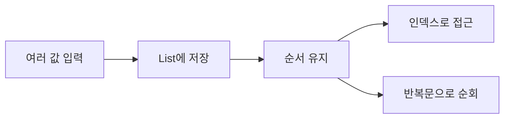
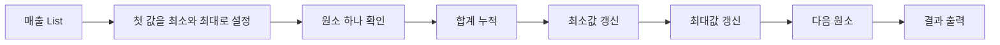

# Coding Test Day 4 — 배열/List 기초

## 1. 학습 목표

- 단계: 1단계 — 코테 기초 체력
- 오늘 주제: 배열/List 기초
- 오늘 배울 것: 배열 순회, 최댓값, 최솟값, 합계
- 오늘 문제 풀이: 배열 5문제
- 오늘 복습/산출물: 인덱스 범위 실수 정리

### 오늘 사용하는 고정 환경

- IDE: Cursor Desktop 3.18
- Python: 3.14.7
- 실행 방식: Cursor Integrated Terminal에서 `python 파일명.py`
- 외부 Library: 없음
- 표준 Library: 오늘은 기본 문법만 사용

> `VERSION_LOCK.md`는 변경하지 않는다. Day 4에서는 새 도구가 필요하지 않다.

### 오늘의 핵심 사고 질문

- 여러 값을 한 번에 저장해야 하는가?
- 리스트의 길이는 몇 개인가?
- 첫 번째 원소의 인덱스는 무엇인가?
- 마지막 원소의 인덱스는 무엇인가?
- 값을 직접 순회할 것인가, 인덱스로 순회할 것인가?
- 합계, 최댓값, 최솟값을 한 번의 순회로 구할 수 있는가?
- `i + 1` 또는 `i - 1`을 사용할 때 범위를 벗어나지 않는가?

---

## Day 3 연결 복습

Day 3에서는 입력, 처리, 출력을 함수로 나누는 습관을 배웠다.

오늘은 함수가 처리할 데이터가 하나가 아니라 여러 개일 때 가장 자주 쓰는 구조인 **List**를 배운다.

예를 들어 점수 다섯 개를 각각 변수에 저장하면 다음처럼 길어진다.

```python
score1 = 70
score2 = 85
score3 = 60
score4 = 92
score5 = 78
```

리스트를 사용하면 하나의 이름으로 묶을 수 있다.

```python
scores = [70, 85, 60, 92, 78]
```

이제 `scores`를 순회하면서 합계, 최댓값, 최솟값 등을 계산할 수 있다.

---

# 2. 이론 1 — List는 여러 값을 순서대로 담는 상자

## 한 줄 정의

**List는 여러 값을 순서를 유지한 채 하나의 변수에 저장하는 Python 자료형이다.**

## 아주 쉬운 비유

사물함이 일렬로 다섯 칸 있다고 생각해 보자.

각 칸에는 번호가 있고 값 하나가 들어 있다.

```text
칸 번호   0   1   2   3   4
값       70  85  60  92  78
```

Python List도 비슷하다.

```python
scores = [70, 85, 60, 92, 78]
```

여기서 중요한 점은 **번호가 1이 아니라 0부터 시작한다**는 것이다.

## 오늘 개념 구조



그림의 뜻은 다음과 같다.

1. 여러 값을 입력받는다.
2. 그 값을 하나의 List에 저장한다.
3. List는 값의 순서를 유지한다.
4. 필요하면 인덱스로 특정 값을 꺼낸다.
5. 모든 값을 확인하려면 반복문으로 순회한다.

## List 만들기

```python
numbers = [10, 20, 30]
```

빈 리스트도 만들 수 있다.

```python
numbers = []
```

문자열도 넣을 수 있다.

```python
names = ["Nara", "Mina", "Jisu"]
```

오늘 코딩테스트에서는 숫자 리스트를 중심으로 사용한다.

## 길이 확인

```python
numbers = [10, 20, 30]
print(len(numbers))
```

출력:

```text
3
```

`len(numbers)`는 리스트에 원소가 몇 개 들어 있는지 알려준다.

## 인덱스

```python
numbers = [10, 20, 30]

print(numbers[0])
print(numbers[1])
print(numbers[2])
```

출력:

```text
10
20
30
```

길이가 `N`인 리스트에서 사용할 수 있는 인덱스 범위는 다음과 같다.

```text
0부터 N - 1까지
```

길이가 3이라면:

```text
0, 1, 2
```

만 가능하다.

`numbers[3]`은 존재하지 않는다.

---

# 3. 실습예제 1 — 첫 값과 마지막 값 출력

## 문제 상황

정수 `N`개가 주어진다. 첫 번째 값과 마지막 값을 출력한다.

## 입력 예시

```text
5
8 3 10 4 7
```

## 예상 출력

```text
8 7
```

## 먼저 손으로 풀기

리스트는 다음과 같다.

```text
인덱스   0  1   2  3  4
값       8  3  10  4  7
```

첫 번째 값은 인덱스 `0`이다.

마지막 값은 인덱스 `N - 1`이다.

Python에서는 마지막 값을 `numbers[-1]`로도 읽을 수 있다.

## 입력 크기 확인

```text
1 <= N <= 100000
```

첫 값과 마지막 값만 읽으면 되므로 전체를 다시 반복할 필요가 없다.

## 가장 단순한 풀이

```python
n = int(input())
numbers = list(map(int, input().split()))

print(numbers[0], numbers[n - 1])
```

## 더 Python다운 표현

```python
n = int(input())
numbers = list(map(int, input().split()))

print(numbers[0], numbers[-1])
```

## 시간복잡도

리스트 입력을 읽어 저장하는 데 `O(N)`이 필요하다.

첫 값과 마지막 값 접근 자체는 각각 `O(1)`이다.

전체는 입력 저장까지 포함하면 `O(N)`이다.

## 공간복잡도

리스트에 N개를 저장하므로 `O(N)`이다.

## 반례

```text
N = 1
값 = 5
```

첫 값과 마지막 값이 같은 원소다.

```text
N = 2
값 = -1 -9
```

음수도 정상적으로 처리해야 한다.

```text
N = 5
값 = 0 0 0 0 0
```

값이 모두 같아도 문제없어야 한다.

## 초보자 실수

```python
numbers[n]
```

를 마지막 값이라고 생각하는 실수다.

마지막 인덱스는 항상 `n - 1`이다.

## 기억할 한 문장

**길이가 N이면 마지막 인덱스는 N이 아니라 N - 1이다.**

---

# 4. 이론 2 — 리스트 순회

## 한 줄 정의

**순회는 리스트의 원소를 처음부터 끝까지 하나씩 확인하는 것이다.**

## 값을 직접 순회하기

```python
numbers = [4, 7, 2]

for number in numbers:
    print(number)
```

출력:

```text
4
7
2
```

값 자체만 필요하다면 이 방식이 가장 단순하다.

## 인덱스로 순회하기

```python
numbers = [4, 7, 2]

for i in range(len(numbers)):
    print(i, numbers[i])
```

출력:

```text
0 4
1 7
2 2
```

현재 위치가 필요할 때 사용한다.

## 어떤 방식을 선택할까

```text
값만 필요
→ for value in numbers

위치도 필요
→ for i in range len numbers
```

## 순회 흐름


한 원소를 확인하고 다음 원소로 이동하는 일을 N번 반복한다.

따라서 한 번 전체 순회하는 시간복잡도는 `O(N)`이다.

---

# 5. 실습예제 2 — 양수의 개수 세기

## 문제 상황

정수 N개가 주어질 때 양수의 개수를 출력한다.

## 입력 예시

```text
6
-3 0 4 8 -1 2
```

## 예상 출력

```text
3
```

## 먼저 손으로 풀기

```text
-3 → 양수 아님
0  → 양수 아님
4  → 양수
8  → 양수
-1 → 양수 아님
2  → 양수
```

총 3개다.

## 가장 단순한 풀이

```python
n = int(input())
numbers = list(map(int, input().split()))

count = 0

for number in numbers:
    if number > 0:
        count += 1

print(count)
```

## 시간복잡도

N개의 값을 한 번 확인하므로 `O(N)`이다.

## 공간복잡도

리스트 저장에 `O(N)`이 필요하다.

## 반례

```text
1
0
```

정답은 0이다.

```text
4
-1 -2 -3 -4
```

정답은 0이다.

```text
4
1 2 3 4
```

정답은 4다.

## 초보자 실수

양수를 `number >= 0`으로 검사하면 0까지 포함한다.

조건을 정확히 읽어야 한다.

---

# 6. 이론 3 — 합계는 누적해서 만든다

## 한 줄 정의

**합계는 빈 결과 변수에서 시작해 각 원소를 하나씩 더하며 누적한다.**

## 기본 패턴

```python
total = 0

for number in numbers:
    total += number
```

예를 들어:

```text
numbers = 3 5 2
```

이라면:

```text
시작 total = 0
3을 더함 → 3
5를 더함 → 8
2를 더함 → 10
```

## Python 내장 함수

Python에는 `sum`이 있다.

```python
numbers = [3, 5, 2]
print(sum(numbers))
```

하지만 오늘은 **반복문으로 합계가 어떻게 만들어지는지** 먼저 이해한다.

---

# 7. 실습예제 3 — 전체 합계 구하기

## 문제 상황

정수 N개의 합을 출력한다.

## 입력 예시

```text
5
10 20 30 40 50
```

## 예상 출력

```text
150
```

## 먼저 손으로 풀기

```text
10 + 20 + 30 + 40 + 50 = 150
```

## 가장 단순한 풀이

```python
n = int(input())
numbers = list(map(int, input().split()))

total = 0

for number in numbers:
    total += number

print(total)
```

## 시간복잡도

한 번 순회하므로 `O(N)`이다.

## 공간복잡도

리스트 저장에 `O(N)`이 필요하다.

## 반례

```text
1
7
```

```text
3
-10 -20 -30
```

```text
4
-5 5 -5 5
```

## 초보자 실수

반복문 안에서 `total = 0`을 다시 작성하면 매번 합계가 초기화된다.

잘못된 예:

```python
for number in numbers:
    total = 0
    total += number
```

`total = 0`은 반복문 **밖**에서 한 번만 실행해야 한다.

---

# 8. 이론 4 — 최댓값과 최솟값

## 한 줄 정의

**최댓값과 최솟값은 지금까지 본 가장 큰 값 또는 가장 작은 값을 계속 갱신하며 찾는다.**

## 가장 중요한 초기값

리스트에 값이 최소 하나 있다고 가정하면 첫 번째 원소를 초기값으로 잡는 것이 안전하다.

```python
max_value = numbers[0]
min_value = numbers[0]
```

그 다음 모든 값을 확인한다.

```python
for number in numbers:
    if number > max_value:
        max_value = number

    if number < min_value:
        min_value = number
```

## 왜 0으로 시작하면 위험할까

다음 입력을 생각해 보자.

```text
-10 -3 -7
```

최댓값은 `-3`이다.

하지만:

```python
max_value = 0
```

으로 시작하면 어떤 값도 0보다 크지 않으므로 잘못된 답 0이 남는다.

그래서 입력 원소 중 하나를 초기값으로 잡는 것이 안전하다.

## Python 내장 함수

```python
max(numbers)
min(numbers)
```

도 사용할 수 있다.

오늘은 내부 동작을 이해하기 위해 직접 구현도 해 본다.

---

# 9. 실습예제 4 — 최댓값과 최솟값 동시에 찾기

## 문제 상황

정수 N개가 주어질 때 최솟값과 최댓값을 출력한다.

## 입력 예시

```text
6
8 -2 14 3 14 0
```

## 예상 출력

```text
-2 14
```

## 풀이 단계

1. 리스트의 첫 값을 최솟값과 최댓값의 초기값으로 잡는다.
2. 리스트를 한 번 순회한다.
3. 더 작은 값을 만나면 최솟값을 갱신한다.
4. 더 큰 값을 만나면 최댓값을 갱신한다.
5. 두 값을 출력한다.

## Python 전체 코드

```python
n = int(input())
numbers = list(map(int, input().split()))

min_value = numbers[0]
max_value = numbers[0]

for number in numbers:
    if number < min_value:
        min_value = number

    if number > max_value:
        max_value = number

print(min_value, max_value)
```

## 시간복잡도

N개를 한 번 확인하므로 `O(N)`이다.

## 공간복잡도

리스트 저장에 `O(N)`이다.

## 반례

```text
1
5
```

최솟값과 최댓값 모두 5다.

```text
4
-8 -4 -10 -2
```

음수만 있어도 정상 동작해야 한다.

```text
5
7 7 7 7 7
```

모든 값이 같아도 정상 동작해야 한다.

---

# 10. 이론 5 — 인덱스 범위 실수

오늘 가장 중요한 실수 유형이다.

## 길이와 마지막 인덱스

```text
길이 N
유효 인덱스 0부터 N - 1
```

예:

```python
numbers = [10, 20, 30]
```

```text
len = 3
가능한 인덱스 = 0, 1, 2
```

## 위험한 패턴 1 — range 끝값 착각

```python
for i in range(len(numbers)):
    print(numbers[i])
```

정상이다.

하지만:

```python
for i in range(len(numbers) + 1):
    print(numbers[i])
```

마지막에 `numbers[len(numbers)]`를 읽게 되어 에러가 난다.

## 위험한 패턴 2 — 다음 원소 접근

```python
numbers[i + 1]
```

을 사용하려면 `i`가 마지막 인덱스까지 가면 안 된다.

따라서:

```python
for i in range(len(numbers) - 1):
    print(numbers[i], numbers[i + 1])
```

처럼 범위를 잡는다.

## 위험한 패턴 3 — 빈 리스트

오늘 문제들은 대부분 `N >= 1`인 조건으로 연습한다.

만약 빈 리스트가 가능하면:

```python
numbers[0]
```

부터 사용할 수 없다.

항상 입력 제한을 먼저 확인해야 한다.

---

# 11. 오늘의 통합 문제 풀이 — 하루 매출 요약

## 문제 상황

한 가게의 N일 매출이 주어진다.

다음을 출력한다.

1. 전체 매출 합계
2. 가장 작은 일 매출
3. 가장 큰 일 매출

## 입력 예시

```text
5
120 80 150 90 110
```

## 예상 출력

```text
550
80
150
```

## 문제를 한 문장으로 줄이기

**리스트를 한 번 순회하면서 합계, 최솟값, 최댓값을 함께 갱신한다.**

## 입력 제한

```text
1 <= N <= 100000
0 <= sales[i] <= 1000000
```

## 허용 가능한 시간복잡도

N이 100000이므로 한 번 또는 몇 번의 선형 순회인 `O(N)`은 충분히 적절하다.

굳이 모든 원소 쌍을 비교하는 `O(N^2)` 풀이를 만들 필요가 없다.

## 가장 단순한 풀이

합계는 한 번 순회한다.

최솟값도 한 번 순회한다.

최댓값도 한 번 순회한다.

이렇게 세 번 순회해도:

```text
O(N) + O(N) + O(N)
= O(3N)
= O(N)
```

이다.

하지만 한 번에 같이 계산할 수도 있다.

## 문제 풀이 사고 흐름



## Python 전체 코드

```python
n = int(input())
sales = list(map(int, input().split()))

total = 0
min_sale = sales[0]
max_sale = sales[0]

for sale in sales:
    total += sale

    if sale < min_sale:
        min_sale = sale

    if sale > max_sale:
        max_sale = sale

print(total)
print(min_sale)
print(max_sale)
```

## 코드 핵심 설명

```python
total = 0
```

합계의 시작값이다.

```python
min_sale = sales[0]
max_sale = sales[0]
```

입력값 중 첫 번째 값을 초기 기준으로 잡는다.

```python
for sale in sales:
```

모든 매출을 한 번씩 확인한다.

```python
total += sale
```

현재 매출을 누적한다.

```python
if sale < min_sale:
    min_sale = sale
```

더 작은 값을 만나면 최소값을 바꾼다.

```python
if sale > max_sale:
    max_sale = sale
```

더 큰 값을 만나면 최대값을 바꾼다.

## 시간복잡도

리스트를 한 번 순회하므로 `O(N)`이다.

## 공간복잡도

매출 N개를 리스트에 저장하므로 `O(N)`이다.

## 반례

### 반례 1 — 원소 한 개

```text
1
50
```

출력:

```text
50
50
50
```

### 반례 2 — 모두 같은 값

```text
4
100 100 100 100
```

### 반례 3 — 0 포함

```text
5
0 10 20 0 5
```

### 반례 4 — 최솟값이 마지막

```text
5
10 9 8 7 1
```

### 반례 5 — 최댓값이 첫 번째

```text
5
100 4 3 2 1
```

---

# 12. 풀이 검증 / 반례 / 복잡도 분석

## 제출 전 검증 순서

```text
N 확인
→ 리스트 길이 확인
→ 첫 인덱스 확인
→ 마지막 인덱스 확인
→ 반복 범위 확인
→ 초기값 확인
→ 최소 입력 테스트
→ 모두 같은 값 테스트
→ 정답이 첫 위치인 테스트
→ 정답이 마지막 위치인 테스트
```

## 오늘 입력 크기로 생각하는 연습

```text
N <= 10
→ O(N) 가능

N <= 100000
→ O(N) 가능

N <= 1000000
→ O(N) 중심으로 생각
```

오늘 문제에서는 리스트 전체를 한 번 확인하는 선형 순회를 기본으로 삼는다.

---

# 13. 자주 발생하는 오류와 오해

## 오류 1 — 첫 원소 인덱스를 1이라고 생각

Python List는 0부터 시작한다.

## 오류 2 — 마지막 인덱스를 N이라고 생각

길이가 N이면 마지막 인덱스는 `N - 1`이다.

## 오류 3 — 합계 변수를 반복문 안에서 초기화

초기화는 반복 전에 한 번만 한다.

## 오류 4 — 최댓값 초기값을 항상 0으로 설정

음수만 있는 입력에서 틀릴 수 있다.

## 오류 5 — 값을 순회하면 되는데 불필요하게 인덱스를 사용

값만 필요하면:

```python
for value in numbers:
```

가 더 단순하다.

## 오류 6 — 다음 원소를 볼 때 마지막 위치를 검사하지 않음

`numbers[i + 1]`을 사용하면 반복 범위를 반드시 다시 계산한다.

## 오류 7 — `len(numbers)`와 마지막 인덱스를 같은 값으로 착각

길이가 5라면 마지막 인덱스는 4다.

---

# 14. 강의 요약

## 오늘 배운 핵심 5가지

1. List는 여러 값을 순서를 유지하며 저장한다.
2. Python List의 인덱스는 0부터 시작한다.
3. 길이가 N이면 마지막 인덱스는 N - 1이다.
4. 합계, 최댓값, 최솟값은 리스트를 순회하며 계산할 수 있다.
5. 한 번의 전체 순회는 기본적으로 `O(N)`이다.

## 오늘의 알고리즘 선택 질문

다음 질문에 `예`라면 리스트 순회를 먼저 떠올린다.

```text
여러 값이 순서대로 주어지는가?
모든 값을 한 번씩 확인하면 답을 구할 수 있는가?
합계나 개수나 최소나 최대를 구하는가?
```

## 오늘의 시간복잡도

| 작업 | 시간복잡도 | 이유 |
|---|---:|---|
| 특정 인덱스 값 읽기 | `O(1)` | 위치를 바로 알고 있음 |
| 리스트 전체 한 번 순회 | `O(N)` | N개 원소를 각각 확인 |
| 합계 직접 계산 | `O(N)` | 모든 값을 한 번 더함 |
| 최댓값 직접 계산 | `O(N)` | 모든 값을 비교 |
| 최솟값 직접 계산 | `O(N)` | 모든 값을 비교 |

## 오늘의 핵심 반례

- `N = 1`
- 모든 값이 동일
- 음수만 존재
- 최댓값이 첫 번째
- 최솟값이 마지막
- 0 포함

## 오늘 완성할 파일

```text
solutions/basic/day004/
├── practice01.py
├── practice02.py
├── practice03.py
├── practice04.py
├── practice05.py
├── integrated.py
├── beginner01.py ~ beginner05.py
├── intermediate01.py ~ intermediate05.py
└── advanced01.py ~ advanced05.py
```

## 다음에 다시 풀 날짜

- D+3: 2026-09-13
- D+7: 2026-09-17

## 다음 Day 연결

Day 5에서는 **문자열 기초**를 배운다.

오늘 List에서 배운 다음 개념이 그대로 연결된다.

```text
순서
인덱스
길이
순회
```

문자열도 문자가 순서대로 나열된 데이터이므로 인덱스와 순회 사고를 다시 사용하게 된다.

---

# 15. 핵심 용어

| 용어 | 아주 쉬운 뜻 | 정확한 의미 |
|---|---|---|
| List | 여러 값을 한 줄로 담은 상자 | 순서를 유지하며 여러 값을 저장하는 Python 자료형 |
| 원소 | 리스트 안의 값 하나 | List를 구성하는 개별 값 |
| 인덱스 | 값이 있는 칸 번호 | 원소 위치를 나타내는 0 기반 정수 |
| 길이 | 원소가 몇 개인지 | `len`으로 얻는 원소 개수 |
| 순회 | 처음부터 하나씩 보기 | 반복문으로 모든 원소를 방문하는 과정 |
| 누적 | 결과에 계속 더하기 | 이전 결과에 현재 값을 반영하는 처리 |
| 최댓값 | 가장 큰 값 | 모든 원소 이상인 값 |
| 최솟값 | 가장 작은 값 | 모든 원소 이하인 값 |
| 경계 | 범위의 시작과 끝 | 인덱스나 조건에서 허용되는 끝 지점 |

---

# 16. 연습문제

오늘의 연습문제는 별도 파일에 총 15개가 있다.

```text
days/day004/exercises.md
```

구성:

```text
초급 5문제
중급 5문제
고급 5문제
```

정답은 포함하지 않는다.

풀이 코드는 다음 폴더에 작성한다.

```text
solutions/basic/day004/
```
