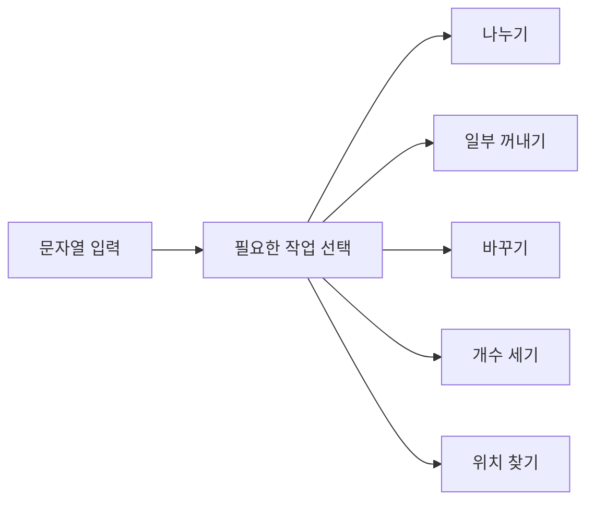
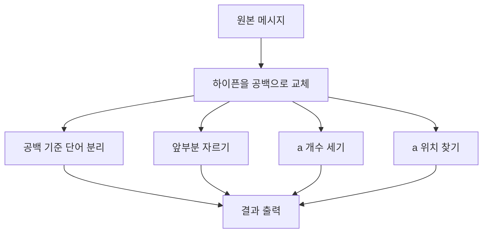

# Coding Test Day 5 — 문자열 기초

## 1. 학습 목표

- 단계: 1단계 — 코테 기초 체력
- 오늘 주제: 문자열 기초
- 오늘 배울 것: `split`, slice, `replace`, `count`, `index` 처리
- 오늘 문제 풀이: 문자열 5문제
- 오늘 복습/산출물: 문자열 내장함수 정리

### 오늘 사용하는 고정 환경

- IDE: Cursor Desktop 3.18
- Python: 3.14.7
- 실행 방식: Cursor Integrated Terminal에서 `python 파일명.py`
- 외부 Library: 사용하지 않음

### 오늘의 핵심 사고 질문

- 문자열에서 내가 필요한 것은 전체 문장인가, 단어인가, 일부 구간인가?
- 공백이나 특정 문자를 기준으로 나눠야 하는가?
- 원본 문자열을 바꿔야 하는가, 새 문자열을 만들어야 하는가?
- 특정 글자가 몇 번 등장하는지 필요한가?
- 특정 글자의 위치가 필요한가?
- 입력 길이가 N일 때 문자열 전체를 몇 번 순회하는가?

---

## Day 4 연결 복습

Day 4에서 List를 배웠다.

```text
여러 값
→ 순서가 있음
→ 인덱스로 접근 가능
→ 처음부터 끝까지 순회 가능
```

문자열도 매우 비슷하다.

```text
"CODE"

인덱스  0 1 2 3
문자    C O D E
```

문자열은 **문자들이 순서대로 나열된 데이터**이므로 Day 4의 인덱스 감각이 그대로 이어진다.

---

# 2. 이론 1 — 문자열은 문자의 순서 있는 묶음

## 한 줄 정의

문자열은 여러 문자가 순서를 유지한 채 이어진 데이터다.

## 아주 쉬운 비유

문자열을 기차라고 생각해 보자.

```text
C - O - D - E
```

각 칸에는 문자 하나가 들어 있고, 각 칸에는 0부터 시작하는 번호가 붙어 있다.

## 오늘 개념 구조



- 나누기: `split`
- 일부 꺼내기: slice
- 바꾸기: `replace`
- 개수 세기: `count`
- 위치 찾기: `index`

## 문자열 만들기

```python
word = "python"
message = "hello world"
```

## 길이 확인

```python
word = "python"
print(len(word))
```

출력:

```text
6
```

## 인덱스 접근

```python
word = "python"
print(word[0])
print(word[5])
```

출력:

```text
p
n
```

길이가 N이라면:

```text
첫 인덱스 = 0
마지막 인덱스 = N - 1
```

## 문자열은 직접 한 글자만 바꿀 수 없다

다음 코드는 오류가 난다.

```python
word = "python"
word[0] = "P"
```

문자열은 한 번 만들어지면 특정 위치의 문자 하나를 직접 수정할 수 없는 자료형이다.

대신 새로운 문자열을 만든다.

```python
word = "python"
new_word = "P" + word[1:]
print(new_word)
```

---

# 3. 실습예제 1 — 첫 문자와 마지막 문자 출력

## 문제 상황

영단어 하나가 주어진다. 첫 문자와 마지막 문자를 한 줄에 공백으로 출력하자.

## 입력 예시

```text
coding
```

## 예상 출력

```text
c g
```

## 먼저 손으로 풀기

```text
coding의 길이 = 6
첫 위치 = 0
마지막 위치 = 5
```

## 입력 크기 확인

```text
문자열 길이 N
1 이상이라고 가정
```

## 허용 가능한 시간복잡도

첫 위치와 마지막 위치만 바로 읽으므로 전체 문자열을 순회할 필요가 없다.

## 가장 단순한 풀이

```python
word = input().strip()

print(word[0], word[len(word) - 1])
```

더 짧게는 마지막 문자를 음수 인덱스로 읽을 수도 있다.

```python
word = input().strip()

print(word[0], word[-1])
```

## 시간복잡도

두 위치에 접근하는 핵심 연산은 `O(1)`이다.

단, 입력 자체를 읽는 비용은 문자열 길이에 영향을 받는다.

## 공간복잡도

입력 문자열을 저장하므로 `O(N)`이다.

## 반례

1. 길이 1인 문자열: `a`
2. 숫자처럼 생긴 문자열: `123`
3. 대소문자가 섞인 문자열: `PyThOn`

## 초보자 실수

- 마지막 인덱스를 `len(word)`로 사용
- 빈 문자열 가능 여부를 확인하지 않음
- 문자열인데 `int`로 변환

## 기억할 한 문장

> 문자열도 첫 인덱스는 0이고 마지막 인덱스는 길이에서 1을 뺀 값이다.

---

# 4. 이론 2 — split은 문자열을 여러 조각으로 나눈다

## 한 줄 정의

`split`은 문자열을 기준에 따라 나누고 **List**로 돌려준다.

## 아주 쉬운 비유

```text
"apple banana grape"
```

공백을 가위라고 생각하면:

```text
apple | banana | grape
```

세 조각으로 나뉜다.

## 기본 사용법

```python
text = "apple banana grape"
words = text.split()

print(words)
```

출력:

```text
['apple', 'banana', 'grape']
```

Day 4와 연결되는 지점이 중요하다.

```text
문자열
→ split
→ List
→ 인덱스와 반복문 사용 가능
```

## 특정 문자를 기준으로 나누기

```python
date = "2026-09-14"
parts = date.split("-")

print(parts)
```

출력:

```text
['2026', '09', '14']
```

## `split()`과 `split(" ")`의 차이 맛보기

입력이 여러 공백을 포함할 수 있을 때 일반적인 단어 분리는 `split()`이 더 안전하다.

```python
text = "red   blue"
print(text.split())
```

출력:

```text
['red', 'blue']
```

오늘은 **공백 단어 분리에는 `split()`**을 기본으로 사용한다.

---

# 5. 실습예제 2 — 단어 개수 세기

## 문제 상황

한 줄에 영어 단어들이 공백으로 주어진다. 단어가 몇 개인지 출력하자.

## 입력 예시

```text
we study python
```

## 예상 출력

```text
3
```

## 먼저 손으로 풀기

```text
we
study
python
```

총 3개다.

## 가장 단순한 풀이

```python
text = input().strip()
words = text.split()

print(len(words))
```

## 코드 핵심 설명

```text
input
→ 한 줄 문자열
split
→ 단어 List
len
→ List 원소 개수
```

## 시간복잡도

문자열 길이를 N이라고 할 때 문자열을 나누는 과정은 입력 전체를 확인해야 하므로 `O(N)`으로 본다.

## 공간복잡도

나눈 단어들을 저장하므로 `O(N)`이다.

## 반례

1. 단어 1개: `hello`
2. 여러 공백: `red   blue`
3. 앞뒤 공백이 있는 입력

## 초보자 실수

- `split` 뒤의 괄호를 빼먹음
- 결과가 문자열이라고 생각함
- 단어 수가 아니라 문자 수를 `len(text)`로 출력

---

# 6. 이론 3 — slice는 문자열의 일부 구간을 꺼낸다

## 한 줄 정의

slice는 시작 위치부터 끝 위치 **직전까지** 문자열 일부를 가져오는 방법이다.

## 기본 모양

```python
text[start:end]
```

가장 중요한 규칙:

```text
start는 포함
end는 제외
```

예:

```python
word = "python"
print(word[1:4])
```

인덱스:

```text
0 1 2 3 4 5
p y t h o n
```

`1:4`는 인덱스 1, 2, 3을 가져온다.

출력:

```text
yth
```

## 앞부분 가져오기

```python
word = "python"
print(word[:3])
```

출력:

```text
pyt
```

## 뒷부분 가져오기

```python
word = "python"
print(word[3:])
```

출력:

```text
hon
```

## Slice 범위 그림


슬라이싱에서 가장 자주 틀리는 지점은 **끝 위치를 포함한다고 착각하는 것**이다.

---

# 7. 실습예제 3 — 앞 세 글자 출력

## 문제 상황

길이가 3 이상인 문자열이 주어진다. 앞의 세 글자만 출력하자.

## 입력 예시

```text
algorithm
```

## 예상 출력

```text
alg
```

## 먼저 손으로 풀기

가져올 인덱스는:

```text
0, 1, 2
```

따라서 끝 인덱스는 3을 사용한다.

## 가장 단순한 풀이

```python
text = input().strip()

print(text[:3])
```

## 시간복잡도

길이 3인 새 문자열을 만드는 작업은 오늘 문제에서는 상수 크기라 `O(1)` 수준으로 볼 수 있다.

일반적으로 길이 K인 조각을 만들면 `O(K)` 비용을 생각해야 한다.

## 공간복잡도

잘라낸 결과 길이를 K라 하면 결과 문자열에 `O(K)` 공간이 필요하다.

## 반례

1. 정확히 길이 3: `cat`
2. 대문자 포함: `ABCDEF`
3. 숫자 포함: `12345`

## 초보자 실수

- `text[0:2]`가 세 글자라고 착각
- 끝 인덱스가 포함된다고 생각
- 원본 문자열이 잘려서 변경된다고 생각

---

# 8. 이론 4 — replace는 바꾼 새 문자열을 만든다

## 한 줄 정의

`replace`는 특정 문자열을 다른 문자열로 바꾼 **새 문자열**을 반환한다.

## 기본 사용법

```python
text = "a-b-c"
changed = text.replace("-", " ")

print(changed)
```

출력:

```text
a b c
```

중요:

```python
text = "a-b-c"
text.replace("-", " ")
print(text)
```

이렇게만 하면 `text` 자체는 그대로다.

따라서 결과를 계속 사용할 거라면:

```python
text = text.replace("-", " ")
```

처럼 다시 저장한다.

---

# 9. 실습예제 4 — 전화번호 가리기

## 문제 상황

문자열 형태의 전화번호가 주어진다. 하이픈을 모두 제거해서 출력하자.

## 입력 예시

```text
010-1234-5678
```

## 예상 출력

```text
01012345678
```

## 먼저 손으로 풀기

`-` 문자를 모두 빈 문자열로 바꾸면 된다.

## 가장 단순한 풀이

```python
phone = input().strip()
cleaned = phone.replace("-", "")

print(cleaned)
```

## 시간복잡도

문자열 길이를 N이라 하면 전체 문자열을 확인하여 바꾸므로 `O(N)`이다.

## 공간복잡도

새 문자열을 만들므로 `O(N)`이다.

## 반례

1. 하이픈이 한 개도 없음
2. 하이픈이 여러 개 있음
3. 문자열의 시작이나 끝에 하이픈이 있음

## 초보자 실수

- `replace` 결과를 저장하지 않음
- `""`와 `" "`를 혼동
- 숫자로 변환해서 앞의 0을 잃음

---

# 10. 이론 5 — count와 index

## count

`count`는 특정 문자열이 몇 번 등장하는지 센다.

```python
text = "banana"
print(text.count("a"))
```

출력:

```text
3
```

## index

`index`는 특정 문자열이 처음 등장하는 위치를 돌려준다.

```python
text = "banana"
print(text.index("n"))
```

출력:

```text
2
```

## index를 사용할 때 주의

찾는 값이 없으면 `index`는 오류를 발생시킨다.

따라서 존재가 보장되지 않는 문제라면 먼저 포함 여부를 확인할 수 있다.

```python
text = input().strip()
target = input().strip()

if target in text:
    print(text.index(target))
else:
    print(-1)
```

오늘은 다음 기준을 기억한다.

```text
문제에서 반드시 존재한다고 보장
→ index 바로 사용 가능

존재하지 않을 수도 있음
→ 먼저 in으로 확인
```

---

# 11. 실습예제 5 — 문자 개수와 첫 위치

## 문제 상황

문자열과 찾을 문자 하나가 주어진다.

- 해당 문자가 몇 번 등장하는지 출력한다.
- 처음 등장한 위치를 출력한다.
- 존재하지 않으면 위치는 -1을 출력한다.

## 입력 예시

```text
banana
a
```

## 예상 출력

```text
3
1
```

## 먼저 손으로 풀기

`banana`에서 `a`는 인덱스 1, 3, 5에 있다.

```text
개수 = 3
첫 위치 = 1
```

## Python 전체 코드

```python
text = input().strip()
target = input().strip()

count_value = text.count(target)
print(count_value)

if target in text:
    print(text.index(target))
else:
    print(-1)
```

## 시간복잡도

문자열 길이를 N이라 하면 `count`와 포함 확인, `index`가 각각 문자열을 확인할 수 있다.

전체는 여러 번의 선형 탐색이지만 상수 번이므로:

```text
O(N) + O(N) + O(N)
→ O(N)
```

## 공간복잡도

추가로 큰 자료구조를 만들지 않으므로 입력 저장을 제외한 추가 공간은 `O(1)` 수준이다.

## 반례

1. 찾는 문자가 없음
2. 모든 문자가 찾는 문자와 같음
3. 찾는 문자가 첫 위치에 있음
4. 찾는 문자가 마지막 위치에만 있음

---

# 12. 오늘의 통합 문제 풀이 — 메시지 정리기

## 문제 상황

한 줄의 메시지가 주어진다.

메시지에는 단어 사이에 `-`가 사용되어 있다.

다음 정보를 출력하자.

1. `-`를 공백으로 바꾼 정리된 문장
2. 단어 개수
3. 정리된 문장의 앞 다섯 글자
4. 문자 `a`의 개수
5. 문자 `a`의 첫 위치. 없으면 -1

## 입력 예시

```text
java-and-python
```

## 예상 출력

```text
java and python
3
java 
3
1
```

`앞 다섯 글자`에는 공백도 문자 하나로 포함된다.

## 문제를 한 문장으로 줄이기

> 문자열을 정리한 뒤 나누기, 자르기, 세기, 위치 찾기를 순서대로 수행한다.

## 입력 제한

학습용으로 메시지 길이를 N이라 하자.

```text
1 이상 N 이하
```

오늘은 정확한 숫자 제한보다 **문자열을 몇 번 순회하는지** 보는 연습이 목적이다.

## 허용 가능한 시간복잡도

문자열 전체를 상수 번 순회하는 `O(N)` 풀이면 충분하다.

## 가장 단순한 풀이

작업을 문제 순서대로 나눈다.

```text
원본 문자열
→ 하이픈 교체
→ 단어 분리
→ 앞부분 슬라이스
→ a 개수
→ a 첫 위치
```

## 풀이 사고 흐름



## Python 전체 코드

```python
message = input().strip()

cleaned = message.replace("-", " ")
words = cleaned.split()
prefix = cleaned[:5]
a_count = cleaned.count("a")

if "a" in cleaned:
    first_a = cleaned.index("a")
else:
    first_a = -1

print(cleaned)
print(len(words))
print(prefix)
print(a_count)
print(first_a)
```

## 코드 핵심 설명

### 1. replace

```python
cleaned = message.replace("-", " ")
```

원본을 직접 고치는 것이 아니라 새로운 문자열을 만든다.

### 2. split

```python
words = cleaned.split()
```

정리된 문장을 공백 기준으로 나눠 List를 만든다.

### 3. slice

```python
prefix = cleaned[:5]
```

0번부터 4번 인덱스까지 총 다섯 글자를 가져온다.

### 4. count

```python
a_count = cleaned.count("a")
```

문자 `a`가 몇 번 있는지 센다.

### 5. index

```python
if "a" in cleaned:
    first_a = cleaned.index("a")
```

존재 여부를 먼저 확인하여 오류를 피한다.

## 시간복잡도

각 문자열 연산이 입력 길이 N에 비례하는 선형 작업일 수 있다.

```text
replace O N
split O N
slice 최대 O N
count O N
in O N
index O N
```

이들은 상수 번 수행된다.

```text
전체 O N
```

Big O에서는 상수 배를 생략하기 때문이다.

## 공간복잡도

`cleaned`, `words`, `prefix`처럼 새 데이터를 만들기 때문에 전체적으로 `O(N)` 수준이다.

## 직접 만든 반례

### 반례 1 — a가 없음

```text
hello-world
```

첫 위치는 `-1`이어야 한다.

### 반례 2 — 단어 하나

```text
python
```

단어 수는 1이다.

### 반례 3 — 짧은 문자열

```text
abc
```

`cleaned[:5]`는 오류 없이 가능한 범위까지만 가져온다.

### 반례 4 — a가 첫 위치

```text
apple-test
```

첫 위치는 0이다.

### 반례 5 — 하이픈 여러 개

```text
a-b-a-c
```

교체 후 단어 수와 `a` 개수를 각각 정확히 세어야 한다.

---

# 13. 풀이 검증 / 반례 / 복잡도 분석

## 문자열 문제 검증 순서

```text
1. 문자열 길이 확인
2. 필요한 연산 구분
3. 인덱스 범위 확인
4. slice 끝 위치 제외 확인
5. split 결과가 List인지 확인
6. replace 결과를 다시 저장했는지 확인
7. index 대상이 없을 가능성 확인
8. 빈 결과나 한 글자 입력 확인
9. 전체 문자열을 몇 번 순회하는지 계산
```

## 입력 크기로 생각하는 연습

문자열 길이가 N이라고 하자.

```text
N이 작음
→ 단순 순회로 충분

N이 십만 수준
→ O N 또는 O N log N 중심

문자열 전체를 이중 반복
→ O N 제곱 가능성을 먼저 의심
```

오늘 사용하는 내장 함수들이 편리해도 **내부에서 문자열을 확인하는 비용이 사라지는 것은 아니다.**

---

# 14. 자주 발생하는 오류와 오해

## 오류 1 — slice 끝 위치도 포함된다고 생각

`text[1:4]`는 인덱스 1, 2, 3만 가져온다.

## 오류 2 — split 결과도 문자열이라고 생각

`split`의 결과는 List다.

## 오류 3 — split 뒤 괄호를 빼먹음

```python
text.split
```

은 함수를 호출한 것이 아니다.

```python
text.split()
```

처럼 호출해야 한다.

## 오류 4 — replace가 원본 문자열을 직접 바꾼다고 생각

반환된 새 문자열을 저장해야 한다.

## 오류 5 — 빈 문자열과 공백 한 칸을 혼동

```text
""  → 길이 0
" " → 길이 1
```

## 오류 6 — index로 없는 문자를 바로 찾음

존재하지 않을 수 있다면 먼저 포함 여부를 확인한다.

## 오류 7 — count가 위치를 반환한다고 생각

- `count`: 개수
- `index`: 위치

역할이 다르다.

---

# 15. 강의 요약

## 오늘 배운 핵심 5가지

1. 문자열은 문자들이 순서를 유지하며 이어진 데이터다.
2. `split`은 문자열을 나누어 List를 만든다.
3. slice는 시작 위치를 포함하고 끝 위치는 제외한다.
4. `replace`는 원본을 직접 수정하지 않고 새 문자열을 만든다.
5. `count`는 개수, `index`는 첫 위치를 구한다.

## 오늘의 알고리즘 선택 질문

문자열 문제를 보면 먼저 다음을 묻는다.

```text
나눠야 하나?
→ split

일부 구간이 필요한가?
→ slice

문자를 바꿔야 하나?
→ replace

몇 번 나오는지 필요한가?
→ count

처음 위치가 필요한가?
→ index
```

## 오늘의 시간복잡도

| 작업 | 대표 시간복잡도 | 이유 |
|---|---:|---|
| 특정 인덱스 문자 읽기 | `O(1)` | 위치를 바로 알고 있음 |
| 문자열 전체 순회 | `O(N)` | N개 문자를 확인 |
| `split` | `O(N)` | 전체 문자열을 나누는 과정 |
| 길이 K 슬라이스 생성 | `O(K)` | K개의 문자를 새 결과에 복사 |
| `replace` | `O(N)` | 전체 문자열에서 대상 확인 |
| `count` | `O(N)` | 전체 문자열에서 등장 횟수 확인 |
| `index` | 최악 `O(N)` | 앞에서부터 찾는 대상 확인 |

## 오늘의 핵심 반례

- 길이 1인 문자열
- 찾는 문자가 없음
- 찾는 문자가 첫 위치
- 찾는 문자가 마지막 위치
- 바꿀 대상이 없음
- 여러 공백이 있는 입력
- slice 길이보다 짧은 문자열

## 오늘 완성할 파일

```text
solutions/basic/day005/
├── practice01.py
├── practice02.py
├── practice03.py
├── practice04.py
├── practice05.py
├── integrated.py
├── beginner01.py ~ beginner05.py
├── intermediate01.py ~ intermediate05.py
└── advanced01.py ~ advanced05.py
```

## 다음에 다시 풀 날짜

- D+3: 2026-09-17
- D+7: 2026-09-21
- D+21: 2026-10-05

## 다음 Day 연결

Day 6은 **1주차 복습**이다.

새 개념을 추가하기보다 지금까지 배운:

```text
조건문
반복문
함수
List
문자열
```

에서 틀린 문제를 다시 풀고 실패 원인을 기록한다.

---

# 16. 핵심 용어

| 용어 | 아주 쉬운 뜻 | 정확한 의미 |
|---|---|---|
| String | 글자들의 줄 | 문자들이 순서대로 나열된 Python 문자열 자료형 |
| Index | 글자의 칸 번호 | 문자열 내부 위치를 나타내는 0 기반 번호 |
| `split` | 기준으로 자르기 | 문자열을 구분 기준에 따라 나누어 List로 반환 |
| Slice | 필요한 구간만 꺼내기 | 시작 위치부터 끝 위치 직전까지 새 문자열을 생성 |
| `replace` | 찾아 바꾸기 | 지정 문자열을 다른 문자열로 치환한 새 문자열 반환 |
| `count` | 몇 개인지 세기 | 대상 문자열의 등장 횟수를 반환 |
| `index` | 첫 위치 찾기 | 대상 문자열이 처음 나타나는 인덱스를 반환 |
| Immutable | 원본 한 칸을 직접 못 바꿈 | 생성된 문자열의 특정 원소를 직접 수정할 수 없는 성질 |
| Time Complexity | 입력이 커질 때 일의 증가량 | 입력 크기에 따라 필요한 연산량이 증가하는 정도 |

---

# 17. 연습문제

오늘의 연습문제는 별도 파일에 총 15개가 있다.

```text
days/day005/exercises.md
```

구성:

```text
초급 5문제
중급 5문제
고급 5문제
```

정답은 포함하지 않는다.

풀이 코드는 다음 폴더에 작성한다.

```text
solutions/basic/day005/
```
