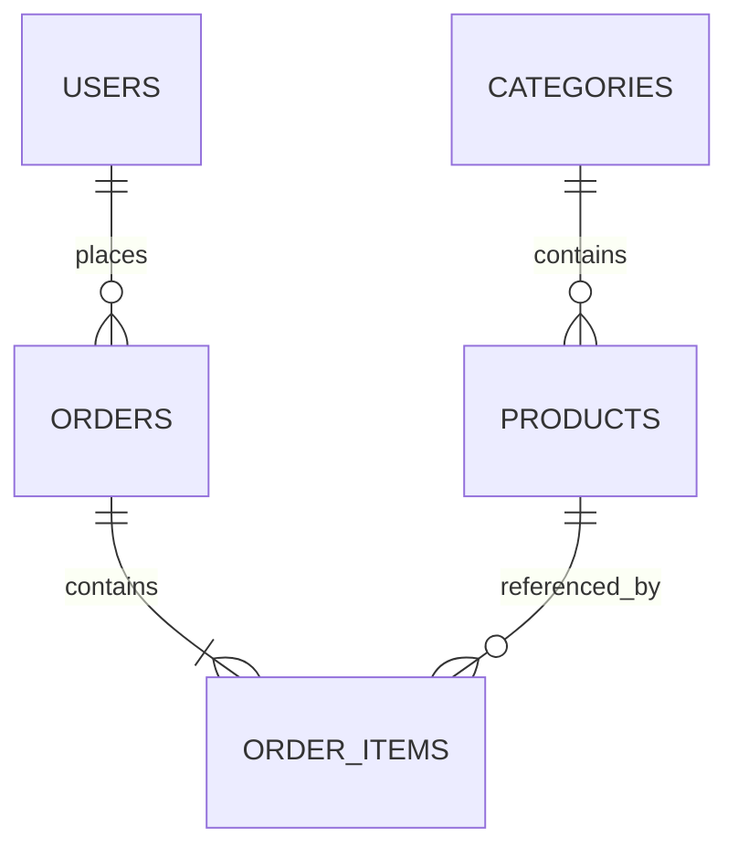
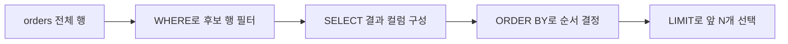
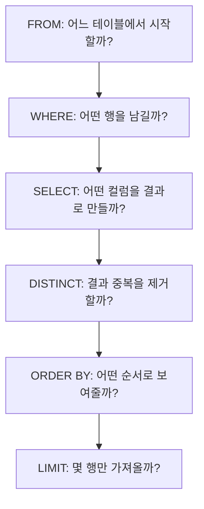

# Day 1. SELECT / WHERE / ORDER BY / LIMIT

> 대기업 IT / 백엔드 / 서버 개발자 SQL 코딩테스트 6주 과정  
> 실습 DBMS: PostgreSQL 18.6  
> 실습 도구: DBeaver Community 26.2.0  
> Master Dataset: `backend_sql_interview_dataset.sql`  
> 오늘의 목표 시간: 이론 45~60분 + 실습 60~90분 + 연습 60분 이상

---

## 0. 오늘의 위치

6주 과정의 첫날이다. 오늘은 복잡한 JOIN이나 집계를 하지 않는다.

오늘의 핵심은 다음 네 가지다.

```text
필요한 컬럼을 고른다.
        ↓
필요한 행을 고른다.
        ↓
원하는 순서로 정렬한다.
        ↓
필요한 개수만 가져온다.
```

SQL 문법으로 연결하면 다음과 같다.

```sql
SELECT ...
FROM ...
WHERE ...
ORDER BY ...
LIMIT ...;
```

오늘 배우는 범위:

- `SELECT`
- `DISTINCT`
- `WHERE`
- 비교 연산자
- `AND` / `OR` / `NOT`
- `IN`
- `BETWEEN`
- `ORDER BY`
- `LIMIT`
- SQL 논리적 실행 순서 기초

오늘 배우지 않는 범위:

- `NULL` 상세 처리 → Day 2
- 문자열 함수 / `LIKE` → Day 3
- 날짜 함수 → Day 4
- `GROUP BY` / `HAVING` → Day 5
- `JOIN` → Day 6 이후
- Window Function → Day 11 이후

---

## 1. 학습 목표

오늘 학습을 끝내면 다음을 할 수 있어야 한다.

1. 테이블에서 필요한 컬럼만 선택해 조회할 수 있다.
2. `WHERE`로 원하는 행만 정확하게 필터링할 수 있다.
3. 여러 조건을 `AND`, `OR`, `NOT`, `IN`, `BETWEEN`으로 표현할 수 있다.
4. `DISTINCT`가 중복 행을 제거하는 위치와 의미를 설명할 수 있다.
5. `ORDER BY`의 오름차순/내림차순을 구분하고 여러 컬럼으로 정렬할 수 있다.
6. `LIMIT`을 사용할 때 `ORDER BY`가 왜 중요한지 설명할 수 있다.
7. 같은 값이 존재할 때 tie-breaker를 추가해 결과를 결정적으로 만들 수 있다.
8. `FROM → WHERE → SELECT → DISTINCT → ORDER BY → LIMIT`의 논리적 처리 흐름을 문제 풀이에 연결할 수 있다.

---

## 2. 오늘 사용할 환경

### 2.1 과정 고정 버전

2026-09-10 기준 공식 릴리스를 확인해 다음 버전을 이 과정의 기준으로 고정한다.

| 항목 | 과정 버전 | 이유 |
|---|---:|---|
| PostgreSQL | **18.6** | Master Dataset의 Target DB와 일치하며 현재 안정 릴리스 계열 |
| DBeaver Community | **26.2.0** | 2026-08-30 공개된 최신 Community 안정 릴리스 |
| PostgreSQL 19 | 사용하지 않음 | 현재 Beta 계열이므로 과정 기본 버전으로 사용하지 않음 |

과정 중 새 버전이 나오더라도 사용자가 별도로 업그레이드를 요청하지 않는 한 위 버전을 유지한다.

### 2.2 `docs/environment.md`에 기록할 내용

프로젝트의 `docs/environment.md`는 다음처럼 유지한다.

```markdown
# SQL Course Environment

- PostgreSQL: 18.6
- DBeaver Community: 26.2.0
- Docker: baseline에서는 필수 아님
- Docker Compose: baseline에서는 필수 아님
- Dataset:
  - backend_sql_interview_dataset.sql
- Schema:
  - interview_lab
- Version fixed at:
  - 2026-09-10
```

### 2.3 공식 확인 출처

- PostgreSQL: https://www.postgresql.org/
- DBeaver Community Releases: https://github.com/dbeaver/dbeaver/releases
- DBeaver Community: https://dbeaver.io/

---

## 3. 프로젝트 구조

전체 30일 동안 같은 프로젝트 구조를 유지한다.

```text
sql-coding-test-lab/
├── README.md
├── curriculum/
│   └── sql_coding_test_6week_curriculum.md
├── dataset/
│   └── backend_sql_interview_dataset.sql
├── prompts/
│   └── sql_day_lecture_generator_prompt.md
├── docs/
│   ├── environment.md
│   ├── course-progress.md
│   ├── sql-patterns.md
│   └── troubleshooting.md
├── lectures/
│   └── day01_sql_coding_test_lecture.md
├── practice/
│   └── day01/
├── solutions/
│   └── day01/
├── explain/
│   ├── plans/
│   └── notes/
└── scratch/
```

이미 프로젝트가 있다면 새 프로젝트를 만들지 않는다. 없는 디렉터리만 추가한다.

오늘 직접 작성하는 연습 SQL은 다음 위치를 사용한다.

```text
practice/day01/
```

오늘 강의자료는 다음 위치에 두는 구조다.

```text
lectures/day01_sql_coding_test_lecture.md
```

---

## 4. Master Dataset 초기화

### 4.1 중요한 원칙

오늘부터 전체 30일 동안 다음 파일을 유일한 Master Dataset으로 사용한다.

```text
dataset/backend_sql_interview_dataset.sql
```

이 파일은 다음을 수행한다.

1. `interview_lab` 스키마를 삭제한다.
2. `interview_lab` 스키마를 다시 만든다.
3. 테이블을 생성한다.
4. seed data를 생성한다.
5. edge case 데이터를 추가한다.
6. `ANALYZE`를 실행한다.
7. 마지막에 테이블별 row count를 확인한다.

따라서 **전체 스크립트를 다시 실행하면 기존 `interview_lab` 스키마가 초기화된다.**

실습 중 원본 데이터 구조나 seed data를 임의로 수정하지 않는다.

---

### 4.2 DBeaver에서 초기화하기

1. DBeaver 실행
2. PostgreSQL Connection 생성 또는 기존 Connection 선택
3. SQL Editor → New SQL Script
4. `backend_sql_interview_dataset.sql` 전체 내용을 연다
5. 전체 Script 실행
6. 하단 Results 탭에서 마지막 sanity check 결과를 확인한다

새 SQL Editor를 열었을 때는 다음을 먼저 실행하는 습관을 들인다.

```sql
SET search_path TO interview_lab;
```

또는 스키마를 명시해도 된다.

```sql
SELECT *
FROM interview_lab.users;
```

이 강의에서는 가독성을 위해 먼저 아래를 실행한 것으로 가정한다.

```sql
SET search_path TO interview_lab;
```

---

### 4.3 데이터 생성 확인

오늘 주요 테이블의 최소 확인 쿼리:

```sql
SELECT COUNT(*)
FROM users;
```

예상:

```text
300
```

```sql
SELECT COUNT(*)
FROM products;
```

예상:

```text
120
```

```sql
SELECT COUNT(*)
FROM orders;
```

예상:

```text
2502
```

`orders`는 기본 생성 2,500건에 동률 테스트용 주문 2건이 추가되어 총 2,502건이다.

---

## 5. 오늘 사용할 데이터

오늘은 JOIN을 배우지 않으므로 기본적으로 **한 번에 한 테이블씩** 조회한다.

### 5.1 `users`

주요 컬럼:

| 컬럼 | 의미 |
|---|---|
| `user_id` | 사용자 PK |
| `user_name` | 사용자 이름 |
| `email` | 이메일 |
| `signup_date` | 가입일 |
| `region` | 지역 |
| `acquisition_channel` | 유입 채널 |
| `birth_year` | 출생연도 |
| `is_premium` | 프리미엄 여부 |

오늘의 대표 grain:

```text
한 행 = 사용자 1명
```

---

### 5.2 `products`

주요 컬럼:

| 컬럼 | 의미 |
|---|---|
| `product_id` | 상품 PK |
| `category_id` | 카테고리 FK |
| `product_name` | 상품명 |
| `price` | 가격 |
| `status` | ACTIVE / SOLD_OUT / DISCONTINUED |
| `created_at` | 생성 시각 |
| `attributes` | JSONB 확장 속성 |

오늘의 대표 grain:

```text
한 행 = 상품 1개
```

---

### 5.3 `orders`

주요 컬럼:

| 컬럼 | 의미 |
|---|---|
| `order_id` | 주문 PK |
| `user_id` | 사용자 FK |
| `order_date` | 주문 시각 |
| `status` | 주문 상태 |
| `shipping_region` | 배송 지역 |
| `coupon_code` | 쿠폰 코드 |
| `total_amount` | 주문 총액 |

오늘의 대표 grain:

```text
한 행 = 주문 1건
```

---

### 5.4 오늘 관계도

오늘은 JOIN을 작성하지 않지만 전체 데이터 관계를 알고 있어야 한다.



오늘은 이 관계 중 각 테이블을 독립적으로 조회한다.

---

## 6. 이론 1 — SELECT: 필요한 컬럼을 선택한다

### 6.1 초등학생도 이해하는 설명

학교에 학생 명단이 있다고 생각해보자.

```text
학생번호 | 이름 | 전화번호 | 주소 | 생일
```

선생님이 “학생번호와 이름만 보여줘”라고 하면 전체 정보를 모두 보여줄 필요가 없다.

SQL에서 이 역할을 하는 것이 `SELECT`다.

---

### 6.2 정확한 SQL 정의

`SELECT`는 결과 집합에 어떤 표현식과 컬럼을 출력할지 결정한다.

기본 문법:

```sql
SELECT
    column1,
    column2
FROM table_name;
```

예:

```sql
SELECT
    user_id,
    user_name
FROM users;
```

결과의 grain:

```text
한 행 = 사용자 1명
```

`users`의 모든 행을 유지하되 출력 컬럼만 `user_id`, `user_name`으로 제한한다.

---

### 6.3 `SELECT *`는 언제 사용할까?

다음은 실행 가능하다.

```sql
SELECT *
FROM users;
```

학습 초기 데이터 구조 확인에는 편하다.

하지만 코딩테스트 답안이나 실무 API 조회 쿼리에서는 필요한 컬럼을 명시하는 습관이 좋다.

```sql
SELECT
    user_id,
    user_name,
    region
FROM users;
```

이유:

- 결과의 의도가 명확하다.
- 불필요한 컬럼 전송을 줄일 수 있다.
- 테이블 컬럼이 추가되어도 결과 형태가 예상치 않게 바뀌지 않는다.
- 코드 리뷰에서 필요한 데이터가 무엇인지 바로 보인다.

---

### 6.4 SELECT 별칭

결과 컬럼 이름을 바꾸고 싶으면 `AS`를 사용할 수 있다.

```sql
SELECT
    user_id AS id,
    user_name AS name
FROM users;
```

`AS`는 컬럼 별칭을 읽기 쉽게 만든다.

오늘은 가독성을 위해 가능하면 `AS`를 명시한다.

---

### 6.5 흔한 실수

#### 실수 1: 필요한 컬럼보다 너무 많이 조회

```sql
SELECT *
FROM orders;
```

문제가 “주문번호와 주문시각만 출력”이라고 했다면 다음이 더 정확하다.

```sql
SELECT
    order_id,
    order_date
FROM orders;
```

#### 실수 2: 문제의 출력 컬럼 순서를 무시

코딩테스트 채점 시스템은 컬럼 이름과 순서까지 확인하는 경우가 있다.

문제에서 다음 순서를 요구한다면:

```text
order_id, status, total_amount
```

답안도 그 순서를 유지하는 것이 안전하다.

---

## 7. 실습 예제 1 — 특정 컬럼 조회

### 7.1 문제

모든 사용자의 사용자 ID, 이름, 지역을 조회하라.

출력 컬럼:

```text
user_id
user_name
region
```

### 7.2 문제 해석

아직 필터 조건이 없다.

```text
원하는 행 = users의 모든 사용자
원하는 컬럼 = user_id, user_name, region
```

### 7.3 최종 결과의 행 단위

```text
한 행 = 사용자 1명
```

### 7.4 사용할 테이블

```text
users
```

### 7.5 사고 과정

```text
users를 읽는다.
    ↓
행 필터는 없다.
    ↓
user_id, user_name, region만 출력한다.
```

### 7.6 SQL

```sql
SELECT
    user_id,
    user_name,
    region
FROM users;
```

### 7.7 DBeaver 실행

1. SQL Editor에서 쿼리 선택
2. Execute SQL Statement 실행
3. Results Grid에서 컬럼 3개인지 확인
4. 전체 결과가 300행인지 확인

### 7.8 예상 결과 일부

```text
user_id | user_name | region
--------+-----------+--------
1       | User 001  | SEO
2       | User 002  | SEOUL
3       | User 003  | BUSAN
...
```

### 7.9 SQL 한 줄씩 해설

```sql
SELECT
```

결과에 표시할 값을 정한다.

```sql
    user_id,
    user_name,
    region
```

세 컬럼만 출력한다.

```sql
FROM users;
```

데이터의 출발점은 `users` 테이블이다.

### 7.10 흔한 오답

```sql
SELECT *
FROM users;
```

결과 자체는 모든 사용자를 보여주지만 문제에서 요구하지 않은 컬럼까지 조회한다.

코딩테스트에서는 “결과가 나오기만 하면 된다”가 아니라 **문제에서 요구한 결과 모양을 정확하게 만든다**는 태도가 중요하다.

### 7.11 면접에서는 어떻게 설명할까?

> SELECT는 결과 집합에 어떤 컬럼이나 표현식을 투영할지 결정합니다. 실무에서는 필요한 컬럼만 명시해 결과 계약을 명확하게 유지하는 편을 선호합니다.

---

## 8. 이론 2 — DISTINCT와 WHERE

## 8.1 DISTINCT: 중복된 결과를 제거한다

`users`의 `acquisition_channel`에는 같은 값이 여러 번 반복된다.

```text
organic
search_ad
social
referral
email
organic
search_ad
...
```

중복 없이 어떤 채널이 존재하는지만 보고 싶으면 `DISTINCT`를 사용한다.

```sql
SELECT DISTINCT
    acquisition_channel
FROM users;
```

중요:

`DISTINCT`는 “테이블의 중복 데이터를 삭제”하는 것이 아니다.

**SELECT 결과에서 중복된 결과 행을 제거한다.**

---

## 8.2 여러 컬럼에 DISTINCT를 쓰면?

```sql
SELECT DISTINCT
    region,
    acquisition_channel
FROM users;
```

중복 판단 기준은 한 컬럼이 아니라 선택한 전체 컬럼 조합이다.

```text
(region, acquisition_channel)
```

조합이 같아야 중복으로 제거된다.

---

## 8.3 WHERE: 필요한 행을 선택한다

`SELECT`가 “어떤 컬럼을 보여줄까?”라면 `WHERE`는 “어떤 행을 남길까?”다.

기본:

```sql
SELECT
    ...
FROM table_name
WHERE condition;
```

예:

```sql
SELECT
    user_id,
    user_name,
    region
FROM users
WHERE region = 'SEOUL';
```

---

## 8.4 비교 연산자

| 연산자 | 의미 |
|---|---|
| `=` | 같다 |
| `<>` | 같지 않다 |
| `!=` | 같지 않다(PostgreSQL에서 사용 가능) |
| `>` | 크다 |
| `<` | 작다 |
| `>=` | 크거나 같다 |
| `<=` | 작거나 같다 |

예:

```sql
SELECT
    product_id,
    product_name,
    price
FROM products
WHERE price >= 300000;
```

---

## 8.5 여러 조건: AND / OR / NOT

### AND

모든 조건이 참이어야 한다.

```sql
SELECT
    product_id,
    product_name,
    price,
    status
FROM products
WHERE status = 'ACTIVE'
  AND price >= 300000;
```

### OR

조건 중 하나 이상이 참이면 된다.

```sql
SELECT
    order_id,
    status
FROM orders
WHERE status = 'PAID'
   OR status = 'SHIPPED';
```

### NOT

조건을 부정한다.

```sql
SELECT
    product_id,
    product_name,
    status
FROM products
WHERE NOT status = 'DISCONTINUED';
```

보통 다음처럼 쓰는 편이 더 읽기 쉽다.

```sql
WHERE status <> 'DISCONTINUED'
```

---

## 8.6 AND / OR가 같이 나오면 괄호를 적극 사용하자

다음 문제를 생각해보자.

> ACTIVE이면서 가격이 300,000원 이상이거나 SOLD_OUT 상품을 조회하라.

다음 SQL은 해석이 헷갈리기 쉽다.

```sql
WHERE status = 'ACTIVE'
  AND price >= 300000
   OR status = 'SOLD_OUT'
```

SQL 연산자 우선순위를 알고 있어도 코딩테스트에서는 의도를 명확하게 하기 위해 괄호를 사용한다.

```sql
WHERE (
        status = 'ACTIVE'
        AND price >= 300000
      )
   OR status = 'SOLD_OUT';
```

문제를 읽은 사람이 조건 구조를 즉시 이해할 수 있다.

---

## 9. 실습 예제 2 — 특정 지역 회원 조회

### 9.1 문제

지역이 `SEOUL`인 사용자의 사용자 ID, 이름, 가입일, 유입 채널을 조회하라.

사용자 ID 오름차순으로 정렬한다.

### 9.2 문제 해석

출력:

```text
user_id
user_name
signup_date
acquisition_channel
```

조건:

```text
region = 'SEOUL'
```

정렬:

```text
user_id ASC
```

### 9.3 최종 결과의 행 단위

```text
한 행 = SEOUL 지역 사용자 1명
```

### 9.4 사용할 테이블

```text
users
```

### 9.5 사고 과정

```text
users
↓
region = 'SEOUL'만 남김
↓
필요 컬럼 선택
↓
user_id 오름차순
```

### 9.6 SQL

```sql
SELECT
    user_id,
    user_name,
    signup_date,
    acquisition_channel
FROM users
WHERE region = 'SEOUL'
ORDER BY user_id ASC;
```

### 9.7 예상 결과 일부

```text
user_id | user_name | signup_date | acquisition_channel
--------+-----------+-------------+--------------------
2       | User 002  | 2025-08-23  | search_ad
9       | User 009  | 2025-11-08  | referral
16      | User 016  | 2026-01-24  | organic
23      | User 023  | 2026-04-11  | social
30      | User 030  | 2026-06-27  | email
...
```

### 9.8 SQL 한 줄씩 해설

```sql
FROM users
```

사용자 테이블에서 시작한다.

```sql
WHERE region = 'SEOUL'
```

SEOUL인 사용자만 남긴다.

```sql
SELECT ...
```

문제에서 요구한 컬럼을 결과로 만든다.

```sql
ORDER BY user_id ASC
```

사용자 ID가 작은 순서부터 출력한다.

### 9.9 검증

조건이 제대로 적용되었는지 확인:

```sql
SELECT
    user_id,
    region
FROM users
WHERE region = 'SEOUL'
ORDER BY user_id;
```

Results Grid에서 모든 `region` 값이 `SEOUL`인지 확인한다.

### 9.10 흔한 오답

```sql
WHERE region = 'Seoul'
```

데이터에는 `SEOUL`이 저장되어 있다. 문자열 비교는 값이 정확히 일치해야 한다.

### 9.11 면접에서는 어떻게 설명할까?

> WHERE는 개별 행에 대한 필터입니다. 논리적으로 SELECT보다 먼저 적용되기 때문에, 먼저 후보 행을 줄인 뒤 결과 컬럼을 구성한다고 이해하면 됩니다.

---

## 10. 이론 3 — IN / BETWEEN

## 10.1 IN

다음 조건은 맞지만 길다.

```sql
WHERE status = 'PAID'
   OR status = 'SHIPPED'
   OR status = 'COMPLETED'
```

같은 컬럼을 여러 값과 비교한다면 `IN`이 읽기 쉽다.

```sql
WHERE status IN ('PAID', 'SHIPPED', 'COMPLETED')
```

### 형태

```sql
column IN (value1, value2, value3)
```

반대 조건:

```sql
column NOT IN (value1, value2)
```

> `NULL`이 섞인 `NOT IN`의 상세 함정은 Day 2에서 다룬다.

---

## 10.2 BETWEEN

범위 조건:

```sql
WHERE price BETWEEN 100000 AND 200000
```

개념적으로 다음과 같다.

```sql
WHERE price >= 100000
  AND price <= 200000
```

### 중요: BETWEEN은 양 끝값을 포함한다

```text
100000 포함
200000 포함
```

즉:

```text
100000 <= price <= 200000
```

이다.

---

## 10.3 날짜 BETWEEN은 왜 조심해야 할까?

Day 4에서 자세히 배우겠지만 TIMESTAMP에는 시간까지 들어 있다.

다음 표현은 종료일의 하루 전체를 포함한다고 착각하기 쉽다.

```sql
WHERE order_date BETWEEN '2026-08-01' AND '2026-08-31'
```

`'2026-08-31'`이 자정으로 해석되면 8월 31일 낮 시간 데이터가 빠질 수 있다.

날짜/시간 범위는 나중에 보통 반열린 구간을 선호한다.

```sql
order_date >= TIMESTAMP '2026-08-01 00:00:00'
AND order_date < TIMESTAMP '2026-09-01 00:00:00'
```

오늘은 `BETWEEN` 자체의 의미만 익힌다.

---

## 11. 실습 예제 3 — 가격 범위와 상태 필터

### 11.1 문제

상품 중 다음 조건을 모두 만족하는 상품을 조회하라.

- 상태가 `ACTIVE`
- 가격이 100,000 이상 200,000 이하

출력:

```text
product_id
product_name
price
status
```

가격 내림차순, 가격이 같으면 상품 ID 오름차순으로 정렬한다.

### 11.2 최종 결과의 행 단위

```text
한 행 = 조건을 만족하는 상품 1개
```

### 11.3 사용할 테이블

```text
products
```

### 11.4 사고 과정

```text
products
↓
status = 'ACTIVE'
↓
price BETWEEN 100000 AND 200000
↓
필요 컬럼 선택
↓
price DESC
↓
동률이면 product_id ASC
```

### 11.5 SQL

```sql
SELECT
    product_id,
    product_name,
    price,
    status
FROM products
WHERE status = 'ACTIVE'
  AND price BETWEEN 100000 AND 200000
ORDER BY
    price DESC,
    product_id ASC;
```

### 11.6 왜 정렬 컬럼이 2개인가?

가격이 같은 상품이 존재할 수 있다.

가격만 정렬하면 동률 상품끼리의 순서는 보장되지 않는다.

```sql
ORDER BY price DESC;
```

더 결정적인 결과:

```sql
ORDER BY
    price DESC,
    product_id ASC;
```

### 11.7 흔한 오답

#### 오답 1

```sql
WHERE price > 100000
  AND price < 200000
```

문제는 양 끝값을 포함한다고 했으므로 `100000`, `200000`을 제외하면 안 된다.

#### 오답 2

```sql
WHERE status = 'ACTIVE'
   OR price BETWEEN 100000 AND 200000
```

`OR`를 사용하면 ACTIVE가 아니어도 가격 범위만 만족하면 결과에 포함된다.

### 11.8 면접에서는 어떻게 설명할까?

> BETWEEN은 양 끝값을 포함하는 범위 조건입니다. 다만 timestamp 범위에서는 종료 경계가 의도와 달라질 수 있어 실제 서비스에서는 반열린 구간을 자주 사용합니다.

---

## 12. 이론 4 — ORDER BY와 LIMIT

## 12.1 ORDER BY

관계형 데이터베이스에서 결과 행의 순서는 `ORDER BY`가 없으면 보장되지 않는다고 생각해야 한다.

기본:

```sql
ORDER BY column ASC
```

오름차순:

```text
작은 값 → 큰 값
이전 날짜 → 최근 날짜
A → Z
```

내림차순:

```sql
ORDER BY column DESC
```

```text
큰 값 → 작은 값
최근 날짜 → 이전 날짜
Z → A
```

---

## 12.2 여러 컬럼 정렬

```sql
ORDER BY
    order_date DESC,
    order_id DESC;
```

의미:

1. `order_date`가 최근인 주문부터
2. 주문시각이 같다면 `order_id`가 큰 주문부터

---

## 12.3 LIMIT

결과 중 앞에서 N개만 가져온다.

```sql
LIMIT 20;
```

예:

```sql
SELECT
    order_id,
    order_date
FROM orders
ORDER BY order_date DESC
LIMIT 20;
```

---

## 12.4 LIMIT만 쓰면 왜 위험할까?

```sql
SELECT
    order_id,
    order_date
FROM orders
LIMIT 20;
```

이 쿼리는 “최근 20개”라는 의미가 아니다.

단순히 DB가 현재 실행에서 먼저 내놓은 20개를 받을 뿐이다.

문제가 “상위”, “최신”, “최저”, “가장 비싼”처럼 순서 의미를 가진다면 반드시 정렬 기준을 먼저 생각한다.

```text
Top N 문제
=
정렬 기준 정의
+
LIMIT
```

---

## 12.5 실제 데이터셋의 tie case

Master Dataset에는 일부러 같은 사용자에게 같은 시각의 주문 두 건이 들어 있다.

```text
order_id 90001
order_id 90002
order_date = 2026-08-25 10:00:00
```

즉 다음 정렬만으로는 두 주문의 상대 순서를 결정할 수 없다.

```sql
ORDER BY order_date DESC
```

결정적 정렬:

```sql
ORDER BY
    order_date DESC,
    order_id DESC;
```

---

## 12.6 정렬과 LIMIT 흐름



---

## 13. 실습 예제 4 — 최근 주문 20개

### 13.1 문제

전체 주문에서 가장 최근 주문 20개를 조회하라.

출력:

```text
order_id
user_id
order_date
status
shipping_region
total_amount
```

정렬:

1. 주문시각 최신순
2. 주문시각이 같으면 주문 ID 큰 순서

### 13.2 문제 해석

핵심 단어:

```text
최근
20개
```

`최근` → `ORDER BY order_date DESC`

`20개` → `LIMIT 20`

동률 → `order_id DESC`

### 13.3 최종 결과의 행 단위

```text
한 행 = 주문 1건
```

### 13.4 사용할 테이블

```text
orders
```

### 13.5 사고 과정

```text
orders
↓
필터 없음
↓
필요 컬럼 선택
↓
order_date DESC
↓
동률은 order_id DESC
↓
LIMIT 20
```

### 13.6 SQL

```sql
SELECT
    order_id,
    user_id,
    order_date,
    status,
    shipping_region,
    total_amount
FROM orders
ORDER BY
    order_date DESC,
    order_id DESC
LIMIT 20;
```

### 13.7 예상 결과 상단 일부

Master Dataset 생성 규칙 기준으로 결과 상단은 다음 패턴이다.

```text
order_id | user_id | order_date           | status
---------+---------+----------------------+----------
2363     | 72      | 2026-08-28 17:31:00  | COMPLETED
1643     | 32      | 2026-08-28 17:31:00  | CANCELLED
923      | 272     | 2026-08-28 17:31:00  | COMPLETED
203      | 232     | 2026-08-28 17:31:00  | PAID
1883     | 232     | 2026-08-28 13:31:00  | PAID
...
```

같은 `order_date`가 여러 건 존재하므로 두 번째 정렬 키가 결과를 안정적으로 만든다.

### 13.8 흔한 오답

#### 오답 1 — LIMIT만 사용

```sql
SELECT
    order_id,
    order_date
FROM orders
LIMIT 20;
```

최근 주문이라는 의미가 없다.

#### 오답 2 — 오름차순

```sql
ORDER BY order_date ASC
LIMIT 20;
```

가장 오래된 주문 20개가 나온다.

#### 오답 3 — 동률 기준 없음

```sql
ORDER BY order_date DESC
LIMIT 20;
```

상위 20개의 경계에 동률이 걸리는 경우 결과가 재현 가능하지 않을 수 있다.

### 13.9 면접에서는 어떻게 설명할까?

> LIMIT은 순서를 정의하지 않습니다. 최신 N건처럼 순서 의미가 있는 문제에서는 ORDER BY가 먼저 필요하고, 정렬 컬럼에 동률이 있을 수 있다면 PK 같은 tie-breaker를 추가해 결정적인 결과를 만드는 것이 안전합니다.

---

## 14. 실습 예제 5 — 중복 acquisition channel 제거

### 14.1 문제

사용자 데이터에 존재하는 유입 채널 종류를 중복 없이 조회하라.

알파벳 오름차순으로 정렬한다.

### 14.2 최종 결과의 행 단위

일반 `SELECT`라면:

```text
한 행 = 사용자 1명
```

하지만 `DISTINCT` 이후 최종 결과는:

```text
한 행 = 서로 다른 acquisition_channel 값 1개
```

### 14.3 사용할 테이블

```text
users
```

### 14.4 SQL

```sql
SELECT DISTINCT
    acquisition_channel
FROM users
ORDER BY acquisition_channel ASC;
```

### 14.5 예상 결과

```text
email
organic
referral
search_ad
social
```

### 14.6 논리적 흐름

```text
FROM users
↓
SELECT acquisition_channel
↓
DISTINCT로 중복 제거
↓
ORDER BY acquisition_channel
```

### 14.7 흔한 오답

```sql
SELECT
    acquisition_channel
FROM users
ORDER BY acquisition_channel;
```

정렬은 되지만 동일 채널이 여러 번 나온다.

### 14.8 성능 관점

`DISTINCT`는 공짜가 아니다.

중복 제거를 위해 DB가 정렬 또는 해시 기반 작업을 수행할 수 있다.

Day 1에서는 “중복 제거가 필요할 때 사용한다” 정도만 기억한다.

실무에서 JOIN으로 중복이 생겼는데 원인을 이해하지 못한 채 마지막에 `DISTINCT`를 붙여 숨기는 습관은 좋지 않다.

그 문제는 JOIN을 배우는 Day 6~7에서 본격적으로 다룬다.

---

## 15. SQL 논리적 실행 순서 기초

작성 순서:

```sql
SELECT ...
FROM ...
WHERE ...
ORDER BY ...
LIMIT ...;
```

하지만 문제를 이해할 때는 다음 논리 흐름으로 생각하면 편하다.

```text
FROM
↓
WHERE
↓
SELECT
↓
DISTINCT
↓
ORDER BY
↓
LIMIT
```

> 실제 DB 엔진의 물리적 실행계획은 옵티마이저가 바꿀 수 있다.  
> 여기서 말하는 것은 SQL을 이해하기 위한 **논리적 처리 순서**다.

---

### 15.1 왜 이 순서를 알아야 할까?

문제:

> 서울 사용자의 이름을 조회하라.

생각:

```text
1. users에서 시작한다.
2. 서울 사용자만 남긴다.
3. 이름을 출력한다.
```

즉:

```text
FROM users
↓
WHERE region = 'SEOUL'
↓
SELECT user_name
```

작성은:

```sql
SELECT
    user_name
FROM users
WHERE region = 'SEOUL';
```

문법 작성 순서와 논리적 사고 순서를 구분하면 복잡한 문제에서도 실수가 줄어든다.

---

### 15.2 전체 흐름 그림



---

## 16. 코딩테스트 문제 풀이 순서

SQL을 바로 쓰지 말고 다음 순서로 메모한다.

```text
문제 읽기
↓
출력 컬럼 확인
↓
최종 결과 한 행의 의미(grain) 정의
↓
사용할 테이블
↓
WHERE 조건
↓
정렬 기준
↓
LIMIT 여부
↓
동률 / 경계 / 중복 확인
↓
SQL 작성
↓
결과 검증
```

Day 1 문제는 이 순서만 잘 지켜도 대부분의 실수를 크게 줄일 수 있다.

---

## 17. 면접 포인트 1 — WHERE와 HAVING 차이

`HAVING`은 Day 5에서 본격적으로 배운다.

오늘은 차이만 기억한다.

### WHERE

개별 행을 필터링한다.

```text
GROUP BY 이전
```

예:

```sql
WHERE status = 'COMPLETED'
```

### HAVING

그룹 집계 결과를 필터링한다.

```text
GROUP BY 이후
```

예시 문법은 Day 5에서 다룬다.

면접 답변 핵심:

> WHERE는 집계 전에 개별 행을 필터링하고, HAVING은 GROUP BY로 만들어진 그룹을 집계 결과 기준으로 필터링합니다.

---

## 18. 면접 포인트 2 — LIMIT과 ORDER BY

질문:

> `LIMIT 10`만 쓰면 상위 10개를 가져오는 것 아닌가요?

답:

아니다.

`LIMIT 10`은 결과 중 10개만 제한할 뿐 “상위”라는 순서를 정의하지 않는다.

상위 10개 가격 상품:

```sql
SELECT
    product_id,
    product_name,
    price
FROM products
ORDER BY
    price DESC,
    product_id ASC
LIMIT 10;
```

핵심:

```text
Top N
=
ORDER BY
+
LIMIT
```

---

## 19. 면접 포인트 3 — 동률이 있으면?

Master Dataset에는 같은 가격 상품도 의도적으로 존재한다.

```text
product_id: 5, 15, 25, 35
price: 99900
```

다음처럼 가격만 정렬하면 동률 내부 순서는 명확하지 않다.

```sql
ORDER BY price DESC;
```

결정적인 정렬:

```sql
ORDER BY
    price DESC,
    product_id ASC;
```

백엔드 API의 페이지네이션에서도 안정적 정렬 기준은 매우 중요하다.

---

## 20. 백엔드 실무 연결

### 20.1 API 조회 컬럼

예를 들어 상품 목록 API가 다음 필드만 필요하다고 하자.

```json
{
  "productId": 10,
  "productName": "Product 010",
  "price": 84190
}
```

그런데 SQL에서 모든 컬럼을 조회하면:

```sql
SELECT *
FROM products;
```

`attributes`, `created_at`, `status` 등 응답에 불필요한 데이터도 읽는다.

실무에서는 API 계약에 필요한 컬럼을 의식적으로 고르는 습관이 중요하다.

---

### 20.2 최신 N건 API

공지사항 최신 20건, 주문 최신 20건, 로그 최신 100건 같은 API는 매우 흔하다.

기본 패턴:

```sql
SELECT
    ...
FROM ...
WHERE ...
ORDER BY
    created_at DESC,
    id DESC
LIMIT 20;
```

여기서 `id DESC`가 tie-breaker 역할을 한다.

---

### 20.3 Pagination의 시작점

Day 1에서는 `LIMIT`까지만 배운다.

나중에 페이지네이션을 다룰 때 다음 주제로 확장된다.

```text
LIMIT / OFFSET
Keyset Pagination
Index
정렬 안정성
```

오늘은 그 기반이 되는 `ORDER BY + LIMIT`을 정확히 익힌다.

---

# 21. 강의 요약

## 21.1 오늘 반드시 기억할 핵심 10개

1. `SELECT`는 결과에 표시할 컬럼을 정한다.
2. 필요한 컬럼만 명시하는 습관을 들인다.
3. `WHERE`는 개별 행을 필터링한다.
4. 같은 컬럼의 여러 후보 값은 `IN`으로 표현하면 읽기 쉽다.
5. `BETWEEN`은 양 끝값을 포함한다.
6. `AND`와 `OR`가 같이 나오면 괄호로 의도를 명확하게 표현한다.
7. `DISTINCT`는 SELECT 결과의 중복 행을 제거한다.
8. `ORDER BY`가 없으면 결과 행 순서를 믿지 않는다.
9. `LIMIT`은 순서를 정의하지 않으므로 Top-N 문제에서는 `ORDER BY`가 먼저다.
10. 정렬값이 동률일 수 있으면 PK 같은 tie-breaker를 추가한다.

---

## 21.2 면접/코테 직전 1분 복습

```text
SELECT
→ 무엇을 출력?

FROM
→ 어디서 읽음?

WHERE
→ 어떤 행을 남김?

DISTINCT
→ 중복 결과 제거?

ORDER BY
→ 어떤 순서?

LIMIT
→ 몇 개?

Top-N 문제?
→ ORDER BY 먼저

동률 가능?
→ PK 등 tie-breaker 추가
```

---

# 22. 초급 연습 문제 5개

> 권장 제한 시간: 문제당 5~10분  
> 정답 SQL은 이 강의자료에 포함하지 않는다.

---

## 초급 1 — BUSAN 사용자

### 문제

지역이 `BUSAN`인 사용자를 조회하라.

### 출력 컬럼

```text
user_id
user_name
email
region
```

### 정렬

```text
user_id ASC
```

### 최종 grain

```text
한 행 = BUSAN 사용자 1명
```

### 주의할 Edge Case

문자열 값은 데이터셋에 저장된 대문자 값을 정확히 사용한다.

### 힌트

`users` + `WHERE region = ...`

---

## 초급 2 — ACTIVE 상품

### 문제

상태가 `ACTIVE`인 상품을 조회하라.

### 출력 컬럼

```text
product_id
product_name
price
status
```

### 정렬

```text
product_id ASC
```

### 최종 grain

```text
한 행 = ACTIVE 상품 1개
```

### 힌트

단일 `WHERE` 조건이면 충분하다.

---

## 초급 3 — 결제 또는 배송 상태 주문

### 문제

주문 상태가 `PAID` 또는 `SHIPPED`인 주문을 조회하라.

### 출력 컬럼

```text
order_id
user_id
order_date
status
```

### 정렬

```text
order_id ASC
```

### 최종 grain

```text
한 행 = 조건을 만족하는 주문 1건
```

### 힌트

같은 컬럼의 여러 값을 비교하므로 `IN`을 고려한다.

---

## 초급 4 — 가격 범위 상품

### 문제

가격이 50,000 이상 100,000 이하인 상품을 조회하라.

### 출력 컬럼

```text
product_id
product_name
price
```

### 정렬

```text
price ASC
product_id ASC
```

### 주의할 Edge Case

50,000과 100,000도 포함한다.

### 힌트

`BETWEEN`

---

## 초급 5 — 지역 종류

### 문제

`users`에 존재하는 지역 값을 중복 없이 조회하라.

### 출력 컬럼

```text
region
```

### 정렬

```text
region ASC
```

### 힌트

`DISTINCT`

---

# 23. 중급 연습 문제 5개

> 권장 제한 시간: 문제당 10~20분  
> Day 1 범위만 사용한다.

---

## 중급 1 — 고가 ACTIVE 상품 Top 10

### 문제

상태가 `ACTIVE`인 상품 중 가격이 높은 상품 10개를 조회하라.

### 출력 컬럼

```text
product_id
product_name
price
status
```

### 정렬

```text
price DESC
product_id ASC
```

### 최종 grain

```text
한 행 = ACTIVE 상품 1개
```

### 주의할 Edge Case

가격 동률이 있을 수 있으므로 두 번째 정렬 기준을 반드시 넣는다.

### 힌트

`WHERE + ORDER BY + LIMIT`

---

## 중급 2 — 특정 지역 배송의 최근 주문

### 문제

배송 지역이 `SEOUL`인 주문 중 가장 최근 주문 20개를 조회하라.

### 출력 컬럼

```text
order_id
user_id
order_date
status
shipping_region
total_amount
```

### 정렬

```text
order_date DESC
order_id DESC
```

### 힌트

“최근 20개”를 한 덩어리로 보지 말고 “최근”과 “20개”를 분리해 생각한다.

---

## 중급 3 — 특정 기간 가입자

### 문제

가입일이 `2026-01-01` 이상 `2026-03-31` 이하인 사용자를 조회하라.

### 출력 컬럼

```text
user_id
user_name
signup_date
region
acquisition_channel
```

### 정렬

```text
signup_date ASC
user_id ASC
```

### 주의할 Edge Case

`signup_date`는 DATE 타입이므로 오늘은 `BETWEEN` 연습에 적합하다.

### 힌트

`BETWEEN DATE '2026-01-01' AND DATE '2026-03-31'`

---

## 중급 4 — 특정 유입 채널의 프리미엄 사용자

### 문제

유입 채널이 `organic`, `social`, `email` 중 하나이고 `is_premium = true`인 사용자를 조회하라.

### 출력 컬럼

```text
user_id
user_name
acquisition_channel
is_premium
```

### 정렬

```text
acquisition_channel ASC
user_id ASC
```

### 힌트

`IN`과 `AND`를 조합한다.

---

## 중급 5 — 판매 가능한 중가 상품

### 문제

상품 상태가 `ACTIVE` 또는 `SOLD_OUT`이고 가격이 150,000 이상 300,000 이하인 상품을 조회하라.

### 출력 컬럼

```text
product_id
product_name
price
status
```

### 정렬

```text
status ASC
price DESC
product_id ASC
```

### 힌트

`IN + BETWEEN`

---

# 24. 고급 연습 문제 5개

> 권장 제한 시간: 문제당 15~25분  
> 고급이지만 **Day 1까지 배운 문법만** 사용한다. 복잡성은 조건 해석과 정확성에서 만든다.

---

## 고급 1 — 복합 조건 상품

### 문제

다음 두 그룹 중 하나를 만족하는 상품을 조회하라.

조건 A:

```text
status = ACTIVE
AND price >= 300000
```

조건 B:

```text
status = SOLD_OUT
AND price BETWEEN 100000 AND 200000
```

### 출력 컬럼

```text
product_id
product_name
price
status
```

### 정렬

```text
status ASC
price DESC
product_id ASC
```

### 주의할 Edge Case

`AND`와 `OR`의 결합을 괄호로 명시한다.

### 힌트

조건 A와 B를 각각 괄호로 묶는다.

---

## 고급 2 — 최근 완료/배송 주문 Top 30

### 문제

주문 상태가 `COMPLETED` 또는 `SHIPPED`인 주문 중 가장 최근 30개를 조회하라.

### 출력 컬럼

```text
order_id
user_id
order_date
status
shipping_region
total_amount
```

### 정렬

```text
order_date DESC
order_id DESC
```

### 주의할 Edge Case

같은 주문시각이 여러 건 존재한다.

### 평가 포인트

- 상태 필터 정확성
- 최신순 방향
- tie-breaker
- LIMIT 위치

---

## 고급 3 — 가장 비싼 전체 상품 15개

### 문제

전체 상품에서 가격이 가장 높은 15개를 조회하라.

### 출력 컬럼

```text
product_id
product_name
price
status
created_at
```

### 정렬

```text
price DESC
product_id ASC
```

### 주의할 Edge Case

데이터셋에 의도적으로 같은 가격인 상품들이 있다.

### 평가 포인트

“가장 비싼”을 `LIMIT`으로만 해결하지 않았는가?

---

## 고급 4 — 가입일 최신 premium 사용자

### 문제

`is_premium = true`인 사용자 중 가입일이 가장 최근인 사용자 25명을 조회하라.

### 출력 컬럼

```text
user_id
user_name
signup_date
region
acquisition_channel
is_premium
```

### 정렬

```text
signup_date DESC
user_id DESC
```

### 주의할 Edge Case

가입일이 같을 수 있다고 가정하고 tie-breaker를 둔다.

---

## 고급 5 — 조건 해석 테스트

### 문제

다음 조건을 만족하는 주문을 조회하라.

```text
배송 지역이 SEOUL 또는 BUSAN이고,
상태는 CANCELLED가 아니며,
total_amount가 100000 이상 500000 이하
```

가장 큰 주문 금액 순으로 50개만 출력한다.

### 출력 컬럼

```text
order_id
user_id
status
shipping_region
total_amount
order_date
```

### 정렬

```text
total_amount DESC
order_id DESC
```

### 주의할 Edge Case

다음 두 표현의 차이를 설명할 수 있어야 한다.

```text
(SEOUL 또는 BUSAN) AND 기타 조건
```

vs.

```text
SEOUL 또는 (BUSAN AND 기타 조건)
```

### 힌트

배송 지역 조건을 `IN`으로 먼저 단순화한다.

---

# 25. 연습 문제 평가 기준

각 문제를 풀고 아래 항목을 체크한다.

| 평가 항목 | 확인 |
|---|---|
| 요구 컬럼을 정확히 출력했는가? | [ ] |
| 최종 grain을 먼저 정의했는가? | [ ] |
| WHERE 조건이 문제와 정확히 일치하는가? | [ ] |
| `AND` / `OR` 괄호가 명확한가? | [ ] |
| `BETWEEN` 경계를 정확히 이해했는가? | [ ] |
| Top-N 문제에서 `ORDER BY`가 있는가? | [ ] |
| ASC / DESC 방향이 맞는가? | [ ] |
| 동률이 가능한 정렬에 tie-breaker가 있는가? | [ ] |
| 불필요한 `DISTINCT`를 쓰지 않았는가? | [ ] |
| SQL을 다른 개발자가 읽기 쉽게 작성했는가? | [ ] |

---

# 26. 오늘의 체크리스트

아래 질문에 즉시 답할 수 있으면 Day 1 핵심은 통과다.

- [ ] `SELECT *`와 필요한 컬럼만 조회하는 방식의 차이를 설명할 수 있다.
- [ ] `WHERE`가 무엇을 필터링하는지 설명할 수 있다.
- [ ] `IN`을 OR 조건 여러 개로 바꿔 쓸 수 있다.
- [ ] `BETWEEN`이 양 끝값을 포함한다는 것을 기억한다.
- [ ] `AND`와 `OR`를 함께 쓸 때 괄호를 넣을 수 있다.
- [ ] `DISTINCT`가 어떤 중복을 제거하는지 설명할 수 있다.
- [ ] `ORDER BY ASC`와 `DESC`를 구분할 수 있다.
- [ ] `LIMIT`만으로는 “상위 N개”가 되지 않는 이유를 설명할 수 있다.
- [ ] 같은 timestamp가 있을 때 추가 정렬 기준을 넣을 수 있다.
- [ ] 논리적 순서 `FROM → WHERE → SELECT → DISTINCT → ORDER BY → LIMIT`를 설명할 수 있다.
- [ ] DBeaver에서 Master Dataset을 초기화하고 `interview_lab` 스키마를 조회할 수 있다.

---

# 27. 오늘 공부 루틴

평일 2시간 기준 추천:

```text
0~20분
환경 확인 + 데이터셋 초기화 + 테이블 눈으로 확인

20~50분
SELECT / DISTINCT / WHERE 이론 + 예제 1~2

50~80분
IN / BETWEEN / ORDER BY / LIMIT + 예제 3~5

80~110분
초급/중급 연습 문제

110~120분
오답 SQL 정리 + 오늘의 핵심 10개 복습
```

시간이 더 있다면 고급 문제까지 진행한다.

---

# 28. 오늘 작성해둘 SQL 패턴

`docs/sql-patterns.md`에 다음 패턴을 개인 노트로 정리해두면 이후에도 계속 사용한다.

```sql
-- 필요한 컬럼 조회
SELECT
    column1,
    column2
FROM table_name;
```

```sql
-- 행 필터
SELECT
    ...
FROM table_name
WHERE condition;
```

```sql
-- 여러 후보 값
WHERE column IN ('A', 'B', 'C')
```

```sql
-- 포함 범위
WHERE column BETWEEN lower_value AND upper_value
```

```sql
-- 결정적인 Top-N
SELECT
    ...
FROM table_name
WHERE ...
ORDER BY
    sort_column DESC,
    id DESC
LIMIT 20;
```

```sql
-- 중복 값 종류 확인
SELECT DISTINCT
    column
FROM table_name
ORDER BY column;
```

---

# 29. Day 1 완료 기준

다음 세 문제를 10분 안에 각각 작성할 수 있으면 Day 1 완료로 본다.

1. `SEOUL` 사용자를 ID 순으로 조회
2. `ACTIVE` 상품 중 가격 상위 10개 조회
3. 전체 주문 중 최근 20개를 동률까지 고려해 조회

그리고 다음 질문에 말로 답할 수 있어야 한다.

```text
Q. LIMIT만 사용하면 왜 최신 20개가 아닌가?
Q. WHERE와 HAVING의 차이는 무엇인가?
Q. ORDER BY 값이 같으면 왜 두 번째 정렬 키를 넣는가?
Q. DISTINCT는 테이블의 데이터를 지우는가?
Q. BETWEEN의 양 끝값은 포함되는가?
```

---

# 30. 참고 자료

## 프로젝트 기준 파일

- `sql_coding_test_6week_curriculum.md`
- `backend_sql_interview_dataset.sql`
- `sql_coding_test_day_lecture_generator_prompt.md`

## 공식 문서

- PostgreSQL: https://www.postgresql.org/
- PostgreSQL SELECT: https://www.postgresql.org/docs/current/sql-select.html
- PostgreSQL ORDER BY: https://www.postgresql.org/docs/current/queries-order.html
- PostgreSQL LIMIT/OFFSET: https://www.postgresql.org/docs/current/queries-limit.html
- DBeaver Community: https://dbeaver.io/
- DBeaver Releases: https://github.com/dbeaver/dbeaver/releases

---

## 마지막 한 줄

> Day 1의 핵심은 문법을 많이 아는 것이 아니라, **원하는 행 → 원하는 컬럼 → 정렬 기준 → 필요한 개수**를 정확하게 SQL로 옮기는 것이다.
