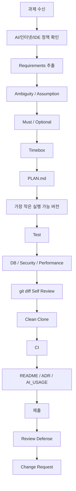

# 대기업 면접 후 과제 전형 대비 2026 최신 커리큘럼
## Take-home · Agentic Coding Assessment · Repository Task · Public Hiring Challenges

> **기준일:** 2026-09-02  
> **권장 기간:** **14주 × 7일 = 98일**  
> **대상:** 백엔드 / 풀스택 개발자  
> **IDE:** Cursor  
> **기본 Backend:** Java 25 LTS + Spring Boot 4.1 + PostgreSQL 18  
> **기본 Frontend:** React 19.2 + TypeScript 7 + Vite 8.1  
> **최종 목표:** 2~24시간짜리 Take-home 또는 AI-assisted/repository 기반 평가를 받아 **요구사항 추출 → 계획 → 구현 → 테스트 → 보안/성능 → CI → 문서화 → 제출 → 코드리뷰 → 즉석 변경요청**까지 방어한다.

---

## 1. 기간 판단

기존 12주 과정은 전통적인 CRUD/Full-stack Take-home 대비에는 충분했다.

하지만 2026년에는 평가 방식이 다음처럼 확장되고 있다.

```text
Greenfield Take-home
+
Existing Repository Bugfix / Feature
+
AI-assisted Coding
+
Plan Mode
+
Diff Review
+
AI Usage Trace
+
Human Explanation
+
Live Change Request
```

CodeSignal은 2026년 **Agentic Coding Assessments**에서 후보자에게
요구사항 추출 → agentic helper(Cursor/Claude Code/Codex 등)로 구현 → 사람이 설명하는 흐름을 평가하고,
greenfield와 existing-codebase 두 유형을 제공한다고 공개했다.

HackerRank는 2026년에:
- AI Fluency
- Plan Mode
- Diff View
- AI-assisted test
- Code Repository Questions
를 강화했다.

따라서 실제 공개 Take-home/채용 Challenge를 별도 2주 동안 풀기 위해
**12주 → 14주(98일)**로 확장한다.

판단:

```text
12주
= 기본 Take-home 대비에는 적절
= 최신 공개 과제와 repository/agentic 평가까지 넣기엔 다소 촘촘

14주
= 가장 균형 좋음

16주+
= 일반 백엔드/풀스택 과제전형 목표에는 과도
```

---

## 2. 2026 핵심 평가 스킬

### Requirements
- Requirement Extraction
- Ambiguity Log
- Must / Should / Could
- Acceptance Criteria
- Definition of Done
- Assumption Log

### Engineering
- API Contract
- Data Integrity
- Transaction / Concurrency
- Test Strategy
- Clean Architecture보다 **변경 가능한 적정 구조**
- Performance Evidence
- Security Baseline
- Resilience

### Delivery
- Clean Clone
- Lockfile
- Docker / Compose
- CI
- PR / Diff Review
- README
- ADR / Trade-off
- Run / Test 명령 재현

### AI-native
- AI Policy 확인
- PLAN.md
- Task Decomposition
- Agent Usage
- Package / API Provenance 확인
- AI-generated code verification
- git diff review
- AI_USAGE.md
- AI suggestion accept/reject 기록
- AI 없이 코드 설명/수정

### Repository Assessment
- Unknown Repo Reading
- Existing Tests
- Bug Localization
- Minimal Patch
- Feature Addition
- Characterization Test
- Impact Analysis
- Plan vs Diff Review

---

## 3. 2026 초기 Version Baseline

과정 시작 Day 1에서 공식 Stable/LTS를 다시 확인하고 `VERSION_LOCK.md`에 고정한다.

| Category | Technology | 2026-09-02 초기 기준 |
|---|---|---|
| Language | Java | **25.0.4.1 LTS** |
| Backend | Spring Boot | **4.1.1 Stable** |
| Build | Gradle | **9.7.1** |
| Database | PostgreSQL | **18.6 Stable** |
| Test | Testcontainers Java | **2.0.5** |
| API Docs | springdoc-openapi | **3.0.3** |
| Frontend | React | **19.2.7 / 19.2 line** |
| Language | TypeScript | **7.0 Stable** |
| Build | Vite | **8.1** |
| Test | Vitest | **4.1** |
| E2E | Playwright | **1.62** |

### Version 원칙

```text
Stable / GA / LTS
→ 기본 실습

Beta / RC / Preview / Nightly
→ 기본 baseline 금지
```

Spring 하위 의존성은 Spring Boot BOM/Dependency Management를 우선하고,
모든 라이브러리를 개별 최신 버전으로 강제하지 않는다.

---

## 4. 공개 과제 Source 등급

### Grade A — 기업 First-party 공개 기출 / 공개 채용 Challenge

기업이 직접 GitHub/공식 사이트에서 공개한 것.

이 과정에서 사용:

- Kakao `kakao/recoteam`
  - Mini Reco
  - Jukebox
  - Beale Ciphers
  - 카카오 추천팀이 **실제 영입 과정에서 사용한 기출 문제**라고 명시
- SimplifyJobs
  - backend-take-home
  - frontend-assessment
- ElloTechnology
  - 2025-full-stack-take-home
- System76
  - takehome_web_be
- Noyo
  - backend-coding-challenge
- FeedMe
  - se-take-home-assignment
- ConsumerAffairs
  - ca-code-challenge
- Ethyca
  - fde-takehome

### Grade B — 기업 공식 실무 Challenge / 인턴 과제

실제 실무형 과제지만 일반적인 Take-home 채용시험과 동일하다고 단정하지 않는다.

- NAVER AI CHALLENGE 2026
  - AI 기반 데이터 파이프라인 로그 분석을 통한 Data Asset 자동 매핑 및 End-to-End Data Lineage 구축
  - VLM 기반 사용자 경험 중심 검색/추천 품질 자동 평가 시스템 개발

### Grade C — 전형 변화는 공개됐지만 문제 원문은 비공개

- CJ올리브영 2026 개발 경력 채용 **AI 과제 전형**
  - 기존 라이브 코딩 대신 AI 과제 도입
  - 공개 보도 기준으로 맥락/제약을 담아 지시하는 능력, 도구 선택 등을 평가
  - **실제 과제 원문은 공개 확인되지 않았으므로 모의 문제만 사용**

절대로 Grade B/C를 “실제 공개 기출 원문”이라고 표현하지 않는다.

---

## 5. 14주 로드맵

| 기간 | 핵심 |
|---|---|
| Week 1 | Requirements / Timebox / Git / README |
| Week 2 | Spring Boot API Contract |
| Week 3 | Test / Testcontainers |
| Week 4 | PostgreSQL / Transaction / Concurrency |
| Week 5 | Auth / Security / Dependency Provenance |
| Week 6 | React / TypeScript / Frontend Test |
| Week 7 | Full-stack / Docker / Clean Clone |
| Week 8 | CI / PR / Review / Observability |
| Week 9 | Performance / Resilience / Change Request |
| Week 10 | AI-assisted Greenfield Assessment |
| Week 11 | Existing Repository / Bugfix / Feature Assessment |
| Week 12 | Global Public Take-home Challenges |
| Week 13 | 국내 대기업·대형 IT 공개 과제 / Challenge |
| Week 14 | Final 8~24h Take-home + Review Defense |

---

## 6. 과제 전형 표준 실행 루프



---

# 7. Day 1 ~ Day 98 상세 커리큘럼


## Week 1 — Take-home 2026 기본기: 요구사항·시간제한·제출 전략

| Day | 주제 | 학습 목표 | 실습 | 산출물 |
|---:|---|---|---|---|
| Day 1 | **2026 Take-home / Agentic Assessment 전체 지도** | 전통 Take-home, AI 제한형, AI-assisted, repository-based 평가를 구분하고 평가자가 보는 증거를 이해한다. | 공개 과제 3개를 읽고 평가항목을 역추적 | `assessment_landscape.md` |
| Day 2 | **요구사항 추출과 Ambiguity Log** | 기능/제약/비기능/모호함을 분리하고 질문할 것과 가정할 것을 구분한다. | 모호한 예약 과제를 REQUIREMENTS.md로 재작성 | `REQUIREMENTS.md` |
| Day 3 | **Must / Should / Could + Timeboxing** | 시간이 짧을수록 핵심 기능과 포기 기준을 먼저 결정한다. | 4시간/8시간/24시간 버전 계획 비교 | `TIMEBOX_PLAN.md` |
| Day 4 | **Acceptance Criteria + Definition of Done** | 완료를 느낌이 아니라 검증 가능한 조건으로 표현한다. | Given/When/Then 기준 15개 작성 | `ACCEPTANCE_CRITERIA.md` |
| Day 5 | **Repository 초기화·Git 전략** | 커밋 이력이 작업 사고를 보여주도록 작은 변경 단위를 만든다. | branch/commit/tag/PR 흐름 실습 | `GIT_STRATEGY.md` |
| Day 6 | **README First + Clean Clone** | 평가자가 clone 후 최소 명령으로 실행할 수 있는 프로젝트를 만든다. | 빈 프로젝트 Quick Start를 다른 디렉터리에서 재검증 | `README.md` |
| Day 7 | **Mini Take-home 1 — CLI Inventory** | 요구사항→구현→테스트→README→제출을 2시간 안에 완주한다. | CLI 재고관리 미니 과제 | `projects/week01-cli-inventory/` |

## Week 2 — Spring Boot API Contract·Validation·Error Design

| Day | 주제 | 학습 목표 | 실습 | 산출물 |
|---:|---|---|---|---|
| Day 8 | **Java 25 LTS + Spring Boot 4.1 프로젝트** | 최신 LTS/Stable 기반으로 재현 가능한 backend starter를 만든다. | Gradle wrapper + Spring Boot API 생성 | `backend/` |
| Day 9 | **REST Resource와 HTTP 의미** | endpoint를 동사 나열이 아니라 resource/상태 전이로 설계한다. | Todo/Reservation API contract | `docs/api-contract.md` |
| Day 10 | **Request/Response DTO + Validation** | 입력 신뢰 금지와 schema 계약을 구현한다. | Bean Validation 성공/실패 케이스 | `backend-validation/` |
| Day 11 | **Problem Details·Error Contract** | 실패를 문자열이 아니라 일관된 machine-readable 계약으로 만든다. | 공통 오류 응답 구현 | `error-contract/` |
| Day 12 | **OpenAPI 3.1 + 실행 가능한 API 문서** | 문서와 코드가 drift하지 않도록 contract를 검증한다. | springdoc OpenAPI + curl examples | `openapi/` |
| Day 13 | **Idempotency·Retry 안전성 기초** | 중복 요청이 데이터 중복을 만들지 않도록 write API를 설계한다. | 중복 POST 방어 시나리오 | `idempotency-note.md` |
| Day 14 | **Mini Take-home 2 — Product API** | CRUD보다 계약/검증/에러/README 완성도를 평가한다. | 3시간 Product API | `projects/week02-product-api/` |

## Week 3 — 테스트 전략·Testcontainers·Mutation 사고

| Day | 주제 | 학습 목표 | 실습 | 산출물 |
|---:|---|---|---|---|
| Day 15 | **테스트 전략과 Risk-based Testing** | 모든 코드를 같은 강도로 테스트하지 않고 실패 비용 기준으로 우선순위를 정한다. | Test Strategy 작성 | `TEST_STRATEGY.md` |
| Day 16 | **Unit Test** | 도메인 규칙을 빠르고 독립적으로 검증한다. | 가격/예약 규칙 테스트 | `tests/unit/` |
| Day 17 | **Web Slice / API Test** | HTTP 계약·validation·status를 분리 검증한다. | MockMvc/API test | `tests/api/` |
| Day 18 | **Testcontainers 2.x + PostgreSQL** | 실제 DB에 가까운 통합 테스트로 H2 착시를 피한다. | Postgres Testcontainer | `tests/integration/` |
| Day 19 | **Fixture·Factory·Test Data Isolation** | 테스트 데이터가 서로 영향을 주지 않게 만든다. | fixture builder 정리 | `tests/fixtures/` |
| Day 20 | **경계값·Property/Invariant 사고** | 예시 몇 개가 아니라 깨지면 안 되는 성질을 정의한다. | 예약 불변조건·랜덤 케이스 | `INVARIANTS.md` |
| Day 21 | **Mini Take-home 3 — Existing Failing Tests** | 실패한 테스트가 있는 저장소를 읽고 원인을 좁혀 고친다. | bugfix repository drill | `projects/week03-bugfix/` |

## Week 4 — PostgreSQL·Transaction·Concurrency·Data Integrity

| Day | 주제 | 학습 목표 | 실습 | 산출물 |
|---:|---|---|---|---|
| Day 22 | **PostgreSQL 18 모델링** | PK/FK/Unique/Check/시간 컬럼을 요구사항과 연결한다. | 예약 ERD + migration | `database/` |
| Day 23 | **Migration과 Schema Evolution** | DDL 변경이 재현 가능하고 되돌릴 수 있게 관리한다. | Flyway migration 3단계 | `migrations/` |
| Day 24 | **Transaction Boundary** | 서비스 메서드의 원자성과 rollback을 설명한다. | 예약 생성 트랜잭션 | `transaction-report.md` |
| Day 25 | **Race Condition 재현** | exists() 검사만으로 중복 예약을 막지 못하는 이유를 실험한다. | 동시 요청 테스트 | `concurrency-race.md` |
| Day 26 | **Unique Constraint·Optimistic/Pessimistic Lock** | DB 무결성과 lock 전략의 trade-off를 비교한다. | 3가지 중복 방지 방식 비교 | `locking-decision.md` |
| Day 27 | **Index·N+1·Pagination** | 작은 과제에서도 지나친 최적화 없이 치명적 성능 문제를 잡는다. | EXPLAIN/N+1/keyset 비교 | `performance-db.md` |
| Day 28 | **Mini Take-home 4 — Reservation API** | 동시성·migration·index·테스트까지 포함한 4시간 backend 과제 | 예약 API | `projects/week04-reservation/` |

## Week 5 — Security·Dependency Provenance·Supply-chain Quality

| Day | 주제 | 학습 목표 | 실습 | 산출물 |
|---:|---|---|---|---|
| Day 29 | **AuthN/AuthZ 경계** | 로그인과 권한을 분리하고 resource ownership을 설계한다. | 회원 전용 resource 규칙 | `auth-boundary.md` |
| Day 30 | **Cookie/Session/JWT/OAuth2 선택** | 과제 규모에 맞는 인증 방식을 고르고 과설계를 피한다. | 인증 decision matrix | `auth-decision.md` |
| Day 31 | **Spring Security + Ownership** | 401/403과 본인 리소스 권한을 테스트한다. | ownership security tests | `security-tests/` |
| Day 32 | **Secret·PII·Logging** | 민감정보가 repo/log/trace로 새지 않게 한다. | secret scan + logging checklist | `SECURITY_CHECKLIST.md` |
| Day 33 | **Dependency Provenance·Lockfile·SBOM 사고** | AI가 추천한 패키지의 존재/버전/출처/취약점을 확인한다. | dependency evidence table | `DEPENDENCY_REVIEW.md` |
| Day 34 | **SAST/Dependency Scan Quality Gate** | 간단한 보안 자동검사를 CI의 증거로 만든다. | dependency/security workflow | `security-ci.yml` |
| Day 35 | **Mini Take-home 5 — Secure Board** | 인증/인가/secret/test를 4시간 안에 균형 있게 적용한다. | 회원 게시판 | `projects/week05-secure-board/` |

## Week 6 — React·TypeScript 7·Frontend Take-home

| Day | 주제 | 학습 목표 | 실습 | 산출물 |
|---:|---|---|---|---|
| Day 36 | **React 19.2 + TypeScript 7 + Vite 8.1** | 최신 frontend baseline과 type-safe API 경계를 만든다. | frontend starter | `frontend/` |
| Day 37 | **Component Boundary·State Ownership** | 페이지를 컴포넌트로 과분할하지 않고 변경 단위로 나눈다. | component map | `frontend/docs/component-map.md` |
| Day 38 | **Server State·Loading/Error/Empty** | 성공 화면만이 아니라 모든 UI 상태를 구현한다. | TanStack Query 상태 UI | `frontend/state/` |
| Day 39 | **Form·Validation·Accessible UI** | keyboard/label/error message까지 평가 가능한 폼을 만든다. | accessible form | `frontend/forms/` |
| Day 40 | **Vitest 4.1 Component Test** | 사용자 행동 중심의 component test를 작성한다. | render/interaction tests | `frontend/tests/` |
| Day 41 | **Playwright 1.62 E2E** | 핵심 사용자 여정을 브라우저에서 검증한다. | create/edit/delete E2E | `e2e/` |
| Day 42 | **Public Challenge Drill — Simplify Frontend** | 공개 실제 Take-home의 2~3시간 제약 속에서 spec→Next.js/React 구현→README를 경험한다. | Simplify Frontend Exercise 변형 실습 | `projects/public-simplify-frontend/` |

## Week 7 — Full-stack·Docker·Clean-room Reproducibility

| Day | 주제 | 학습 목표 | 실습 | 산출물 |
|---:|---|---|---|---|
| Day 43 | **Frontend↔Backend 계약 연결** | 타입/validation/error가 양쪽에서 일치하게 만든다. | full-stack API integration | `fullstack/` |
| Day 44 | **Dockerfile·Multi-stage Build** | 작고 재현 가능한 실행 이미지를 만든다. | backend/frontend Dockerfile | `docker/` |
| Day 45 | **Docker Compose + Healthcheck** | DB까지 한 명령으로 띄우고 readiness를 검증한다. | compose.yaml | `compose.yaml` |
| Day 46 | **Seed Data·Environment Profiles** | 평가자가 바로 기능을 확인할 수 있는 최소 fixture를 제공한다. | seed + .env.example | `seed/` |
| Day 47 | **Clean Clone Verification** | 새 디렉터리/깨끗한 환경에서 README 명령을 그대로 검증한다. | verification transcript | `CLEAN_CLONE_REPORT.md` |
| Day 48 | **E2E + API + DB 통합 Gate** | 기능이 layer별로 따로가 아니라 전체 흐름에서 동작함을 증명한다. | fullstack E2E | `tests/e2e/` |
| Day 49 | **Mini Take-home 6 — Full-stack App** | 6시간 내 실행 가능한 full-stack 제출물을 완성한다. | Todo/Board full-stack | `projects/week07-fullstack/` |

## Week 8 — CI·PR·Code Review·Observability-as-Evidence

| Day | 주제 | 학습 목표 | 실습 | 산출물 |
|---:|---|---|---|---|
| Day 50 | **GitHub Actions CI** | push/PR마다 build/test를 자동화한다. | backend+frontend CI | `ci.yml` |
| Day 51 | **Quality Gate·Required Checks 사고** | lint/test/integration/e2e를 실패 조건과 연결한다. | quality-gate.md | `QUALITY_GATE.md` |
| Day 52 | **PR Description·Diff Story** | PR이 요구사항→변경→검증→risk를 설명하도록 만든다. | PR template | `PULL_REQUEST_TEMPLATE.md` |
| Day 53 | **Self Code Review** | 제출 전 git diff를 평가자 시선으로 다시 읽는다. | self-review checklist | `SELF_REVIEW.md` |
| Day 54 | **Actuator·Health·Structured Log** | 운영 스택을 과도하게 넣지 않고 최소 관측 가능성을 제공한다. | health/log demo | `observability/` |
| Day 55 | **OpenTelemetry 맛보기** | trace/span/correlation을 실제 요청 흐름과 연결한다. | API trace map | `TRACE_NOTE.md` |
| Day 56 | **Mini Take-home 7 — CI/Review Ready** | 기능 구현보다 제출/검증/PR 품질을 평가하는 repo 과제 | quality-ready repo | `projects/week08-quality/` |

## Week 9 — Performance·Resilience·Change-friendly Design

| Day | 주제 | 학습 목표 | 실습 | 산출물 |
|---:|---|---|---|---|
| Day 57 | **Latency Budget·N+1·Network Waterfall** | 느린 이유를 측정하고 가장 큰 병목부터 고친다. | before/after report | `PERFORMANCE_REPORT.md` |
| Day 58 | **Timeout·Retry·Backoff** | 외부 API 실패 시 무한 대기/재시도 폭주를 피한다. | failure simulation | `resilience/` |
| Day 59 | **Idempotency·Duplicate Delivery** | 결제/예약/외부 callback의 중복 처리를 설계한다. | idempotent flow | `idempotency/` |
| Day 60 | **Rate Limit·Graceful Degradation** | 과제 규모에서 설명 가능한 수준의 보호 장치를 설계한다. | policy + test | `RATE_LIMIT_NOTE.md` |
| Day 61 | **Change Request Impact Analysis** | 추가 요구사항이 controller만이 아니라 DB/test/docs까지 미치는 영향을 추적한다. | impact map | `CHANGE_IMPACT.md` |
| Day 62 | **ADR·Trade-off Writing** | 왜 이 구조를 선택했고 무엇을 포기했는지 짧게 증명한다. | ADR 2개 | `docs/adr/` |
| Day 63 | **Mini Take-home 8 — Change Request Round** | 제출된 예약 서비스를 60분 변경요청으로 수정·테스트·문서화한다. | change request patch | `projects/week09-change/` |

## Week 10 — AI-Assisted / Agentic Coding: Greenfield

| Day | 주제 | 학습 목표 | 실습 | 산출물 |
|---:|---|---|---|---|
| Day 64 | **AI Policy Matrix** | No-AI / Guarded AI / Free AI 세 평가 모드를 구분한다. | 시험 규정 checklist | `AI_POLICY.md` |
| Day 65 | **PLAN.md 먼저 쓰기** | AI에게 바로 코딩시키지 않고 요구사항/파일/테스트 단위의 작업 계획을 만든다. | implementation plan | `PLAN.md` |
| Day 66 | **Cursor Agent Task Decomposition** | 한 번에 전체 앱이 아니라 검증 가능한 작은 task로 나눈다. | task contracts 6개 | `TASKS.md` |
| Day 67 | **AI 생성 코드 Provenance·Verification** | AI 제안의 package/API/logic을 공식 문서·테스트·diff로 확인한다. | AI verification log | `AI_USAGE.md` |
| Day 68 | **Diff Review·Reject/Accept 기록** | AI 제안 중 채택/거절/직접 수정한 이유를 남긴다. | AI decision log | `AI_DECISIONS.md` |
| Day 69 | **Agentic Greenfield Assessment** | CodeSignal형 요구사항 추출→agent helper→사람 설명 흐름을 연습한다. | 2시간 greenfield assessment | `projects/week10-agentic-greenfield/` |
| Day 70 | **AI-Assisted Defense** | AI 없이 현재 코드를 설명/수정/테스트할 수 있는지 검증한다. | oral defense checklist | `AI_DEFENSE.md` |

## Week 11 — Repository-based Assessment·Legacy Code·Plan/Diff Review

| Day | 주제 | 학습 목표 | 실습 | 산출물 |
|---:|---|---|---|---|
| Day 71 | **Unknown Repository Reading** | README/entrypoint/config/test부터 읽어 시스템 지도를 만든다. | repo map | `REPO_MAP.md` |
| Day 72 | **Bug Localization** | 증상→재현→로그/test→원인→최소 patch 순서로 디버깅한다. | bug investigation | `BUG_REPORT.md` |
| Day 73 | **Feature Addition without Rewrite** | 기존 convention을 지키며 작은 기능을 추가한다. | feature patch | `feature/` |
| Day 74 | **Refactor with Safety Net** | 테스트 없이 리팩토링하지 않고 characterization test부터 만든다. | refactor evidence | `REFACTOR_REPORT.md` |
| Day 75 | **HackerRank Repository Question Drill** | 기존 repo에서 bugfix/feature 문제를 해결하고 Plan/Diff를 남긴다. | repository assessment | `projects/week11-repo-assessment/` |
| Day 76 | **Plan Mode·Diff View Simulation** | 계획의 질과 실제 diff가 일치하는지 검증한다. | plan-vs-diff review | `PLAN_DIFF_REVIEW.md` |
| Day 77 | **Review Interview** | 면접관의 '왜?'와 즉석 변경요청을 45분 방어한다. | review transcript | `REVIEW_DEFENSE.md` |

## Week 12 — 공개 실제 Take-home Challenge 집중

| Day | 주제 | 학습 목표 | 실습 | 산출물 |
|---:|---|---|---|---|
| Day 78 | **Simplify Backend Take-home** | 공개 first-party backend challenge의 starter/tests/mock server를 읽고 요구사항을 구현한다. | 공개 과제 실습 | `projects/public-simplify-backend/` |
| Day 79 | **Noyo Backend Coding Challenge** | 기존 Docker/test 환경에서 문제를 해결하고 기존 테스트를 깨지 않는다. | 공개 과제 실습 | `projects/public-noyo/` |
| Day 80 | **System76 Backend Take-home** | Postgres 모델/API/filtering과 assumption/production readiness 문서를 연습한다. | 공개 과제 실습 | `projects/public-system76/` |
| Day 81 | **FeedMe SE Take-home** | AI 활용 가능 + 직접 테스트 + PR/GitHub Actions라는 2026형 조건을 연습한다. | 공개 과제 실습 | `projects/public-feedme/` |
| Day 82 | **ConsumerAffairs AI-expected Migration Challenge** | AI 도구 사용을 전제로도 migration decision과 방어 가능성을 평가한다. | 공개 challenge 변형 실습 | `projects/public-consumeraffairs/` |
| Day 83 | **Ethyca FDE Take-home** | 미지의 제품/API를 조사하고 문제 재현→분석→고객/내부 write-up까지 수행한다. | 공개 troubleshooting 과제 | `projects/public-ethyca/` |
| Day 84 | **Ello 2025 AI-powered Learning Companion** | 4~8시간 범위에서 voice/LLM/async/data-flow/trade-off/AI usage 설명을 훈련한다. | 공개 full-stack AI 과제 | `projects/public-ello-ai/` |

## Week 13 — 국내 대기업·대형 IT 공개 과제/실무형 Challenge

| Day | 주제 | 학습 목표 | 실습 | 산출물 |
|---:|---|---|---|---|
| Day 85 | **카카오 추천팀 영입 기출 — Mini Reco** | 카카오 추천팀이 실제 영입 기출이라고 공개한 문제를 요구사항/평가/실험 관점으로 해결한다. | 공개 기출 실습 | `projects/kakao-mini-reco/` |
| Day 86 | **카카오 추천팀 영입 기출 — Jukebox** | 공개 영입 기출을 시간제한으로 풀고 README/실험 결과를 방어한다. | 공개 기출 실습 | `projects/kakao-jukebox/` |
| Day 87 | **카카오 추천팀 영입 기출 — Beale Ciphers** | 공개 영입 기출을 분석하고 구현/검증/설명까지 완주한다. | 공개 기출 실습 | `projects/kakao-beale-ciphers/` |
| Day 88 | **NAVER AI Challenge 2026 — Data Lineage 과제 분석** | 공식 공개된 'AI 기반 데이터 파이프라인 로그 분석→Data Asset 자동 매핑→E2E Lineage' 과제명을 바탕으로 요구사항/평가 계획을 설계한다. | 공식 실무 Challenge 재구성 | `projects/naver-data-lineage/` |
| Day 89 | **NAVER AI Challenge 2026 — VLM 품질평가 과제 분석** | 공식 공개된 'VLM 기반 사용자 경험 중심 검색/추천 품질 자동 평가' 주제로 prototype/eval plan을 설계한다. | 공식 실무 Challenge 재구성 | `projects/naver-vlm-eval/` |
| Day 90 | **CJ올리브영 2026 AI 과제 전형 대응** | 공개된 전형 변화(맥락·제약 지시, 도구 선택 평가)를 바탕으로 모의 과제를 수행한다. 실제 기출 원문으로 표기하지 않는다. | AI Task simulation | `projects/oliveyoung-ai-simulation/` |
| Day 91 | **국내 공개과제 Mixed Defense** | 카카오/NAVER/올리브영형 과제를 비교해 회사별 평가 신호와 자신의 강약점을 정리한다. | 3시간 mixed review | `KOREA_PUBLIC_CHALLENGE_MAP.md` |

## Week 14 — 최종 8~24시간 Take-home + Review/Change Request Defense

| Day | 주제 | 학습 목표 | 실습 | 산출물 |
|---:|---|---|---|---|
| Day 92 | **Final Brief 공개·질문·가정** | 최종 과제 요구사항을 30분 내 구조화하고 질문/가정/포기 기준을 확정한다. | final REQUIREMENTS/PLAN | `projects/final/` |
| Day 93 | **Final Core Backend** | 핵심 resource/API/DB/validation을 Must 우선으로 구현한다. | backend core | `projects/final/backend/` |
| Day 94 | **Final Integrity·Concurrency·Test** | DB constraint/transaction/concurrency와 핵심 테스트를 완성한다. | test evidence | `projects/final/tests/` |
| Day 95 | **Final Frontend 또는 API Client** | 지원 직무에 맞춰 frontend 또는 강한 API client/demo를 완성한다. | usable UI/client | `projects/final/frontend/` |
| Day 96 | **Final CI·Docker·Security·Observability** | clean clone, CI, secret, health/log, 최소 trace를 검증한다. | release evidence | `projects/final/quality/` |
| Day 97 | **Final README·Self Review·Submission** | 평가자가 5분 안에 이해하도록 README/ADR/AI usage/trade-off를 정리한다. | submission package | `projects/final/README.md` |
| Day 98 | **Final Review Defense + Live Change Request** | 설계 질문을 방어하고 45~60분 변경요청을 구현·테스트·문서화한다. | portfolio defense | `projects/final/DEFENSE.md` |

---

# 8. 최신 공개 과제 실습 규칙

공개 repository를 그대로 답안 저장소로 fork해서 공개하지 않는다.

각 공개 과제 Day에서는:

```text
원문/README 읽기
↓
평가 의도 추출
↓
자체 private/local 연습 repository 생성
↓
시간 제한 Blind Solve
↓
Test
↓
Self Review
↓
공개 요구사항과 비교
↓
회고
```

순서로 학습한다.

기업이 “fork하지 말라”, “private repo 사용” 등의 조건을 명시한 경우 그 취지를 존중한다.

---

# 9. 공개 과제별 핵심 학습 포인트

## Kakao Recommendation Team

`kakao/recoteam`은 README에서 다음을
추천팀 영입 과정에서 실제 사용했던 문제라고 명시한다.

- Mini Reco
- Jukebox
- Beale Ciphers

목표:

```text
문제 해결
+
데이터/추천 사고
+
실험 설계
+
코드 품질
+
결과 설명
```

## Simplify Backend

현재 공개 repository 형태의 backend Take-home.

학습:

- starter repository 읽기
- mock grading server
- existing tests
- backend behavior
- minimal implementation
- test preservation

## Simplify Frontend

약 2~3시간을 권장하는 공개 Frontend Take-home.

학습:

- Figma/spec → component
- Next.js / React
- mock API
- client/server rendering 판단
- 시간 부족 시 우선순위
- AI 사용 시 사용 범위 설명

## Ello 2025 AI-Powered Learning Companion

4~8시간 제한을 명시하고 AI assistant 사용을 장려하는 공개 Full-stack Take-home.

학습:

- voice/session async flow
- LLM integration
- email/report
- architecture/data-flow
- failure handling
- AI usage explanation

## FeedMe

공개 assignment에서:
- AI 사용 가능
- 직접 testing 필수
- GitHub Flow / PR
- GitHub Actions check
- 과도한 기술 사용보다 clean implementation
을 강조한다.

2026형 과제전형의 좋은 연습 자료로 사용한다.

## ConsumerAffairs

공개 challenge가 AI tool 사용을 실제 업무처럼 기대하고,
결정을 사람이 소유하고 방어하는 것을 강조한다.

AI 시대 과제전형의 중요한 패턴이다.

## Ethyca

일반 CRUD가 아니라:
- unknown product
- API 조사
- issue reproduction
- troubleshooting
- customer response
- internal ticket
을 평가한다.

Forward Deployed / Solution / Platform Engineer 계열 대비에 사용한다.

---

# 10. 2026 최신 평가 변화

## Agentic Coding Assessment

2026 CodeSignal 공개 자료 기준:

```text
Requirement Extraction
→ Agentic Helper
→ Build
→ Human Explanation
```

그리고:
- from-scratch
- existing-codebase
두 유형을 제공한다.

따라서 AI를 많이 호출하는 능력이 아니라:

```text
무엇을 시킬지
무엇을 믿지 않을지
어떤 test로 확인할지
왜 이 결과를 채택했는지
```

를 훈련한다.

## Repository Question

2026 HackerRank 공개 문서 기준:

기존 repository를 바탕으로:
- bug fix
- feature build
- 특정 영역 수정
을 평가할 수 있다.

따라서 새 프로젝트 생성 능력만으로는 부족하다.

## Plan Mode / Diff Review

평가자는 최종 코드뿐 아니라:
- 탐색
- 계획
- 변경 과정
- AI 상호작용
을 볼 수 있다.

그러므로 “작동하는 final.zip”만 만드는 습관을 버린다.

---

# 11. AI 사용 기록 Template

```md
# AI_USAGE.md

## 시험 정책
- AI 허용 여부:
- 허용 Tool:
- 인터넷:
- 외부 문서:

## 사용 목적
- 요구사항 누락 검토
- 설계 대안
- 테스트 아이디어
- 코드 리뷰
- 디버깅

## 내가 먼저 한 것

## AI에게 준 Task

## 채택한 제안

## 거절한 제안

## AI가 틀린 부분

## 직접 수정한 부분

## 검증 Evidence
- test:
- command:
- diff:
- official docs:

## AI 없이 설명할 수 있는가?
```

---

# 12. 제출 전 Evidence Package

최종 제출에는 가능한 범위에서 다음을 남긴다.

```text
README.md
REQUIREMENTS.md
ASSUMPTIONS.md
PLAN.md
ACCEPTANCE_CRITERIA.md
VERSION_LOCK.md
AI_USAGE.md
SELF_REVIEW.md
TRADEOFFS.md
```

모든 과제에서 파일 수를 늘리라는 의미가 아니다.

과제 시간과 평가 기준에 맞춰 필요한 문서만 최소화한다.

---

# 13. 최종 98일 수료 기준

- [ ] 15~30분 안에 요구사항을 구조화할 수 있다.
- [ ] Must/Should/Could와 포기 기준을 정할 수 있다.
- [ ] Java/Spring Boot API를 시간 제한 안에 구현할 수 있다.
- [ ] PostgreSQL constraint/transaction/concurrency를 설명할 수 있다.
- [ ] 핵심 Unit/API/Integration Test를 선택할 수 있다.
- [ ] Testcontainers로 실제 DB 통합 테스트를 만들 수 있다.
- [ ] React/TypeScript UI를 loading/error/empty까지 구현할 수 있다.
- [ ] Playwright 핵심 E2E를 작성할 수 있다.
- [ ] clean clone에서 실행 가능함을 직접 검증할 수 있다.
- [ ] CI 실패를 quality gate로 사용할 수 있다.
- [ ] Secret/권한/Dependency 위험을 점검할 수 있다.
- [ ] N+1/index/latency를 과도한 최적화 없이 점검할 수 있다.
- [ ] AI-assisted 평가에서 PLAN → Agent → Diff → Test → Review를 수행할 수 있다.
- [ ] AI 생성 코드를 package/API/logic 수준에서 검증할 수 있다.
- [ ] AI 금지 환경에서도 핵심 기능을 직접 구현할 수 있다.
- [ ] 처음 보는 repository를 읽고 bug/feature 위치를 찾을 수 있다.
- [ ] 기존 구조를 갈아엎지 않고 최소 변경할 수 있다.
- [ ] 카카오 공개 영입 기출을 실제로 풀어봤다.
- [ ] 공개 글로벌 Take-home을 시간 제한으로 여러 유형 경험했다.
- [ ] 제출 후 45~60분 변경요청을 안전하게 반영할 수 있다.
- [ ] 설계·trade-off·포기한 기능을 면접에서 방어할 수 있다.

---

# 14. 최종 판단

이 과정의 권장 기간은 **14주·98일**이다.

```text
12주
= 전통 Take-home 대비에는 충분

14주
= 2026 Agentic/Repository 평가
+ AI-assisted workflow
+ 실제 공개 Take-home / 국내 공개 영입 기출
까지 포함하기에 적절

16주 이상
= 일반 백엔드/풀스택 과제전형 대비에는 과도
```

최종 목표는 “기술을 많이 넣은 프로젝트”가 아니다.

**제한된 시간 안에 요구사항을 정확히 해석하고, 가장 중요한 기능을 안정적으로 구현하고, 테스트·실행·문서·AI 사용 근거를 남기며, 제출 후 변경 요청까지 자기 코드로 방어하는 개발자**가 되는 것이다.

---

# 15. 조사 출처

기준일 2026-09-02에 확인한 주요 공개 자료:

- CodeSignal — Product Updates: March 2026 / Agentic Coding Assessments
  - https://support.codesignal.com/hc/en-us/articles/39883270333591-Product-Updates-March-2026
- CodeSignal — AI-Assisted Coding Assessments
  - https://codesignal.com/resource/ai-assisted-coding-assessments/
- HackerRank — July 2026 Release Notes
  - https://support.hackerrank.com/articles/8142080826-july-2026-release-notes
- HackerRank — Code Repository Questions
  - https://support.hackerrank.com/articles/1900882930-code-repository-questions
- Kakao Recommendation Team
  - https://github.com/kakao/recoteam
- NAVER 2026 AI Challenge
  - https://d2.naver.com/news/7477295
- CJ OliveYoung AI Task hiring change
  - 2026-07-21 공개 보도 기준, 실제 문제 원문 비공개
- Simplify Backend Take-home
  - https://github.com/SimplifyJobs/backend-take-home
- Simplify Frontend Assessment
  - https://github.com/SimplifyJobs/frontend-assessment
- Ello 2025 Full-stack Take-home
  - https://github.com/ElloTechnology/2025-full-stack-take-home
- Noyo Backend Coding Challenge
  - https://github.com/noyo-technologies/backend-coding-challenge
- System76 Backend Take-home
  - https://github.com/system76/takehome_web_be
- FeedMe SE Take-home Assignment
  - https://github.com/feedmepos/se-take-home-assignment
- ConsumerAffairs Code Challenge
  - https://github.com/ConsumerAffairs/ca-code-challenge
- Ethyca FDE Take-home
  - https://github.com/ethyca/fde-takehome

기술 버전:
- Oracle JDK 25 release notes
- Spring Boot 4.1.1 release
- Gradle 9.7.1 release
- PostgreSQL 18.6 release
- React 19.2
- TypeScript 7
- Vite 8.1
- Vitest 4.1
- Playwright 1.62
- Testcontainers Java 2.0.5
