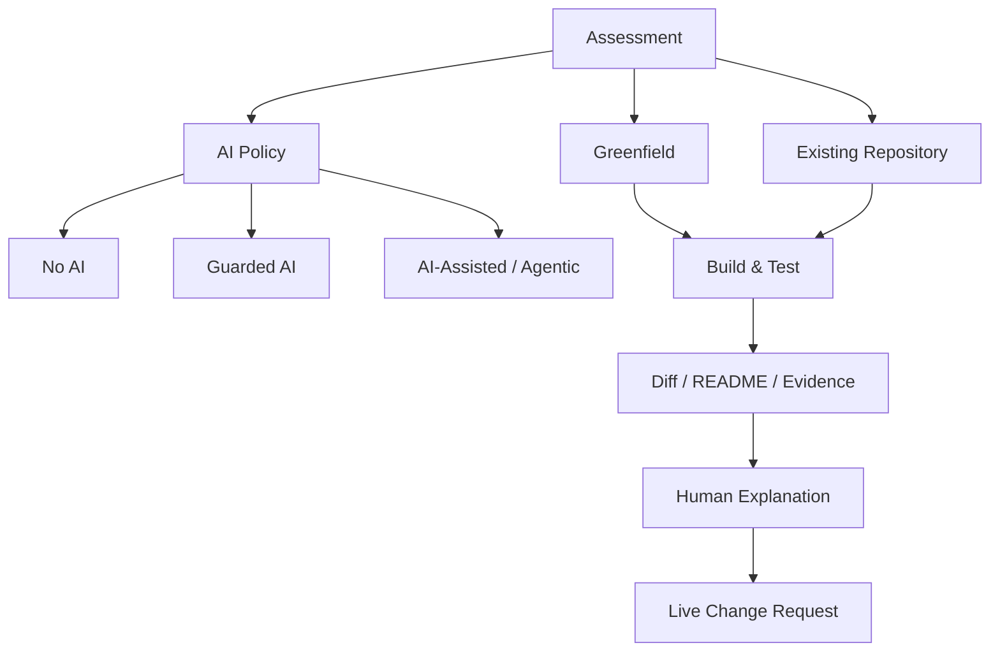

# assessment_landscape.md

## 목적

2026 Take-home / Agentic / Repository-based 평가에서 **과제 원문의 조건 → 평가 신호 → 후보자가 남길 Evidence**를 연결하는 Day 1 산출물이다.

이 문서는 공개 과제 원문을 복제하지 않는다. 아래 `Observed`는 커리큘럼이 선정 이유로 명시한 공개 특성과 원문에서 학습자가 확인해야 할 핵심 조건을 요약한 것이며, `Inferred`는 그 조건으로부터 추론한 학습용 평가 신호다. 실제 기업의 비공개 scoring rubric이라고 단정하지 않는다.

---

# 1. 2026 Assessment Map



평가 형태는 서로 배타적이지 않다. `Existing Repository + AI-Assisted + Human Explanation`처럼 결합될 수 있다.

---

# 2. Public Source 1 — Simplify Backend Take-home

- Source: https://github.com/SimplifyJobs/backend-take-home
- 분류: **기업 first-party 공개 Backend Take-home**
- 과정 내 재사용 Day: Day 78

## Observed / curriculum-supported facts

- 공개 repository 형태의 backend Take-home이다.
- starter repository를 읽는 연습에 사용한다.
- mock grading server / existing tests를 이해하고 보존하는 흐름을 학습한다.
- 기존 구조 위에서 필요한 backend behavior를 최소 구현하는 연습으로 사용한다.

## Inferred evaluation signals

1. **Unknown repo reading**
   - 근거: starter와 기존 테스트가 있는 repository 형태
   - 추론: 새 프로젝트 생성 속도보다 기존 구조를 빠르게 파악하는 능력이 중요할 가능성이 높다.
2. **Regression safety**
   - 근거: existing tests가 학습 포인트
   - 추론: 새 기능만 맞추는 것보다 기존 behavior를 깨뜨리지 않는 것이 중요할 가능성이 높다.
3. **Minimal implementation**
   - 근거: starter/grading 환경에서 요구 behavior 구현
   - 추론: 광범위한 rewrite보다 필요한 범위의 작은 변경이 설명·검증에 유리하다.
4. **Executable evidence**
   - 근거: 테스트/평가용 서버가 존재하는 과제 형태
   - 추론: “코드가 좋아 보임”보다 실제 실행 결과가 강한 Evidence다.

## Candidate evidence

- 기존 test + 새/수정 test 통과 결과
- 변경 파일이 제한된 `git diff`
- run/test 명령이 명확한 README
- 요구사항별 구현 위치 메모

## High-risk mistakes

- 기존 tests를 읽기 전에 구현 시작
- repository convention을 무시한 대규모 rewrite
- grading/mock 환경을 임의로 바꿔 문제를 우회

---

# 3. Public Source 2 — FeedMe SE Take-home Assignment

- Source: https://github.com/feedmepos/se-take-home-assignment
- 분류: **기업 first-party 공개 SE Take-home Assignment**
- 과정 내 재사용 Day: Day 81

## Observed / curriculum-supported facts

- AI 사용이 가능하다고 공개 assignment에서 안내한다.
- 직접 testing을 요구한다.
- GitHub Flow / PR 방식이 학습 포인트다.
- GitHub Actions check를 사용한다.
- 과도한 기술보다 clean implementation을 강조하는 공개 assignment로 사용한다.

## Inferred evaluation signals

1. **AI fluency + ownership**
   - 근거: AI 사용 가능과 직접 testing이 함께 존재
   - 추론: AI 사용량보다 AI 결과를 검증하고 소유하는 태도를 볼 가능성이 높다.
2. **Delivery workflow**
   - 근거: GitHub Flow / PR / Actions
   - 추론: 최종 코드뿐 아니라 review 가능한 변경 단위와 자동 검증을 중요하게 볼 가능성이 높다.
3. **Judgment against overengineering**
   - 근거: clean implementation 강조
   - 추론: 도구/architecture 개수보다 문제에 맞는 단순하고 설명 가능한 선택이 유리하다.
4. **Human verification**
   - 근거: 직접 testing
   - 추론: AI가 “완료”라고 한 상태는 Evidence로 충분하지 않다.

## Candidate evidence

- 로컬 test command와 observed result
- CI check 통과
- 요구사항→변경→검증→risk가 보이는 PR description
- AI를 썼다면 accept/reject/verification 기록

## High-risk mistakes

- AI 생성 코드를 읽지 않고 제출
- CI가 있으니 로컬 테스트를 생략
- “실무처럼 보이게” 하려고 불필요한 인프라/서비스를 추가

---

# 4. Public Source 3 — Ello 2025 Full-stack Take-home

- Source: https://github.com/ElloTechnology/2025-full-stack-take-home
- 분류: **기업 first-party 공개 Full-stack Take-home**
- 과정 내 재사용 Day: Day 84

## Observed / curriculum-supported facts

- 4~8시간 범위를 명시한 공개 Full-stack Take-home으로 사용한다.
- AI assistant 사용을 장려하는 과제로 분류한다.
- AI-powered learning companion 맥락에서 voice/session, LLM integration, async/data flow가 학습 포인트다.
- failure handling, architecture/data-flow, trade-off, AI usage 설명을 훈련한다.

## Inferred evaluation signals

1. **Timeboxing / scope judgment**
   - 근거: 4~8시간 범위
   - 추론: 모든 기능을 완벽히 만들기보다 핵심 흐름을 선택하고 포기 기준을 설명하는 능력이 중요할 가능성이 높다.
2. **Integration reasoning**
   - 근거: voice/LLM/async 흐름
   - 추론: 단일 CRUD가 아니라 외부 서비스·비동기 경계와 실패를 다루는 사고를 볼 가능성이 높다.
3. **AI-assisted delivery**
   - 근거: AI assistant 사용 장려
   - 추론: AI를 활용하더라도 architecture, data flow, failure handling을 사람이 설명해야 한다.
4. **Trade-off communication**
   - 근거: 제한 시간 + 여러 integration 요소
   - 추론: 완성하지 못한 선택을 숨기기보다 우선순위와 known limitation을 명시하는 것이 중요하다.

## Candidate evidence

- 핵심 end-to-end flow가 동작하는 demo/test
- architecture/data-flow 그림
- 외부 서비스 실패 처리 설명
- 시간 제한 안에서 포기한 항목과 다음 개선 순서
- AI 사용 범위와 직접 검증한 항목

## High-risk mistakes

- LLM/voice 기능 수를 늘리느라 핵심 사용자 흐름이 깨짐
- happy path만 구현하고 외부 API 실패/timeout을 설명하지 못함
- AI가 만든 integration code를 이해하지 못함

---

# 5. 세 과제 비교

| Source | Shape | AI 관점 | 주요 제약 신호 | Inferred evaluator signal | 강한 Candidate Evidence |
|---|---|---|---|---|---|
| Simplify Backend | Existing/starter repo backend | 실제 원문 정책 확인 필요 | existing tests / grading context | repo reading, regression safety, minimal patch | tests, small diff, reproducible run |
| FeedMe | SE take-home + PR workflow | AI 사용 가능 | 직접 test, PR, Actions, clean implementation | AI ownership, delivery quality, judgment | local test + CI + PR story + AI verification |
| Ello 2025 | Timeboxed full-stack AI | AI assistant 장려 | 4~8h, multiple integrations | scope judgment, integration/failure reasoning | working core flow, data-flow, trade-off, AI usage |

---

# 6. 공통 평가 신호

세 source의 성격은 다르지만 학습 관점에서 다음 공통점을 뽑을 수 있다.

1. **기능 개수보다 핵심 요구사항을 안정적으로 끝내는 판단**
2. **실행/테스트처럼 다른 사람이 확인할 수 있는 Evidence**
3. **도구를 쓰더라도 결과를 사람이 소유하고 설명하는 능력**
4. **기존 맥락과 제한 시간을 존중하는 scope 통제**
5. **README/PR/architecture note 등 reviewer가 이해할 수 있는 전달 품질**

---

# 7. 나의 Day 1 대응 원칙

앞으로 실제 과제를 받으면 첫 15분에 다음 순서를 지킨다.

```text
1. AI/인터넷/IDE/공개 제출 정책 확인
2. Greenfield인지 Existing Repo인지 확인
3. Must-looking behavior와 제약 표시
4. 테스트/실행/제출 Evidence 요구 확인
5. 시간 제한 확인
6. 모호한 점과 가정 후보 메모
7. 그 다음에만 구현 계획 시작
```

Day 2부터 3~6번을 더 정교하게 `REQUIREMENTS.md`와 Ambiguity Log로 만든다.

---

# 8. Day 1 Self Review

- [ ] `Observed`에 원문/커리큘럼이 지원하지 않는 내용을 단정하지 않았는가?
- [ ] `Inferred`를 실제 기업 scoring rubric처럼 표현하지 않았는가?
- [ ] 세 과제가 각각 왜 다른 연습을 제공하는지 설명할 수 있는가?
- [ ] AI 허용 여부와 repository shape를 별개의 축으로 볼 수 있는가?
- [ ] “좋은 제출 = 많은 기술”이라는 생각에서 벗어났는가?
