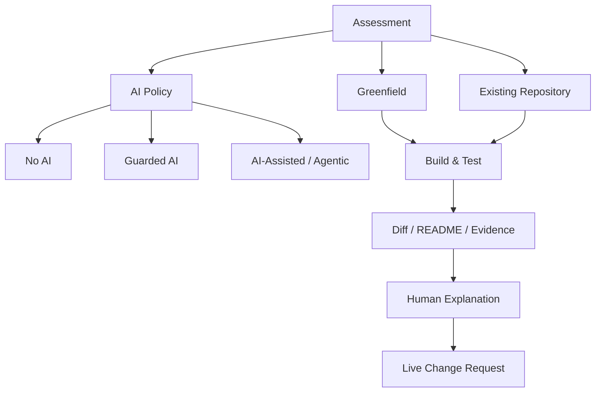

# assessment_landscape.md

## 목적

2026 Take-home / Agentic / Repository-based 평가에서 **과제 원문의 조건 → 평가 신호 → 후보자가 남길 Evidence**를 연결하는 Day 1 산출물이다.

이 문서는 공개 과제 원문을 복제하지 않는다. 아래 `Observed`는 커리큘럼이 선정 이유로 명시한 공개 특성과 원문에서 학습자가 확인해야 할 핵심 조건을 요약한 것이며, `Inferred`는 그 조건으로부터 추론한 학습용 평가 신호다. 실제 기업의 비공개 scoring rubric이라고 단정하지 않는다.

---

# 1. 2026 Assessment Map

평가 형태는 서로 배타적이지 않다. `Existing Repository + AI-Assisted + Human Explanation`처럼 결합될 수 있다.

---

# 2. Simplify Backend Take-home

- Source: https://github.com/SimplifyJobs/backend-take-home
- 원문 확인: `README.md`, `CHALLENGE.md`, starter의 `tests/`, `takehome/mock.py` (2026-09-10, `master`)

### Observed Facts
- Source type: 기업 first-party 공개 Backend Take-home. FastAPI starter repository가 있다.
- Starting point: 기존 boilerplate. 템플릿 사용은 권장이며 필수는 아니다. 쓰려면 boilerplate와 같은 FastAPI application name으로 실행 가능해야 한다.
- Explicit timebox: 원문에 시간 제한이 없다.
- AI policy: 원문에 AI 허용/금지 문장이 없다.
- Internet/document policy: 원문에 인터넷·문서 검색 정책이 없다.
- Required behavior:
  - Part 1: Project/Candidate 모델·스키마, CRUD, Pydantic 검증·에러 처리, API unit test, logging
  - Part 2: `POST /api/form-team/` 팀 매칭. 스킬 커버·전문성 최대, overlap 최소. 전부 못 커버하면 가능한 범위에서 coverage·expertise를 최대화
  - Part 3: flaky mock scoring API를 Candidate에 연동. retry, (권장) parallelize/cache. Candidate Read와 form-team 응답에 score 포함
- Test/build/run requirement:
  - 의존성: Python 3.12+, Poetry 1.8+
  - 실행: `poetry run dev`, mock은 `poetry run mock`, 테스트는 `poetry run pytest`
  - API endpoint unit test를 요구한다
  - 알고리즘은 최대 제약에서 예: 5초 이내
  - `takehome/mock.py`는 수정하지 말라고 적혀 있다
  - starter `tests/test_app.py`는 수정해도 된다고 적혀 있다
- Submission format: 이 repo를 fork하거나 새 repo를 만든다. GitHub repository 링크를 제출한다.
- Documentation requirement: `SUBMISSION.md`에 알고리즘·시간복잡도, assumptions, 완료 기능/known issues, 실행 특별 지시. 코드 주석과 README 설명도 평가 항목에 있다.
- Public/fork restriction: fork를 금지하지 않는다. fork 또는 새 저장소 모두 허용이다.
- Bonus (Brownie Points): lint, auth, custom logger, pagination, sort/filter, GitHub CI. 필수는 아니고 bonus로 본다고 명시한다.

### Unknown / Not stated
- 제한 시간
- AI 사용 정책
- 인터넷/외부 문서 허용 범위
- 공식 scoring rubric / 항목별 배점
- 기존 starter test를 절대 깨면 안 된다는 문장 (index HTML test는 있으나, 파일 수정을 권장한다)
- 데이터베이스 종류 (SQL/ORM 강제 없음)
- production deploy 요구

### Inferred Evaluation Signals
1. Signal: starter/mock을 읽고 필요한 위치에 최소 구현하는 능력
   - Evidence from README: boilerplate 권장, `poetry run mock`/`pytest`, `mock.py` 수정 금지, 같은 application name
   - Why I infer this: 새 프로젝트를 멋지게 만드는 속도보다, 주어진 구조와 평가용 mock을 존중하는지 볼 가능성이 높다.

2. Signal: core(CRUD + 팀 알고리즘 + flaky API)를 bonus보다 우선하는 scope 판단
   - Evidence from README: Brownie Points는 “not required”. 평가 기준 1번은 알고리즘 correctness/efficiency, 9번이 bonus
   - Why I infer this: auth/CI/pagination에 시간을 쓰고 form-team이나 retry가 비면 감점 위험이 클 가능성이 높다.

3. Signal: 실행 가능한 테스트와 재현 가능한 설명이 Evidence다
   - Evidence from README: unit tests 요구, `poetry run pytest`, `SUBMISSION.md`에 복잡도·가정·known issues
   - Why I infer this: “코드가 좋아 보임”보다 pytest 통과와 알고리즘 설명이 평가 근거가 될 가능성이 높다.

4. Signal: 외부 의존성 실패를 우아하게 다루는 능력
   - Evidence from README: mock은 10% 실패·지연. retry 필수, parallel/cache 권장. mock 파일은 건드리지 말 것
   - Why I infer this: happy path만 만들고 flaky 응답을 무시하면 Part 3를 충족하지 못한다고 볼 가능성이 높다.

5. Signal: 모호한 알고리즘 요구를 assumption으로 고정하는 능력
   - Evidence from README: overlap 최소, 평균 expertise, coverage 우선순위가 있고 예시는 하나뿐. SUBMISSION.md에 assumptions를 적으라고 한다
   - Why I infer this: 최적해를 단정하지 않고 목표 함수와 근사/제약(5초)을 문서로 남기는 사람을 볼 가능성이 높다.

### Candidate Evidence
- [x] 실행 명령 — `poetry run mock` / `poetry run dev` / `poetry run pytest`가 그대로 동작해야 평가자가 재현할 수 있다.
- [x] 핵심 test — Project/Candidate CRUD, form-team 예시 2개, 스킬을 다 못 덮는 경우, flaky score retry. 평가 기준에 unit test가 있다.
- [x] README / assumptions — `SUBMISSION.md`에 알고리즘·복잡도·가정·known issues. 원문이 제출 문서로 요구한다.
- [x] known limitation — Brownie(auth, pagination, CI)를 안 했다면 명시. bonus를 core처럼 위장하지 말라는 신호다.
- [ ] diff가 작은 이유 — 원문이 새 repo도 허용하므로 필수 Evidence는 아니다. boilerplate를 쓰면 mock.py를 안 고친 diff가 강한 신호가 된다.
- [ ] PR description — 제출은 GitHub 링크이지 PR 형식이 아니다.
- [ ] AI usage / verification — 원문에 AI 정책이 없어 필수 Evidence가 아니다. 썼다면 검증 기록을 남기는 편이 안전하다.

### High-risk mistakes
- mock.py를 고쳐 실패를 없애거나, retry 없이 Part 3를 끝냈다고 보기
- Brownie(인증, CI, pagination)에 시간을 쓰고 form-team 또는 unit test가 빠짐
- boilerplate application name/실행 명령을 바꿔 평가자가 `poetry run pytest`를 못 돌림
- SUBMISSION.md 없이 코드만 제출하거나, 알고리즘 복잡도·가정을 안 적음
- 예제 JSON 2개만 하드코딩하고 제약(team_size≤10, candidates≤100, 5초)을 무시

### practice.md 학습 질문
1. 기존 구조를 존중해야 할 신호: 권장 boilerplate, 같은 application name, `mock.py` 수정 금지, 제공된 run/test 명령.
2. grading/test 환경이 구현 순서를 바꾸는 점: 구현 전에 `poetry run mock`과 기존 `test_index`를 돌려 재현 경로를 고정한다. 그다음 CRUD → form-team → flaky score 순이 안전하다.
3. 큰 rewrite보다 작은 안전한 확장이 설명하기 쉽다. 원문은 자체 FastAPI setup도 허용하지만, mock 연동·pytest·application name을 바꾸면 설명이 어려워진다.

---

# 3. FeedMe SE Take-home Assignment

### Observed Facts
- Source type:
- Starting point:
- Explicit timebox:
- AI policy:
- Internet/document policy:
- Required behavior:
- Test/build/run requirement:
- Submission format:
- Documentation requirement:
- Public/fork restriction:

### Unknown / Not stated
- ...

---

# 4. ElloTechnology 2025 Full-stack Take-home

### Observed Facts
- Source type:
- Starting point:
- Explicit timebox:
- AI policy:
- Internet/document policy:
- Required behavior:
- Test/build/run requirement:
- Submission format:
- Documentation requirement:
- Public/fork restriction:

### Unknown / Not stated
- ...