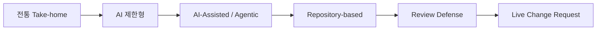
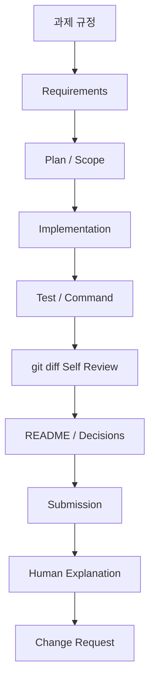
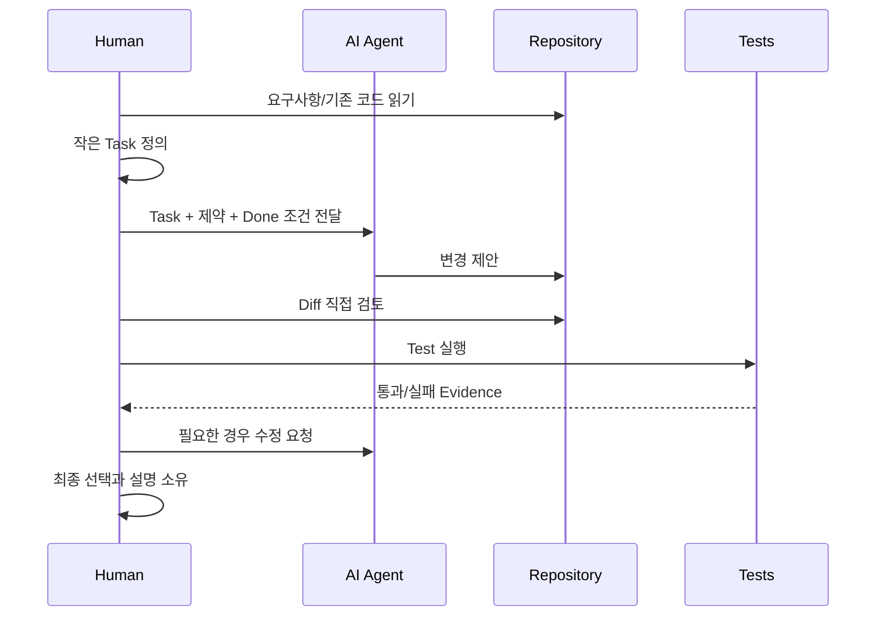

# 대기업 과제전형 Day 1 — 2026 Take-home / Agentic Assessment 전체 지도

## 오늘의 위치

- Week: **Week 1**
- Day: **Day 1 / 98**
- 주차 주제: **Take-home 2026 기본기: 요구사항·시간제한·제출 전략**
- 오늘 주제: **2026 Take-home / Agentic Assessment 전체 지도**
- 오늘 학습 목표: 전통 Take-home, AI 제한형, AI-assisted, repository-based 평가를 구분하고 평가자가 보는 Evidence를 이해한다.
- 오늘 실습: 공개 과제 3개를 읽고 평가항목을 역추적한다.
- 오늘 산출물: `assessment_landscape.md`
- 전체 과정에서의 역할: 앞으로 97일 동안 “무엇을 왜 연습하는지”를 이해하기 위한 지도 만들기

## 오늘 사용하는 고정 환경

- IDE: Cursor 3.9
- 문서: Markdown
- Git: 설치된 안정 버전 사용, 프로젝트 저장소에서 이력 관리
- Java/Spring Boot/PostgreSQL/Node/React: 오늘은 설치하지 않아도 됨. 버전은 `../../VERSION_LOCK.md` 참고

## 오늘의 평가 Mode

- Mode: **AI-Assisted 학습 모드**
- 원칙: 공개 과제를 먼저 내가 읽은 뒤, AI는 누락 검토에 사용
- 인터넷: 공개 과제 원문과 공식 문서 확인에 사용 가능
- 제출 형태: Markdown Evidence

---

# 1. 학습 목표

오늘이 끝나면 다음을 할 수 있어야 한다.

1. 전통 Take-home, No/Guarded AI, AI-Assisted/Agentic, Repository-based 평가의 차이를 자기 말로 설명할 수 있다.
2. 과제 설명에서 “코드를 만들라는 말” 뒤에 숨어 있는 평가 신호를 찾아낼 수 있다.
3. 결과물뿐 아니라 요구사항 해석, 계획, 테스트, diff, 실행 재현성, 설명 능력이 Evidence가 되는 이유를 설명할 수 있다.
4. 공개 과제 3개를 읽고 `관찰한 사실`과 `내가 추론한 평가항목`을 구분해 기록할 수 있다.
5. 앞으로 과제를 받았을 때 “바로 코딩” 대신 “정책 확인 → 요구사항 → 계획 → 구현 → 검증 → 제출 → 방어” 흐름을 떠올릴 수 있다.

---

# 2. 오늘 내용을 아주 쉽게 먼저 이해하기

Take-home 과제를 **요리 시험**이라고 생각해 보자.

예전에는 완성된 음식이 맛있는지가 가장 중요했다. 지금은 여기에 더해 다음도 볼 수 있다.

- 레시피를 제대로 읽었는가?
- 제한 시간에 중요한 요리부터 했는가?
- 주방 도구를 안전하게 사용했는가?
- AI 요리 도우미에게 무엇을 시켰는가?
- 도우미가 틀린 제안을 했을 때 알아챘는가?
- 이미 어질러진 다른 주방에 들어가 고칠 수 있는가?
- 왜 이 재료와 조리법을 선택했는지 설명할 수 있는가?
- “소금을 줄여 달라”는 마지막 변경 요청에도 대응할 수 있는가?

개발 과제도 같다. **최종 코드만 보는 시험에서, 사고 과정과 검증 능력까지 보는 시험으로 범위가 넓어졌다.**



그림을 읽는 법:

- `전통 Take-home`: 주어진 요구사항으로 작은 서비스를 만든다.
- `AI 제한형`: AI 또는 인터넷 사용 범위가 규정된다.
- `AI-Assisted / Agentic`: AI 사용 방식 자체가 평가 신호가 될 수 있다.
- `Repository-based`: 빈 프로젝트가 아니라 기존 코드를 읽고 고친다.
- `Review Defense`: 제출 후 “왜 이렇게 했나요?”에 답한다.
- `Live Change Request`: 요구사항을 즉석에서 바꾸고 안전하게 수정한다.

오늘 기억할 가장 중요한 생각은 하나다.

> **평가자는 코드 한 덩어리보다, 요구사항을 안정적으로 결과로 바꾸는 개발 과정을 본다.**

---

# 3. 이론 1 — 2026 과제전형의 네 가지 큰 형태

## 3.1 한 줄 정의

과제전형의 형태는 **어디서 시작하고, 어떤 도구를 허용하며, 무엇을 관찰하는가**에 따라 달라진다.

## 3.2 쉬운 비유

- Greenfield: 빈 레고판에서 집을 짓는다.
- AI 제한형: 설명서를 볼 수 있지만 자동 조립기는 못 쓴다.
- AI-Assisted: 자동 조립기를 써도 되지만 잘못 조립한 부분을 내가 찾아야 한다.
- Repository-based: 이미 누군가 만든 레고 도시에서 고장 난 다리만 고친다.

## 3.3 현실적인 Take-home 상황

### A. 전통 Greenfield Take-home

“상품 API를 4시간 안에 만들어 주세요.”

평가자는 보통 요구사항 충족, API 계약, 테스트, 실행법, 코드 품질을 본다.

### B. No AI / Guarded AI

“AI 생성 도구는 금지합니다.” 또는 “문서 검색은 가능하지만 코드 생성은 금지합니다.”

여기서는 **도구 정책 준수 자체가 평가 조건**이다. 평소 AI를 잘 쓰더라도 금지된 시험에서 사용하면 좋은 코드여도 실패할 수 있다.

### C. AI-Assisted / Agentic

AI helper를 써서 구현해도 되거나, 오히려 적극적으로 쓰는 과제다. 하지만 중요한 질문은 “몇 번 호출했나?”가 아니다.

```text
무엇을 맡겼는가?
왜 그 단위로 나눴는가?
무엇을 검증했는가?
무엇을 거절했는가?
최종 코드를 내가 설명할 수 있는가?
```

### D. Repository-based

이미 존재하는 repository에서 bug를 수정하거나 feature를 추가한다.

여기서는 새 프로젝트를 예쁘게 만드는 능력보다 다음이 더 중요하다.

```text
README / build / tests를 먼저 읽는가?
증상을 재현하는가?
변경 범위를 좁히는가?
기존 convention을 지키는가?
최소 patch로 회귀를 막는가?
```

## 3.4 정확한 기술적 구분

| 형태 | 시작점 | AI | 대표 작업 | 중요한 Evidence |
|---|---|---|---|---|
| Greenfield | 빈/얇은 starter | 회사 정책에 따라 다름 | 작은 서비스 구축 | 요구사항, 구조, test, README |
| Guarded | Greenfield/Repo 모두 가능 | 제한적 | 규정 안에서 구현 | 정책 준수 + 직접 구현력 |
| Agentic | Greenfield/Repo 모두 가능 | 명시적으로 허용/관찰 | 계획→AI task→검증 | plan, interaction, diff, tests, 설명 |
| Repository-based | 기존 codebase | 회사 정책에 따라 다름 | bugfix/feature/refactor | repo 이해, 최소 변경, 회귀 test |

## 3.5 왜 필요한가?

시험 종류를 잘못 판단하면 준비 방향이 틀어진다.

예를 들어 repository bugfix인데 새 아키텍처로 갈아엎으면 “코드 실력은 있어 보이지만 협업하기 어려운 사람”이라는 신호가 될 수 있다. 반대로 agentic assessment인데 AI에게 모든 것을 한 번에 시킨 뒤 설명을 못 하면 “도구는 썼지만 결과를 소유하지 못한다”는 신호가 된다.

## 3.6 이 개념이 없으면 생기는 문제

- 문제를 받자마자 새 프로젝트부터 만든다.
- AI 금지 규정을 뒤늦게 발견한다.
- 기존 테스트를 무시하고 behavior를 깨뜨린다.
- bonus 기능에 시간을 쓰고 핵심 요구사항을 놓친다.
- 최종 코드는 작동하지만 실행 방법을 평가자가 재현하지 못한다.
- 면접에서 “왜?” 질문에 답하지 못한다.

## 3.7 평가자는 왜 보는가?

실제 업무도 항상 새 프로젝트만 만드는 것이 아니다. 기존 코드, 애매한 요구사항, 도구 제약, 동료 review, 변경 요청 속에서 결과를 만들어야 한다. 과제 형태가 넓어진 이유는 이런 실제 업무 능력을 더 가까이 관찰하려는 것이다.

## 3.8 좋은 예 / 나쁜 예

좋은 예:

```text
“기존 repository 과제이므로 README와 tests부터 확인하겠습니다.
현재 실패를 재현한 뒤 최소 변경하고 regression test를 추가하겠습니다.”
```

나쁜 예:

```text
“구조가 마음에 안 들어서 전체를 Clean Architecture로 다시 만들었습니다.”
```

## 3.9 시간 제한별 적용 수준

- 2시간: 평가 형태와 금지사항을 5분 안에 확인한다.
- 8시간: 제출 규칙, test command, AI policy, repo 구조를 짧게 메모한다.
- 24시간: 계획/decision/evidence를 더 정돈하되, 문서 작성이 구현 시간을 잡아먹지 않게 한다.

## 3.10 자주 하는 실수

1. “AI 허용”을 “AI 결과를 검증하지 않아도 됨”으로 이해한다.
2. “기존 repo”를 “내 스타일로 다시 만들 기회”로 이해한다.
3. “Take-home”이면 무조건 CRUD라고 생각한다.
4. 규정 확인을 구현 뒤로 미룬다.
5. 최종 결과만 제출하면 과정은 아무도 안 본다고 가정한다.

## 3.11 면접에서 이렇게 설명한다

“과제 유형을 먼저 분류하는 이유는 최적의 구현 기술을 고르기 위해서가 아니라, 평가자가 원하는 Evidence와 변경 허용 범위를 파악하기 위해서입니다. Greenfield와 existing-repo는 같은 기능이라도 접근 순서가 다르고, AI 허용 여부는 작업 방식 자체를 바꿉니다.”

## 3.12 핵심 한 문장

> **과제 유형을 먼저 알아야 올바른 문제를 풀 수 있다.**

---

# 4. 실습예제 1 — 8개의 과제 문장을 분류해 보기

## 실습 목표

과제 설명의 몇 줄만 보고도 평가 형태를 빠르게 분류한다.

## 과제 상황

평가 안내에 다음 문장이 하나씩 있다고 가정한다.

1. “Starter repository에 TODO가 있습니다. 기존 테스트를 통과시키세요.”
2. “AI coding assistant 사용은 금지합니다.”
3. “AI assistant 사용을 허용하며, 사용 내역을 제출하세요.”
4. “새로운 REST API를 처음부터 구현하세요.”
5. “기존 결제 모듈에서 중복 청구 bug를 수정하세요.”
6. “구현 후 30분 동안 reviewer와 코드를 설명합니다.”
7. “제출 후 pagination 요구사항을 cursor 방식으로 변경합니다.”
8. “인터넷 문서 검색은 가능하지만 생성형 AI는 허용하지 않습니다.”

## 평가자가 보는 것

정답 라벨 암기가 아니라, **각 문장이 작업 전략을 어떻게 바꾸는지** 설명하는지 본다.

## 내가 먼저 생각할 것

각 문장 옆에 다음 두 줄을 쓴다.

```text
형태:
내 첫 행동:
```

예:

```text
1번
형태: Repository-based
내 첫 행동: TODO 코딩이 아니라 README → build file → tests 순서로 읽는다.
```

## 예상 결과

- 2, 8: AI 제한형
- 3: AI-Assisted
- 1, 5: Repository-based
- 4: Greenfield
- 6: Review Defense
- 7: Live Change Request

실제 평가에서는 여러 형태가 동시에 섞일 수 있다. 예를 들어 “Repository-based + AI-Assisted + Review Defense”가 가능하다.

## Self Review

- [ ] 분류 이름만 적지 않고 첫 행동까지 적었는가?
- [ ] AI 허용 여부와 repository 형태를 별개의 축으로 보았는가?
- [ ] 제출 후 review/change request까지 평가 범위라고 이해했는가?

---

# 5. 이론 2 — 평가자가 찾는 것은 ‘코드’가 아니라 Evidence다

## 5.1 한 줄 정의

**Evidence(증거)**란 “내가 요구사항을 제대로 이해하고 구현했으며, 실제로 동작하고, 선택을 설명할 수 있다”는 것을 평가자가 확인할 수 있게 만드는 자료다.

## 5.2 쉬운 비유

수학 시험에서 답만 `42`라고 적는 것과 풀이 과정을 적는 것은 다르다. 개발 과제의 Evidence는 풀이 과정과 검산에 가깝다.

## 5.3 전체 Evidence 흐름



화살표의 의미:

- 규정을 몰라서는 요구사항을 안전하게 해석할 수 없다.
- 요구사항이 있어야 구현 범위를 정할 수 있다.
- 구현 뒤에는 “그럴듯함”이 아니라 테스트와 명령으로 검증한다.
- diff를 읽어 요구사항 밖 변경과 실수를 제거한다.
- README/Decision은 평가자가 재현하고 이해할 수 있게 만든다.
- 마지막에는 사람이 자신의 코드를 설명하고 바꿀 수 있어야 한다.

## 5.4 대표 Evidence

| Evidence | 무엇을 증명하는가? | 예시 |
|---|---|---|
| Requirements | 문제를 정확히 읽었는가 | 기능/제약/모호함 분리 |
| Plan | 시간을 어떻게 쓸 것인가 | Must 우선 작업 순서 |
| Test | 핵심 동작을 검증했는가 | unit/API/integration test |
| DB constraint | 데이터 무결성을 어디서 보장하는가 | UNIQUE, FK |
| Command | 다른 사람도 실행 가능한가 | `./gradlew test` |
| Diff | 불필요한 변경을 통제했는가 | `git diff` review |
| README | clone 후 빠르게 재현 가능한가 | Quick Start/Test |
| AI usage log | AI 결과를 소유했는가 | accept/reject/verification |
| Oral defense | 설계를 이해하는가 | trade-off 설명 |

## 5.5 왜 필요한가?

평가자는 네 컴퓨터의 상태를 모른다. “제 컴퓨터에서는 됐어요”는 Evidence가 아니다. 또한 코드가 길고 복잡하다고 요구사항을 잘 만족했다는 뜻도 아니다.

## 5.6 Evidence가 없으면 생기는 문제

- 테스트가 없어 regression 여부를 모른다.
- README 명령이 틀려 실행을 못 한다.
- AI가 만든 API가 실제로 없는지 모른다.
- race condition이 있지만 정상 경로만 보고 놓친다.
- 면접관이 요구사항과 코드의 연결을 찾느라 시간을 쓴다.

## 5.7 좋은 예 / 나쁜 예

좋은 예:

```text
Requirement: 같은 사용자/시간대 중복 예약 금지
Implementation: DB UNIQUE(user_id, slot_id)
Verification: concurrent integration test
Known limitation: 분산 idempotency key는 시간상 제외
```

나쁜 예:

```text
“중복은 서비스 코드에서 체크했으니 아마 괜찮습니다.”
```

## 5.8 Trade-off

Evidence를 많이 만든다고 무조건 좋지 않다. 2시간 과제에서 40페이지 설계 문서를 만들면 오히려 핵심 구현을 놓칠 수 있다. **위험이 큰 부분에 최소한의 강한 Evidence**를 남기는 것이 목표다.

## 5.9 시간 제한별 수준

- 2시간: 핵심 동작 + 핵심 test + README run/test 명령.
- 8시간: 위에 DB integrity, integration test, 간단 CI까지 고려.
- 24시간: E2E, 관측성, 성능 근거, 더 탄탄한 decision 기록을 추가할 수 있음.

## 5.10 면접에서 이렇게 설명한다

“저는 기능 개수보다 검증 가능한 Evidence를 우선합니다. 예를 들어 중복 방지 요구사항이면 서비스 코드만 보여주는 대신 DB 제약과 관련 테스트를 같이 보여줘서 보장 수준을 명확하게 합니다.”

## 5.11 핵심 한 문장

> **완료는 ‘코드가 있다’가 아니라 ‘요구사항을 충족했다는 증거가 있다’다.**

---

# 6. 실습예제 2 — Evidence Ledger 만들기

## 실습 목표

과제 설명 한 문장을 “평가 가능한 Evidence”로 바꾼다.

## 과제 상황

가상의 요구사항:

```text
사용자는 상품을 생성하고 목록에서 볼 수 있어야 한다.
프로젝트는 다른 개발자가 쉽게 실행할 수 있어야 한다.
```

## 내가 먼저 생각할 것

`기능`과 `검증 증거`를 분리한다.

```md
| Requirement | Evidence 후보 |
|---|---|
| 상품 생성 | API test 또는 실행 가능한 curl 예시 |
| 상품 목록 | list API test |
| 다른 개발자가 실행 | README Quick Start + clean environment 검증 |
```

여기서 아직 Spring이나 React를 구현할 필요가 없다. 오늘은 “어떤 Evidence가 필요할지” 사고하는 연습이다.

## 실패 예시

```text
Evidence: 코드가 깔끔하다.
```

왜 실패하는가?

“깔끔하다”는 주관적이고, 상품 생성이 실제로 되는지 증명하지 않는다.

## 수정

```text
Evidence: 상품 생성 요청이 201을 반환하고, 저장된 상품을 목록 조회에서 확인하는 테스트.
```

이제 검증할 수 있다.

---

# 7. 이론 3 — Agentic Coding에서 중요한 것은 ‘위임’이 아니라 ‘소유’다

## 7.1 한 줄 정의

Agentic Coding은 AI가 여러 단계 작업을 수행하도록 위임할 수 있는 방식이지만, **요구사항 해석·검증·최종 책임은 사람에게 남는다.**

## 7.2 쉬운 비유

AI를 신입 개발자라고 생각해 보자. 빠르게 코드를 쓸 수 있지만 프로젝트 맥락을 잘못 이해하거나 존재하지 않는 API를 자신 있게 제안할 수 있다. 팀 리더는 “써 줘”로 끝내지 않고 작업을 나누고, diff를 보고, 테스트하고, 잘못된 부분을 거절한다.

## 7.3 좋은 Agentic 흐름



핵심은 AI와 사람 사이에 항상 `Diff`, `Test`, `설명`이 있다는 점이다.

## 7.4 나쁜 흐름

```text
과제 전체 복사
→ “완성해줘”
→ AI가 수십 파일 수정
→ 실행 안 해봄
→ 제출
```

문제:

- scope가 커져 review가 어려움
- AI가 requirement를 누락해도 발견하기 어려움
- dependency hallucination 가능
- 왜 그런 설계를 했는지 설명하기 어려움
- live change request에서 코드 위치를 못 찾을 수 있음

## 7.5 좋은 Task의 크기

나쁜 요청:

```text
“예약 시스템 다 만들어줘.”
```

더 좋은 요청:

```text
“현재 repository의 예약 생성 흐름만 읽고,
중복 시간대 예약을 막기 위해 변경이 필요한 파일 후보를 제안해줘.
아직 코드는 수정하지 말고, 기존 테스트와 DB 제약을 먼저 확인해줘.”
```

더 작고 검증 가능하다.

## 7.6 AI가 틀릴 수 있는 세 지점

1. **Requirement**: 요청 자체를 오해한다.
2. **API/package**: 존재하지 않거나 버전이 다른 API를 쓴다.
3. **Logic**: 정상 케이스는 맞지만 동시성/경계값에서 깨진다.

그래서 AI 결과는 공식 문서, 실제 build/test, diff로 검증한다.

## 7.7 시간 제한별 적용

- 2시간: 큰 prompt보다 작은 핵심 task 2~4개. review 시간이 반드시 남아야 함.
- 8시간: plan과 test 단위를 나누고 AI_USAGE를 짧게 기록할 수 있음.
- 24시간: architecture/data flow/edge cases도 검토하되, AI 대화 로그 자체를 과도하게 문서화하지 않음.

## 7.8 면접에서 이렇게 설명한다

“AI는 throughput을 높이는 도구로 사용하지만, task를 작게 쪼개고 diff와 test를 통해 결과를 검증합니다. 특히 새 dependency나 public API는 공식 출처를 확인하고, 제가 설명하지 못하는 코드는 그대로 제출하지 않습니다.”

## 7.9 핵심 한 문장

> **AI에게 일을 맡길 수는 있어도, 판단과 책임까지 맡길 수는 없다.**

---

# 8. 실습예제 3 — 같은 요구를 좋은 AI Task로 바꾸기

## 실습 목표

“전체 앱을 만들어줘”를 검증 가능한 작은 요청으로 바꾼다.

## 과제 상황

요구사항:

```text
사용자는 상품을 만들고, 수정하고, 삭제할 수 있다.
```

## 나쁜 Task

```text
Spring Boot로 상품 CRUD 완성해줘. 테스트랑 문서도 다 해줘.
```

## 개선 과정

### Task 1 — 요구사항 누락 검토

```text
아직 코드를 쓰지 말고 상품 CRUD 요구사항에서
입력 validation, 실패 상태, ID 존재 여부와 관련해
확인해야 할 모호한 점만 목록으로 제시해줘.
```

### Task 2 — 코드 범위 계획

```text
현재 repository 구조를 기준으로 상품 생성 기능에 필요한
최소 파일만 제안해줘. 새 dependency는 추가하지 말아줘.
```

### Task 3 — 구현

```text
상품 생성 한 기능만 구현해줘.
Done 조건은 정상 생성 테스트와 invalid request 테스트가 통과하는 것이다.
```

### Task 4 — 검증

```text
현재 git diff에서 요구사항 밖 변경, validation 누락,
테스트가 검증하지 못하는 부분을 리뷰해줘.
코드는 수정하지 말고 위험만 알려줘.
```

이렇게 하면 사람이 각 단계에서 멈추고 검증할 수 있다.

---

# 9. 이론 4 — 공개 과제에서 평가 기준을 역추적하는 법

## 9.1 한 줄 정의

**평가항목 역추적**은 과제 README의 요구사항·제약·제출 형식을 보고 “왜 이런 조건을 넣었을까?”를 질문해 평가자가 보고 싶은 능력을 추론하는 것이다.

## 9.2 사실과 추론을 분리하라

가장 중요하다.

```text
관찰한 사실: README에 기존 test를 깨뜨리지 말라고 쓰여 있다.
추론: regression safety와 기존 behavior 이해를 중요하게 볼 가능성이 높다.
```

추론을 사실처럼 쓰면 안 된다.

## 9.3 역추적 질문 7개

공개 과제를 읽을 때 다음만 먼저 찾는다.

1. 시작점은 빈 프로젝트인가, 기존 repository인가?
2. 제한 시간은 있는가?
3. AI/인터넷 정책은 무엇인가?
4. 반드시 구현할 behavior는 무엇인가?
5. test/build/run에 대한 요구가 있는가?
6. README/PR/write-up 같은 제출 Evidence를 요구하는가?
7. “production-ready”, “trade-off”, “assumption” 같은 설명을 요구하는가?

## 9.4 평가 신호 예시

| README 표현 | 가능한 평가 신호 |
|---|---|
| “existing tests must pass” | 회귀 방지, 기존 코드 존중 |
| “AI is allowed, but test your work” | AI 검증력, 결과 소유 |
| “submit a PR” | diff story, 협업 방식 |
| “4–8 hours” | scope/timebox 판단 |
| “document assumptions” | 모호함 관리, 의사결정 설명 |
| “do not fork publicly” | 지시 준수, 채용 과제 윤리 |

## 9.5 핵심 한 문장

> **과제의 제약은 귀찮은 부가조건이 아니라 평가 기준의 힌트다.**

---

# 10. 오늘의 통합 실습 — 공개 과제 3개에서 평가 지도 만들기

자세한 진행표는 `practice.md`를 따른다.

오늘 읽을 공개 자료:

1. Simplify Backend Take-home  
   https://github.com/SimplifyJobs/backend-take-home
2. FeedMe SE Take-home Assignment  
   https://github.com/feedmepos/se-take-home-assignment
3. Ello 2025 Full-stack Take-home  
   https://github.com/ElloTechnology/2025-full-stack-take-home

이 세 자료는 이 커리큘럼에서 **기업 first-party 공개 Take-home/assignment** 연습 소스로 분류한다. 원문을 복제하지 않고, 필요한 조건만 직접 읽고 학습용 분석을 작성한다.

## 통합 실습 순서

```text
각 원문을 10~15분 Blind Read
→ 사실만 메모
→ 평가 신호 추론
→ 필요한 Evidence 역추적
→ 세 과제 공통점/차이점 비교
→ assessment_landscape.md 작성
→ 마지막에 AI로 누락만 검토
```

## 완료 기준

각 과제마다 최소 다음이 있어야 한다.

- Source 성격
- 과제 형태
- AI/도구 정책
- 시간 또는 scope 제약
- 직접 관찰한 요구
- 추론한 평가 신호 3개 이상
- 후보자가 남길 Evidence 3개 이상
- 가장 위험한 실수 2개 이상

---

# 11. 실행 / 테스트 / 검증

오늘은 애플리케이션 build가 없으므로 “테스트”는 문서 품질을 검증하는 방식으로 한다.

## 11.1 파일 존재 확인

프로젝트 루트에서:

```bash
find lessons/day001 -maxdepth 1 -type f -print
```

기대 파일:

```text
lessons/day001/lecture.md
lessons/day001/practice.md
lessons/day001/exercises.md
lessons/day001/review.md
lessons/day001/assessment_landscape.md
```

## 11.2 Mermaid 확인

Cursor에서 `lecture.md`를 열고 Markdown Preview로 다이어그램이 읽기 쉬운지 확인한다.

## 11.3 산출물 구조 확인

```bash
grep -n "Simplify\|FeedMe\|Ello" lessons/day001/assessment_landscape.md
```

세 공개 과제가 모두 나타나야 한다.

## 11.4 사실/추론 분리 확인

`assessment_landscape.md`에서 “공개 source에서 직접 확인한 조건”과 “평가 신호 추론”이 같은 문장으로 뒤섞이지 않았는지 읽는다.

## Observed vs Expected

이 강의자료 생성 시점에 확인한 것은 **파일 생성과 문서 구조**다. 실제 학습자가 세 외부 repository를 읽고 자기 판단으로 수정하는 단계는 사용자가 직접 수행해야 한다. 예시 분석을 그대로 정답으로 외우지 않는다.

---

# 12. Take-home 평가자 관점 체크

평가자가 이 결과물을 봤을 때 무엇을 확인할까?

```text
“최신 기술 이름을 많이 아는가?”
보조적이다.

“과제 유형과 제약을 읽고 작업 전략을 바꿀 수 있는가?”
중요하다.

“검증 가능한 Evidence를 만들 수 있는가?”
매우 중요하다.

“AI를 사용했을 때도 결과를 자기 것으로 설명할 수 있는가?”
AI-assisted 평가에서는 특히 중요하다.
```

오늘은 코드 한 줄보다 `assessment_landscape.md`의 사고 구조가 Evidence다.

---

# 13. 자주 발생하는 실수 / 오류

## 실수 1 — 과제 제목만 보고 CRUD 난이도를 판단함

- 증상: README를 대충 읽고 바로 framework setup 시작
- 원인: “코딩 문제 = 구현량”이라고 생각함
- 확인: 제약/제출/AI policy를 메모하지 않았는지 확인
- 수정: 구현 전에 5~10분 평가 형태를 분류
- 예방: `정책 → 요구사항 → Evidence` 세 줄을 먼저 작성

## 실수 2 — 사실과 추론을 섞음

- 증상: “이 회사는 반드시 테스트 커버리지 90%를 본다”처럼 원문에 없는 말을 단정
- 원인: 평가 신호 추론을 사실로 착각
- 확인: 각 주장에 원문 근거가 있는지 되묻기
- 수정: `Observed`와 `Inferred` 열을 분리
- 예방: “원문에 적힘 / 내가 추론함” 태그 사용

## 실수 3 — AI 허용 = 자동완성 답안 제출이라고 생각함

- 증상: 큰 prompt 한 번으로 전체 구현
- 원인: 속도를 검증보다 우선
- 확인: diff를 직접 설명할 수 있는지 질문
- 수정: task를 작게 나누고 test/diff를 사이에 넣음
- 예방: `AI_POLICY.md` 체크리스트 사용

## 실수 4 — Repository 문제에서 rewrite부터 시작함

- 증상: 기존 test와 convention을 보지 않고 새 구조 생성
- 원인: greenfield 습관
- 확인: 첫 commit이 대규모 이동/삭제인지 확인
- 수정: README → build → tests → relevant code 순으로 다시 읽음
- 예방: “최소 patch”를 기본 가설로 둠

## 실수 5 — 문서가 많으면 Evidence가 강해진다고 생각함

- 증상: 2시간 과제에서 구현보다 문서가 길어짐
- 원인: 문서 자체를 목적화
- 확인: 각 문서가 어떤 위험을 줄이는지 설명할 수 있는지 확인
- 수정: 핵심 run/test/decision만 남김
- 예방: 문서도 timebox 안에서 작성

---

# 14. 강의요약

## 오늘 배운 핵심 5가지

1. 2026형 과제전형은 Greenfield뿐 아니라 AI 제한형, Agentic, Repository-based, Review/Change Request까지 넓어졌다.
2. 과제 유형을 먼저 분류해야 읽는 순서, 구현 방식, AI 사용 방식이 맞아진다.
3. 평가자는 최종 코드뿐 아니라 요구사항, 계획, 테스트, diff, 실행 재현성, 설명 같은 Evidence를 본다.
4. AI는 빠른 협업 도구지만, diff와 test를 통해 사람이 결과를 소유해야 한다.
5. 공개 과제의 제약·제출 형식은 평가 기준을 역추적할 수 있는 중요한 힌트다.

## 오늘 완성한 것

- `VERSION_LOCK.md`
- `PROJECT_RULES.md`
- `AI_POLICY.md`
- `lessons/day001/lecture.md`
- `lessons/day001/practice.md`
- `lessons/day001/exercises.md`
- `lessons/day001/review.md`
- `lessons/day001/assessment_landscape.md`

## 오늘의 평가 Evidence

- [x] 공식 Stable/LTS 기준 Version Lock
- [x] 평가 정책 기본 문서
- [x] 공개 과제 3종 평가 지도
- [x] 사실과 추론을 분리한 분석 Template
- [x] Day 1 Self Review checklist

## 오늘의 핵심 Trade-off

Day 1에 모든 개발 도구를 설치하면 “준비했다”는 느낌은 들지만 본래 목표인 평가 구조 이해를 놓칠 수 있다. 오늘은 기술 설치를 최소화하고, 앞으로 어떤 Evidence를 왜 만들어야 하는지 지도부터 고정한다.

## 스스로 설명할 수 있어야 하는 것

1. Greenfield와 repository-based 과제에서 첫 15분이 왜 달라야 하는가?
2. AI 허용 과제에서도 왜 diff와 test가 필요한가?
3. “코드가 동작한다”와 “평가 가능한 Evidence가 있다”의 차이는 무엇인가?
4. 공개 과제의 제약에서 평가 기준을 어떻게 추론하는가?
5. 실제 공고의 AI 정책이 이 학습용 `AI_POLICY.md`보다 우선하는 이유는 무엇인가?

---

# 15. 핵심 용어

| 용어 | 쉬운 뜻 | 정확한 의미 | 과제에서 왜 중요한가 |
|---|---|---|---|
| Take-home | 집에서 푸는 개발 과제 | 제한 시간/규정 아래 제출물을 만드는 채용 평가 | 결과물과 작업 판단을 함께 평가 |
| Greenfield | 빈 땅에서 시작 | 기존 codebase 제약이 적은 신규 구현 | 구조·계약·scope 판단을 봄 |
| Repository-based | 기존 코드에서 고치기 | 기존 repository의 bugfix/feature/refactor 평가 | 읽기, 영향 분석, 최소 변경이 중요 |
| Agentic Coding | AI에게 여러 단계 일을 맡김 | agent가 탐색·수정·실행을 보조하는 개발 방식 | 위임보다 검증과 소유가 중요 |
| Evidence | 했다는 증거 | 요구사항 충족을 검증 가능한 artifact/결과로 남긴 것 | 평가자가 신뢰할 근거가 됨 |
| Diff | 무엇이 바뀌었는지 | 이전 상태와 현재 변경점의 비교 | AI/사람 변경을 self-review하는 핵심 |
| Regression | 고친 뒤 다른 게 깨짐 | 기존 동작이 새 변경으로 손상되는 현상 | repo 과제에서 기존 test 보존과 연결 |
| Timebox | 시간을 미리 칸막이 | 작업별 최대 시간을 제한해 scope를 통제 | bonus 때문에 core를 놓치는 것을 방지 |
| Assumption | 애매할 때 둔 가정 | 확인 불가한 요구를 합리적으로 명시한 결정 | 숨은 해석 차이를 드러냄 |
| Review Defense | 제출 후 설명 | 설계/코드/선택을 사람이 질의응답으로 방어 | AI 없이도 이해하는지 확인 |

---

# 16. 초급 연습문제 5개

1. Greenfield Take-home과 Repository-based Assessment의 가장 큰 시작점 차이를 한 문장으로 설명하라.
2. “AI 사용 가능”이라는 문장을 봤을 때 바로 전체 과제를 AI에 맡기면 안 되는 이유를 두 가지 적어라.
3. `Evidence`를 쉬운 말로 정의하고, 코드 이외의 Evidence를 세 가지 적어라.
4. “기존 테스트를 깨뜨리지 마세요”라는 조건에서 직접 관찰한 사실과 추론 가능한 평가 신호를 각각 한 줄로 써라.
5. 다음 중 Day 1의 핵심 산출물은 무엇인가? `ProductController.java`, `assessment_landscape.md`, `docker-compose.yml` 중 하나를 고르고 이유를 써라.

# 17. 중급 연습문제 5개

1. “기존 repository에 기능을 하나 추가하고 PR 형태로 제출, AI 사용 가능”이라는 과제를 `평가 형태 / 첫 행동 / 필요한 Evidence` 세 항목으로 분석하라.
2. 같은 기능 요구사항이라도 2시간 과제와 24시간 과제의 Evidence 수준이 어떻게 달라져야 하는지 비교하라.
3. “코드 품질을 봅니다”라는 모호한 문구를 평가 가능한 Evidence 후보 세 가지로 바꾸어라.
4. AI에게 “예약 시스템을 전부 만들어줘”라고 요청하는 대신 검증 가능한 task 세 개로 분해하라.
5. 공개 과제 README에서 사실과 추론이 섞이지 않도록 사용할 수 있는 Markdown 표 구조를 설계하라.

# 18. 고급 연습문제 5개

1. 기존 결제 repository bugfix 과제에서 첫 30분 동안 수행할 작업 순서를 설계하고, 각 단계가 어떤 위험을 줄이는지 설명하라.
2. AI agent가 18개 파일을 한 번에 수정했다. 기능은 겉보기엔 동작한다. 제출 전 어떤 순서로 검증할지 Evidence 중심으로 설계하라.
3. 과제 공고가 “AI 사용은 허용하지만, 최종 면접에서 모든 코드를 설명해야 함”이라고 한다. 이 조건이 task decomposition 전략을 어떻게 바꾸는지 설명하라.
4. “production-ready를 고려하세요”라는 문구가 있는 8시간 과제에서 과설계를 피하면서 보여줄 Evidence를 5개 이내로 선정하고 우선순위를 설명하라.
5. 동일한 요구사항이 Greenfield와 Repository-based로 각각 출제되었다고 가정하고, architecture 선택 자유도·test 전략·diff 크기·문서 방식이 어떻게 달라지는지 비교하라.

---

# 19. 오늘의 산출물

필수:

```text
lessons/day001/assessment_landscape.md
```

초기 환경 산출물:

```text
VERSION_LOCK.md
PROJECT_RULES.md
AI_POLICY.md
```

강의 파일:

```text
lessons/day001/lecture.md
lessons/day001/practice.md
lessons/day001/exercises.md
lessons/day001/review.md
```

---

# 20. 제출/검증 체크리스트

- [ ] Day 1과 Week 1의 주제를 정확히 이해했다.
- [ ] 네 가지 평가 형태를 예시와 함께 설명할 수 있다.
- [ ] 실제 시험 정책이 학습용 AI 정책보다 우선함을 이해했다.
- [ ] 공개 과제 3개를 직접 열어보았다.
- [ ] 원문 전체를 복제하지 않았다.
- [ ] 관찰한 사실과 평가 신호 추론을 분리했다.
- [ ] 각 공개 과제에 필요한 Evidence를 3개 이상 적었다.
- [ ] `VERSION_LOCK.md`에서 Preview/Beta를 기본값으로 쓰지 않았다.
- [ ] Cursor Markdown Preview로 Mermaid를 확인했다.
- [ ] 오늘은 애플리케이션 build가 없다는 점을 “미완성”으로 착각하지 않는다.

---

# 21. 실무/면접 질문

1. “AI가 허용된 과제라면 최대한 많이 쓰는 것이 좋은가요?”
2. “기존 repository 과제에서 구조가 마음에 들지 않으면 리팩토링부터 해도 되나요?”
3. “테스트를 많이 쓰는 것과 좋은 Evidence를 남기는 것은 같은가요?”
4. “2시간 Take-home에서 README에 어느 정도 시간을 써야 하나요?”
5. “AI가 만든 코드가 동작하면 왜 공식 문서를 또 확인해야 하나요?”
6. “최종 구현이 같아도 평가 과정이 다르면 점수가 달라질 수 있는 이유는?”
7. “새 기능보다 clean clone이 중요한 순간은 언제인가요?”

---

# 22. 다음 Day 연결

Day 1은 “시험 전체 지도”를 만들었다. Day 2부터는 실제 과제를 받았다고 가정하고 **요구사항을 Functional / Non-functional / Constraint / Ambiguity / Assumption으로 분해**한다.

오늘 `assessment_landscape.md`를 만들며 느낀 가장 큰 어려움이 “README에 적힌 문장을 어떻게 정확한 요구사항으로 바꾸지?”였다면 정상이다. 바로 그 문제를 Day 2에서 다룬다.
