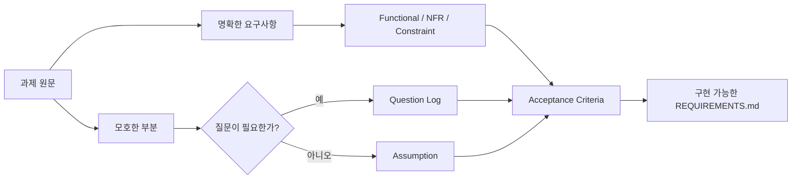
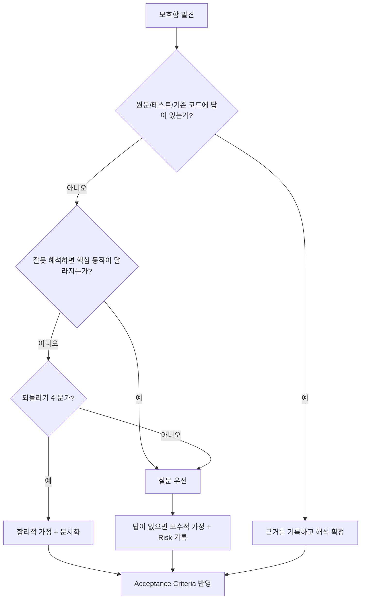
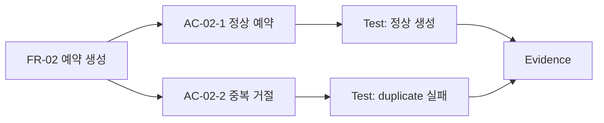

# 대기업 과제전형 Day 2 — 요구사항 추출과 Ambiguity Log

## 오늘의 위치

- Week: **Week 1**
- Day: **Day 2 / 98**
- 주차 주제: **Take-home 2026 기본기: 요구사항·시간제한·제출 전략**
- 오늘 주제: **요구사항 추출과 Ambiguity Log**
- 오늘 학습 목표: 기능/제약/비기능/모호함을 분리하고 질문할 것과 가정할 것을 구분한다.
- 오늘 실습: 모호한 예약 과제를 `REQUIREMENTS.md`로 재작성한다.
- 오늘 산출물: `docs/requirements/REQUIREMENTS.md`
- 전체 과정에서의 역할: Day 3의 Must/Should/Could와 Timeboxing을 하기 전에 **무엇을 만들어야 하는지 정확히 고정하는 단계**

## 오늘 사용하는 고정 환경

- IDE: Cursor 3.9
- 문서: Markdown
- 버전 정책: `../../VERSION_LOCK.md` 재사용, 오늘 새 기술 추가 없음
- Java/Spring Boot/PostgreSQL/Node/React: 오늘은 사용하지 않음

## 오늘의 평가 Mode

- Mode: **AI-Assisted 학습 모드**
- 권장 순서: 내가 먼저 요구사항 분해 → AI에 누락 검토 요청 → 원문과 대조 → 최종 채택
- 인터넷: 오늘 모의 예약 과제에는 필요 없음
- 제출 형태: 요구사항 Evidence 문서

---

# 1. 학습 목표

오늘이 끝나면 다음을 할 수 있어야 한다.

1. 과제 문장을 `Functional / Non-functional / Constraint / Optional / Ambiguity / Assumption / Acceptance Criteria / Out of Scope`로 분류할 수 있다.
2. “원문에 쓰인 사실”과 “내가 구현을 위해 정한 가정”을 구분해 기록할 수 있다.
3. 모호한 문장을 발견했을 때 무조건 질문하지 않고, **질문할 것과 안전하게 가정할 것**을 나눌 수 있다.
4. 요구사항마다 식별자(`FR-01`, `NFR-01` 등)를 붙여 구현·테스트·README와 추적 가능하게 만들 수 있다.
5. 모호한 예약 과제를 코딩 가능한 수준의 `REQUIREMENTS.md`로 재작성할 수 있다.
6. 평가자에게 “왜 이런 해석을 했는지”를 근거와 함께 설명할 수 있다.

---

# 2. 오늘 내용을 아주 쉽게 먼저 이해하기

과제 문서는 **친구가 말로 부탁한 심부름**과 비슷하다.

친구가 이렇게 말한다고 해보자.

> “내일 오후에 카페 예약 좀 해줘. 적당한 시간으로 하고, 너무 늦지는 않게.”

이 문장만 듣고 바로 예약 버튼을 누르면 문제가 생긴다.

- 몇 명인가?
- 오후는 몇 시부터 몇 시까지인가?
- “너무 늦지 않게”는 몇 시인가?
- 예약이 꽉 차면 다른 시간도 괜찮은가?
- 카페는 어느 지점인가?

개발 과제도 같다. 문장에는 **명확한 사실**과 **빈칸**이 섞여 있다. 좋은 지원자는 빈칸을 감추지 않는다.



그림을 읽는 법:

- 원문에서 먼저 **명확한 요구사항**과 **모호한 부분**을 분리한다.
- 명확한 요구사항은 기능, 비기능, 제약으로 정리한다.
- 모호한 부분은 모두 질문하지 않는다. 점수나 핵심 동작을 바꾸는 것은 질문하고, 위험이 낮고 되돌리기 쉬운 것은 가정할 수 있다.
- 마지막에는 “완료 여부를 테스트할 수 있는 문장”인 Acceptance Criteria로 바꾼다.

오늘의 핵심 문장:

> **요구사항 분석은 코딩 전에 문서를 예쁘게 만드는 작업이 아니라, 잘못된 문제를 푸는 위험을 줄이는 작업이다.**

---

# 3. 이론 1 — 요구사항을 종류별로 분리하기

## 3.1 한 줄 정의

**Requirement Extraction(요구사항 추출)**은 과제 원문의 문장을 개발자가 구현하고 검증할 수 있는 단위로 분해하는 작업이다.

## 3.2 쉬운 비유

학교 준비물을 챙긴다고 생각해 보자.

- “연필을 가져오세요” → 해야 할 일
- “검은색 연필만 됩니다” → 제약
- “가방은 가벼워야 합니다” → 품질 조건
- “지우개가 있으면 좋습니다” → 선택사항
- “적당한 크기” → 모호함

모두 같은 문장처럼 보여도 성격이 다르다.

## 3.3 현실적인 Take-home 상황

예약 서비스 과제에 다음 문장이 있다고 하자.

> 사용자는 가능한 시간을 조회하고 예약할 수 있어야 합니다. 예약 시간은 30분 단위입니다. 같은 시간에는 한 명만 예약할 수 있어야 합니다. 서비스는 간단하고 사용하기 쉬워야 합니다. 시간이 남으면 예약 취소도 구현해 주세요.

분해하면 다음처럼 된다.

| 원문 | 분류 | 이유 |
|---|---|---|
| 가능한 시간을 조회 | Functional | 사용자가 할 수 있어야 하는 기능 |
| 예약 생성 | Functional | 핵심 상태 변경 기능 |
| 30분 단위 | Constraint | 구현 선택을 제한하는 규칙 |
| 같은 시간 한 명 | Functional + Data rule | 중복 예약을 막아야 하는 비즈니스 규칙 |
| 간단하고 사용하기 쉬움 | Ambiguity/NFR 후보 | 측정 기준이 없음 |
| 시간이 남으면 취소 | Optional | 핵심 완료 조건이 아님 |

## 3.4 정확한 기술 정의

### Functional Requirement

시스템이 **무엇을 해야 하는지**를 나타낸다.

예:

```text
FR-01 사용자는 예약 가능한 시간 목록을 조회할 수 있다.
FR-02 사용자는 하나의 시간 슬롯을 예약할 수 있다.
```

### Non-functional Requirement

시스템이 **어떤 품질로 동작해야 하는지**를 나타낸다.

예:

```text
NFR-01 오류 응답은 일관된 형식을 사용한다.
NFR-02 실행 방법은 README만으로 재현 가능해야 한다.
```

“빠르게”, “안전하게”, “사용하기 쉽게” 같은 말은 그대로는 검증하기 어려우므로 수치나 관찰 가능한 조건이 필요하다.

### Constraint

설계 선택을 제한하는 조건이다.

예:

```text
CON-01 예약 슬롯은 30분 단위다.
CON-02 데이터는 PostgreSQL을 사용한다.
CON-03 제출은 4시간 이내다.
```

### Optional

없어도 핵심 제출이 성립하지만 시간이 남으면 추가할 수 있는 항목이다.

### Ambiguity

여러 해석이 가능해서 구현 결과가 달라질 수 있는 빈칸이다.

### Assumption

모호함을 해결하기 위해 **내가 임시로 채택한 해석**이다. 원문 사실이 아니다.

### Acceptance Criteria

구현이 끝났는지 **검증 가능한 형태**로 표현한 조건이다.

### Out of Scope

이번 제출에서 하지 않는다고 명시적으로 정한 범위다.

## 3.5 왜 필요한가?

과제전형은 제한 시간이 짧다. 잘못 이해한 기능을 2시간 구현한 뒤 요구사항을 다시 읽으면 복구가 어렵다. 분류를 먼저 하면 “필수”, “제약”, “질문해야 할 빈칸”이 빨리 보인다.

## 3.6 이 개념이 없으면 어떤 문제가 생기는가?

- Optional을 Must처럼 구현해 핵심 기능이 미완성된다.
- “빠르게”라는 말을 보고 Redis부터 넣는다.
- 30분 슬롯 규칙을 DB에 반영하지 않는다.
- 원문에 없는 회원가입을 당연히 필요하다고 생각해 추가한다.
- 평가자와 다른 시간대/중복 규칙으로 구현한다.

## 3.7 평가자는 왜 보는가?

실제 업무에서 개발자는 완벽한 명세만 받지 않는다. 제품 요구, 디자이너 설명, 기존 동작, 운영 제약을 조합해 실행 가능한 정의를 만들어야 한다. 과제전형에서 요구사항 추출은 이 능력을 압축해서 보여준다.

## 3.8 좋은 예

```md
## Functional Requirements
- FR-01: 사용자는 날짜별 예약 가능한 슬롯을 조회할 수 있다.
- FR-02: 사용자는 가능한 슬롯 하나를 예약할 수 있다.

## Constraints
- CON-01: 슬롯 길이는 30분이다.

## Ambiguities
- AMB-01: 동일 사용자의 하루 예약 횟수 제한이 명시되어 있지 않다.
```

## 3.9 나쁜 예

```md
- 예약 시스템을 잘 만든다.
- UX를 좋게 한다.
- 성능을 빠르게 한다.
- 보안을 신경 쓴다.
```

문제점:

- 테스트할 수 없다.
- 무엇이 필수인지 모른다.
- 구현 범위가 끝없이 커진다.
- 평가자와 해석이 일치하는지 확인할 수 없다.

## 3.10 작은 예시

원문:

```text
고객은 미래 시간만 예약할 수 있습니다.
```

분해:

```md
- FR-03: 고객은 현재 시각 이후의 슬롯만 예약할 수 있다.
- AMB-02: “현재 시각”의 기준 timezone이 명시되지 않았다.
- Q-01: 평가 환경에서 사용할 timezone이 정해져 있는가?
```

## 3.11 줄 단위 설명

- `FR-03`: 원문에 직접 있는 동작 규칙이다.
- `AMB-02`: “미래”를 계산하려면 timezone이 필요하기 때문에 빈칸을 발견한 것이다.
- `Q-01`: timezone 선택은 경계값과 테스트 결과를 바꿀 수 있으므로 질문 후보가 된다.

## 3.12 Trade-off

요구사항 문서를 너무 자세히 쓰면 구현 시간이 줄어든다. 너무 짧으면 해석 오류를 막지 못한다.

권장 수준:

- 핵심 기능과 실패 조건은 구체적으로 적는다.
- obvious한 UI 세부사항까지 전부 명세하지 않는다.
- 질문/가정은 **결과가 달라지는 것** 위주로 남긴다.

## 3.13 시간 제한별 적용 수준

### 2시간

```text
5~10분
- Must 기능
- 핵심 제약
- 치명적 모호함 3~5개
- 완료 기준
```

### 8시간

```text
10~20분
- 기능/비기능/제약 분리
- 질문/가정 로그
- Acceptance Criteria
- Out of Scope
```

### 24시간

```text
20~30분
- ID 기반 traceability
- API/DB/Test와 연결
- Risk/decision 기록
```

문서 시간이 길다고 점수가 자동으로 올라가지는 않는다.

## 3.14 자주 하는 실수

1. 원문을 그대로 복사하고 “요구사항 분석 완료”라고 한다.
2. 모든 모호함을 질문해 평가자에게 작은 결정을 떠넘긴다.
3. 반대로 중요한 모호함을 모두 자기 마음대로 가정한다.
4. Optional을 필수처럼 구현한다.
5. 비기능 요구사항을 “빠르게/안전하게” 같은 형용사로 끝낸다.

## 3.15 면접에서 이렇게 설명한다

“저는 원문을 기능, 비기능, 제약, 모호함으로 분리합니다. 특히 구현 결과나 테스트 기대값을 바꿀 수 있는 빈칸은 질문하고, 영향이 낮고 쉽게 되돌릴 수 있는 것은 가정으로 남깁니다. 이렇게 해야 제한 시간 안에 잘못된 해석으로 구현하는 위험을 줄일 수 있습니다.”

## 3.16 핵심 한 문장

> **원문 문장을 분류하면 ‘해야 할 일’과 ‘내가 만들어낸 생각’이 섞이지 않는다.**

---

# 4. 실습예제 1 — 예약 과제 문장 12개 분류하기

## 실습 목표

과제 문장을 읽고 즉시 코딩하지 않고 먼저 분류한다.

## 과제 상황

아래는 오늘 사용할 모의 예약 과제의 일부다.

```text
1. 사용자는 원하는 날짜의 예약 가능 시간을 볼 수 있습니다.
2. 예약은 30분 단위입니다.
3. 이미 예약된 시간에는 다른 예약이 들어가면 안 됩니다.
4. 사용자는 이름과 이메일을 입력해 예약합니다.
5. 과거 시간은 예약할 수 없습니다.
6. API는 이해하기 쉬워야 합니다.
7. 예약 성공 시 예약 정보를 반환하세요.
8. 잘못된 요청은 적절한 오류를 반환하세요.
9. 예약 취소는 시간이 남으면 구현하세요.
10. 관리자 페이지는 필요 없습니다.
11. 가능한 한 간단하게 구현하세요.
12. README에 실행 방법을 적어 주세요.
```

## 평가자가 보는 것

- 기능과 제약을 구분하는가?
- 검증 불가능한 표현을 그대로 두지 않는가?
- Optional과 Out of Scope를 발견하는가?
- “간단하게”를 새 기능 요구로 오해하지 않는가?

## 내가 먼저 생각할 것

표를 만든다.

| # | 문장 | 분류 | 구현 영향 | 추가 질문? |
|---:|---|---|---|---|
| 1 | 가능 시간 조회 | Functional | 조회 API 필요 | 날짜/timezone 확인 |
| 2 | 30분 단위 | Constraint | 슬롯 모델 | 영업시간 확인 |
| 3 | 중복 금지 | Functional/Data rule | 무결성 필요 | 동시 요청까지 포함? |
| ... | ... | ... | ... | ... |

## 생성/수정할 파일

- `lessons/day002/practice.md`
- `docs/requirements/REQUIREMENTS.md`

## 실행

Cursor에서 파일을 열고 먼저 원문 부분만 읽는다. AI는 사용하지 않고 10분 동안 표를 채운다.

## 예상 결과

- 1, 3, 4, 5, 7, 8: Functional 또는 기능 규칙
- 2: Constraint
- 6: NFR 후보지만 “이해하기 쉬움”은 측정 기준이 불명확
- 9: Optional
- 10: Out of Scope
- 11: 설계 원칙/제약 성격
- 12: Delivery/Non-functional requirement

## 실패 예시

```text
“예약 취소도 기능이니까 먼저 구현한다.”
```

왜 실패하는가?

원문이 “시간이 남으면”이라고 했으므로 핵심 기능보다 우선하면 안 된다.

## 수정

```text
OPT-01: 예약 취소는 core requirements 완료 후 시간이 남으면 구현한다.
```

## Self Review

- [ ] Optional을 Must로 올리지 않았는가?
- [ ] “이해하기 쉬움”처럼 측정하기 어려운 문장을 표시했는가?
- [ ] 원문과 내가 추가한 해석을 분리했는가?

## Trade-off

초기 분류에 10분을 쓰면 구현 시간이 줄어드는 것처럼 보인다. 하지만 잘못된 범위에서 1시간 일하는 것을 막을 수 있다.

---

# 5. 이론 2 — Ambiguity Log: 질문할 것과 가정할 것 구분하기

## 5.1 한 줄 정의

**Ambiguity Log(모호함 기록)**는 과제 설명에서 여러 해석이 가능한 부분을 목록화하고, 각 항목을 질문·가정·보류 중 하나로 처리하는 문서다.

## 5.2 쉬운 비유

친구가 “점심때 만나자”고 했다.

- 12:00인가?
- 13:00도 점심인가?
- 어디서 만나는가?

모든 것을 묻는 사람은 피곤하고, 아무것도 묻지 않는 사람은 엉뚱한 곳에 갈 수 있다. 좋은 방식은 **결과를 크게 바꾸는 것만 먼저 확인하는 것**이다.

## 5.3 현실적인 Take-home 상황

예약 과제에서 다음이 빠져 있다고 하자.

- 영업시간
- timezone
- 같은 이메일의 중복 예약 허용 여부
- 예약 번호 형식
- 목록 정렬 순서

이 다섯 개가 똑같이 중요한 것은 아니다.

예를 들어 timezone은 “과거 시간 예약 금지”의 경계값을 바꿀 수 있다. 반면 예약 번호가 UUID인지 숫자인지는 API 계약이 따로 없다면 비교적 쉽게 가정하고 문서화할 수 있다.

## 5.4 질문 우선순위 결정 기준

다음 네 가지를 본다.

```text
Impact    결과를 크게 바꾸는가?
Cost      잘못 구현했을 때 되돌리기 비싼가?
Evidence  원문/테스트/starter code에서 답을 찾을 수 없는가?
Time      답을 기다릴 시간이 있는가?
```



그림을 읽는 법:

1. 먼저 README, 테스트, starter code 같은 **이미 주어진 근거**에서 답을 찾는다.
2. 답이 없고 핵심 동작을 바꾸면 질문한다.
3. 영향이 작고 되돌리기 쉬우면 가정한다.
4. 질문 답이 오지 않을 수도 있으므로, 제출 마감 전에는 보수적 가정을 명시하고 진행할 수 있다.

## 5.5 정확한 예

### 질문해야 할 가능성이 높은 항목

```text
Q-01 timezone은 무엇인가?
Q-02 동일 슬롯 중복 예약은 동시 요청 상황에서도 금지되어야 하는가?
Q-03 예약 가능한 영업시간 범위는 무엇인가?
```

### 가정해도 될 가능성이 높은 항목

```text
ASM-01 예약 목록은 시작 시각 오름차순으로 반환한다.
ASM-02 예약 ID는 내부 생성 식별자를 사용한다.
```

단, 실제 과제의 API contract나 테스트가 이 선택을 정하고 있다면 그것이 우선이다.

## 5.6 왜 필요한가?

모호함을 기록하면 나중에 “왜 이렇게 구현했나요?” 질문에 답할 수 있다. 또한 평가자가 다른 해석을 의도했더라도, 단순 실수가 아니라 **명시적으로 판단한 결정**임을 보여준다.

## 5.7 없으면 생기는 문제

- 평가자가 의도한 timezone과 다른 기준으로 테스트가 실패한다.
- 코드 곳곳에 서로 다른 가정이 숨어 있다.
- 변경 요청이 오면 어떤 전제가 깨지는지 찾기 어렵다.
- README에는 A라고 쓰고 코드에는 B로 구현한다.

## 5.8 좋은 예

```md
| ID | Ambiguity | Impact | Decision | Reason |
|---|---|---|---|---|
| AMB-01 | 영업시간 미지정 | High | Ask Q-01 | 슬롯 생성 범위를 바꿈 |
| AMB-02 | 목록 정렬 미지정 | Low | Assume ASC | 예측 가능하고 변경 쉬움 |
```

## 5.9 나쁜 예

```md
궁금한 점
- 시간은 어떻게 하나요?
- 이메일은 어떻게 하나요?
- 정렬은 어떻게 하나요?
- 예약번호는 어떻게 하나요?
- 화면은 어떻게 하나요?
```

문제는 “무엇이 중요한지” 우선순위가 없다.

## 5.10 Trade-off

질문을 많이 하면 정확해질 수 있지만, 평가자가 답하지 않는 과제나 시간 제한 환경에서는 진행이 멈춘다. 반대로 질문이 너무 적으면 위험한 가정이 숨어든다.

권장 원칙:

> **점수·데이터 무결성·API 계약·핵심 business rule을 바꾸는 모호함은 질문 우선, 표현/정렬/내부 구현처럼 영향이 낮은 것은 문서화된 가정으로 처리한다.**

## 5.11 시간 제한별 적용 수준

- 2시간: High impact 모호함만 3~5개 표시
- 8시간: 질문/가정/근거를 표로 관리
- 24시간: 요구사항 ID와 test/decision까지 연결

## 5.12 자주 하는 실수

1. 질문이 많으면 꼼꼼해 보인다고 생각한다.
2. starter tests에 답이 있는데 다시 질문한다.
3. 질문 답을 기다리느라 구현을 멈춘다.
4. 가정을 문서에 쓰지 않고 코드에만 숨긴다.
5. 질문과 요청을 섞는다. “이렇게 바꿔도 될까요?”보다 “현재 요구사항에서 X의 기준이 무엇인가요?”가 명확하다.

## 5.13 면접에서 이렇게 설명한다

“모호함은 영향도와 되돌리기 비용으로 우선순위를 정합니다. 핵심 business rule이나 테스트 결과를 바꾸는 것은 질문하고, 영향이 낮은 것은 합리적으로 가정한 뒤 문서에 남깁니다. 답을 기다릴 수 없는 상황에서는 보수적 가정과 위험을 같이 기록합니다.”

## 5.14 핵심 한 문장

> **모든 빈칸을 묻는 것이 아니라, 잘못 채우면 비싼 빈칸을 먼저 묻는다.**

---

# 6. 실습예제 2 — 모호함 8개를 Ask / Assume으로 나누기

## 실습 목표

모호함을 발견하는 것에서 끝내지 않고 처리 방식을 결정한다.

## 과제 상황

예약 과제에서 다음 정보가 없다.

1. 영업시간
2. timezone
3. 같은 이메일의 하루 예약 횟수
4. 예약 목록 정렬 기준
5. 예약 ID 형식
6. 이름 길이 제한
7. 이메일 대소문자 처리
8. “적절한 오류”의 정확한 응답 형식

## 평가자가 보는 것

- 모든 항목을 같은 중요도로 다루지 않는가?
- core behavior와 data integrity에 영향을 주는 항목을 먼저 찾는가?
- 가정에 이유가 있는가?

## 내가 먼저 생각할 것

각 항목에 다음 점수를 준다.

```text
Impact: High / Medium / Low
Rollback Cost: High / Medium / Low
Evidence available?: Yes / No
Decision: Ask / Assume / Defer
```

## 예시 판단

| 항목 | Impact | Decision | 이유 |
|---|---|---|---|
| 영업시간 | High | Ask | 가능한 슬롯 범위를 결정 |
| timezone | High | Ask | 과거/미래 판정 경계에 영향 |
| 하루 예약 횟수 | Medium | Ask 또는 명시적 가정 | business rule 가능성 |
| 정렬 기준 | Low | Assume ASC | 변경 쉬움 |
| ID 형식 | Low | Assume | 외부 contract가 없으면 내부 선택 |
| 오류 형식 | Medium | Ask/contract 확인 | grading test가 정확한 shape를 볼 수 있음 |

## 실패 예시

```text
“정렬 기준이 없으니 최신순, timezone은 UTC, 영업시간은 09~18시로 그냥 정했다.”
```

왜 실패하는가?

세 가지 가정이 모두 외부 동작을 바꾼다. 특히 영업시간과 timezone은 테스트 결과를 크게 바꿀 수 있다.

## 수정

- 영업시간/timezone은 질문 대상으로 올린다.
- 답이 없으면 `ASM-`으로 전환하되 이유와 위험을 기록한다.
- 정렬은 낮은 영향의 가정으로 둘 수 있다.

## Self Review

- [ ] 질문해야 할 이유를 “궁금해서”가 아니라 영향도로 설명했는가?
- [ ] 가정한 항목에 이유가 있는가?
- [ ] 답이 없을 때 fallback 계획이 있는가?

---

# 7. 이론 3 — Acceptance Criteria와 Traceability로 ‘완료’를 검증 가능하게 만들기

## 7.1 한 줄 정의

**Acceptance Criteria(인수 조건)**는 요구사항이 충족되었는지 코드가 아니라 **관찰 가능한 결과**로 판단하는 기준이다.

**Traceability(추적 가능성)**는 요구사항 → 구현 → 테스트 → 문서 사이의 연결을 찾을 수 있게 만드는 것이다.

## 7.2 쉬운 비유

“방을 깨끗하게 해”는 사람마다 다르게 이해한다.

하지만 다음처럼 말하면 확인할 수 있다.

```text
- 바닥에 물건이 없다.
- 쓰레기통이 비워져 있다.
- 책이 책장에 꽂혀 있다.
```

개발도 “예약 기능 완료”보다 확인 가능한 조건이 필요하다.

## 7.3 현실적인 Take-home 상황

요구사항:

```text
FR-02 사용자는 가능한 슬롯을 예약할 수 있다.
```

Acceptance Criteria:

```text
AC-02-1 Given 미래의 빈 슬롯이 있을 때
        When 유효한 이름/이메일로 예약 요청을 보내면
        Then 예약이 생성되고 생성된 예약 정보를 반환한다.

AC-02-2 Given 이미 예약된 슬롯일 때
        When 다른 예약 요청을 보내면
        Then 새 예약은 생성되지 않는다.
```

## 7.4 Mermaid로 보는 연결



이 연결이 있으면 구현하면서 “무슨 테스트를 써야 하지?”라는 질문이 줄어든다.

## 7.5 정확한 기술 정의

Acceptance Criteria는 보통 다음 속성이 필요하다.

- 구체적이다.
- 관찰 가능하다.
- pass/fail 판단이 가능하다.
- 구현 방식에 지나치게 종속되지 않는다.

예:

나쁨:

```text
AC: Service 클래스를 잘 작성한다.
```

좋음:

```text
AC: 이미 예약된 슬롯에 두 번째 예약이 성공하지 않는다.
```

좋은 기준은 DB unique constraint를 쓰든 lock을 쓰든 **외부 behavior**를 검증한다.

## 7.6 왜 필요한가?

- 완료 범위를 명확히 한다.
- 테스트 우선순위를 정할 수 있다.
- 평가자와 기대 결과를 맞춘다.
- 요구사항 변경 시 영향 범위를 찾기 쉽다.

## 7.7 없으면 생기는 문제

- 정상 케이스만 구현하고 실패 케이스를 잊는다.
- 코드는 많지만 어떤 요구사항을 충족하는지 설명하기 어렵다.
- 테스트가 구현 세부사항만 확인한다.
- Optional 기능을 구현하느라 core AC가 미완성된다.

## 7.8 좋은 예

```md
| Req ID | Acceptance Criteria | Evidence planned |
|---|---|---|
| FR-01 | 날짜를 주면 예약 가능한 슬롯을 반환 | API test |
| FR-02 | 빈 슬롯 예약 성공 | API + integration test |
| FR-03 | 과거 슬롯 예약 거절 | boundary test |
| FR-04 | 중복 슬롯 예약 거절 | integration/concurrency test later |
```

## 7.9 나쁜 예

```md
- API가 잘 동작한다.
- 오류가 잘 난다.
- DB가 잘 저장한다.
```

## 7.10 Trade-off

Day 2에 실제 테스트 코드를 쓰지는 않는다. 아직 구현도 없다. 하지만 어떤 Evidence가 필요할지 계획하면 이후 Day의 테스트 설계가 자연스럽게 연결된다.

## 7.11 시간 제한별 적용 수준

- 2시간: Must 기능마다 핵심 AC 1~2개
- 8시간: 정상/실패/경계 조건까지 작성
- 24시간: Requirement ID ↔ Test/Doc 연결표까지 관리

## 7.12 자주 하는 실수

1. AC를 구현 방법으로 적는다.
2. “잘/빠르게/안전하게” 같은 표현을 그대로 쓴다.
3. 실패 조건을 빼먹는다.
4. 요구사항 ID와 AC 번호가 연결되지 않는다.
5. 모든 AC를 E2E로 검증하려고 한다.

## 7.13 면접에서 이렇게 설명한다

“요구사항을 추출한 뒤에는 pass/fail이 가능한 Acceptance Criteria로 바꿉니다. 이렇게 하면 구현 방식과 독립적으로 완료 조건을 정의할 수 있고, 이후 테스트 전략에서 어떤 위험을 어떤 계층에서 검증할지 연결하기 쉽습니다.”

## 7.14 핵심 한 문장

> **완료는 느낌이 아니라 관찰 가능한 조건으로 정의한다.**

---

# 8. 실습예제 3 — Requirement ID → Acceptance Criteria 연결하기

## 실습 목표

요구사항을 테스트 가능한 완료 기준으로 바꾼다.

## 과제 상황

다음 세 요구사항을 사용한다.

```text
FR-01 날짜별 가능한 슬롯 조회
FR-02 빈 슬롯 예약
FR-03 과거 슬롯 예약 금지
```

## 내가 먼저 생각할 것

각 요구사항에 최소 다음을 적는다.

```text
정상 상황
실패 상황
경계값
관찰 가능한 결과
```

## 예시

```md
### FR-03 과거 슬롯 예약 금지

- AC-03-1: 현재 시각보다 이전인 시작 시각으로 예약 요청하면 생성되지 않는다.
- AC-03-2: 현재 시각과 정확히 같은 시작 시각의 처리는 timezone/정책 결정에 따른다.
```

여기서 `AC-03-2`는 좋은 예다. 경계값에서 아직 정책이 확정되지 않았다는 사실을 숨기지 않는다.

## 예상 결과

요구사항마다 최소 하나 이상의 pass/fail 가능한 기준이 생긴다.

## Self Review

- [ ] AC가 구현 기술이 아니라 behavior를 말하는가?
- [ ] 실패/경계 상황이 포함되었는가?
- [ ] 아직 모호한 것은 억지로 확정하지 않았는가?

---

# 9. 오늘의 통합 실습 — 모호한 예약 과제를 REQUIREMENTS.md로 재작성하기

## 9.1 실습 목표

오늘 배운 모든 흐름을 하나로 연결한다.

```text
Requirement
→ Classification
→ Ambiguity
→ Ask / Assume
→ Acceptance Criteria
→ Out of Scope
→ Evidence Plan
```

## 9.2 모의 과제 원문

다음은 학습을 위해 재구성한 **모의 과제**다. 실제 기업 기출이 아니다.

```text
간단한 예약 서비스를 만들어 주세요.

사용자는 원하는 날짜의 예약 가능한 시간을 볼 수 있어야 하고,
이름과 이메일을 입력해 예약할 수 있어야 합니다.
예약은 30분 단위이며 이미 예약된 시간에는 다른 사람이 예약할 수 없어야 합니다.
과거 시간은 예약할 수 없습니다.

잘못된 입력에는 적절한 오류를 반환하고,
평가자가 쉽게 실행할 수 있도록 README에 실행 방법을 적어 주세요.
가능한 한 간단하게 구현해 주세요.

시간이 남으면 예약 취소 기능도 추가해 주세요.
관리자 페이지는 필요 없습니다.
```

## 9.3 1단계 — 원문을 줄 단위로 쪼개기

한 문장에 두 규칙이 있으면 분리한다.

예:

```text
“이름과 이메일을 입력해 예약할 수 있어야 한다”
↓
FR: 예약 생성 가능
CON/Input: 이름 필요
CON/Input: 이메일 필요
```

## 9.4 2단계 — ID 부여

권장 prefix:

```text
FR-     Functional Requirement
NFR-    Non-functional Requirement
CON-    Constraint
OPT-    Optional
AMB-    Ambiguity
Q-      Question
ASM-    Assumption
AC-     Acceptance Criteria
OOS-    Out of Scope
```

## 9.5 3단계 — 모호함 우선순위 정하기

최소 다음을 검토한다.

- 영업시간은?
- timezone은?
- “현재”와 정확히 같은 시각은 과거인가?
- 이메일 validation 수준은?
- 같은 이메일이 같은 날 여러 번 예약 가능한가?
- “적절한 오류”의 정확한 HTTP/status/body는?
- 가능한 시간 조회는 이미 지난 슬롯을 제외하는가?

## 9.6 4단계 — 질문/가정 결정

질문을 보낼 수 있는 환경이라면 high-impact 항목을 질문한다.

질문 예:

```text
Q-01. 예약 가능한 영업시간 범위가 정해져 있나요?
Q-02. 시간 계산에 사용할 timezone이 정해져 있나요?
Q-03. 동일 슬롯 중복 예약 금지는 동시 요청에서도 보장되어야 하나요?
```

답을 기다릴 수 없는 연습에서는 `REQUIREMENTS.md`에 fallback 가정을 함께 적는다.

## 9.7 5단계 — Acceptance Criteria 작성

예:

```text
AC-04-1 Given 이미 예약된 슬롯이 있을 때
        When 두 번째 예약 요청을 보내면
        Then 새로운 예약이 생성되지 않는다.
```

## 9.8 6단계 — Out of Scope 고정

```text
OOS-01 관리자 페이지
OOS-02 결제
OOS-03 알림 발송
OOS-04 인증/회원가입 (원문 요구 없음)
```

주의: 인증이 정말 필요한 과제라면 이 판단은 달라진다. 오늘 모의 원문 기준이다.

## 9.9 7단계 — Evidence Plan

아직 코드는 없지만 다음을 계획한다.

```text
FR-01 → API contract/test
FR-02 → API + DB integration test
FR-03 → boundary test
FR-04 → DB integrity/concurrency evidence later
NFR-01 → README clean-run check later
```

## 9.10 완성 파일

오늘 실제 산출물은:

```text
docs/requirements/REQUIREMENTS.md
```

에 저장한다.

---

# 10. 실행 / 테스트 / 검증

오늘은 애플리케이션 코드가 없으므로 build/test 대신 **문서 검증**을 한다.

## 10.1 파일 존재 확인

```bash
test -f docs/requirements/REQUIREMENTS.md && echo OK
```

## 10.2 요구사항 ID 확인

```bash
grep -E 'FR-|NFR-|CON-|AMB-|ASM-|AC-|OOS-' docs/requirements/REQUIREMENTS.md
```

## 10.3 모호함이 가정으로 조용히 사라지지 않았는지 확인

```bash
grep -n 'AMB-\|Q-\|ASM-' docs/requirements/REQUIREMENTS.md
```

## 10.4 오늘의 Observed Result

이 패키지 생성 시 확인해야 할 것은 다음이다.

- `REQUIREMENTS.md`가 존재한다.
- Functional / NFR / Constraint / Optional / Ambiguity / Assumption / AC / Out of Scope가 모두 구분되어 있다.
- 질문과 fallback 가정이 분리되어 있다.
- Acceptance Criteria가 pass/fail 가능한 문장이다.

---

# 11. Take-home 평가자 관점 체크

평가자가 이 결과물을 봤을 때 무엇을 확인할까?

```text
문서를 길게 썼는가?                      X
원문과 내 해석을 구분했는가?             O
핵심 모호함을 찾았는가?                  O
질문과 가정을 합리적으로 나눴는가?       O
필수/선택/제외 범위가 보이는가?           O
완료 기준을 검증 가능하게 만들었는가?     O
이후 구현/테스트로 추적할 수 있는가?      O
```

평가자는 요구사항 문서 자체보다 **해석의 정확도와 범위 통제 능력**을 본다.

---

# 12. 자주 발생하는 실수 / 오류

## 실수 1 — 원문을 그대로 복사한다

### 증상

`REQUIREMENTS.md`가 과제 README와 거의 같다.

### 왜 발생하는가?

분석을 “요약”과 혼동한다.

### 어떻게 확인하는가?

Functional/Constraint/Ambiguity가 분리되어 있는지 본다.

### 수정

문장별 역할과 ID를 붙인다.

### 예방

원문을 먼저 줄 단위로 쪼개고 분류한다.

---

## 실수 2 — 질문을 너무 많이 한다

### 증상

작은 UI 문구부터 내부 ID 형식까지 전부 평가자에게 묻는다.

### 원인

“가정하면 틀릴 수 있다”는 두려움 때문에 모든 결정을 외부에 넘긴다.

### 수정

Impact/rollback cost 기준으로 질문 우선순위를 매긴다.

### 예방

High impact만 질문, Low impact는 문서화된 가정.

---

## 실수 3 — 중요한 모호함을 조용히 가정한다

### 증상

timezone, 영업시간, 중복 정책이 코드에 하드코딩된다.

### 원인

빨리 구현하고 싶어서 빈칸을 무시한다.

### 수정

`AMB-`와 `ASM-`을 먼저 적는다.

### 예방

“결과가 달라지는 빈칸이 있는가?”를 코딩 전 5분 체크한다.

---

## 실수 4 — Acceptance Criteria가 구현 세부사항이다

### 증상

“Repository 메서드가 호출된다” 같은 문장을 완료 기준으로 쓴다.

### 원인

behavior와 implementation을 혼동한다.

### 수정

사용자/외부 시스템이 관찰할 수 있는 결과로 바꾼다.

---

## 실수 5 — Optional이 핵심보다 앞선다

### 증상

예약 취소 UI를 만들었지만 중복 예약 방지가 미완성이다.

### 수정

Optional은 별도 섹션으로 격리하고 Day 3에서 우선순위를 확정한다.

---

# 13. 강의요약

## 오늘 배운 핵심 5가지

1. 과제 원문은 Functional, NFR, Constraint, Optional, Ambiguity 등으로 분해해야 한다.
2. 원문 사실과 내가 만든 Assumption은 반드시 구분해야 한다.
3. 모호함은 영향도와 되돌리기 비용을 기준으로 Ask와 Assume으로 나눈다.
4. Acceptance Criteria는 “완료”를 관찰 가능한 pass/fail 조건으로 만든다.
5. Requirement ID를 사용하면 이후 구현·테스트·README와 연결할 수 있다.

## 오늘 완성한 것

```text
lessons/day002/lecture.md
lessons/day002/practice.md
lessons/day002/exercises.md
lessons/day002/review.md
docs/requirements/REQUIREMENTS.md
```

## 오늘의 평가 Evidence

- 문서 기반 Requirement Classification
- Ambiguity / Question / Assumption Log
- Acceptance Criteria
- Out of Scope
- Requirement → Planned Evidence 연결

## 오늘의 핵심 Trade-off

요구사항 분석은 길게 쓰는 것이 목적이 아니다. **잘못 구현하면 비싼 빈칸과 핵심 완료 조건만 충분히 명확하게 만드는 것**이 목적이다.

## 스스로 설명할 수 있어야 하는 것

1. Functional Requirement와 Constraint는 어떻게 다른가?
2. Ambiguity와 Assumption의 차이는 무엇인가?
3. 어떤 모호함을 질문하고 어떤 것은 가정하는가?
4. Acceptance Criteria가 왜 테스트 전략과 연결되는가?
5. 요구사항 문서에 Out of Scope를 쓰는 이유는 무엇인가?

## 다음 Day 연결

Day 3에서는 오늘 정리한 요구사항을 모두 구현하려 하지 않는다. `Must / Should / Could / Won't`로 우선순위를 정하고 **4시간 / 8시간 / 24시간 버전의 Timebox Plan**을 만든다.

---

# 14. 핵심 용어

| 용어 | 쉬운 뜻 | 정확한 의미 | 과제에서 왜 중요한가 |
|---|---|---|---|
| Functional Requirement | 시스템이 해야 할 일 | 관찰 가능한 기능/행동 요구 | 핵심 구현 범위를 정함 |
| Non-functional Requirement | 어떤 품질로 해야 하는지 | 성능·보안·재현성 등 품질 속성 | 코드 외 평가 기준을 놓치지 않음 |
| Constraint | 선택을 제한하는 규칙 | 기술/시간/형식/도메인 제약 | 잘못된 설계 선택 방지 |
| Ambiguity | 여러 뜻으로 읽히는 빈칸 | 해석에 따라 결과가 달라질 수 있는 불명확성 | 숨은 위험을 드러냄 |
| Assumption | 내가 임시로 정한 해석 | 명세에 없는 내용을 진행을 위해 채택한 전제 | 원문과 내 판단을 구분 |
| Acceptance Criteria | 끝났는지 확인하는 조건 | 요구사항 충족 여부를 pass/fail로 검증 가능한 기준 | 테스트와 완료 판단의 기준 |
| Out of Scope | 이번에 하지 않을 것 | 명시적으로 제외한 범위 | 과설계와 시간 낭비 방지 |
| Traceability | 연결 고리 | 요구사항→구현→테스트→문서 간 추적 가능성 | 누락과 변경 영향 확인 |

---

# 15. 초급 연습문제 5개

정답은 `exercises.md`에 포함하지 않는다.

1. Functional Requirement와 Constraint의 차이를 한 문장씩 설명하라.
2. “예약은 30분 단위다”를 어떤 분류로 볼지 이유와 함께 적어라.
3. “서비스는 빨라야 한다”가 그대로는 좋은 NFR이 아닌 이유를 적어라.
4. Ambiguity와 Assumption의 차이를 예시 하나로 설명하라.
5. Out of Scope를 문서에 적는 이유를 두 가지 적어라.

---

# 16. 중급 연습문제 5개

1. “사용자는 당일 예약을 할 수 있다”에서 발생할 수 있는 시간 관련 모호함을 3개 찾아라.
2. 예약 과제에서 질문할 항목 3개와 가정할 항목 3개를 나누고 판단 기준을 적어라.
3. “중복 예약이 없어야 한다”에 대해 정상/실패 Acceptance Criteria를 각각 하나 작성하라.
4. 이름과 이메일 입력 요구사항을 Functional/Constraint/Validation 관점으로 분해하라.
5. `FR-01 → AC → Test Evidence` 형태의 traceability 예시를 두 개 작성하라.

---

# 17. 고급 연습문제 5개

1. 같은 슬롯에 두 요청이 거의 동시에 들어오는 상황을 현재 요구사항 문서에서 어떻게 표현해야 하는지 작성하라. 아직 lock 구현 지식은 요구하지 않는다.
2. 평가자가 질문에 답하지 않는 4시간 과제에서 timezone이 미정일 때 어떻게 진행할지 Decision Log를 작성하라.
3. “적절한 오류”라는 문장을 API 과제에서 검증 가능한 요구사항으로 바꾸기 위해 어떤 정보가 필요한지 분석하라.
4. 원문에는 인증 요구가 없는데 개발자가 JWT 로그인부터 구현하려 한다. 요구사항/Out of Scope/시간 위험 관점에서 리뷰하라.
5. 제출 직전에 새로운 요구사항 “사용자당 하루 1회만 예약 가능”이 추가되었다. 현재 `REQUIREMENTS.md`에서 어떤 섹션과 ID가 영향을 받는지 Impact Map만 작성하라.

---

# 18. 오늘의 산출물

핵심 산출물:

```text
docs/requirements/REQUIREMENTS.md
```

보조 학습 자료:

```text
lessons/day002/lecture.md
lessons/day002/practice.md
lessons/day002/exercises.md
lessons/day002/review.md
```

---

# 19. 제출/검증 체크리스트

- [ ] 원문과 내 해석이 분리되어 있다.
- [ ] Functional Requirement에 ID가 있다.
- [ ] NFR/Constraint/Optional이 별도 구분되어 있다.
- [ ] 모호함이 최소 3개 이상 식별되어 있다.
- [ ] 질문과 가정이 분리되어 있다.
- [ ] 중요한 가정에는 이유와 위험이 있다.
- [ ] Acceptance Criteria가 pass/fail 가능하다.
- [ ] Out of Scope가 명시되어 있다.
- [ ] 원문에 없는 기능을 몰래 Must로 추가하지 않았다.
- [ ] 이후 테스트 Evidence와 연결할 수 있다.

---

# 20. 실무/면접 질문

1. 요구사항이 모호하면 무조건 Product Manager에게 질문하나요?
2. 질문에 답이 오지 않는데 마감이 다가오면 어떻게 하나요?
3. Assumption을 코드 주석에만 남기면 왜 부족한가요?
4. Acceptance Criteria와 Test Case는 같은 것인가요?
5. Optional 기능을 구현하지 못하면 어떻게 제출 문서에 표현하나요?
6. 기존 repository의 테스트가 README와 다른 동작을 요구하면 무엇을 근거로 판단하나요?
7. 요구사항 문서가 너무 길어지는 것을 어떻게 막나요?
8. AI에게 요구사항 분석을 맡길 때 어떤 검증을 하나요?

---

# 21. 다음 Day 연결

Day 2에서 **무엇을 해야 하는지**를 분명히 했다.

Day 3에서는 다음 질문으로 넘어간다.

> “이 요구사항을 제한 시간 안에 전부 할 수 없다면 무엇부터 해야 하는가?”

오늘의 `FR / NFR / Constraint / Optional / AC`를 그대로 사용해 `Must / Should / Could / Won't`와 4h/8h/24h Timebox Plan을 만든다.

---

## 오늘 확보한 Evidence

- [ ] Build — 오늘 해당 없음
- [ ] Unit Test — 오늘 해당 없음
- [ ] Integration Test — 오늘 해당 없음
- [ ] E2E — 오늘 해당 없음
- [ ] API Example — 계획 수준
- [ ] SQL / Constraint — 개념 분류 수준
- [x] Requirement Traceability
- [x] Ambiguity Log
- [x] Assumption Log
- [x] Acceptance Criteria
- [x] Out of Scope
- [ ] Git Diff — 워크스페이스에서 직접 확인
- [ ] Clean Clone — Day 6 집중
- [ ] CI — Day 50 집중
- [ ] README — Day 6 집중
- [x] AI Usage 원칙 — 내가 먼저 분석 후 누락 검토
- [x] Trade-off
