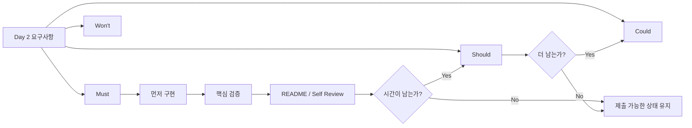
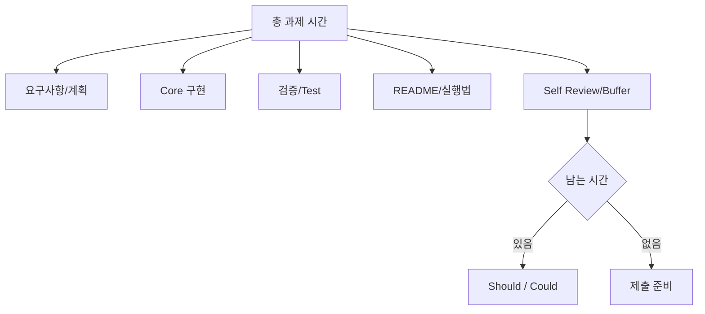

# 대기업 과제전형 Day 3 — Must / Should / Could + Timeboxing

## 오늘의 위치

- Week: **Week 1 — Take-home 2026 기본기: 요구사항·시간제한·제출 전략**
- Day: **Day 3**
- 오늘 주제: **Must / Should / Could + Timeboxing**
- 오늘 학습 목표: 시간이 짧을수록 핵심 기능과 포기 기준을 먼저 결정한다.
- 오늘 실습: Day 2의 모호한 예약 과제를 **4시간 / 8시간 / 24시간** 버전으로 나눠 계획한다.
- 오늘 산출물: `docs/requirements/TIMEBOX_PLAN.md`
- Source 성격: **학습용 모의 과제**이며 실제 기업 기출이 아니다.
- 전후 연결:
  - Day 2: 요구사항과 모호함을 분리했다.
  - **Day 3: 무엇을 먼저 하고 무엇을 포기할지 결정한다.**
  - Day 4: 선택한 Must를 검증 가능한 Acceptance Criteria와 Definition of Done으로 더 단단하게 만든다.

## 오늘 사용하는 고정 환경

- IDE: Cursor
- Git: 사용 가능하면 변경 내용 확인에 사용
- 문서: Markdown
- `VERSION_LOCK.md`: Day 1 Lock을 그대로 유지
- Java / Spring Boot / PostgreSQL: 오늘은 설치·구현하지 않음
- 새 Library: **없음**

## 오늘의 평가 Mode

- 기본 연습 Mode: **Guarded AI**
- 원칙: 우선순위 결정은 먼저 사람이 한다.
- AI를 쓴다면: 빠진 항목 검토나 반론 제시에만 사용하고, AI가 정한 우선순위를 그대로 채택하지 않는다.
- 실제 과제에서는: 회사가 명시한 AI/인터넷/IDE 정책이 최우선이다.

---

# 1. 학습 목표

오늘 학습을 끝내면 다음을 할 수 있어야 한다.

1. 요구사항을 **Must / Should / Could / Won't**로 분류할 수 있다.
2. “중요해 보인다”가 아니라 **평가 실패 위험**을 기준으로 Must를 설명할 수 있다.
3. 4시간, 8시간, 24시간처럼 시간이 달라질 때 구현 범위를 다시 설계할 수 있다.
4. 시작 전에 **중단 조건과 포기 기준**을 정할 수 있다.
5. Bonus 기능보다 Core Complete를 우선하는 이유를 면접에서 설명할 수 있다.
6. 시간 예산을 기능 구현뿐 아니라 테스트·README·Self Review에도 배분할 수 있다.
7. Day 2의 `REQUIREMENTS.md`를 실제 실행 계획인 `TIMEBOX_PLAN.md`로 연결할 수 있다.

---

# 2. 오늘 내용을 아주 쉽게 먼저 이해하기

Take-home 과제는 뷔페가 아니다.

메뉴가 열 개 있다고 해서 열 개를 모두 조금씩 담는 사람이 이기는 것이 아니다. 평가자가 반드시 먹어 보겠다고 한 음식 세 가지를 **완성된 상태로** 내놓는 것이 더 중요하다.

예를 들어 4시간짜리 예약 과제에서 다음 둘 중 무엇이 더 좋은가?

```text
A안
- 예약 조회 완성
- 예약 생성 완성
- 중복 예약 방어
- 핵심 오류 처리
- 핵심 테스트
- README 실행법

B안
- 예약 조회 70%
- 예약 생성 70%
- 예약 취소 50%
- 예쁜 관리자 UI 40%
- 이메일 알림 20%
- 테스트 없음
- README 미완성
```

대부분의 과제 전형에서는 A안이 훨씬 강하다.

이유는 간단하다.

```text
Core Complete
>
Bonus Feature
```

평가자는 “기술을 많이 넣었는가?”보다 다음을 본다.

```text
요구사항을 지켰는가?
실행되는가?
핵심 기능이 끝났는가?
검증 근거가 있는가?
시간을 합리적으로 썼는가?
```

오늘은 바로 그 판단법을 연습한다.



그림에서 가장 중요한 점은 **Could를 시작하기 전에 제출 가능한 상태를 먼저 만든다**는 것이다.

---

# 3. 이론 1 — Must / Should / Could / Won't란 무엇인가?

## 3.1 한 줄 정의

**MoSCoW 우선순위**는 제한된 시간 안에 요구사항을 “반드시 해야 할 것, 하면 좋은 것, 여유가 있으면 할 것, 이번에는 하지 않을 것”으로 나누는 방법이다.

## 3.2 아주 쉬운 비유

비행기를 타러 공항에 가는 상황을 생각해 보자.

- 여권 챙기기: Must
- 충전기 챙기기: Should
- 여행용 목베개 챙기기: Could
- 공항 가기 전에 새 캐리어 사기: Won't

목베개를 고르느라 여권을 놓치면 실패다.

Take-home도 같다.

## 3.3 정확한 의미

| 분류 | 쉬운 뜻 | 과제에서의 의미 |
|---|---|---|
| Must | 없으면 안 됨 | 빠지면 요구사항 미충족 또는 실행 실패 가능성이 큼 |
| Should | 중요하지만 대체 가능 | 점수와 품질을 높이지만 Core를 깨면서까지 할 필요는 없음 |
| Could | 여유가 있을 때 | 보너스 또는 polish 성격 |
| Won't | 이번 제출에서는 안 함 | 의도적으로 범위에서 제외하고 이유를 설명 |

> `Won't`는 “영원히 안 한다”가 아니라 **이번 시간 제한 안에서는 하지 않는다**는 뜻이다.

## 3.4 평가자는 왜 이걸 보는가?

실무 개발자는 늘 시간이 부족하다.

좋은 개발자는 모든 요구를 동시에 잡으려 하지 않고 다음을 구분한다.

- 제품이 지금 반드시 동작해야 하는 것
- 나중에 보강해도 되는 것
- 지금 하면 오히려 위험한 것

과제 전형은 작은 프로젝트지만 이런 **판단 능력**을 볼 수 있다.

## 3.5 좋은 예

Day 2 예약 과제에서:

```text
Must
- 예약 가능한 시간 조회
- 이름/이메일로 예약 생성
- 이미 예약된 슬롯 중복 방지
- 과거 시간 예약 거절
- 잘못된 입력 오류
- 실행 방법 README

Should
- 오류 응답을 더 일관되게 정리
- 대표적인 실패 케이스 테스트 보강

Could
- 예약 취소

Won't
- 관리자 페이지
- 회원가입
- 결제
- SMS 알림
```

## 3.6 나쁜 예

```text
Must
- 예약 조회
- 예약 생성
- 예약 취소
- 관리자 대시보드
- JWT 로그인
- Redis Cache
- Docker
- CI
- 이메일 발송
```

왜 나쁜가?

원문이 요구하지 않은 항목이 대량으로 Must에 들어갔다. 이러면 핵심 기능이 늦어지고 실패 표면만 커진다.

## 3.7 자주 하는 실수

1. **기술적으로 재미있는 것을 Must로 올린다.**
2. **Optional이라고 적혀 있는데도 Must처럼 먼저 구현한다.**
3. **README와 테스트를 기능 이후 남는 시간에만 하려고 한다.**
4. **Won't를 쓰는 것을 실패라고 생각한다.**
5. **모든 Must가 같은 위험도라고 생각한다.**

## 3.8 면접에서는 어떻게 말할까?

다음처럼 설명하면 된다.

```text
시간 제한이 있으므로 원문에서 직접 요구한 핵심 사용자 흐름과
실행 재현성을 Must로 두었습니다.
예약 취소는 원문이 '시간이 남으면'이라고 명시했기 때문에 Could로 두었습니다.
핵심 기능과 테스트, README가 모두 제출 가능한 상태가 된 뒤에만 시작하도록 했습니다.
```

## 3.9 기억할 한 문장

> **Must는 내가 좋아하는 기능이 아니라, 빠졌을 때 제출이 실패할 가능성이 큰 항목이다.**

---

# 4. 실습예제 1 — Day 2 요구사항을 MoSCoW로 분류하기

## 실습 목표

`REQUIREMENTS.md`의 각 항목을 우선순위로 분류한다.

## 과제 상황

Day 2에서 다음 핵심 항목이 있었다.

- FR-01 가능한 슬롯 조회
- FR-02 예약 생성
- FR-03 중복 예약 금지
- FR-04 과거 예약 금지
- FR-05 잘못된 입력 오류
- NFR-01 README 실행 가능성
- OPT-01 예약 취소

## 평가자가 보는 것

- 원문을 우선했는가?
- 핵심 사용자 흐름을 끝낼 수 있는가?
- Optional에 끌려가지 않는가?
- 품질 검증을 별도 시간으로 잡았는가?

## 내가 먼저 생각할 것

다음 세 질문을 각 항목마다 묻는다.

```text
1. 이게 없으면 원문을 만족한다고 말할 수 있는가?
2. 평가자가 바로 테스트할 가능성이 높은가?
3. 이걸 빼면 핵심 사용자 흐름이 끊기는가?
```

셋 중 하나라도 강하게 Yes라면 Must 후보가 된다.

## 분류 결과

| ID | 우선순위 | 이유 |
|---|---|---|
| FR-01 | Must | 사용자가 예약 가능한 시간을 보는 핵심 진입점 |
| FR-02 | Must | 과제의 핵심 상태 변화 |
| FR-03 | Must | 원문이 명시한 데이터 무결성 요구 |
| FR-04 | Must | 원문이 명시한 금지 규칙 |
| FR-05 | Must | 원문이 명시한 오류 처리 |
| NFR-01 | Must | 평가자가 실행하지 못하면 기능을 확인할 수 없음 |
| OPT-01 | Could | 원문이 “시간이 남으면”이라고 명시 |
| OOS-01 관리자 페이지 | Won't | 원문이 불필요하다고 명시 |

## Self Review

다음 질문에 답한다.

- “예약 취소를 안 하면 감점 아닌가?” → 원문상 Optional이므로 Core를 깨면서까지 먼저 할 이유가 없다.
- “Docker를 안 넣으면 안 되나?” → 오늘 과제 원문에 없음. 실행 재현성을 가장 단순한 방식으로 충족하면 된다.
- “테스트는 Should 아닌가?” → 테스트의 **양**은 Should일 수 있지만, 핵심 동작을 검증하는 최소 Test Evidence는 제출 신뢰성을 위해 Must에 가깝다.

## Trade-off

MoSCoW는 절대적인 점수표가 아니다. 회사가 별도 평가 기준을 제공하면 그 기준이 우선한다.

---

# 5. 이론 2 — Timeboxing이란 무엇인가?

## 5.1 한 줄 정의

**Timeboxing(시간 상자 만들기)**은 작업이 끝날 때까지 무한히 하는 것이 아니라, 각 작업에 미리 최대 시간을 배정하고 그 시간이 끝나면 다음 판단을 하는 방식이다.

## 5.2 초등학생도 이해할 수 있는 비유

시험 시간이 60분인데 첫 문제를 완벽하게 풀려고 50분을 쓰면 나머지 문제를 못 푼다.

그래서 미리 정한다.

```text
1~10번: 35분
검토: 15분
막힌 문제: 10분
```

Take-home도 똑같다.

## 5.3 왜 필요한가?

코딩은 “조금만 더 하면 될 것 같은데”가 반복되기 쉽다.

특히 다음에서 시간이 새기 쉽다.

- 구조를 예쁘게 만들기
- 라이브러리 고르기
- 오류 하나에 오래 매달리기
- Optional 기능 시작하기
- CSS 다듬기
- README를 마지막에 미루기

Timebox는 이런 작업이 전체 제출을 망치는 것을 막는다.

## 5.4 시간 예산의 기본 구조



여기서 핵심은 **테스트와 README가 “남으면 하는 일”이 아니라 처음부터 시간 예산을 갖는다**는 것이다.

## 5.5 시간별 수준

### 2시간

우선:

```text
핵심 기능
핵심 Test
명확한 Error
README 실행법
```

### 8시간

추가 가능:

```text
더 탄탄한 Integration Test
DB Integrity
CI
Docker
Security 기본
```

### 24시간

추가 가능:

```text
E2E
Observability
성능 검증
더 탄탄한 문서
변경 대응성
```

하지만 “24시간이니까 Kubernetes” 같은 식으로 기술을 늘리는 것은 잘못이다.

## 5.6 자주 하는 실수

1. 구현에 95%를 쓰고 README를 10분 만에 쓴다.
2. 버그 하나에 2시간을 쓰고도 중단 기준이 없다.
3. 계획을 너무 정교하게 쓰느라 구현 시간이 줄어든다.
4. Optional 기능이 예상보다 오래 걸려 핵심 테스트가 사라진다.
5. 마지막 10분까지 코드를 바꿔 안정적인 제출 시점을 잃는다.

## 5.7 기억할 한 문장

> **시간제한 과제에서는 “무엇을 할까?”만큼 “언제 멈출까?”가 중요하다.**

---

# 6. 실습예제 2 — 4시간 예약 과제 Timebox 만들기

## 실습 목표

가장 빡빡한 4시간 버전에서 Core Complete를 만드는 계획을 세운다.

## 과제 상황

총 시간: **240분**

## 추천 계획

| 구간 | 시간 | 목표 | 종료 조건 |
|---|---:|---|---|
| 요구사항 재확인 | 20분 | Must/질문/가정 확정 | 구현 범위가 한 화면에 정리됨 |
| 최소 실행 뼈대 | 25분 | 실행 가능한 기본 앱 | 최소 명령으로 실행 가능 |
| 슬롯 조회 | 35분 | FR-01 | 대표 성공 케이스 확인 |
| 예약 생성 + validation | 45분 | FR-02, FR-05 | 정상/잘못된 입력 확인 |
| 중복·과거 방어 | 35분 | FR-03, FR-04 | 대표 실패 케이스 확인 |
| 핵심 테스트 | 35분 | Must Evidence | 핵심 규칙 회귀 확인 |
| README | 20분 | 실행/테스트 절차 | 새 사용자가 따라할 수 있음 |
| Self Review + Buffer | 25분 | diff/누락 확인 | 제출 가능한 상태 |

총합: **240분**

## 중요한 포기 기준

4시간 버전에서는 다음을 시작하지 않는다.

```text
- 예약 취소
- 인증
- 관리자 기능
- 복잡한 UI
- 과도한 리팩토링
- 고급 관측성
```

## 실패 상황 1

예약 생성 구현이 45분을 넘겼다.

잘못된 대응:

```text
“조금만 더 하면 예쁘게 끝날 것 같아.”
→ 30분 추가
→ 테스트/README 밀림
```

좋은 대응:

```text
1. 현재 동작 범위를 확인한다.
2. 핵심을 막는 버그인지 본다.
3. 구조 개선은 멈춘다.
4. 가장 작은 정상 흐름을 완성한다.
5. 남은 Must로 이동한다.
```

## 실패 상황 2

예약 취소가 20분이면 될 것 같다.

아직 README와 테스트가 안 끝났다면 **시작하지 않는다.**

## Self Review

4시간 버전의 목표는 “많이 구현”이 아니라 **완성된 제출물**이다.

---

# 7. 이론 3 — 포기 기준과 Stop Rule

## 7.1 한 줄 정의

**Stop Rule(중단 규칙)**은 특정 작업이 일정 시간이나 위험 한도를 넘으면 더 파고들지 않고 축소·우회·포기하기로 미리 정한 기준이다.

## 7.2 왜 필요한가?

사람은 이미 시간을 많이 쓴 작업을 쉽게 버리지 못한다.

예:

```text
이미 50분 썼는데 여기서 포기하면 아까워.
```

하지만 Take-home에서는 그 50분보다 **남은 190분**이 더 중요하다.

## 7.3 Stop Rule 예시

```text
- Optional 기능은 Core 완료 전 시작하지 않는다.
- 새 dependency 도입 조사에 15분 이상 쓰지 않는다.
- CSS polish는 마지막 20분 이후 금지한다.
- 구조 리팩토링은 핵심 test가 없는 상태에서 시작하지 않는다.
- 알 수 없는 버그가 30분 이상 막으면 scope 축소/명시적 제한을 검토한다.
- 제출 30분 전부터는 신규 기능을 시작하지 않는다.
```

## 7.4 좋은 포기는 실패가 아니다

다음 문서는 오히려 좋은 신호가 될 수 있다.

```text
Known Limitations
- 예약 취소는 원문의 optional 항목이어서 이번 4시간 범위에서는 제외했습니다.
- 먼저 예약 생성/중복 방지/과거 방지/테스트/README의 완결성을 우선했습니다.
```

이것은 “못 했다”가 아니라 **의식적인 선택**이다.

## 7.5 Trade-off

Stop Rule을 너무 엄격하게 잡으면 고칠 수 있는 핵심 버그를 일찍 포기할 수 있다.

따라서 다음을 구분한다.

```text
핵심 Must를 깨는 문제
→ 더 파고들 가치가 큼

Could/Polish 문제
→ 빨리 중단할 가치가 큼
```

## 7.6 기억할 한 문장

> **포기 기준은 능력 부족 선언이 아니라, 더 중요한 작업을 지키기 위한 의사결정 규칙이다.**

---

# 8. 실습예제 3 — 4시간 / 8시간 / 24시간 비교

## 실습 목표

총 시간이 늘어나도 Must가 사라지는 것이 아니라 **Evidence와 품질의 깊이**가 늘어난다는 것을 이해한다.

## 4시간

```text
Must
- 핵심 사용자 흐름
- 핵심 validation/error
- 대표 테스트
- README
- 제출 직전 Self Review

Could
- 예약 취소
```

## 8시간

4시간 범위를 안정적으로 만든 뒤 추가한다.

```text
- 더 촘촘한 failure/boundary test
- 실제 DB 제약을 고려한 설계
- 실행 재현성 강화
- 간단한 CI 또는 컨테이너화가 과제에 가치가 있다면 추가
- 예약 취소는 Core가 안정된 뒤 고려
```

> DB/CI/Docker의 구체 구현은 이후 Day에서 배운다. 오늘은 “시간이 늘면 어떤 품질 Evidence를 더 확보할지”만 계획한다.

## 24시간

8시간 범위를 먼저 확보한 뒤 추가한다.

```text
- 더 강한 통합 검증
- E2E 또는 실제 사용자 흐름 검증
- 보안/성능/관측성 점검
- 설계 결정과 trade-off 문서
- 변경 요청 대응성 검토
```

## 잘못된 24시간 사고

```text
시간이 많다
→ Microservice
→ Kafka
→ Redis
→ Kubernetes
→ 핵심 예약 기능은 아직 불안정
```

## 올바른 24시간 사고

```text
시간이 많다
→ 핵심 완성
→ 검증 깊이 증가
→ 재현성 증가
→ 위험 감소
→ 설명 가능성 증가
```

---

# 9. 오늘의 통합 실습

오늘 최종 실습은 `TIMEBOX_PLAN.md`를 완성하는 것이다.

## 9.1 Requirement

Day 2 예약 과제를 다음 세 범위로 계획한다.

- 4시간
- 8시간
- 24시간

## 9.2 Decision

다음 원칙을 사용한다.

```text
원문 직접 요구
→ Must 후보

실행/검증 가능성을 지키는 최소 품질
→ Must 또는 Should

원문 Optional
→ Could

원문 미요구 / 과설계
→ Won't
```

## 9.3 작성할 파일

```text
docs/requirements/TIMEBOX_PLAN.md
```

## 9.4 반드시 포함할 내용

```text
1. Priority Principle
2. Must / Should / Could / Won't
3. 4h Plan
4. 8h Plan
5. 24h Plan
6. Stop Rules
7. Cut Order
8. Buffer
9. Submission Freeze
10. Known Limitations 표현 방식
```

## 9.5 Evidence

오늘은 코드 실행보다 **문서 일관성**이 Evidence다.

검증할 것:

```text
REQUIREMENTS.md의 항목이 우선순위에서 사라지지 않았는가?
Optional이 Must로 올라오지 않았는가?
시간 합계가 실제 총 시간과 맞는가?
README/Test 시간이 별도로 있는가?
마지막 Buffer가 있는가?
```

---

# 10. 실행 / 테스트 / 검증

오늘은 애플리케이션 코드를 실행하지 않는다.

대신 문서를 실제로 검증한다.

## 10.1 파일 확인

```bash
ls docs/requirements
```

예상:

```text
REQUIREMENTS.md
TIMEBOX_PLAN.md
```

## 10.2 검색으로 Optional 확인

```bash
grep -n "예약 취소\|Could\|Won't" docs/requirements/TIMEBOX_PLAN.md
```

확인 목표:

- 예약 취소가 Core보다 먼저 시작되지 않는다.
- Won't 항목이 명시되어 있다.

## 10.3 시간 합계 수동 검증

4시간 계획은 반드시 **240분**이 되어야 한다.

8시간 계획은 **480분**, 24시간 계획은 **1440분**의 전체 예산 안에 있어야 한다.

모든 시간을 빈틈없이 세부 task로 쪼갤 필요는 없다. 특히 긴 과제는 수면/식사/중단 시간을 포함해 현실적인 작업 시간을 따로 정할 수 있다.

## 10.4 Git diff

Git 저장소라면:

```bash
git diff -- docs/requirements/TIMEBOX_PLAN.md lessons/day003
```

확인:

- Day 2 원문 요구사항을 몰래 바꾸지 않았는가?
- 새로운 기능을 요구사항인 것처럼 추가하지 않았는가?
- 4h/8h/24h 범위가 일관적인가?

## Observed vs Expected

- 이 강의자료에서 실제 애플리케이션 build/test는 수행하지 않았다.
- 오늘 검증 대상은 Markdown 산출물의 범위·시간·추적성이다.
- 실제 구현 Evidence는 이후 구현 Day에서 확보한다.

---

# 11. Take-home 평가자 관점 체크

평가자가 `TIMEBOX_PLAN.md`를 직접 요구하지 않을 수도 있다.

하지만 당신의 결과물에서는 이런 판단이 보여야 한다.

```text
평가자가 이 결과물을 봤을 때 무엇을 확인할까?
```

체크:

- [ ] 핵심 기능이 모두 완성되어 있는가?
- [ ] Optional 기능 때문에 핵심이 깨지지 않았는가?
- [ ] README와 검증이 남는 시간에 몰려 있지 않은가?
- [ ] 과제 범위에 없는 기술을 과도하게 추가하지 않았는가?
- [ ] 하지 못한 기능을 숨기지 않고 제한사항으로 설명하는가?
- [ ] 시간에 맞는 깊이로 만들었는가?

평가자는 화려한 기술 스택보다 **판단의 질과 완결성**을 본다.

---

# 12. 자주 발생하는 실수 / 오류

## 실수 1 — 모든 요구사항을 Must로 둔다

### 증상

표가 사실상 우선순위 역할을 하지 못한다.

### 왜 발생하는가?

“빼면 감점일 것 같다”는 불안 때문에 모든 것을 필수로 취급한다.

### 확인

Optional이나 명시적 Out of Scope까지 Must에 들어갔는지 본다.

### 수정

원문 문구와 평가 실패 위험을 기준으로 재분류한다.

### 예방

각 Must마다 “빠지면 무엇이 실패하는가?”를 한 줄로 적는다.

---

## 실수 2 — 구현 시간만 잡는다

### 증상

마지막 15분에 테스트와 README를 몰아서 한다.

### 왜 발생하는가?

코드 작성만 개발이라고 생각한다.

### 확인

Timebox 표에 Test / README / Review 구간이 별도 존재하는지 본다.

### 수정

처음부터 고정 예산으로 배치한다.

### 예방

총 시간의 일부를 항상 검증과 제출 준비에 예약한다.

---

## 실수 3 — Optional을 너무 일찍 시작한다

### 증상

예약 취소는 있는데 중복 예약 테스트가 없다.

### 왜 발생하는가?

새 기능이 눈에 잘 보이고 재미있기 때문이다.

### 확인

Could 시작 조건을 문서에 적었는지 본다.

### 수정

`Core Complete Gate`를 둔다.

```text
Must 기능 완료
+ 핵심 테스트 통과
+ README 초안 존재
→ 그 다음 Could
```

---

## 실수 4 — Buffer가 없다

### 증상

예상보다 10분만 늦어도 전체 계획이 붕괴한다.

### 왜 발생하는가?

모든 작업이 예상대로 끝날 것이라고 가정한다.

### 확인

마지막 Self Review / Buffer가 있는지 본다.

### 수정

짧은 과제일수록 최소 10~15% 정도의 여유를 고려한다.

---

## 실수 5 — 제출 직전까지 신규 기능을 넣는다

### 증상

마지막 커밋에서 기존 기능이 깨진다.

### 왜 발생하는가?

남은 시간을 모두 생산 시간으로 생각한다.

### 확인

Submission Freeze가 있는지 본다.

### 수정

예: 제출 30분 전 신규 기능 금지.

---

## 실수 6 — 24시간이면 기술을 많이 넣어야 한다고 생각한다

### 증상

기술 수는 많지만 요구사항과 테스트가 불안정하다.

### 왜 발생하는가?

과제 점수를 기술 개수로 오해한다.

### 수정

시간이 늘어날수록 **검증·재현성·설명 가능성**을 먼저 강화한다.

---

# 13. 강의요약

## 오늘 배운 핵심 5가지

1. **Must는 원문과 평가 실패 위험으로 정한다.**
2. **Optional은 Core Complete 이후에만 시작한다.**
3. **Timeboxing은 작업마다 최대 시간을 미리 정하는 것이다.**
4. **Test·README·Self Review도 처음부터 시간 예산을 가져야 한다.**
5. **좋은 포기는 핵심 제출물을 지키는 의식적인 Scope Decision이다.**

## 오늘 완성한 것

```text
lessons/day003/lecture.md
lessons/day003/practice.md
lessons/day003/exercises.md
lessons/day003/review.md
docs/requirements/TIMEBOX_PLAN.md
```

## 오늘의 평가 Evidence

- [ ] Requirement → Priority 추적
- [ ] 4h 계획
- [ ] 8h 계획
- [ ] 24h 계획
- [ ] Stop Rule
- [ ] Cut Order
- [ ] Submission Freeze
- [ ] Git Diff 검토

## 오늘의 핵심 Trade-off

기능을 더 많이 넣는 대신 핵심 흐름의 완결성, 테스트, 실행 가능성, README를 지킨다. 시간 여유가 생기면 새 기능보다 먼저 품질 Evidence를 강화한다.

## 스스로 설명할 수 있어야 하는 것

1. 왜 예약 취소는 Must가 아닌가?
2. 왜 README 시간을 따로 잡는가?
3. 4시간과 24시간의 가장 큰 차이는 무엇인가?
4. Stop Rule은 왜 필요한가?
5. Optional을 언제 시작해도 되는가?

## 다음 Day 연결

Day 3에서 “무엇을 할 것인가”를 정했다.

Day 4에서는 그 Must가 **정확히 어떤 상태가 되면 완료인지**를 Acceptance Criteria와 Definition of Done으로 더 명확하게 만든다.

---

# 14. 핵심 용어

| 용어 | 쉬운 뜻 | 정확한 의미 | 과제에서 왜 중요한가 |
|---|---|---|---|
| Must | 반드시 해야 함 | 빠지면 핵심 요구 미충족 가능성이 큰 범위 | 핵심 제출 완결성 확보 |
| Should | 하면 매우 좋음 | 중요하지만 Core를 깨면서까지 우선할 필요는 없는 범위 | 품질 보강 우선순위 |
| Could | 여유가 있으면 | 보너스/선택 기능 | Scope Creep 방지 |
| Won't | 이번에는 안 함 | 이번 Timebox에서 명시적으로 제외 | 의도적 포기와 범위 통제 |
| Timebox | 작업 시간 상자 | 작업에 미리 최대 시간을 배정하는 방식 | 한 작업이 전체 시간을 잡아먹는 것 방지 |
| Stop Rule | 중단 규칙 | 일정 조건에서 작업을 축소·중단하는 사전 기준 | Sunk Cost 방지 |
| Core Complete | 핵심 완성 | 핵심 요구사항·최소 검증·실행법이 제출 가능한 상태 | Optional 시작 Gate |
| Buffer | 예비 시간 | 예상 오차와 문제 대응을 위한 여유 | 제출 안정성 확보 |
| Submission Freeze | 신규 변경 중단 시점 | 제출 전에 새 기능을 더 이상 시작하지 않는 기준 | 마지막 회귀 위험 감소 |
| Scope Creep | 범위가 계속 커짐 | 원래 요구보다 기능/기술이 불필요하게 늘어나는 현상 | 과제 실패의 흔한 원인 |

---

# 15. 초급 연습문제 5개

> 정답은 이 파일에 넣지 않는다.

1. Must와 Could의 차이를 한 문장으로 설명하라.
2. 원문에 “시간이 남으면 예약 취소를 추가해 주세요”라고 적혀 있다. 예약 취소는 어떤 우선순위가 가장 자연스러운가?
3. 4시간 과제에서 README를 마지막 남는 시간에만 작성하면 위험한 이유를 두 가지 적어라.
4. `Won't`가 “영원히 구현하지 않는다”는 뜻인지 설명하라.
5. Timeboxing의 목적을 “완벽함”이라는 단어를 사용해 한 문장으로 설명하라.

---

# 16. 중급 연습문제 5개

1. 180분짜리 간단한 게시판 과제에 대해 요구사항 분석 15분, 구현 100분, 테스트 25분, README 20분, Review 20분의 계획이 있다. 합계와 위험 요소를 검토하라.
2. 다음 항목을 Must/Should/Could/Won't로 분류하고 이유를 적어라: 게시글 생성, 게시글 목록, 로그인, 관리자 통계, README, 원문에 optional로 표시된 검색.
3. Core 테스트가 실패한 상태에서 Optional UI 개선을 시작하려는 동료에게 어떤 Stop Rule을 제안할지 적어라.
4. 4시간 계획에서 어떤 작업이 30분 초과되었을 때 전체 계획을 어떻게 재조정할지 Cut Order를 작성하라.
5. “8시간이 있으니 Redis를 넣자”라는 제안에 대해 요구사항·위험·검증 관점에서 반박하라.

---

# 17. 고급 연습문제 5개

1. 4시간 과제에서 2시간이 지난 시점에 예약 조회와 생성은 동작하지만 중복 방지와 과거 예약 방지, 테스트, README가 남았다. 남은 2시간의 우선순위를 분 단위로 다시 설계하라.
2. 8시간 과제에서 Optional 예약 취소가 예상 40분이었지만 90분이 지나도 끝나지 않았다. 어떤 정보를 기준으로 계속할지 중단할지 결정할지 설명하라.
3. 평가자가 “왜 기능을 더 넣지 않았나요?”라고 물었을 때 60초 답변을 작성하라. 반드시 원문, Core, Test, README, Known Limitation을 포함하라.
4. Must 기능 하나가 기술적으로 매우 어렵고 4시간 안에 완료 가능성이 낮다. 요구사항을 몰래 축소하지 않으면서 취할 수 있는 대응 전략을 순서대로 작성하라.
5. 24시간 과제에서 남은 3시간을 `새 보너스 기능`, `추가 테스트`, `README/Trade-off`, `Self Review` 중 어떻게 배분할지 결정하고 근거를 적어라.

---

# 18. 오늘의 산출물

핵심 산출물:

```text
docs/requirements/TIMEBOX_PLAN.md
```

보조 학습 파일:

```text
lessons/day003/lecture.md
lessons/day003/practice.md
lessons/day003/exercises.md
lessons/day003/review.md
```

`REQUIREMENTS.md`는 Day 2의 Source of Truth로 유지하고, 오늘 우선순위 계획은 별도 파일에 둔다.

---

# 19. 제출 / 검증 체크리스트

- [ ] Day 2 `REQUIREMENTS.md`를 먼저 읽었다.
- [ ] 원문 직접 요구를 Must 후보로 검토했다.
- [ ] Optional 예약 취소는 Could로 유지했다.
- [ ] 관리자 페이지는 Won't/Out of Scope다.
- [ ] 4시간 계획이 실제 240분과 맞는다.
- [ ] Test 시간이 별도로 있다.
- [ ] README 시간이 별도로 있다.
- [ ] Self Review / Buffer가 있다.
- [ ] Could 시작 Gate가 있다.
- [ ] Stop Rule이 있다.
- [ ] Cut Order가 있다.
- [ ] Submission Freeze가 있다.
- [ ] 8시간과 24시간 범위가 단순 기술 추가가 아니라 Evidence 강화 중심이다.
- [ ] 새로운 라이브러리를 불필요하게 추가하지 않았다.
- [ ] `VERSION_LOCK.md`를 임의로 변경하지 않았다.

---

# 20. 실무 / 면접 질문

1. 왜 모든 요구사항을 Must로 두지 않았나요?
2. 예약 취소를 구현하지 않은 이유를 어떻게 설명하겠습니까?
3. 4시간 과제에서 README에 몇 분을 쓰겠습니까? 왜인가요?
4. 예상보다 구현이 30분 늦어지면 무엇부터 자르겠습니까?
5. Stop Rule을 너무 엄격하게 두면 어떤 문제가 생길 수 있나요?
6. 24시간이 주어졌을 때 4시간보다 무엇을 더 강화하겠습니까?
7. 왜 새 기술 도입보다 테스트와 재현성을 먼저 강화합니까?
8. 제출 직전 Submission Freeze를 두는 이유는 무엇입니까?
9. “시간이 더 있었으면 했을 것”을 README에 어떻게 적겠습니까?
10. 평가자가 Bonus 기능 개수를 높게 본다고 명시했다면 우선순위를 어떻게 바꾸겠습니까?

---

# 21. 다음 Day 연결

Day 3의 결과는 “이 과제에서 무엇을 끝내야 하는가?”에 대한 답이다.

Day 4에서는 그 답을 더 객관적으로 바꾼다.

```text
Must 기능
↓
Acceptance Criteria
↓
Definition of Done
↓
끝났는지 검증 가능한 상태
```

즉, 오늘은 **범위 결정**, 다음 Day는 **완료 판정**이다.
