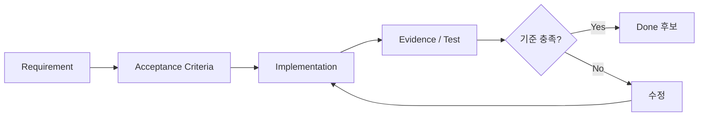
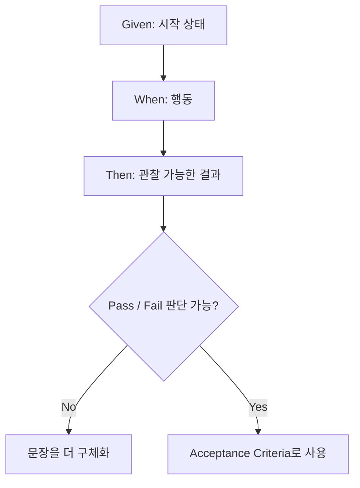
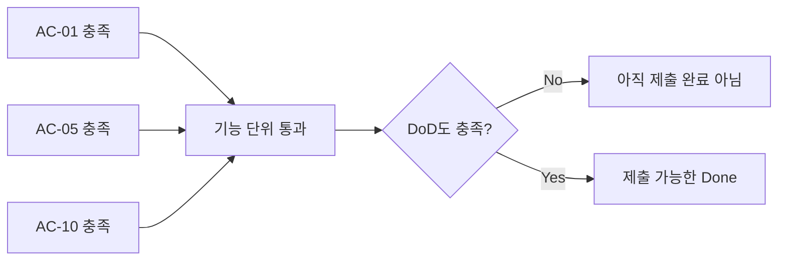

# 대기업 과제전형 Day 4 — Acceptance Criteria + Definition of Done

## 오늘의 위치

- Week: **Week 1 — Take-home 2026 기본기: 요구사항·시간제한·제출 전략**
- Day: **Day 4**
- 오늘 주제: **Acceptance Criteria + Definition of Done**
- 오늘 학습 목표: 완료를 느낌이 아니라 검증 가능한 조건으로 표현한다.
- 오늘 실습: Day 2~3의 예약 과제에 **Given / When / Then 기준 15개**를 작성한다.
- 오늘 산출물: `docs/requirements/ACCEPTANCE_CRITERIA.md`
- Source 성격: **학습용 모의 과제** — 실제 기업 기출이 아니다.
- 전후 연결:
  - Day 2: 요구사항과 모호함을 분리했다.
  - Day 3: Must / Should / Could와 시간 예산을 정했다.
  - **Day 4: “무엇이면 완료인가?”를 검증 가능한 기준으로 바꾼다.**
  - Day 5: 이 기준을 지키며 변경 이력을 남기는 Git 전략으로 이어진다.

## 오늘 사용하는 고정 환경

- IDE: Cursor
- 문서: Markdown
- 기존 산출물:
  - `docs/requirements/REQUIREMENTS.md`
  - `docs/requirements/TIMEBOX_PLAN.md`
- `VERSION_LOCK.md`: Day 1 Lock 재사용, **변경 없음**
- 새 Library: **없음**
- Java / Spring Boot / PostgreSQL: 오늘은 구현하지 않음

## 오늘의 평가 Mode

- 기본 연습 Mode: **Guarded AI**
- 사람이 먼저 Requirement → Acceptance Criteria를 작성한다.
- AI는 누락/모순/검증 가능성 검토에만 보조적으로 사용할 수 있다.
- 실제 평가에서는 회사의 AI/인터넷 정책이 최우선이다.

---

# 1. 학습 목표

오늘이 끝나면 다음을 할 수 있어야 한다.

1. Acceptance Criteria를 자기 말로 설명할 수 있다.
2. Given / When / Then의 역할을 구분할 수 있다.
3. 검증할 수 없는 모호한 문장을 검증 가능한 문장으로 고칠 수 있다.
4. Requirement와 Acceptance Criteria의 차이를 설명할 수 있다.
5. Acceptance Criteria와 Definition of Done의 차이를 설명할 수 있다.
6. 예약 과제의 Core behavior를 Given / When / Then 15개로 표현할 수 있다.
7. 미해결 Ambiguity를 몰래 사실로 바꾸지 않고 Working Assumption으로 관리할 수 있다.

---

# 2. 오늘 내용을 아주 쉽게 먼저 이해하기

친구에게 이렇게 부탁했다고 생각해 보자.

```text
"방을 깨끗하게 치워 줘."
```

친구는 물어볼 수 있다.

```text
"어디까지 해야 깨끗한 거야?"
```

그래서 기준을 바꾼다.

```text
- 바닥에 쓰레기가 없어야 한다.
- 책은 책장에 들어가 있어야 한다.
- 책상 위에는 컵이 없어야 한다.
```

이제 “끝났는지” 확인할 수 있다.

Take-home도 똑같다.

```text
"예약 기능을 만들어 주세요"
```

만으로는 완료 기준이 약하다.

그래서 다음처럼 바꾼다.

```text
Given 미래의 예약 가능한 슬롯이 있고
When 유효한 이름과 이메일로 예약하면
Then 예약이 생성된다.
```

핵심은 **느낌을 체크 가능한 조건으로 바꾸는 것**이다.



화살표의 의미는 단순하다.

- Requirement: 무엇을 원하는가?
- Acceptance Criteria: 무엇이면 만족했다고 판단하는가?
- Implementation: 실제로 만든다.
- Evidence: 정말 되는지 확인한다.
- Done: 기준을 통과한 경우에만 완료라고 부른다.

---

# 3. 이론 1 — Acceptance Criteria란 무엇인가?

## 3.1 한 줄 정의

**Acceptance Criteria(인수 기준)**는 요구사항이 충족되었다고 판단할 수 있는 **관찰 가능하고 검증 가능한 조건**이다.

## 3.2 아주 쉬운 비유

“달리기 잘하기”는 기준이 애매하다.

```text
100m를 15초 안에 완주한다.
```

라고 하면 확인할 수 있다.

Acceptance Criteria도 같은 역할을 한다.

## 3.3 Take-home 상황

원문:

```text
이미 예약된 시간에는 다른 사람이 예약할 수 없어야 합니다.
```

나쁜 기준:

```text
중복 예약이 잘 막힌다.
```

좋은 기준:

```text
Given 한 슬롯에 예약이 이미 존재하고
When 다른 사용자가 같은 슬롯을 다시 예약하면
Then 두 번째 예약은 성공하지 않는다.
```

## 3.4 정확한 기술 정의

Requirement가 **필요한 capability 또는 constraint**를 말한다면, Acceptance Criteria는 그 요구를 **검증할 수 있는 behavior 수준으로 구체화**한다.

```text
Requirement
"중복 예약 금지"

Acceptance Criteria
"첫 예약이 존재하는 상태에서 같은 슬롯을 다시 예약하면 두 번째 예약은 성공하지 않는다."
```

둘은 같지 않다.

- Requirement는 **무엇을 원하는가**
- Acceptance Criteria는 **무엇을 보면 만족했다고 판단할 수 있는가**

## 3.5 왜 필요한가?

Acceptance Criteria가 없으면 다음 문제가 생긴다.

1. 개발자는 자기가 생각한 완료를 구현한다.
2. 평가자는 다른 완료를 기대할 수 있다.
3. 테스트가 무엇을 검증해야 하는지 흔들린다.
4. 구현 도중 scope가 계속 늘어난다.
5. 마지막에 “이 정도면 되겠지”로 끝내기 쉽다.

## 3.6 평가자는 왜 보는가?

평가자는 문서 파일 이름 자체보다 **사고방식**을 본다.

```text
요구사항을 구체화했는가?
경계/실패 조건을 생각했는가?
구현과 검증이 같은 목표를 보고 있는가?
모호한 부분을 몰래 정답처럼 가정하지 않았는가?
```

## 3.7 좋은 예 / 나쁜 예

| 나쁜 기준 | 문제 | 좋은 방향 |
|---|---|---|
| 예약이 정상적으로 된다 | 정상의 의미가 없음 | 선행 상태/행동/결과 명시 |
| 오류를 적절히 반환한다 | 적절함을 판정 불가 | 어떤 입력이 성공하지 않는지 분리 |
| 조회가 빠르다 | 수치/측정법 없음 | 성능 요구가 있다면 기준 정의 |
| DB에 저장된다 | 내부 구현에 묶임 | 외부에서 확인 가능한 결과 우선 |
| 예외처리 한다 | 범위가 너무 넓음 | 실패 시나리오별 기준 작성 |

## 3.8 Trade-off

모든 문장을 수십 개 AC로 쪼갠다고 좋은 것은 아니다.

너무 많으면:

- 작성 시간이 과도해진다.
- 같은 behavior가 반복된다.
- 실제 구현보다 문서가 커진다.

따라서 Take-home에서는 **점수에 직접 영향을 줄 Core behavior와 위험한 실패 조건부터** 작성한다.

## 3.9 시간제한별 적용 수준

### 2시간

```text
핵심 Must 흐름 5~8개
가장 위험한 실패 조건
README 실행 가능성
```

### 8시간

```text
핵심 흐름
경계값
실패 조건
데이터 무결성 관련 기준
```

### 24시간

```text
위 기준 +
더 많은 integration/change scenario
더 구체적인 delivery 기준
```

시간이 길다고 문서를 100개 쓰는 것은 목표가 아니다.

## 3.10 자주 하는 실수

1. 구현 방법을 Acceptance Criteria에 박아 넣는다.
2. `적절히`, `정상적으로`, `빠르게` 같은 단어만 사용한다.
3. 원문에 없는 정책을 사실처럼 추가한다.
4. 성공 시나리오만 쓰고 실패 조건을 빼먹는다.
5. Optional 기준을 Core 완료 기준과 섞는다.

## 3.11 면접에서 어떻게 설명할까?

```text
요구사항을 바로 구현하지 않고 핵심 behavior를 Acceptance Criteria로 먼저 표현했습니다.
특히 정상 예약뿐 아니라 중복, 과거 시간, 잘못된 입력을 별도 기준으로 두어
나중에 구현과 테스트가 같은 목표를 보도록 했습니다.
```

## 3.12 기억할 한 문장

> **Acceptance Criteria는 “무엇을 만들까?”를 “무엇을 확인하면 끝인가?”로 바꾸는 문장이다.**

---

# 4. 실습예제 1 — 모호한 문장을 검증 가능한 기준으로 바꾸기

## 실습 목표

모호한 표현 세 개를 직접 고친다.

## 과제 상황

다음 문장이 있다고 하자.

```text
1. 예약이 잘 되어야 한다.
2. 중복 예약을 적절히 막아야 한다.
3. 잘못된 입력은 좋은 오류를 보여줘야 한다.
```

## 평가자가 보는 것

- 성공 조건을 판정할 수 있는가?
- 실패 조건을 구분했는가?
- 구현 세부보다 behavior를 적었는가?

## 내가 먼저 생각할 것

각 문장에 묻는다.

```text
무슨 상태에서?
무슨 행동을 하면?
밖에서 무엇을 확인해야 하나?
```

## 직접 작성할 위치

```text
docs/requirements/ACCEPTANCE_CRITERIA.md
```

## 변환 예시

### 예시 A

```text
나쁨:
예약이 잘 되어야 한다.

좋음:
Given 미래의 예약 가능한 슬롯이 있고
When 유효한 이름과 이메일로 예약하면
Then 예약이 생성된다.
```

### 예시 B

```text
나쁨:
중복 예약을 적절히 막아야 한다.

좋음:
Given 한 슬롯에 기존 예약이 있고
When 같은 슬롯을 다시 예약하면
Then 두 번째 예약은 성공하지 않는다.
```

### 예시 C

```text
나쁨:
잘못된 입력은 좋은 오류를 보여줘야 한다.

좋음:
Given 이름이 비어 있고
When 예약 요청을 보내면
Then 예약은 생성되지 않고 입력 오류임을 확인할 수 있다.
```

## Self Review

- `잘`, `적절히`, `좋은` 같은 단어가 남아 있는가?
- Then을 읽고 Pass / Fail을 판단할 수 있는가?
- 원문에 없는 HTTP status를 임의로 추가하지 않았는가?

## Trade-off

Day 11에서 Error Contract를 배우기 전이므로 지금은 `400`, `409`, 특정 JSON schema를 강제로 확정하지 않는다. 오늘은 **behavior 기준**에 집중한다.

---

# 5. 이론 2 — Given / When / Then

## 5.1 한 줄 정의

Given / When / Then은 시나리오를 **상태 → 행동 → 결과**로 나눠 쓰는 방법이다.

## 5.2 쉬운 비유

자판기를 생각해 보자.

```text
Given 자판기에 음료가 있고 돈 2,000원이 들어 있으며
When 1,500원짜리 음료 버튼을 누르면
Then 음료가 나오고 잔돈 500원이 나온다.
```

세 부분의 역할이 다르다.

- Given: 출발 상태
- When: 한 번의 핵심 행동
- Then: 관찰할 결과

## 5.3 구조 그림



## 5.4 Given 작성법

좋은 Given:

```text
Given 한 슬롯에 예약이 이미 존재하고
```

나쁜 Given:

```text
Given 시스템이 정상이고
```

“정상”이 무엇인지 모르기 때문이다.

## 5.5 When 작성법

한 시나리오에는 핵심 행동을 가능한 한 하나로 둔다.

좋은 예:

```text
When 같은 슬롯을 다시 예약하면
```

너무 복잡한 예:

```text
When 로그인하고 날짜를 고르고 조회하고 예약하고 취소하고 다시 조회하면
```

이렇게 길어지면 실패 원인을 찾기 어렵다.

## 5.6 Then 작성법

가능하면 밖에서 확인 가능한 결과를 쓴다.

좋은 예:

```text
Then 두 번째 예약은 성공하지 않는다.
```

오늘 범위를 넘어가는 예:

```text
Then ReservationService가 DuplicateReservationException을 던진다.
```

후자는 특정 내부 구현 방식에 묶인다. 실제 과제가 그 구현을 요구하지 않는다면 AC로는 지나치게 구체적일 수 있다.

## 5.7 복수 Then은 가능한가?

가능하지만 서로 강하게 묶인 결과만 둔다.

예:

```text
Then 두 번째 예약은 성공하지 않고
And 기존 첫 예약은 유지된다.
```

다만 핵심 의미가 다르면 두 개의 AC로 분리하는 편이 더 읽기 쉽다. 오늘 산출물에서는 `AC-10`, `AC-11`로 분리한다.

## 5.8 자주 하는 실수

1. Given에 행동까지 넣는다.
2. When에 다섯 단계를 넣는다.
3. Then에 내부 클래스/메서드 이름만 적는다.
4. 결과가 아니라 구현 계획을 적는다.
5. 같은 의미를 표현만 바꿔 여러 번 반복한다.

## 5.9 기억할 한 문장

> **Given은 상태, When은 행동, Then은 밖에서 확인할 결과다.**

---

# 6. 실습예제 2 — 예약 과제를 Given / When / Then으로 분해하기

## 실습 목표

Day 2의 `FR-01~FR-05`를 Core 시나리오로 분해한다.

## 과제 상황

Must는 이미 Day 3에서 정했다.

```text
FR-01 예약 가능 슬롯 조회
FR-02 예약 생성
FR-03 중복 예약 금지
FR-04 과거 예약 금지
FR-05 잘못된 입력 오류
NFR-01 README 실행 가능성
```

## 평가자가 보는 것

- 정상 흐름만 적었는가?
- 실패/경계를 생각했는가?
- Requirement와 AC가 추적 가능한가?

## 직접 작성할 위치

```text
Cursor
→ docs/requirements/ACCEPTANCE_CRITERIA.md
```

## 첫 번째 묶음 — 조회

```text
AC-01 정상 가용 슬롯 조회
AC-02 30분 슬롯
AC-03 예약된 슬롯 제외
AC-04 지난 슬롯 제외
```

## 두 번째 묶음 — 예약 생성/입력

```text
AC-05 유효 예약 생성
AC-06 생성 후 가용 목록에서 제외
AC-07 빈 이름 거절
AC-08 이메일 누락 거절
AC-09 이메일 형식 오류 거절
```

## 세 번째 묶음 — 중복/시간 무결성

```text
AC-10 중복 예약 거절
AC-11 기존 예약 보존
AC-12 과거 슬롯 거절
AC-13 현재 시각 경계값 처리
AC-14 실패 요청이 새 예약을 만들지 않음
```

## 네 번째 — Delivery

```text
AC-15 README에서 실행/검증 경로 확인 가능
```

## 왜 정확히 15개인가?

오늘 커리큘럼 실습 자체가 **Given / When / Then 15개 작성**이다.

하지만 실전에서는 15라는 숫자 자체가 정답이 아니다. 실제 과제에서는 핵심 위험을 덮는 만큼만 작성한다.

## Self Review

다음을 확인한다.

```text
[ ] Core Must와 연결되는가?
[ ] Optional이 Core 목록에 섞이지 않았는가?
[ ] Then이 판정 가능한가?
[ ] 미해결 Ambiguity를 사실처럼 확정하지 않았는가?
```

---

# 7. 이론 3 — Acceptance Criteria와 Definition of Done의 차이

## 7.1 한 줄 정의

- **Acceptance Criteria**: 특정 요구사항/기능이 만족됐는지 보는 기준
- **Definition of Done(DoD)**: 작업 또는 제출 전체를 완료라고 부르기 위한 공통 기준

## 7.2 쉬운 비유

식당에서 메뉴 하나를 만드는 상황으로 보면:

```text
Acceptance Criteria
= 스테이크가 주문한 굽기로 나왔는가?

Definition of Done
= 음식이 완성됐고, 접시에 담겼고, 주문과 일치하고,
  테이블에 제공할 준비까지 끝났는가?
```

## 7.3 Take-home 예시

예약 생성 AC:

```text
Given 유효한 미래 슬롯
When 유효한 이름/이메일로 예약
Then 예약이 생성된다.
```

그런데 이 기능이 동작한다고 해서 제출이 Done은 아니다.

제출에는 이런 것도 필요할 수 있다.

```text
- Must 범위가 끝났는가?
- 핵심 검증 Evidence가 있는가?
- README에서 실행 방법을 찾을 수 있는가?
- 미구현 항목을 숨기지 않았는가?
- 제출 전 검토를 했는가?
```

## 7.4 그림



## 7.5 DoD에 무엇을 넣어야 하나?

Day 4 수준에서는 다음 범주면 충분하다.

```text
Scope
Behavior
Evidence
Delivery
```

아직 CI, Docker, 실제 DB 통합 테스트 등을 배우지 않았으므로 미래 Day 기술을 오늘의 필수 정답으로 만들지 않는다.

## 7.6 나쁜 DoD

```text
- 코드가 예쁘다.
- 아키텍처가 멋지다.
- 테스트가 많다.
- 최신 기술을 사용했다.
```

판정 기준도 약하고 과제 목표와도 다를 수 있다.

## 7.7 좋은 DoD

```text
- Must 범위가 구현 범위와 일치한다.
- 핵심 성공/실패 behavior를 확인했다.
- README에 실행/검증 경로가 있다.
- 미구현 Known Limitation을 명시했다.
- 실제 검증하지 않은 것을 완료라고 표시하지 않는다.
```

## 7.8 Acceptance Criteria와 Test는 같은가?

같지 않다.

```text
Acceptance Criteria
= 무엇을 검증해야 하는가?

Test
= 그것을 어떤 방식으로 자동/수동 검증할 것인가?
```

하나의 AC를 Unit Test, API Test, Integration Test 등 여러 방식으로 검증할 수도 있다. 어떤 Test를 선택할지는 Week 3에서 더 깊게 배운다.

## 7.9 기억할 한 문장

> **AC는 기능별 합격 기준이고, DoD는 제출 전체의 졸업 기준이다.**

---

# 8. 실습예제 3 — Day 4 Definition of Done 만들기

## 실습 목표

예약 과제에서 “코드가 돌아감”과 “제출 완료”를 분리한다.

## 과제 상황

가정:

```text
예약 생성은 된다.
하지만 README가 비어 있다.
중복 예약은 확인하지 않았다.
잘못된 입력도 확인하지 않았다.
```

질문:

```text
이 제출은 Done인가?
```

답: **아직 아니다.**

핵심 behavior와 delivery evidence가 빠져 있기 때문이다.

## 직접 작성할 위치

```text
Docs:
docs/requirements/ACCEPTANCE_CRITERIA.md

Section:
# 7. Definition of Done — Day 4 Baseline
```

## 작성 순서

### 1) Scope

```text
요구사항과 실제 범위가 일치하는가?
Optional을 먼저 하지 않았는가?
```

### 2) Behavior

```text
조회 / 생성 / 중복 / 과거 / 입력 실패를 확인할 수 있는가?
```

### 3) Evidence

```text
어떤 방식으로 확인했는가?
실제로 본 결과와 예상 결과를 구분했는가?
```

### 4) Delivery

```text
평가자가 실행 경로를 찾을 수 있는가?
Known Limitation을 숨기지 않았는가?
```

## Self Review

DoD 항목마다 묻는다.

```text
이 항목을 Yes / No로 판단할 수 있는가?
오늘 아직 배우지 않은 기술을 억지로 요구하고 있지 않은가?
과제 원문보다 과하게 범위를 키우지 않았는가?
```

---

# 9. 오늘의 통합 실습

오늘은 새 프로젝트를 코딩하지 않는다.

Day 2~3의 문서를 연결해 **검증 가능한 계약 문서**를 완성한다.

## Requirement

예약 과제의 Must 기능을 완료 가능한 기준으로 바꾼다.

## Decision

다음 구조를 사용한다.

```text
15 Core Acceptance Criteria
+
Optional Acceptance Criteria 별도 분리
+
Day 4 Definition of Done
+
Requirement Traceability
```

## Implementation

Cursor에서 다음 파일을 연다.

```text
docs/requirements/REQUIREMENTS.md
docs/requirements/TIMEBOX_PLAN.md
```

그리고 생성한다.

```text
docs/requirements/ACCEPTANCE_CRITERIA.md
```

오늘 제공된 완성 예시를 먼저 읽은 뒤, 반드시 각 AC가 왜 필요한지 자신의 말로 설명한다.

## Evidence

다음 명령으로 문서 구조를 확인할 수 있다.

```bash
grep -n '^## AC-' docs/requirements/ACCEPTANCE_CRITERIA.md
grep -n 'Given\|When\|Then' docs/requirements/ACCEPTANCE_CRITERIA.md
```

Core AC 개수 확인 예:

```bash
grep -c '^## AC-' docs/requirements/ACCEPTANCE_CRITERIA.md
```

예상값:

```text
15
```

> `OPT-AC-01`은 Core 15개에 포함하지 않는다.

## Trade-off

지금은 구체 HTTP status, DB constraint, transaction, 테스트 종류를 정답으로 강제하지 않는다. 그 개념들은 이후 Day에서 배운다.

---

# 10. 실행 / 테스트 / 검증

오늘은 애플리케이션 build가 아니라 **문서 검증**이 Evidence다.

프로젝트 루트에서:

```bash
cd take-home-2026
```

파일 존재 확인:

```bash
test -f docs/requirements/ACCEPTANCE_CRITERIA.md && echo "AC file: OK"
```

Core AC 개수:

```bash
grep -c '^## AC-' docs/requirements/ACCEPTANCE_CRITERIA.md
```

Expected:

```text
15
```

DoD 확인:

```bash
grep -n 'Definition of Done' docs/requirements/ACCEPTANCE_CRITERIA.md
```

Traceability 확인:

```bash
grep -n 'FR-01\|FR-02\|FR-03\|FR-04\|FR-05' docs/requirements/ACCEPTANCE_CRITERIA.md
```

### Observed와 Expected를 구분하기

이 강의자료의 명령은 여러분 로컬 Cursor workspace에서 실행해야 한다.

- Expected: 위 명령이 어떤 결과를 내야 하는지
- Observed: **직접 실행해서 실제로 본 결과**

직접 실행하지 않았다면 `Observed OK`라고 기록하면 안 된다.

---

# 11. Take-home 평가자 관점 체크

평가자가 이 결과물을 봤을 때 확인하려는 것은 문서 양이 아니다.

```text
요구사항을 검증 가능한 단위로 이해했는가?
정상뿐 아니라 실패/경계를 생각했는가?
Optional과 Core를 구분했는가?
모호한 정책을 몰래 사실처럼 만들지 않았는가?
완료 조건이 실행/검증과 연결되는가?
```

나쁜 신호:

```text
"정상적으로 동작한다"
"적절한 오류"
"예쁘게 구현"
"테스트 충분히 작성"
```

좋은 신호:

```text
Given / When / Then
Requirement ID 연결
Assumption 표시
Pass / Fail 가능한 DoD
```

---

# 12. 자주 발생하는 실수 / 오류

## 실수 1 — Then이 검증 불가능함

### 증상

```text
Then 정상적으로 처리된다.
```

### 왜 발생?

결과보다 느낌을 썼다.

### 확인

“이 문장만 보고 두 사람이 같은 Pass/Fail 결론을 낼 수 있는가?”라고 묻는다.

### 수정

구체적인 observable outcome을 적는다.

---

## 실수 2 — 원문에 없는 정책을 확정

### 증상

```text
모든 예약은 Asia/Seoul 기준으로 09:00~18:00만 가능하다.
```

### 왜 발생?

빈칸을 빨리 채우려고 가정을 사실처럼 만들었다.

### 수정

원문에 없다면 질문하거나 Working Assumption으로 표시한다.

---

## 실수 3 — 구현 세부를 AC에 박아 넣음

### 증상

```text
Then ReservationRepository.save()가 정확히 한 번 호출된다.
```

### 왜 발생?

테스트 구현과 요구사항 합격 기준을 섞었다.

### 수정

“예약이 한 건만 존재한다”처럼 behavior 중심으로 바꾼다.

---

## 실수 4 — Optional을 Core Done에 넣음

### 증상

예약 취소를 못 만들었다고 전체 제출을 미완료 처리한다.

### 왜 발생?

Day 3 우선순위를 무시했다.

### 수정

Optional AC는 별도 섹션에 두고 Core Complete 이후에만 적용한다.

---

## 실수 5 — Test와 AC를 같은 것으로 생각

### 증상

`JUnit test 20개 작성`을 Acceptance Criteria라고 적는다.

### 왜 발생?

검증 대상과 검증 수단을 혼동했다.

### 수정

```text
AC = 무엇을 확인?
Test = 어떻게 확인?
```

으로 분리한다.

---

# 13. 강의요약

## 오늘 배운 핵심 5가지

1. Acceptance Criteria는 요구사항을 **Pass / Fail 가능한 기준**으로 바꾼다.
2. Given / When / Then은 **상태 → 행동 → 결과**를 분리한다.
3. 모호한 정책은 사실처럼 만들지 않고 **질문/Assumption**으로 추적한다.
4. Acceptance Criteria는 기능별 기준이고, Definition of Done은 제출 전체의 공통 완료 기준이다.
5. Test는 Acceptance Criteria 자체가 아니라 **Acceptance Criteria를 검증하는 수단**이다.

## 오늘 완성한 것

```text
docs/requirements/ACCEPTANCE_CRITERIA.md
lessons/day004/lecture.md
lessons/day004/practice.md
lessons/day004/exercises.md
lessons/day004/exercise-solutions.md
lessons/day004/review.md
```

## 오늘의 평가 Evidence

```text
Requirement → AC Traceability
Core AC 15개
Definition of Done
문서 검증 명령
```

## 오늘의 핵심 Trade-off

Acceptance Criteria를 많이 쓰는 것이 목적이 아니다. **핵심 요구사항과 실패 위험을 충분히 검증할 정도로만 구체화**하고, 아직 배우지 않은 구현 기술을 미리 강제하지 않는다.

## 스스로 설명할 수 있어야 하는 것

1. Requirement와 Acceptance Criteria는 무엇이 다른가?
2. Given / When / Then 각각의 역할은 무엇인가?
3. AC와 Test는 왜 같은 것이 아닌가?
4. Acceptance Criteria와 Definition of Done은 무엇이 다른가?
5. 출제자의 답이 없는 정책을 어떻게 다뤄야 하는가?

## 다음 Day 연결

Day 5에서는 Repository 초기화와 Git 전략을 배운다.

오늘 만든 기준이 있기 때문에 앞으로 Git 변경도 단순히 “파일 수정”이 아니라:

```text
어떤 Requirement / AC를 위해
무엇을 바꿨는가?
```

라는 이야기로 남길 수 있다.

---

# 14. 핵심 용어

| 용어 | 쉬운 뜻 | 정확한 의미 | 과제에서 왜 중요한가 |
|---|---|---|---|
| Acceptance Criteria | 끝났는지 확인하는 체크 기준 | 요구사항 충족을 검증 가능한 형태로 정의한 조건 | 구현/평가 기준을 맞춘다 |
| Given | 시작 상태 | 시나리오의 선행 조건 | 테스트/재현 조건을 명확히 한다 |
| When | 행동 | 시나리오에서 발생시키는 핵심 이벤트 | 무엇을 검증하는지 좁힌다 |
| Then | 결과 | 관찰 가능한 기대 결과 | Pass/Fail을 판단한다 |
| Definition of Done | 전체 완료 체크리스트 | 작업/제출을 완료로 판단하는 공통 기준 | “코드만 됨”을 완료로 착각하지 않게 한다 |
| Traceability | 연결 추적 | Requirement→AC→Evidence 연결 | 누락과 과잉 구현을 찾는다 |
| Working Assumption | 임시 진행 규칙 | 미해결 모호함에 대해 명시적으로 둔 임시 가정 | 가정을 사실처럼 숨기는 것을 막는다 |

---

# 15. 초급 연습문제 5개

`exercises.md`에서 직접 푼다.

---

# 16. 중급 연습문제 5개

`exercises.md`에서 직접 푼다.

---

# 17. 고급 연습문제 5개

`exercises.md`에서 직접 푼다.

답은 `exercise-solutions.md`에 작성한다.

---

# 18. 오늘의 산출물

필수:

```text
docs/requirements/ACCEPTANCE_CRITERIA.md
```

강의 자료:

```text
lessons/day004/lecture.md
lessons/day004/practice.md
lessons/day004/exercises.md
lessons/day004/exercise-solutions.md
lessons/day004/review.md
```

---

# 19. 제출 / 검증 체크리스트

- [ ] Core Acceptance Criteria가 정확히 15개인가?
- [ ] 모든 Core AC가 Given / When / Then 의미를 갖는가?
- [ ] `적절히`, `잘`, `정상적으로` 같은 모호한 표현을 제거했는가?
- [ ] Requirement ID와 AC를 연결했는가?
- [ ] Optional 예약 취소가 Core AC와 분리되어 있는가?
- [ ] 미해결 시간 정책을 Working Assumption으로 표시했는가?
- [ ] Definition of Done이 Yes / No로 판단 가능한가?
- [ ] 실제 실행하지 않은 검증을 했다고 쓰지 않았는가?
- [ ] `VERSION_LOCK.md`를 불필요하게 변경하지 않았는가?

---

# 20. 실무 / 면접 질문

1. Acceptance Criteria를 왜 구현 전에 작성했나요?
2. AC를 너무 많이 작성하면 어떤 문제가 생기나요?
3. Given / When / Then을 사용하지 않아도 좋은 AC를 쓸 수 있나요?
4. Requirement가 모호한데 출제자에게 질문할 수 없다면 어떻게 하겠습니까?
5. Acceptance Criteria와 Unit Test는 어떤 관계인가요?
6. Definition of Done에 왜 README가 들어갈 수 있나요?
7. Optional 기능의 AC는 언제 적용해야 하나요?
8. 출제자의 답변이 바뀌어 기존 AC와 충돌하면 어떻게 하겠습니까?

---

# 21. 다음 Day 연결

다음 Day는 **Repository 초기화·Git 전략**이다.

오늘까지 우리는:

```text
Day 2: 무엇을 요구했는가?
Day 3: 무엇을 먼저 할 것인가?
Day 4: 무엇이면 완료인가?
```

를 정했다.

Day 5부터는 이 판단을 실제 Repository 변경 이력으로 남기는 방법을 배운다.
