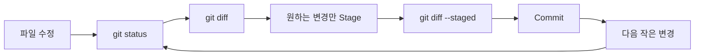
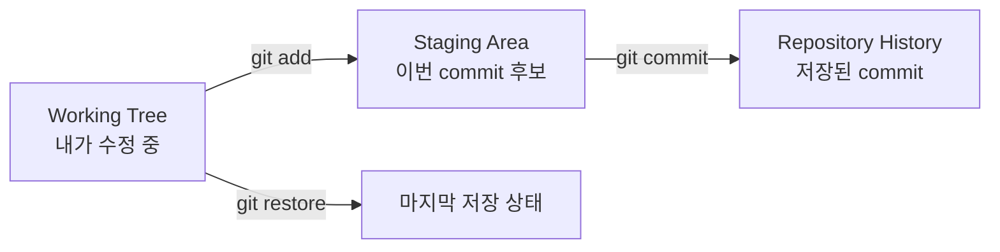
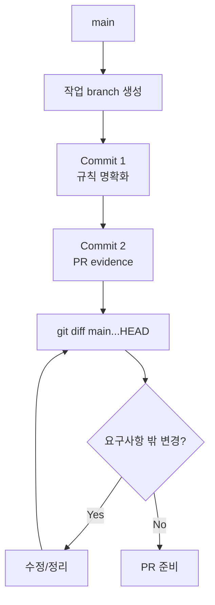

# 대기업 과제전형 Day 5 — Repository 초기화·Git 전략

## 오늘의 위치

- Week: **Week 1 — Take-home 2026 기본기: 요구사항·시간제한·제출 전략**
- Day: **Day 5**
- 오늘 주제: **Repository 초기화·Git 전략**
- 오늘 학습 목표: 커밋 이력이 작업 사고를 보여주도록 변경을 작은 의미 단위로 나누고, branch → commit → tag → PR 흐름을 설명하고 직접 수행한다.
- 오늘 실습: 안전한 연습 저장소에서 `git init`부터 branch/commit/tag/PR 직전 diff review까지 직접 수행한다.
- 오늘 산출물: `docs/reviews/GIT_STRATEGY.md`
- Source 성격: **학습용 모의 실습** — 실제 기업 기출이 아니다.
- 전후 연결:
  - Day 2: 요구사항을 구조화했다.
  - Day 3: Must / Should / Could와 시간 예산을 정했다.
  - Day 4: Acceptance Criteria와 Definition of Done을 만들었다.
  - **Day 5: 구현 과정의 판단과 변경을 Git 이력으로 남기는 방법을 익힌다.**
  - Day 6: 평가자가 clone 후 README만 보고 실행할 수 있는지 검증한다.

## 오늘 사용하는 고정 환경

- IDE: Cursor
- 주요 기능: Explorer, Integrated Terminal, Source Control, Diff
- 핵심 도구: Git
- 기존 `VERSION_LOCK.md`: **재사용, 변경 없음**
- 새 Framework/Library: **없음**
- Java / Spring Boot / PostgreSQL: 오늘은 구현하지 않음

> 오늘 제공되는 `GIT_STRATEGY.md`는 **모범답안이 아니라 Starter/TODO 문서**다. 강의를 읽으며 직접 채운다.

## 오늘의 평가 Mode

- 기본 연습 Mode: **Guarded AI**
- Git 명령과 커밋 경계는 먼저 사람이 판단한다.
- AI는 커밋 메시지 후보나 self-review 질문을 제안할 수 있지만, 실제 diff를 읽고 commit할 책임은 사람에게 있다.
- 실제 채용 과제에서는 공고의 AI/인터넷/외부 저장소 정책이 최우선이다.

---

# 1. 학습 목표

오늘이 끝나면 다음을 할 수 있어야 한다.

1. Git repository, working tree, staging area, commit의 차이를 자기 말로 설명할 수 있다.
2. `git status`, `git diff`, `git diff --staged`를 목적에 맞게 사용할 수 있다.
3. 하나의 큰 변경을 평가자가 이해하기 좋은 작은 commit 단위로 나눌 수 있다.
4. branch를 작업 격리 도구로 사용하고 `main`과 작업 branch의 역할을 구분할 수 있다.
5. 좋은 commit message와 나쁜 commit message를 구분할 수 있다.
6. tag가 어떤 시점의 제출 후보를 표시하는지 설명할 수 있다.
7. PR을 만들기 전 `main...HEAD` diff를 읽고 불필요한 변경을 제거할 수 있다.

---

# 2. 오늘 내용을 아주 쉽게 먼저 이해하기

Take-home 과제를 종이에 풀고 있다고 생각해 보자.

연필로 계속 덧칠만 하면 마지막 답은 남지만 **어떤 생각으로 바뀌었는지**는 사라진다.

Git은 중간중간 사진을 찍어 두는 것과 비슷하다.

```text
요구사항 정리
→ 사진 1
→ Git 전략 문서 추가
→ 사진 2
→ 검증 체크리스트 추가
→ 사진 3
```

여기서 사진 한 장이 `commit`이라고 생각하면 된다.

중요한 것은 사진을 많이 찍는 것이 아니다.

```text
한 장을 봤을 때
"이 변경은 왜 했는지"
설명할 수 있어야 한다.
```



이 흐름에서 핵심은 `commit` 버튼을 누르기 전에 **두 번 확인한다**는 점이다.

- `git diff`: 아직 stage하지 않은 변경을 읽는다.
- `git diff --staged`: 이번 commit에 실제로 들어갈 변경을 읽는다.

---

# 3. 이론 1 — Repository, Working Tree, Staging Area, Commit

## 3.1 한 줄 정의

Git은 파일 변경 이력을 **의미 있는 snapshot(스냅샷)** 단위로 저장하는 버전 관리 시스템이다.

## 3.2 초등학생도 이해할 수 있는 비유

숙제를 제출하기 전에 책상 위에 여러 장의 종이가 있다고 생각하자.

- Working Tree: 지금 책상 위에서 고치고 있는 종이
- Staging Area: 이번 제출 봉투에 넣기로 고른 종이
- Commit: 봉투를 봉해서 이름과 설명을 붙인 상태

파일을 수정했다고 자동으로 commit되는 것이 아니다.

## 3.3 구조 그림



### 화살표 설명

- `git add`: 이번 commit에 포함할 변경을 선택한다.
- `git commit`: stage된 변경을 하나의 이력으로 저장한다.
- `git restore`: 원하지 않는 working tree 변경을 되돌릴 때 사용할 수 있다.

## 3.4 Take-home에서 왜 중요한가?

평가자는 보통 최종 코드가 가장 중요하다. 하지만 commit 이력도 볼 수 있는 환경이라면 다음 신호를 얻는다.

```text
요구사항을 작은 변경으로 나눴는가?
테스트를 언제 추가했는가?
문서/코드가 한 번에 뒤섞여 있지 않은가?
마지막에 모든 파일을 한 commit으로 던지지 않았는가?
```

## 3.5 좋은 예

```text
feat: add reservation creation rule
test: cover duplicate reservation rejection
docs: document reservation assumptions
```

각 commit의 목적이 다르다.

## 3.6 나쁜 예

```text
update
fix
final
final2
real-final
```

무엇이 바뀌었는지 알 수 없다.

## 3.7 실습예제 1 — 안전한 연습 Repository 초기화

### 실습 목표

실제 학습 workspace의 history를 망가뜨리지 않고 Day 5 전용 폴더에서 Git repository를 직접 초기화한다.

### 직접 작업할 위치

```text
take-home-2026/
└── drills/
    └── repository/
        └── day005-git-flow/
```

### 실행

Cursor에서 `take-home-2026`을 열고 Integrated Terminal에서 실행한다.

```bash
cd drills/repository/day005-git-flow

git init -b main
git status
```

환경에 Git 사용자 정보가 없다면 **이 연습 repository에만** 로컬 설정한다.

```bash
git config user.name "Your Name"
git config user.email "you@example.com"
```

실제 지원 과제에서는 본인이 사용하는 정상적인 Git identity를 사용한다.

### 예상 결과

`git status`에서 대략 다음 상태가 보인다.

```text
On branch main
No commits yet
Untracked files: ...
```

### 첫 commit

먼저 내용부터 읽는다.

```bash
ls
git status
```

그 다음 starter 파일을 첫 snapshot으로 저장한다.

```bash
git add README.md reservation-rules.md PR_DRAFT.md
git diff --staged
git commit -m "chore: initialize git flow drill"
```

### 확인

```bash
git status
git log --oneline --decorate --graph --all
```

### 실제 검증 여부

이 강의에 기재한 기본 `git init → commit → branch → commit → tag` 명령 흐름은 별도 임시 repository에서 실제 실행해 확인했다. 다만 **당신의 Cursor 환경에서의 결과는 직접 실행해서 확인해야 한다.**

---

# 4. 이론 2 — Commit은 “작게”가 아니라 “하나의 이유”로 나눈다

## 4.1 한 줄 정의

좋은 commit은 파일 개수가 적은 commit이 아니라 **하나의 설명 가능한 목적을 가진 commit**이다.

## 4.2 왜 단순히 줄 수로 나누면 안 되는가?

다음 변경을 생각해 보자.

```text
ReservationRule.md 수정 10줄
README 수정 3줄
테스트 체크리스트 수정 4줄
```

17줄이니 작아 보인다. 그러나 세 변경이 서로 다른 이유라면 한 commit으로 묶지 않는 편이 읽기 쉽다.

반대로 API 하나를 추가하면서 다음 파일이 함께 바뀔 수 있다.

```text
Controller
Service
DTO
Test
```

파일은 4개지만 모두 **“예약 생성 기능 추가”**라는 하나의 목적이라면 한 commit이 자연스러울 수 있다.

## 4.3 커밋 경계 질문

commit하기 전에 다음을 묻는다.

```text
이 commit 제목을 한 줄로 정확히 쓸 수 있는가?
이 변경만 되돌려도 다른 목적의 변경이 같이 사라지지 않는가?
리뷰어가 이 commit 하나만 보고 이유를 이해할 수 있는가?
```

## 4.4 실습예제 2 — 첫 작업 branch와 작은 commit

### 과제 상황

`reservation-rules.md`에는 일부러 모호한 규칙이 들어 있다.

### 목표

`main`에서 바로 작업하지 말고 branch를 만든다.

```bash
git switch -c docs/clarify-reservation-rules
```

`reservation-rules.md`에서 TODO를 직접 수정한다.

수정 후 바로 commit하지 않는다.

```bash
git status
git diff
```

확인 질문:

```text
요구사항 밖 파일이 바뀌었는가?
편집기 임시 파일이 생겼는가?
원하지 않는 문장 삭제가 있는가?
```

원하는 파일만 stage한다.

```bash
git add reservation-rules.md
git diff --staged
```

그리고 commit한다.

```bash
git commit -m "docs: clarify reservation rules"
```

### 나쁜 방식

```bash
git add .
git commit -m "update"
```

`git add .` 자체가 항상 나쁜 명령은 아니다. 문제는 **무엇이 들어가는지 읽지 않고** 전부 stage하는 습관이다.

### 더 안전한 습관

```bash
git status
git diff
git add <의도한 파일>
git diff --staged
git commit
```

변경이 한 파일 안에서도 여러 목적이 섞였다면 다음을 연습할 수 있다.

```bash
git add -p
```

`git add -p`는 변경 덩어리(hunk)를 보면서 일부만 stage할 수 있게 해 준다.

---

# 5. 이론 3 — Branch는 복잡한 Git Flow를 만들기 위한 것이 아니다

## 5.1 한 줄 정의

Branch는 다른 작업과 섞이지 않도록 **변경 흐름을 격리하는 가벼운 포인터**다.

## 5.2 Take-home에서의 현실적인 전략

2~8시간짜리 과제에서 다음처럼 거대한 branch 정책은 대개 과하다.

```text
develop
release/*
hotfix/*
feature/* 여러 단계
```

간단한 기본 전략이면 충분하다.

```text
main
└── feat/reservation-create
```

또는 문서 실습이라면:

```text
main
└── docs/clarify-reservation-rules
```

## 5.3 시간별 적용 수준

### 2시간 과제

- `main` + 짧은 작업 branch 1개 정도면 충분할 수 있다.
- branch ceremony보다 기능/테스트/README를 우선한다.

### 8시간 과제

- 기능 단위 branch 또는 제출 branch를 사용할 수 있다.
- meaningful commit 여러 개를 남긴다.
- PR이 요구되면 PR 기반으로 검토한다.

### 24시간 과제

- 기능/리스크에 따라 branch를 나눌 수 있다.
- 그래도 일반적인 소규모 Take-home에 복잡한 Git Flow는 필요 없다.

## 5.4 실습예제 3 — Diff Story 만들기

두 번째 작은 변경으로 `PR_DRAFT.md`의 TODO를 채운다.

먼저 현재 상태를 확인한다.

```bash
git status
git log --oneline --decorate --graph --all
```

`PR_DRAFT.md`에는 실제 변경을 다음 구조로 요약한다.

```text
What
Why
How verified
Risk / limitation
```

수정 후:

```bash
git diff
git add PR_DRAFT.md
git diff --staged
git commit -m "docs: add pull request evidence draft"
```

이제 branch 전체 diff를 본다.

```bash
git diff main...HEAD
```

`main...HEAD`는 현재 branch가 `main`에서 갈라진 뒤 누적된 변경을 리뷰할 때 유용하다.



---

# 6. 이론 4 — Commit Message는 변경의 이유를 빠르게 전달한다

## 6.1 기본 형식

이 과정에서는 다음처럼 간결하게 사용한다.

```text
<type>: <의미 있는 요약>
```

예:

```text
feat: add reservation creation
fix: reject duplicate reservation slot
test: cover invalid reservation time
docs: document timebox trade-offs
chore: initialize project metadata
```

## 6.2 type이 핵심인가?

아니다.

`feat`, `fix`, `test`를 정확히 외우는 것보다 **제목만 읽어도 변경 목적이 이해되는 것**이 더 중요하다.

## 6.3 나쁜 메시지를 고쳐보기

```text
fix
```

→

```text
fix: reject booking for past time slot
```

```text
update readme
```

→

```text
docs: add local test command to README
```

## 6.4 WIP commit은 금지인가?

개인 작업 중 임시 WIP commit을 쓸 수는 있다. 하지만 최종 제출 history를 평가자가 본다면 그대로 둘지 검토한다.

시간이 매우 짧은 과제에서 history를 예쁘게 만들기 위한 과도한 interactive rebase는 오히려 리스크다.

원칙:

```text
history 미용 < 동작하는 제출물 + 테스트 + README
```

---

# 7. 이론 5 — Tag는 “이 시점이 제출 후보”라는 표식이다

## 7.1 한 줄 정의

Tag는 특정 commit을 알아보기 쉬운 이름으로 가리키는 표식이다.

## 7.2 Take-home에서의 활용

예를 들어 모든 Day 5 실습을 마치고 제출 후보 상태라면:

```bash
git tag -a day5-complete -m "Day 5 Git strategy drill complete"
```

확인:

```bash
git tag -n
git show day5-complete --stat
```

실제 채용 과제에서 tag 제출을 요구하지 않는다면 반드시 만들 필요는 없다.

## 7.3 Tag가 backup인가?

아니다.

Tag는 특정 commit을 가리키는 이름이지 외부 backup 자체가 아니다. 로컬 저장소가 사라지면 로컬 tag도 함께 사라질 수 있다.

---

# 8. 이론 6 — PR의 핵심은 버튼이 아니라 Review 가능한 Diff다

## 8.1 한 줄 정의

Pull Request는 변경을 합치기 전에 **무엇을 왜 바꿨고 어떻게 검증했는지 리뷰할 수 있게 만드는 협업 단위**다.

## 8.2 오늘은 왜 실제 GitHub PR을 강제하지 않는가?

오늘의 핵심은 특정 플랫폼 사용법이 아니라 다음 흐름이다.

```text
branch
→ commits
→ diff review
→ PR 설명
→ merge 판단
```

원격 저장소가 있고 과제 정책이 허용한다면 실제 PR을 만들 수 있다. 하지만 공개 repository 생성이 금지된 과제라면 절대 공개해서는 안 된다.

## 8.3 PR 전 최소 확인

```bash
git status
git log --oneline --decorate --graph --all
git diff main...HEAD
```

확인:

- 요구사항 밖 변경이 없는가?
- secret이 들어가지 않았는가?
- debug text가 남지 않았는가?
- commit message가 읽히는가?
- 검증 근거를 설명할 수 있는가?

---

# 9. 오늘의 통합 실습

## 목표

Day 5용 mini repository에서 다음 전체 흐름을 완주한다.

```text
Repository Initialize
→ Initial Commit
→ Branch
→ Change 1
→ Diff Review
→ Commit 1
→ Change 2
→ Diff Review
→ Commit 2
→ Branch Diff Review
→ Tag
→ PR Draft
```

## Step 1 — 초기화

```bash
cd drills/repository/day005-git-flow
git init -b main
```

필요한 경우에만 local identity를 설정한다.

```bash
git config user.name "Your Name"
git config user.email "you@example.com"
```

## Step 2 — Starter snapshot

```bash
git add README.md reservation-rules.md PR_DRAFT.md
git diff --staged
git commit -m "chore: initialize git flow drill"
```

## Step 3 — 작업 branch

```bash
git switch -c docs/clarify-reservation-rules
```

## Step 4 — `reservation-rules.md` 직접 수정

TODO를 해결한다. 정답 파일은 제공하지 않는다.

```bash
git diff
git add reservation-rules.md
git diff --staged
git commit -m "docs: clarify reservation rules"
```

## Step 5 — `PR_DRAFT.md` 직접 수정

변경 목적과 검증 근거를 작성한다.

```bash
git diff
git add PR_DRAFT.md
git diff --staged
git commit -m "docs: add pull request evidence draft"
```

## Step 6 — 전체 branch review

```bash
git status
git log --oneline --decorate --graph --all
git diff main...HEAD
```

## Step 7 — Tag

```bash
git tag -a day5-complete -m "Day 5 Git strategy drill complete"
git tag -n
```

## Step 8 — 실제 산출물 작성

다음 파일을 직접 채운다.

```text
docs/reviews/GIT_STRATEGY.md
```

이 파일은 Starter/TODO 상태로 제공된다. 자신의 실습 결과를 근거로 채운다.

---

# 10. 실행 / 테스트 / 검증

오늘은 애플리케이션 build가 아니라 Git history 자체가 검증 대상이다.

## 필수 명령

```bash
git status
git log --oneline --decorate --graph --all
git diff main...HEAD
git tag -n
```

## 성공 기준

다음을 직접 확인한다.

```text
[ ] main에 initial commit이 있다.
[ ] 작업 branch가 별도로 존재한다.
[ ] 의미가 다른 변경이 최소 2개 commit으로 구분되어 있다.
[ ] git diff main...HEAD를 직접 읽었다.
[ ] working tree가 의도한 상태인지 git status로 확인했다.
[ ] tag가 의도한 마지막 commit을 가리킨다.
[ ] GIT_STRATEGY.md를 자신의 말로 작성했다.
```

## Expected와 Observed 구분

강의에서 보여 주는 출력은 예상 형태다. 자신의 결과는 `review.md`의 기록란에 직접 적는다.

---

# 11. Take-home 평가자 관점 체크

평가자가 Git 이력을 본다면 무엇을 확인할까?

화려한 branch 전략을 만들었는가?

**아니다.**

다음이 더 중요하다.

```text
변경 이유가 보이는가?
한 commit에 무관한 변경이 뒤섞이지 않았는가?
테스트/문서/기능 변화의 흐름을 이해할 수 있는가?
최종 제출 직전에 실수 파일을 같이 넣지 않았는가?
과제 시간 대비 Git ceremony가 과하지 않은가?
```

Git history는 평가의 주인공이 아니라 **개발 과정의 신뢰도를 보조하는 Evidence**다.

---

# 12. 자주 발생하는 실수 / 오류

## 실수 1 — 시작부터 `git add .`

### 증상

의도하지 않은 파일까지 stage된다.

### 왜 발생하는가?

변경 범위를 읽지 않고 편한 명령부터 실행한다.

### 확인

```bash
git status
git diff --staged
```

### 수정

잘못 stage한 파일이 있다면 commit하기 전에 staging에서 빼고 다시 확인한다.

```bash
git restore --staged <file>
```

### 예방

`status → diff → add → staged diff → commit` 순서를 습관화한다.

## 실수 2 — commit 제목이 `fix`, `update`, `final`

### 문제

나중에 log만 보고 변경 목적을 알 수 없다.

### 예방

“무엇을 어떤 이유로 바꿨는가?”를 1줄로 쓴다.

## 실수 3 — 한 commit에 unrelated change를 전부 포함

### 문제

리뷰와 rollback이 어려워진다.

### 예방

목적이 다르면 commit을 나눈다. 필요하면 `git add -p`를 쓴다.

## 실수 4 — branch 이름과 실제 작업이 다름

예:

```text
branch: feat/login
실제 변경: README + 예약 규칙 + CI
```

작업 범위가 넓어졌다면 branch를 계속 끌고 갈지 다시 판단한다.

## 실수 5 — 제출 직전 history를 예쁘게 만들다 사고

과도한 rebase/squash로 정상 commit을 잃거나 충돌을 만든다.

과제에서는 안정성을 우선한다.

## 실수 6 — secret을 commit한 뒤 파일만 삭제

파일에서 삭제해도 이미 commit history에 남았을 수 있다. 실제 secret을 애초에 commit하지 않는다.

## 실수 7 — 공개 금지 과제를 public GitHub에 push

기업이 private repo나 비공개 제출을 요구한다면 반드시 따른다. Git 학습과 공개 게시 여부는 별개다.

---

# 13. 강의요약

## 오늘 배운 핵심 5가지

1. Working Tree → Staging Area → Commit의 흐름을 이해해야 한다.
2. 좋은 commit은 작은 줄 수가 아니라 **하나의 설명 가능한 목적**을 가진다.
3. commit 전에 `git diff`와 `git diff --staged`를 사람이 읽는다.
4. Take-home의 branch 전략은 단순할수록 좋고, 복잡한 Git Flow가 점수를 보장하지 않는다.
5. PR의 핵심은 플랫폼 버튼이 아니라 review 가능한 diff와 검증 근거다.

## 오늘 완성할 것

```text
drills/repository/day005-git-flow/.git/      # 본인이 로컬에서 생성
docs/reviews/GIT_STRATEGY.md                  # 본인이 Starter를 완성
lessons/day005/exercise-solutions.md           # 연습문제 답안 작성용
```

## 오늘의 평가 Evidence

- Git command execution
- Commit history
- Branch diff
- Tag
- PR draft
- `GIT_STRATEGY.md`

## 오늘의 핵심 Trade-off

정돈된 history는 유용하지만, Take-home에서는 **history 미용 때문에 핵심 기능·테스트·README를 희생하면 안 된다.** 이해 가능한 최소한의 Git 전략이 적절하다.

## 스스로 설명할 수 있어야 하는 것

1. 왜 `git add`와 `git commit` 사이에 staging area가 필요한가?
2. 왜 `git diff --staged`를 commit 전에 읽는가?
3. 어떤 기준으로 commit을 나눌 것인가?
4. 2시간 과제에서 branch를 몇 개나 만들 것인가?
5. `git diff main...HEAD`는 PR 전 왜 유용한가?

## 다음 Day 연결

Day 5에서 “변경 이력을 어떻게 신뢰 가능하게 남길지” 배웠다. Day 6에서는 한 단계 더 나아가 **평가자가 새 폴더에서 clone한 뒤 README만 보고 실행할 수 있게 만드는 것**을 배운다.

---

# 14. 핵심 용어

| 용어 | 쉬운 뜻 | 정확한 의미 | 과제에서 왜 중요한가 |
|---|---|---|---|
| Repository | 변경 기록 보관함 | Git이 추적하는 프로젝트와 이력 | 제출 과정 추적 |
| Working Tree | 지금 고치는 파일들 | checkout된 파일의 현재 상태 | 미저장 변경 확인 |
| Staging Area | 이번 commit 후보 상자 | 다음 commit에 포함할 index 상태 | commit 범위 통제 |
| Commit | 의미 있는 저장 지점 | 특정 시점의 snapshot과 metadata | 변경 이유를 기록 |
| Branch | 독립 작업 줄 | commit을 가리키는 이동 가능한 ref | 작업 격리 |
| Diff | 바뀐 내용 | 두 상태 사이의 변경 | self review 핵심 |
| Tag | 특정 지점 이름표 | 특정 object/commit을 가리키는 ref | 제출 후보 표시 |
| PR | 합치기 전 리뷰 묶음 | branch diff와 토론/검증 단위 | 변경 설명과 리뷰 |
| HEAD | 현재 위치 표시 | 현재 checkout된 commit/branch를 가리키는 ref | 현재 작업 위치 이해 |
| Atomic Commit | 한 이유의 commit | 논리적으로 하나의 목적을 갖는 변경 | 리뷰/rollback 용이 |

---

# 15. 초급 연습문제 5개

정답은 `exercise-solutions.md`에 직접 작성한다.

1. Working Tree, Staging Area, Commit을 각각 한 문장으로 설명하라.
2. `git status`와 `git diff`가 보여 주는 정보의 차이를 설명하라.
3. `update`라는 commit message가 좋지 않은 이유를 두 가지 적어라.
4. 다음 중 commit 직전에 가장 먼저 읽어야 할 명령을 고르고 이유를 적어라: `git diff --staged`, `git tag`, `git clone`.
5. Tag와 branch의 차이를 초보자에게 설명하라.

---

# 16. 중급 연습문제 5개

6. README 오타 수정, 예약 생성 기능, 예약 테스트 추가가 동시에 working tree에 있다. 어떻게 commit을 나눌지 제안하라.
7. `git add .` 후 `.env`가 stage된 것을 발견했다. commit 전에 어떤 순서로 대응할지 명령과 함께 적어라.
8. 4시간 Take-home에서 `main`, `develop`, `release`, 기능 branch 6개를 쓰려 한다. 장단점을 분석하고 더 적절한 대안을 제안하라.
9. `git log --oneline --decorate --graph --all`을 PR 전 확인하는 이유를 설명하라.
10. 기능과 테스트를 같은 commit에 넣는 경우와 별도 commit으로 나누는 경우의 trade-off를 설명하라.

---

# 17. 고급 연습문제 5개

11. 작업 branch에서 5개 commit 중 2개가 순수 formatting 변경이고 핵심 diff를 읽기 어렵게 만든다. 제출 20분 전이라면 어떤 판단을 할지 설명하라.
12. 이미 commit한 뒤 secret이 포함된 것을 발견했다. “파일에서 삭제하고 다음 commit을 하면 끝”이 아닌 이유를 설명하라. 구체적 secret 폐기/재발급 절차는 시스템별 정책을 확인해야 한다는 점도 포함하라.
13. 평가자가 commit history를 본다고 알려진 과제에서 `initial commit` 하나만 제출하는 전략의 장단점을 분석하라.
14. `git diff main..HEAD`와 `git diff main...HEAD`의 목적 차이를 조사하지 않고, 오늘 배운 범위에서 왜 PR branch review에는 merge base 관점이 중요할지 개념적으로 설명하라.
15. 60분 live change request에서 긴급 수정이 들어왔다. 별도 branch/commit을 만들지, 기존 branch에서 바로 수정할지 결정하는 기준을 시간·위험·리뷰 관점으로 제시하라.

---

# 18. 오늘의 산출물

## 필수

```text
docs/reviews/GIT_STRATEGY.md
```

Starter의 TODO를 자신의 실습 결과로 채운다.

## 실습용

```text
drills/repository/day005-git-flow/
```

이 폴더에서 직접 `git init`을 수행한다. 제공 zip에는 `.git` history가 들어 있지 않다.

---

# 19. 제출/검증 체크리스트

- [ ] Day 5 drill repository를 직접 `git init`했다.
- [ ] initial commit을 만들었다.
- [ ] main이 아닌 작업 branch를 만들었다.
- [ ] 최소 2개의 의미 있는 commit을 만들었다.
- [ ] 각 commit 전 `git diff --staged`를 읽었다.
- [ ] `git diff main...HEAD`를 읽었다.
- [ ] `git status`에서 의도하지 않은 파일이 없는지 확인했다.
- [ ] tag를 만들고 어떤 commit을 가리키는지 확인했다.
- [ ] `PR_DRAFT.md`를 직접 작성했다.
- [ ] `GIT_STRATEGY.md`의 TODO를 직접 채웠다.
- [ ] 실제 기업 과제에서는 공개/private 정책을 먼저 확인한다는 원칙을 설명할 수 있다.

---

# 20. 실무/면접 질문

1. 왜 모든 작업을 `main`에서 바로 하지 않았나요?
2. 이 commit을 왜 둘로 나누었나요?
3. 기능 코드와 테스트를 같은 commit에 넣는 편인가요?
4. `git add .`를 써도 되는 상황과 위험한 상황은 무엇인가요?
5. 제출 직전 commit history가 지저분하다면 rebase할 건가요?
6. PR 만들기 전 어떤 diff를 확인하나요?
7. tag를 왜 만들었나요? 꼭 필요한가요?
8. 과제 시간이 2시간밖에 없다면 Git 전략을 어떻게 줄일 건가요?
9. AI가 “모든 변경을 한 번에 commit하라”고 제안하면 어떻게 판단하나요?
10. commit history와 최종 코드 중 무엇이 더 중요하며, 왜 그렇게 생각하나요?

---

# 21. 다음 Day 연결

Day 6에서는 Git repository를 만든 것에서 끝내지 않는다.

평가자가 다음 흐름을 실제로 성공할 수 있어야 한다.

```text
새 폴더
→ clone
→ README만 읽기
→ 필요한 환경 준비
→ 실행/검증
```

즉 Day 5가 **변경 과정의 재현성**이라면, Day 6는 **실행 방법의 재현성**이다.
